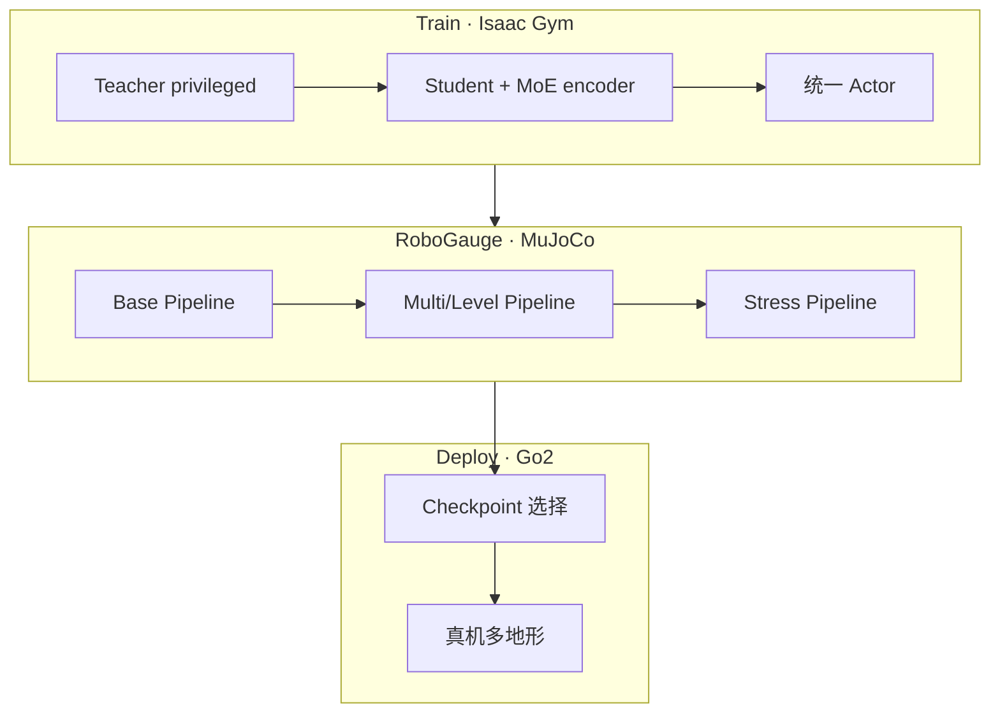
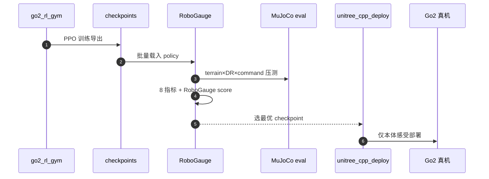

# RoboGauge：MoE 四足运动与 Sim-to-Real 可预测性

**Toward Reliable Sim-to-Real Predictability for MoE-based Robust Quadrupedal Locomotion**（RSS 2026，arXiv:2602.00678，西安交通大学）同时回答两件事：① 仅本体感受的四足策略如何在多地形/多命令下获得 **更专化、更稳的隐空间表示**；② 如何在 **上真机之前** 用比训练 reward 更可信的指标判断策略能否迁移。答案是 **latent MoE student** + **RoboGauge** 跨引擎评估闭环。

## 一句话定义

**MoE 放在 representation encoder 而非 action 头，让多 expert 理解地形与命令；RoboGauge 用 Isaac Gym→MuJoCo 的 8 维本体指标分层压测，把「选哪个 checkpoint 上真机」变成可量化决策。**

## 英文缩写速查

| 缩写 | 英文全称 | 简要说明 |
|------|----------|----------|
| MoE | Mixture-of-Experts | 门控多专家；本文用于 latent encoder |
| RoboGauge | — | 跨物理引擎的 sim-to-sim 评估套件 |
| DR | Domain Randomization | 训练与评估中的动力学随机化 |
| ZMP | Zero Moment Point | 零力矩点稳定裕度指标 |
| PPO | Proximal Policy Optimization | 训练所用 on-policy 算法 |
| Sim2Sim | Simulation to Simulation | 换引擎测试策略鲁棒性 |

## 为什么重要

- **预测可迁移性** 是被忽视的 sim-to-real 环节：真机试错贵且危险，RoboGauge 提供 **保守 proxy**。
- **MoE 结构选择有教训：** action 侧 MoE（AC-MoE/MCP）易发散；**latent 侧 MoE + 统一 actor** 更稳——对人形多地形 locomotion 同样适用。
- **涌现窄步态：** 4 m/s 高速下自发窄支撑宽度，提示 reward 只给倾向、步态可自组织。

## 流程总览

## 核心机制

### 1）Latent MoE（非 action MoE）

- 单一 encoder 易 **表示耦合**：平地高速与楼梯/障碍最优模式差异大。
- 多个 expert 形成条件化 latent，**再由共享 actor 映射动作**——避免 gate 权重直接抖动关节目标。

### 2）训练侧增强

- 8192 并行；七类地形 + 宽范围 DR（摩擦、负载、CoM、执行器、延迟等）
- Command curriculum + extreme sampling + dynamic command sampling
- 动态 velocity tracking precision：训练早期宽容、后期收紧

### 3）RoboGauge 三 pipeline

| 阶段 | 作用 |
|------|------|
| Base | 单环境：terrain × level × DR × command → 指标 |
| Multi/Level | 多种子/多难度；Worst-Case Mean、最大可通过 level |
| Stress | 全组合 → 每地形 robust score → **总体 RoboGauge score** |

**8 项指标：** 线/角速度误差、功耗、关节限位、姿态稳定、力矩平滑、**ZMP margin**、**friction margin**；用 **几何平均** 防单项满分掩盖短板。

### 4）Sim-to-Sim 为何能预测 Sim-to-Real

策略若 exploit 训练仿真器 $P_{\text{train}}$ 的数值细节，换 $P_{\text{eval}}$（MuJoCo）会掉分；跨引擎一致性 ≈ 对模型不确定性的敏感度低 → **更可能** 真机鲁棒（非等价保证）。

## 核心信息

| 字段 | 内容 |
|------|------|
| 会议 | RSS 2026 |
| arXiv | [2602.00678](https://arxiv.org/abs/2602.00678) |
| 机构 | 西安交通大学（XJTU） |
| 平台 | Unitree Go2 / Go2-Edu |
| 感知 | **仅本体感受** |

## 实验与评测（文内摘要）

- 未见地形：雪、沙、楼梯、斜坡、30 cm 障碍等稳健通行
- 高速测试：**4 m/s**；涌现与稳定相关的 **窄步态**
- 2025 全球具身 AI 强化学习运动挑战赛 **第一名**（项目页）

## 工程实践

| 组件 | 仓库 | 状态 |
|------|------|------|
| 训练 `go2_rl_gym` | [wty-yy/go2_rl_gym](https://github.com/wty-yy/go2_rl_gym) | **已开源** |
| 评估 `RoboGauge` | [wty-yy/RoboGauge](https://github.com/wty-yy/RoboGauge) | **已开源** |
| 部署 `unitree_cpp_deploy` | [wty-yy/unitree_cpp_deploy](https://github.com/wty-yy/unitree_cpp_deploy) | **已开源** |

### 源码运行时序图

## 结论

**本文核心贡献是「可预测的迁移」而非「MoE 本身」——RoboGauge 把真机试错前移为跨引擎可重复筛选；MoE 则是让仅本体感受策略在多地形上获得更可分的隐式表示。**

- Latent MoE + 统一 actor 是稳定训练的关键结构选择；action 侧 MoE 在本工作的消融中更易发散。
- RoboGauge 的 8 维几何平均指标刻意惩罚「偏科」策略，与训练 terrain level / reward 不是同一套标尺。
- 真机证据集中在 **四足 Go2**；对人形的价值是 **评估方法论与 MoE 表示分工** 可迁移，而非已有任何人形结果。
- 动态 command sampling 等训练细节对 RoboGauge 分数有显著影响（附录约 +11%），说明 **训练–评估闭环** 需要一起调。
- 开源三件套（训练/评估/部署）使 RSS 主张可独立复现 demo。

## 局限与风险

- Sim-to-Sim **不等价** Sim-to-Real；RoboGauge 是保守 proxy，不能替代最终真机验收。
- 平台与感知设定为四足 + proprio-only；视觉/人形需重新标定指标与阈值。
- 深读笔记级细节见 [paper-notebook stub](./paper-notebook-toward-reliable-sim-to-real-predictability-for-m.md)。

## 关联页面

- [Sim2Real](../concepts/sim2real.md)、[Domain Randomization](../concepts/domain-randomization.md)
- [Locomotion](../tasks/locomotion.md)、[CMoE](./paper-cmoe.md)

## 推荐继续阅读

- [RoboGauge 项目页](https://robogauge.github.io/complete/)
- [arXiv:2602.00678](https://arxiv.org/abs/2602.00678)

## 参考来源

- [sources/sites/robogauge.md](../../sources/sites/robogauge.md)
- [PinkRobot RSS 2026 文献解读](../../sources/blogs/wechat_pinkrobot_robogauge_rss2026_2026-09-15.md)
- [Robot Learning Paper Notebooks 深读索引](../../sources/papers/humanoid_pnb_toward-reliable-sim-to-real-predictability-for-m.md)
