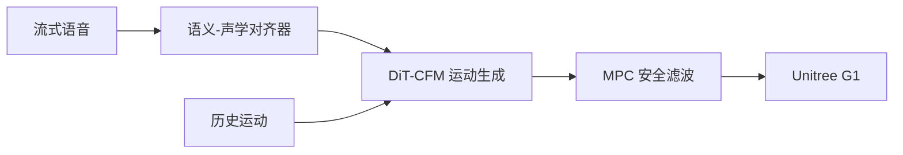

# RoboGesture：人形实时语义对齐伴随语音手势

**RoboGesture**（[arXiv:2608.28693](https://arxiv.org/abs/2608.28693)）由 **清华大学、银河通用机器人（Galbot）、北理工、哈工大、北大、上海期智研究院** 提出（公众号周更 ingest 见 [策展索引](../../sources/blogs/wechat_shenlan_weekly_papers_2026-09-04.md)）。

## 一句话定义

让人形从 **听** 到 **做手势** 走 **原始音频 token → 机器人运动** 的端到端流式管线，并用 MPC 保证真机无碰撞。

## 英文缩写速查

| 缩写 | 英文全称 | 简要说明 |
|------|----------|----------|
| DiT | Diffusion Transformer | 连续运动空间的扩散 Transformer |
| CFM | Conditional Flow Matching | 条件流匹配生成运动块 |
| CFG | Classifier-Free Guidance | 本文 Anti-Inertia 变体防历史惯性 |
| HRI | Human-Robot Interaction | 社交人机交互 |

## 为什么重要

文本中间表示丢韵律；纯运动惯性会让模型 **忽视音频**；avatar→retarget 在线不安全——RoboGesture 在 **机器人空间** 联合设计数据、模型与控制。

## 核心信息

| 项 | 内容 |
|----|------|
| **机构** | 清华大学、银河通用机器人（Galbot）、北理工、哈工大、北大、上海期智研究院 |
| **开源** | 见 [工程实践](#工程实践) |

## 核心原理

三模块：**Hierarchical Semantic-Acoustic Aligner**（Mimi codec 多粒度 token + beat/300 类语义头）、**Streaming DiT+CFM**（Cross-Attn 微对齐 + FiLM 宏调制；15% 历史 mask）、**MPC 安全滤波**（5.6 ms/帧）。平台：G1 + BrainCo 灵巧手，41 DoF 上身。

### 流程总览

## 源码运行时序图

**不适用** — 截至 **2026-09-07** 无可运行官方代码（或本文为硬件/协议类工作）。

## 工程实践

| 项 | 说明 |
|----|------|
| 开源状态 | 见论文摘录与项目页核查结论 |
| 复现入口 | 以 arXiv 为准 |

## 实验与评测

| 基准 | FGD↓ | Col.↓ | 读法 |
|------|------|-------|------|
| BEAT | **0.845** | 0.88% | 优于 LivelySpeaker/DiffSHEG 等 |
| SemanticBEAT | BC **0.295** | **0.13%** | 语义手势对齐 SOTA |

## 结论

RoboGesture 把 **语义–韵律–安全** 绑成可部署的 listen–respond–gesture 闭环；Anti-Inertia Masking 是打破「运动抄历史」的关键训练技巧。

1. **300+** 手势类 + **1000 h** 半合成训练对。
2. 真机四场景：社交协助/情感支持/知识分享/办公沟通。
3. 与 Speech-LLM 管线级联；瓶颈在上游语音而非运动。
4. ECCV 2026 Poster。
5. 截至入库日 **未开源**。

## 与其他工作对比

「让人形做出得体的上身动作」有几条路，差别在 **条件信号** 与 **谁保证真机安全**：

| 工作 | 条件输入 | 生成空间 | 真机安全由谁保证 | 与本文 |
|------|----------|----------|------------------|--------|
| **RoboGesture** | **原始音频 token**（Mimi codec，多粒度 + beat/300 类语义头） | **直接在机器人空间** | **MPC 安全滤波**（5.6 ms/帧），在线可用 | 本页；G1 + BrainCo 手，41 DoF 上身，≈120 FPS |
| [PAMoR](./paper-pamor.md) | **文本 + 效价–唤醒（V-A）** | 机器人全身运动（G1） | 未报安全滤波层 | 同为社交人形运动生成、同平台家族；条件是 **情感标签** 而非声学信号 |
| LivelySpeaker / DiffSHEG 一类 avatar 方法 | 语音/文本 | **虚拟人空间**，再 retarget | retarget 后无在线保证 | 页首动机直指此点：**avatar→retarget 在线不安全**；本文报 BEAT FGD 0.845 优于这批基线 |
| 文本中间表示管线 | ASR→文本→动作 | 各式 | — | 页首动机：**丢韵律**；本文用音频 token 绕开 |
| [人形语音交互流水线](../queries/humanoid-voice-interaction-pipeline.md) | 完整 listen–respond 链路 | — | — | RoboGesture 是该链路的 **动作输出端**；页内已注明瓶颈常在 **上游语音** 而非运动生成 |

**技巧层面的可迁移点：** **Anti-Inertia Masking**（15% 历史 mask 的 CFG 变体）针对的是自回归运动生成的通病——**模型抄历史、忽视条件信号**。这个问题不限于手势，任何「历史运动 + 外部条件」的流式生成都可能复用该配方。

**证据边界：** BEAT / SemanticBEAT 数字来自论文；**代码与数据截至入库日未开源**，真机结论为四场景演示而非统计评测。

## 局限与风险

上身为主；未覆盖全身行走协同；数据合成依赖 LLM 场景与 TTS。

## 关联页面

- [loco-manipulation](../tasks/loco-manipulation.md)
- [paper-pamor.md](./paper-pamor.md)
- [unitree-g1.md](./unitree-g1.md)
- [diffusion-motion-generation](../methods/diffusion-motion-generation.md)
- [人形语音交互流水线](../queries/humanoid-voice-interaction-pipeline.md) — 上游语音链路语境

## 参考来源

- [robogesture_arxiv_2608_28693.md](../../sources/papers/robogesture_arxiv_2608_28693.md)
- [robogesture-arxiv.md](../../sources/sites/robogesture-arxiv.md)
- [公众号周更策展](../../sources/blogs/wechat_shenlan_weekly_papers_2026-09-04.md)

## 推荐继续阅读

- [https://RoboGesture.github.io](https://RoboGesture.github.io)
