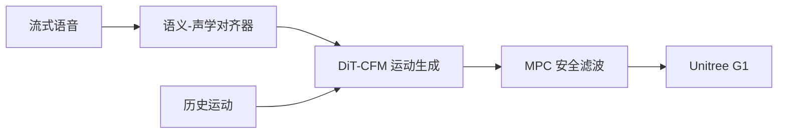

# RoboGesture：人形实时语义对齐伴随语音手势

**RoboGesture: Real-Time Semantic-aligned Co-Speech Gestures Generation for Humanoid Interaction**（[arXiv:2608.28693](https://arxiv.org/abs/2608.28693)）由 **Zifan Wang、Ziang Ren、Pengyang Shi、Zirui Wang、Chenghuai Lin、Tianze Wang、Zekun Qi、Liangliang Zhao、He Wang、Li Yi**（清华 / Galbot / 北理工 / 哈工大 / 北大 / 上海期智研究院）提出；早期映射见 [公众号周更](../../sources/blogs/wechat_shenlan_weekly_papers_2026-09-04.md)，**2026-09-28** 按 arXiv 元数据与项目页复核更新。

## 一句话定义

让人形从 **听** 到 **做手势** 走 **原始音频 token → 机器人运动** 的端到端流式管线，并用 MPC 保证真机无碰撞。

## 英文缩写速查

| 缩写 | 英文全称 | 简要说明 |
|------|----------|----------|
| DiT | Diffusion Transformer | 连续运动空间的扩散 Transformer |
| CFM | Conditional Flow Matching | 条件流匹配生成运动块 |
| CFG | Classifier-Free Guidance | 本文 Anti-Inertia 变体防历史惯性 |
| MPC | Model Predictive Control | 在线凸 QP 安全滤波（碰撞/速度/跟踪） |
| HRI | Human-Robot Interaction | 社交人机交互 |

## 为什么重要

文本中间表示丢韵律；**modality eclipse** 让模型抄运动惯性、忽视音频；avatar→retarget 在线不安全——RoboGesture 在 **机器人空间** 联合设计数据、模型与控制，并作为 **listen–respond–gesture** 闭环的运动核心。

## 核心信息

| 项 | 内容 |
|----|------|
| **机构** | 清华大学、银河通用机器人（Galbot）、北京理工大学、哈尔滨工业大学、北京大学、上海期智研究院 |
| **作者** | Zifan Wang, Ziang Ren, Pengyang Shi, Zirui Wang, Chenghuai Lin, Tianze Wang, Zekun Qi, Liangliang Zhao, He Wang, Li Yi |
| **开源** | 见 [工程实践](#工程实践) |

## 核心原理

三模块：**Hierarchical Semantic-Acoustic Aligner**（Mimi codec 多粒度 token + beat/300 类语义头）、**Streaming DiT+CFM**（Cross-Attn 微对齐 + FiLM 宏调制；15% 历史 mask 的 Anti-Inertia CFG）、**MPC 安全滤波**（5.6 ms/帧，离线亦用于清洗训练集）。平台：G1 + BrainCo 灵巧手，41 DoF 上身。

### 流程总览

```mermaid
flowchart LR
  audio[流式语音] --> align[语义-声学对齐器]
  align --> dit[DiT-CFM 运动生成]
  hist[历史运动] --> dit
  dit --> mpc[MPC 安全滤波]
  mpc --> g1[Unitree G1]
```

## 源码运行时序图

**不适用** — 截至 **2026-09-28** [项目页](https://RoboGesture.github.io) **未见** 可运行官方仓库或权重；无法对齐 README 训练/推理入口。

## 工程实践

| 项 | 说明 |
|----|------|
| 开源状态 | **未开源** — 项目页无 GitHub；论文 ECCV 2026 Poster |
| 复现入口 | arXiv + 项目页演示；真机系统级联 **ASR → LoRA LLM → TTS → 流式 motion → 执行**（延迟主因在上游语音） |
| 数据 | RoboGesture 数据集（300+ 类；半合成 **1000 h**）未公开下载 |

## 实验与评测

| 基准 | FGD↓ | Col.↓ | 读法 |
|------|------|-------|------|
| BEAT | **0.845** | 0.88% | 优于 LivelySpeaker/DiffSHEG 等 |
| SemanticBEAT | BC **0.295** | **0.13%** | 语义手势对齐 SOTA |

## 结论

RoboGesture 把 **语义–韵律–安全** 绑成可部署的 listen–respond–gesture 闭环；Anti-Inertia Masking 是打破「运动抄历史」的关键训练技巧。

1. **300+** 手势类 + **1000 h** 半合成训练对（LLM 场景 → 标注 → TTS/节拍 → 0.4 s 语义预期 → MPC 清洗）。
2. 真机四场景：社交协助 / 情感支持 / 知识分享 / 办公沟通（G1 演示 clip）。
3. 与 Speech-LLM 管线级联；**≈120 FPS** motion，系统 latency 瓶颈在上游语音而非运动生成。
4. **ECCV 2026** Poster（2026-09-10 Session 2）。
5. 截至 **2026-09-28** **未开源** — 选型应假设无法复现训练，仅可对照方法与 BEAT 数字。

## 与其他工作对比

「让人形做出得体的上身动作」有几条路，差别在 **条件信号** 与 **谁保证真机安全**：

| 工作 | 条件输入 | 生成空间 | 真机安全由谁保证 | 与本文 |
|------|----------|----------|------------------|--------|
| **RoboGesture** | **原始音频 token**（Mimi codec，多粒度 + beat/300 类语义头） | **直接在机器人空间** | **MPC 安全滤波**（5.6 ms/帧），在线可用 | 本页；G1 + BrainCo 手，41 DoF 上身，≈120 FPS |
| [PAMoR](./paper-pamor.md) | **文本 + 效价–唤醒（V-A）** | 机器人全身运动（G1） | 未报安全滤波层 | 同为社交人形运动生成、同平台家族；条件是 **情感标签** 而非声学信号 |
| [DiffSHEG](./paper-diffsheg.md) / LivelySpeaker 一类 avatar 方法 | 语音/文本 | **虚拟人空间**，再 retarget | retarget 后无在线保证 | 动机：**avatar→retarget 在线不安全**；BEAT FGD 0.845 优于 DiffSHEG 等 |
| [Semantic Co-Speech → G1](./paper-notebook-semantic-co-speech-gesture-synthesis-and-real-ti.md) | 语义检索 + 生成 | 人体→GMR→RL 跟踪 | 跟踪策略 | 同为 G1 共语手势；本文 **text-free 流式音频 token**，彼为 PNB 深读索引 |
| 文本中间表示管线 | ASR→文本→动作 | 各式 | — | **丢韵律**；本文用音频 token 绕开 |
| [人形语音交互流水线](../queries/humanoid-voice-interaction-pipeline.md) | 完整 listen–respond 链路 | — | — | RoboGesture 是该链路的 **动作输出端** |

**技巧层面的可迁移点：** **Anti-Inertia CFG Masking**（15% 历史 mask）针对「历史运动 + 外部条件」流式生成的通病——**模型抄历史、忽视条件信号**。

**证据边界：** BEAT / SemanticBEAT 数字来自论文；**代码与数据截至 2026-09-28 未开源**，真机为四场景演示而非统计评测。

## 局限与风险

上身为主；未覆盖全身行走协同；半合成数据依赖 LLM 场景与 TTS；MPC 假设与 G1+BrainCo  kinematics 绑定，换 embodiment 需重跑数据管线。

## 关联页面

- [loco-manipulation](../tasks/loco-manipulation.md)
- [paper-pamor.md](./paper-pamor.md)
- [paper-diffsheg.md](./paper-diffsheg.md)
- [Semantic Co-Speech → G1（PNB）](./paper-notebook-semantic-co-speech-gesture-synthesis-and-real-ti.md)
- [unitree-g1.md](./unitree-g1.md)
- [diffusion-motion-generation](../methods/diffusion-motion-generation.md)
- [人形语音交互流水线](../queries/humanoid-voice-interaction-pipeline.md)

## 参考来源

- [robogesture_arxiv_2608_28693.md](../../sources/papers/robogesture_arxiv_2608_28693.md)
- [robogesture-arxiv.md](../../sources/sites/robogesture-arxiv.md)
- [公众号周更策展](../../sources/blogs/wechat_shenlan_weekly_papers_2026-09-04.md)

## 推荐继续阅读

- [RoboGesture 项目页](https://RoboGesture.github.io)
- [arXiv:2608.28693 PDF](https://arxiv.org/pdf/2608.28693)
