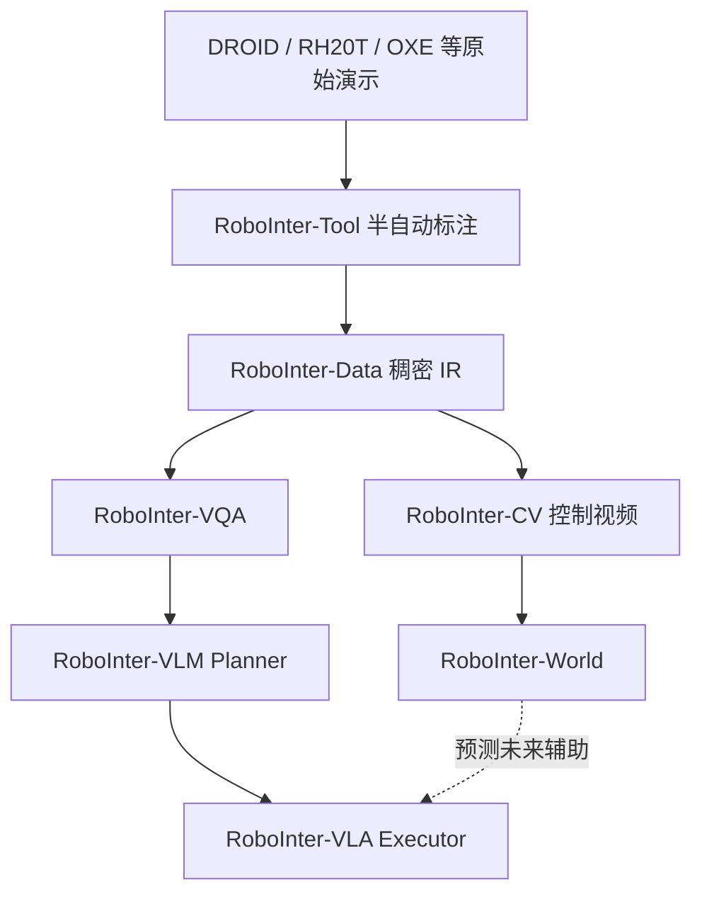
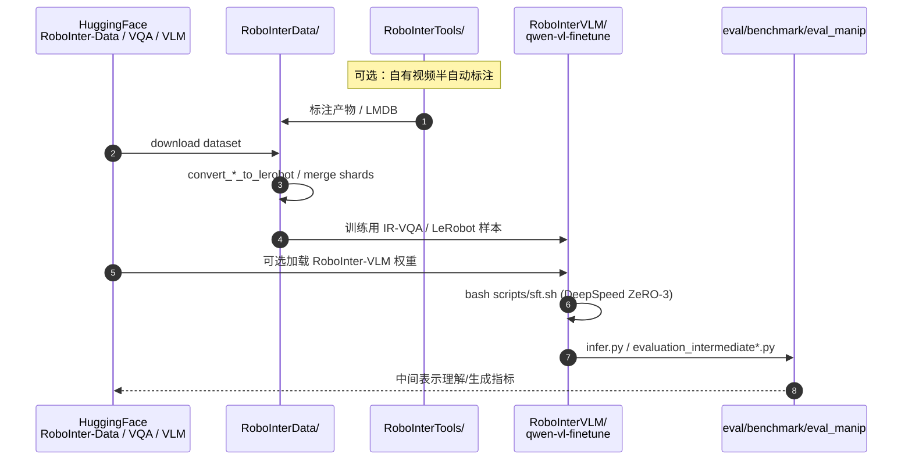

# RoboInter1.5（中间表示操作与世界建模套件）

**RoboInter1.5**（*A Holistic Intermediate Representation Suite for Embodied World Modeling and Robotic Manipulation*，[arXiv:2607.18709](https://arxiv.org/abs/2607.18709)，2026；团队单位含 **北京航空航天大学（BUAA）** / **中国科学技术大学（USTC）** / **上海人工智能实验室（Shanghai AI Lab）**；[项目页](https://lihaohn.github.io/RoboInter.github.io/)，[代码](https://github.com/InternRobotics/RoboInter)）在 RoboInter1.0（[arXiv:2602.09973](https://arxiv.org/abs/2602.09973)，ICLR 2026）的 **Data / Tool / VQA / VLM / VLA** 之上，补齐以中间表示为条件的 **RoboInter-World** 与长程控制视频基准 **RoboInter-CV**，把中间表示写成连接规划、执行与像素推演的 **双向接口**。

## 一句话定义

**一套以稠密操作中间表示为核心的数据–基准–模型套件：既训练能理解/生成 IR 的 VLM/VLA，又用同一套 IR 约束具身世界模型的长程未来预测。**

## 英文缩写速查

| 缩写 | 英文全称 | 简要说明 |
|------|----------|----------|
| IR | Intermediate Representation | 子任务、轨迹、框、接触等中间结构 |
| VLA | Vision-Language-Action | 视觉–语言–动作策略 |
| VLM | Vision-Language Model | 本文 Planner 骨干（Qwen2.5-VL / LLaVA-OV） |
| F-CoT | Flexible Chain-of-Thought | 可组合的多 IR 思维链 |
| DiT | Diffusion Transformer | Executor 动作头 |
| CV | Control Video（RoboInter-CV） | 由分割点/夹爪轨迹渲染的控制视频基准 |
| WM | World Model | RoboInter-World：IR 条件未来观测生成 |
| DROID | Distributed Robot Interaction Dataset | 主要 In-the-Wild 数据源之一 |

## 为什么重要

- **填「指令–动作」中间空洞：** 多数公开操作集只有语言+低层动作；缺与动作时间对齐的稠密 IR，模块化 VLA 与可控世界模型都缺监督。
- **同一脚手架服务两边：** IR 既正则化动作空间（plan-then-execute），又给视频世界模型提供比纯语言/原始电机命令更对齐像素的结构条件。
- **可落地的开源切口：** 数据、标注工具与 VLM 训练评测已公开；适合先做 IR 理解/生成，再等 VLA/World 权重齐套。

## 核心信息

| 字段 | 内容 |
|------|------|
| 机构 | 北京航空航天大学（BUAA）；中国科学技术大学（USTC）；上海人工智能实验室（Shanghai AI Lab） |
| arXiv | 1.5：[2607.18709](https://arxiv.org/abs/2607.18709)；1.0：[2602.09973](https://arxiv.org/abs/2602.09973) |
| 数据规模 | **>230k** episode · **571** 场景 · **6** 类臂 · **10+** IR 类型 |
| VQA | 约 **9** 空间 + **20** 时间类；总量约 **2.3M** 量级（项目页/1.0 口径） |
| 开源（截至 2026-07-23） | **部分开源**：Data / Tool / VLM / VQA **已发**；**VLA 权重**与 **RoboInter-World 代码**待齐 |

## 核心原理

### 套件组成

| 组件 | 作用 |
|------|------|
| **RoboInter-Tool** | 半自动 GUI：技能切分、语言、接触帧、SAM2 分割跟踪、夹爪轨迹等 |
| **RoboInter-Data** | 人机校验的稠密逐帧 IR，与双视角观测/动作对齐 |
| **RoboInter-VQA** | 空间/时间 × 理解/生成 的具身 VQA，训 Planner |
| **RoboInter-VLM** | Qwen2.5-VL / LLaVA-OneVision 微调后的 IR Planner |
| **RoboInter-VLA** | Planner + DiT Executor；IC-E2E / EC-E2E / Modular |
| **RoboInter-CV / World**（1.5） | 控制视频条件的可控未来观测生成与长程基准 |

### 流程总览

### VLA 三种范式

| 变体 | 机制 |
|------|------|
| **IC-E2E** | 用预训练 Planner 的 VLM 作更强视觉–语言特征，端到端出动作 |
| **EC-E2E** | 联合优化推理（显式 IR）与动作 |
| **Modular** | 训练时 Executor 吃 GT IR；推理时吃 Planner 预测；支持 Te/Im F-CoT |

### RoboInter-World（要点）

在历史 latent \(z^{\mathrm{hist}}\)、语言 \(c\)、可选动作 \(a\) 与控制视频 \(u\) 条件下对未来 latent 去噪；\(u\) 由物体跟踪点与夹爪轨迹渲染到黑底画布，去掉外观、保留时空结构。论文报告 World 预测可提升 VLA 动作精度。

## 评测与结果

- **数据/基准规模：** RoboInter-Data **>230k** episode · **571** 场景 · **6** 类机械臂 · **10+** 类 IR；RoboInter-VQA 约 **9** 空间 + **20** 时间类、总量约 **2.3M** 量级；新增 **RoboInter-CV** 作长程控制视频基准。
- **VLM（Planner）：** 在 Qwen2.5-VL / LLaVA-OneVision 上微调，用 `evaluation_intermediate*.py` 评 IR 理解/生成指标（当前唯一可社区端复现的评测口径）。
- **VLA 与 World（index-level）：** 论文报告 RoboInter-World 的未来预测可提升 VLA 动作精度、三种范式（IC-E2E / EC-E2E / Modular）各有取舍；但 VLA 权重与 World 代码待齐，**per-task 成功率尚不能社区端复现**，此处按索引级记录。

## 源码运行时序图

公开可运行路径以 **数据 → VLM 训练/评测** 为主（VLA/World 待齐）：

关键复现路径：先拉 HF 数据与权重，用 `RoboInterData/` 转 LeRobot，再跑 `RoboInterVLM/.../scripts/sft.sh` 或官方 eval；**不要**假设 `RoboInterVLA/` 与 World 已可训练。

## 工程实践

| 项 | 建议 |
|----|------|
| 先跑通 | Data 可视化（`RoboInterData-Demo`）→ VLM 推理评测 → 再考虑自训 |
| 数据许可 | 遵循 DROID/RH20T 原许可 + HF gated 表单（若启用） |
| 与 LeRobot | 转换脚本支持 v2.1；v3.0 全量支持仍在 TODO |
| 1.0 vs 1.5 | 仓 README/徽章多指向 **2602.09973**；读 World/CV 请以 **2607.18709** 为准 |
| 重定向就绪度 | 数据跨 **6 类机械臂形态**；核心 IR（分割点 / 夹爪轨迹 / 接触帧）是**形态相对无关的中间表示**，比原始电机命令更易跨本体适配、作为重定向/迁移的条件；但 DiT Executor 动作头仍需按目标本体重训，IR 不直接等于可部署关节指令 |

## 与其他工作对比

| 维度 | RoboInter1.5 | [InternVLA-A1.5](./paper-internvla-a15-unified-vla.md) | [Masked Visual Actions](./paper-masked-visual-actions.md) | 纯语言+低层动作数据集 |
|------|--------------|-----------|-----------|----------------------|
| 监督结构 | **稠密逐帧 IR**（子任务/轨迹/框/接触，与动作对齐） | 统一 VLA 表征 | 掩码视觉动作条件 | 仅语言 + 电机命令 |
| 覆盖闭环 | 数据/工具/VQA/VLM/VLA/**World+CV** 全栈 | unified VLA 策略 | 结构化视觉条件 WM | 缺中间监督 |
| IR 复用 | **双向**：正则化动作空间 + 给世界模型提供像素对齐条件 | 单向策略 | 视觉条件生成 | — |
| 开源状态 | Data/Tool/VQA/VLM 已发，VLA 权重/World 代码待齐 | 见对应页 | 见对应页 | 视数据集而定 |

## 局限与风险

- **VLA 权重与 World 代码未齐：** 论文中的 plan-then-execute 与 World→VLA 增益目前难社区端完整复现。
- **标注仍依赖人机环：** 相对纯自动伪标签质量更高，但扩展成本仍在。
- **IR 选择敏感：** F-CoT 组合空间大，任务需裁剪，否则 Planner 噪声会灌进 Executor。
- **World 仍是像素推演：** 长程仍受累积误差制约；IR 条件减幻觉，不替代物理引擎保证。

## 关联页面

- [VLA](../methods/vla.md) — plan-then-execute / 中间表示策略族
- [Generative World Models](../methods/generative-world-models.md) — 可控视频世界模型谱系
- [Video-as-Simulation](../concepts/video-as-simulation.md) — 像素仿真范式
- [Manipulation](../tasks/manipulation.md) — 操作任务地图
- [InternVLA-A1.5](./paper-internvla-a15-unified-vla.md) — 同组织 unified VLA 对照
- [Masked Visual Actions](./paper-masked-visual-actions.md) — 另一类结构化视觉条件 WM
- [VLA 开源复现景观](../overview/vla-open-source-repro-landscape-2025.md) — 复现选型

## 参考来源

- [RoboInter1.5 论文摘录](../../sources/papers/robointer_1_5_arxiv_2607_18709.md)
- [InternRobotics/RoboInter 仓库归档](../../sources/repos/robointer.md)
- [RoboInter 项目页归档](../../sources/sites/lihaohn-robointer-github-io.md)

## 推荐继续阅读

- [GitHub: InternRobotics/RoboInter](https://github.com/InternRobotics/RoboInter) — 组件入口表
- [HF: RoboInter-Data](https://huggingface.co/datasets/InternRobotics/RoboInter-Data) — 数据集卡片
- [arXiv:2607.18709](https://arxiv.org/abs/2607.18709) — 1.5 全文（含 World / CV）
