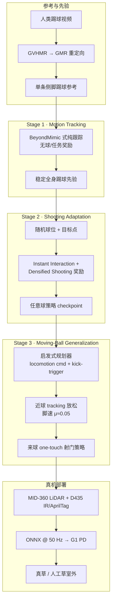

# RoboNaldo（人形足球射门 · Motion-Guided Curriculum RL）

**RoboNaldo**（*Accurate, Stable and Powerful Humanoid Soccer Shooting via Motion-Guided Curriculum Reinforcement Learning*，arXiv:2606.11092，港大 · 港中文 · Archon Robotics）针对 **高冲量、毫秒级足–球接触** 的人形射门：用 **一条人类侧脚踢球参考** 作 scaffold，经 **三阶段课程 RL** 依次获得 **稳定踢球先验 → 任意球瞄准 → 来球时机与接近控制**，在仿真与 **Unitree G1 真草室外** 上同时追求 **点级精度、球速、来球泛化、机载感知与室外部署**。

## 一句话定义

**先跟踪人类踢球学会稳定全身协调，再用任务奖励学会「偏离参考」瞄准任意球，最后用 locomotion + kick-trigger 把来球射门拆成可学的接近与触球时机问题。**

## 英文缩写速查

| 缩写 | 英文全称 | 简要说明 |
|------|----------|----------|
| RL | Reinforcement Learning | 通过与环境交互最大化长期回报来学习策略 |
| PPO | Proximal Policy Optimization | 本文采用的 on-policy 策略梯度算法（RSL-RL） |
| GMR | General Motion Retargeting | 将人类/视频踢球动作重定向为 G1 可执行参考 |
| GVHMR | Gravity-View Human Motion Recovery | 从人类视频恢复 3D 人体运动，供重定向管线使用 |
| G1 | Unitree G1 Humanoid | 宇树教育科研人形平台，本文真机与仿真主体 |
| Sim2Real | Simulation to Real | 仿真训练策略迁移到真机草地与感知栈 |
| LiDAR | Light Detection and Ranging | 头部 Livox MID-360，近距 retro-reflective 球定位 |
| ONNX | Open Neural Network Exchange | 机载 50 Hz 策略推理导出格式 |

## 为什么重要

- **射门是「 athletic humanoid interaction」的紧凑基准：** 同时耦合单脚平衡、亚 10 ms 冲量接触与跨球位/目标泛化；比持续接触搬运更难，因为有效监督 **延迟且稀疏**。
- **运动先验与任务目标的 staged 合设计：** 论文明确指出固定 reference 不能选触球点/时机，纯 task RL 又难从零发现踢球；三阶段把各学习信号 **可靠提供的部分** 拆开，并用 **proximity-based tracking relaxation** 在触球附近释放脚端自由度。
- **相对 PAiD / HumanX 等的精度与功率跃迁：** 公开 Table 1 中 RoboNaldo 是唯一同时报告 **点级瞄准、报告球速、来球射门、自中心感知、室外演示** 的系统；仿真任意球误差约为 prior work **一半**、球速 **2.96×**。
- **可复用的真机感知栈叙事：** 快球下 **LiDAR 反射率 + 球体拟合** 与 **IR 亮斑** 优于 RGB YOLO/HSV；并强调 Isaac Lab BFS 与 Unitree SDK DFS **关节序置换** 的 silent failure 风险。

## 流程总览

## 核心机制（归纳）

### 三阶段课程

| 阶段 | 优化重点 | 关键接口 |
|------|----------|----------|
| **Stage 1** | 平衡、摆腿、全身协调 | motion-reference **anchor cue** |
| **Stage 2** | 触球点、方向、冲量 → **点级瞄准** | 球/目标观测 + 射门奖励；球位随机化 |
| **Stage 3** | 接近轨迹 + **触球时机** | **locomotion command** 替换 anchor；**kick-trigger** 切换踢球参考 |

Stage 3 训练期由 **启发式规划器** 预测来球位置、驱动接近并在最近接近距离低于阈值时触发踢球；推理期 **同一低层策略** 可由其他高层控制器驱动。

### 奖励与 tracking 放松

- **Instant Interaction Reward：** 面向极短冲量接触，在有效触球瞬间给密集反馈。
- **Densified Shooting Reward：** 外推触球后球轨迹，缓解延迟的球–目标误差监督。
- **Proximity relaxation：** 距球 $d \leq 0.35$ m 时按项缩放 motion tracking 权重；**脚线速度** 项几乎完全放松（$\mu{=}0.05$），保留躯干姿态部分约束以维持平衡。

### 训练与仿真

- **算法：** PPO（RSL-RL）；4096 并行环境；Isaac Lab GPU PhysX；50 Hz 控制。
- **网络：** actor/critic 均为 $512{\to}256{\to}128$ MLP + 经验观测归一化；critic 用特权无噪声观测。
- **域随机化：** 摩擦、restitution、关节偏置、CoM、执行延迟、随机基座扰动。

### 与代表性 humanoid soccer 系统对比（论文 Table 1 摘要）

| 能力维度 | PAiD† | HumanX† | Reactive | **RoboNaldo** |
|----------|-------|---------|----------|---------------|
| 点级瞄准 | ✗ | ✗ | ✗ | **✓** |
| 报告球速 | ✗ | ✗ | ✗ | **✓** |
| 来球射门 | ✓ | ✓ | ✗ | **✓** |
| 自中心感知 | ✓ | ✗ | ✓ | **✓** |
| 室外演示 | ✓ | ✗ | ✓ | **✓** |

† 并发工作。PAiD 更强调 **goal-region 入门** 与渐进感知融合；RoboNaldo 强调 **亚米级点放置** 与 **职业级球速比例**。

## 评测

- **仿真：** 任意球（Stage 2）自 5 m — 平均误差 **0.899 m**，**65.5%** <1 m，球速 **14.79 m/s**；来球（Stage 3）**63.3%** <1 m。
- **真机（G1，3 m）：** 任意球平均 **0.73 m**；来球 **0.86 m**；来球 **74%** 有效触球；最佳单次 **17 cm** 落点误差、触球后 **13.10 m/s**（约 **47.2 km/h**）。
- **场地：** 人工足球场、曲棍球场、天然草；全程 **机载** 感知，无外部动捕基础设施。
- **热图：** 项目页提供 8 m×2 m 目标面、3 m 射门距离的 shot-quality heatmap（Stage 2/3）。

## 常见误区或局限

- **不是端到端感知–动作单策略：** 低层是统一 RL 策略，但 Stage 3 训练依赖 **启发式高层**；换高层控制器的能力需单独验证。
- **单条人类参考的上限：** scaffold 来自 **一条侧脚踢球**；极不同踢球风格（内脚背、凌空等）未覆盖。
- **感知仍分近/远模态：** LiDAR 近距 + IR 远距；快球 **截停/拦截** 列为未来扩展；RGB 检测在 motion blur 下仍不可靠。
- **与 PAiD 指标不可直接横比：** PAiD 报告 **goal-region / 成功率** 叙事；RoboNaldo 主打 **点级误差与 m/s 球速**——读对比表时应对齐任务定义与距离。

## 与其他页面的关系

- [Humanoid Soccer](../tasks/humanoid-soccer.md) — 任务背景与技能分解；本文是 **射门子技能** 的 2026 前沿实例。
- [PAiD Framework](../methods/paid-framework.md) — 同 G1、同三阶段渐进哲学；PAiD 偏 **感知融合 + goal 区域**，RoboNaldo 偏 **点级瞄准 + 高冲量**。
- [BeyondMimic](../methods/beyondmimic.md) — Stage 1 tracking 范式来源。
- [GMR](../methods/motion-retargeting-gmr.md) — 人类踢球 → G1 参考管线。
- [Unitree G1](./unitree-g1.md) — 硬件与足球技能研究平台。
- [Learning Soccer Skills（PAiD 论文实体）](./paper-notebook-learning-soccer-skills-for-humanoid-robots.md) — 同主题并发对照。

## 推荐继续阅读

- 论文：<https://arxiv.org/abs/2606.11092>
- 项目页：<https://opendrivelab.com/RoboNaldo/>
- 对照：[PAiD 深读笔记](https://imchong.github.io/Humanoid_Robot_Learning_Paper_Notebooks/papers/04_Loco-Manipulation_and_WBC/Learning_Soccer_Skills_for_Humanoid_Robots____A_Progressive_Perception-Action_Fr/Learning_Soccer_Skills_for_Humanoid_Robots____A_Progressive_Perception-Action_Fr.html)

## 参考来源

- [robonaldo_arxiv_2606_11092.md](../../sources/papers/robonaldo_arxiv_2606_11092.md) — arXiv 策展摘录
- [opendrivelab-robonaldo.md](../../sources/sites/opendrivelab-robonaldo.md) — 项目页公开主张与演示矩阵

## 关联页面

- [Humanoid Soccer](../tasks/humanoid-soccer.md)
- [PAiD Framework](../methods/paid-framework.md)
- [BeyondMimic](../methods/beyondmimic.md)
- [Reward Design](../concepts/reward-design.md)
- [Sim2Real](../concepts/sim2real.md)
- [Unitree G1](./unitree-g1.md)
