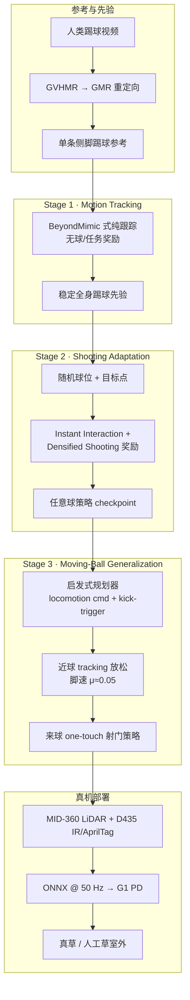
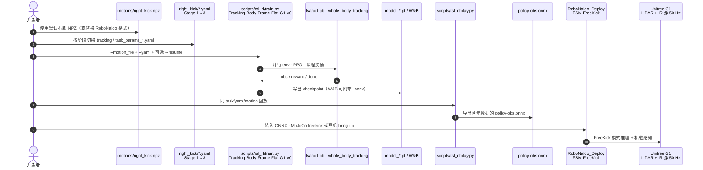

# RoboNaldo（人形足球射门 · Motion-Guided Curriculum RL）

**RoboNaldo**（*Accurate, Stable and Powerful Humanoid Soccer Shooting via Motion-Guided Curriculum Reinforcement Learning*，[arXiv:2606.11092](https://arxiv.org/abs/2606.11092)，[代码](https://github.com/OpenDriveLab/RoboNaldo)）由 **香港大学 · 香港中文大学 · 源策未来（Archon Robotics）**（项目页 [OpenDriveLab](https://opendrivelab.com/RoboNaldo/)）提出：针对 **高冲量、毫秒级足–球接触** 的人形射门，用 **一条人类侧脚踢球参考** 作 scaffold，经 **三阶段课程 RL** 依次获得 **稳定踢球先验 → 任意球瞄准 → 来球时机与接近控制**；在仿真与 **Unitree G1 真草室外** 上同时追求 **点级精度、球速、来球泛化、机载感知与室外部署**。

## 一句话定义

**先跟踪人类踢球学会稳定全身协调，再用任务奖励学会「偏离参考」瞄准任意球，最后用 locomotion + kick-trigger 把来球射门拆成可学的接近与触球时机问题。**

## 英文缩写速查

| 缩写 | 英文全称 | 简要说明 |
|------|----------|----------|
| RL | Reinforcement Learning | 通过与环境交互最大化长期回报来学习策略 |
| PPO | Proximal Policy Optimization | 本文采用的 on-policy 策略梯度算法（RSL-RL） |
| GMR | General Motion Retargeting | 将人类/视频踢球动作重定向为 G1 可执行参考 |
| GVHMR | Gravity-View Human Motion Recovery | 从人类视频恢复 3D 人体运动，供重定向管线使用 |
| G1 | Unitree G1 Humanoid | 宇树教育科研人形平台，本文真机与仿真主体 |
| Sim2Real | Simulation to Real | 仿真训练策略迁移到真机草地与感知栈 |
| LiDAR | Light Detection and Ranging | 头部 Livox MID-360，近距 retro-reflective 球定位 |
| ONNX | Open Neural Network Exchange | 机载 / 部署仓策略推理导出格式 |
| FSM | Finite State Machine | 部署仓多策略模式切换（FreeKick / Loco / Passive 等） |

## 为什么重要

- **射门是「 athletic humanoid interaction」的紧凑基准：** 同时耦合单脚平衡、亚 10 ms 冲量接触与跨球位/目标泛化；比持续接触搬运更难，因为有效监督 **延迟且稀疏**。
- **运动先验与任务目标的 staged 合设计：** 固定 reference 不能选触球点/时机，纯 task RL 又难从零发现踢球；三阶段把各学习信号 **可靠提供的部分** 拆开，并用 **proximity-based tracking relaxation** 在触球附近释放脚端自由度。
- **相对 PAiD / HumanX 等的精度与功率跃迁：** 公开 Table 1 中 RoboNaldo 是唯一同时报告 **点级瞄准、报告球速、来球射门、自中心感知、室外演示** 的系统；仿真任意球误差约为 prior work **一半**、球速 **2.96×**。
- **可复现闭环已开源：** 训练仓（Isaac Lab）+ 部署仓（MuJoCo / 真机 FSM + 机载感知）+ 默认右脚 NPZ，可按 YAML 复现 Stage 1→3 课程。

## 核心信息

| 项 | 内容 |
|----|------|
| **机构** | 香港大学（HKU）；香港中文大学（CUHK）；源策未来（Archon Robotics）；项目页由 OpenDriveLab 托管 |
| **平台** | Unitree G1，29-DoF；策略 50 Hz；部署要求 **3-DoF 腰**（固定支架需先解锁） |
| **栈** | Isaac Lab + PhysX GPU · RSL-RL PPO · BeyondMimic 风格 `whole_body_tracking` 扩展 |
| **开源** | **已开源**（截至 **2026-07-28**）：训练 [OpenDriveLab/RoboNaldo](https://github.com/OpenDriveLab/RoboNaldo)（MIT）· 部署 [RoboNaldo_Deploy](https://github.com/OpenDriveLab/RoboNaldo_Deploy)（根目录未声明 LICENSE） |

## 流程总览

```mermaid
flowchart TB
  subgraph ref ["参考与先验"]
    vid["人类踢球视频"]
    gvh["GVHMR → GMR 重定向"]
    refm["单条侧脚踢球参考"]
    vid --> gvh --> refm
  end

  subgraph s1 ["Stage 1 · Motion Tracking"]
    trk["BeyondMimic 式纯跟踪<br/>无球/任务奖励"]
    prior["稳定全身踢球先验"]
    refm --> trk --> prior
  end

  subgraph s2 ["Stage 2 · Shooting Adaptation"]
    ball["随机球位 + 目标点"]
    rwd["Instant Interaction +<br/>Densified Shooting 奖励"]
    fk["任意球策略 checkpoint"]
    prior --> ball --> rwd --> fk
  end

  subgraph s3 ["Stage 3 · Moving-Ball Generalization"]
    plan["启发式规划器<br/>locomotion cmd + kick-trigger"]
    relax["近球 tracking 放松<br/>脚速 μ≈0.05"]
    mb["来球 one-touch 射门策略"]
    fk --> plan --> relax --> mb
  end

  subgraph deploy ["真机部署"]
    sense["MID-360 LiDAR + D435 IR/AprilTag"]
    onnx["ONNX @ 50 Hz → G1 PD"]
    field["真草 / 人工草室外"]
    mb --> sense --> onnx --> field
  end
```

## 核心原理

### 三阶段课程

| 阶段 | 优化重点 | 关键接口 |
|------|----------|----------|
| **Stage 1** | 平衡、摆腿、全身协调 | motion-reference **anchor cue** |
| **Stage 2** | 触球点、方向、冲量 → **点级瞄准** | 球/目标观测 + 射门奖励；球位随机化 |
| **Stage 3** | 接近轨迹 + **触球时机** | **locomotion command** 替换 anchor；**kick-trigger** 切换踢球参考 |

Stage 3 训练期由 **启发式规划器** 预测来球位置、驱动接近并在最近接近距离低于阈值时触发踢球；推理期 **同一低层策略** 可由其他高层控制器驱动。

### 奖励与 tracking 放松

- **Instant Interaction Reward：** 面向极短冲量接触，在有效触球瞬间给密集反馈。
- **Densified Shooting Reward：** 外推触球后球轨迹，缓解延迟的球–目标误差监督。
- **Proximity relaxation：** 距球 $d \leq 0.35$ m 时按项缩放 motion tracking 权重；**脚线速度** 项几乎完全放松（$\mu{=}0.05$），保留躯干姿态部分约束以维持平衡。

### 训练与仿真

- **算法：** PPO（RSL-RL）；4096 并行环境；Isaac Lab GPU PhysX；50 Hz 控制。
- **网络：** actor/critic 均为 $512{\to}256{\to}128$ MLP + 经验观测归一化；critic 用特权无噪声观测。
- **域随机化：** 摩擦、restitution、关节偏置、CoM、执行延迟、随机基座扰动。

## 与其他工作对比

| 能力维度 | PAiD† | HumanX† | Reactive | **RoboNaldo** |
|----------|-------|---------|----------|---------------|
| 点级瞄准 | ✗ | ✗ | ✗ | **✓** |
| 报告球速 | ✗ | ✗ | ✗ | **✓** |
| 来球射门 | ✓ | ✓ | ✗ | **✓** |
| 自中心感知 | ✓ | ✗ | ✓ | **✓** |
| 室外演示 | ✓ | ✗ | ✓ | **✓** |

† 并发工作。PAiD 更强调 **goal-region 入门** 与渐进感知融合；RoboNaldo 强调 **亚米级点放置** 与 **职业级球速比例**。选型细节见 [人形足球技能学习方法选型](../queries/humanoid-soccer-skill-learning-method-selection.md)。

## 源码运行时序图

官方训练仓 [OpenDriveLab/RoboNaldo](https://github.com/OpenDriveLab/RoboNaldo) 与部署仓 [RoboNaldo_Deploy](https://github.com/OpenDriveLab/RoboNaldo_Deploy)（归档见 [sources/repos/robonaldo.md](../../sources/repos/robonaldo.md)、[robonaldo-deploy.md](../../sources/repos/robonaldo-deploy.md)）：

```mermaid
sequenceDiagram
    autonumber
    actor Dev as 开发者
    participant Mot as motions/right_kick.npz
    participant YAML as right_kick/*.yaml<br/>Stage 1→3
    participant Train as scripts/rsl_rl/train.py<br/>Tracking-Body-Frame-Flat-G1-v0
    participant IL as Isaac Lab · whole_body_tracking
    participant CKPT as model_*.pt / W&B
    participant Play as scripts/rsl_rl/play.py
    participant ONNX as policy-obs.onnx
    participant Dep as RoboNaldo_Deploy<br/>FSM FreeKick
    participant G1 as Unitree G1<br/>LiDAR + IR @ 50 Hz

    Dev->>Mot: 使用默认右脚 NPZ（或替换 RoboNaldo 格式）
    Dev->>YAML: 按阶段切换 tracking / task_params_*.yaml
    Dev->>Train: --motion_file + --yaml + 可选 --resume
    Train->>IL: 并行 env · PPO · 课程奖励
    IL-->>Train: obs / reward / done
    Train->>CKPT: 写出 checkpoint（W&B 可附带 .onnx）
    Dev->>Play: 同 task/yaml/motion 回放
    Play->>ONNX: 导出含元数据的 policy-obs.onnx
    Dev->>Dep: 装入 ONNX · MuJoCo freekick 或真机 bring-up
    Dep->>G1: FreeKick 模式推理 + 机载感知
```

- **最短复现路径：** 装 Isaac Lab 2.3.2 → `pip install -e source/whole_body_tracking` → 下载 G1 URDF → `train.py` 按 YAML 爬 Stage 1→3 → `play.py` 导出 ONNX → `RoboNaldo_Deploy` MuJoCo/`deploy_real`。
- **Stage 2/3 resume：** README 建议减小 policy noise std，避免破坏踢球先验。
- **当前 release：** 右脚预设与参考；左脚需镜像运动并改 `main_foot_name`。

## 工程实践

| 项 | 建议 |
|----|------|
| **开源状态** | **已开源**（2026-06 起）：训练 MIT；部署仓公开但根目录 **未声明 LICENSE**——商用前自行确认 |
| 环境 | Isaac Sim 5.1.0 + Isaac Lab 2.3.2 + Python 3.11；校验 `whole_body_tracking` 包路径勿与旧 BeyondMimic 冲突 |
| 课程切换 | 仅改 `--yaml`：`tracking_params` → `task_params_1/2` → `task_params_3`；从上一阶段 checkpoint resume |
| 资产 | G1 description 另下；球用 Isaac Lab `SphereCfg`，无需球 mesh |
| 部署 | FreeKick 需机载 LiDAR；29-DoF + 3-DoF 腰；建议去手；关节 BFS↔DFS 置换必须与 SDK 对齐 |
| 偏置调试 | 部署仓支持 L1/L2 + D-pad 调目标/球 Y 偏置（±1.5 m），不改原始感知读数 |
| 感知 | 近距：Livox MID-360 反射率 + 球体拟合 + Kalman；远距：D435 IR 亮斑（快球下优于 RGB YOLO/HSV） |

## 评测

- **仿真：** 任意球（Stage 2）自 5 m — 平均误差 **0.899 m**，**65.5%** <1 m，球速 **14.79 m/s**；来球（Stage 3）**63.3%** <1 m。
- **真机（G1，3 m）：** 任意球平均 **0.73 m**；来球 **0.86 m**；来球 **74%** 有效触球；最佳单次 **17 cm** 落点误差、触球后 **13.10 m/s**（约 **47.2 km/h**）。
- **场地：** 人工足球场、曲棍球场、天然草；全程 **机载** 感知，无外部动捕基础设施。
- **热图：** 项目页提供 8 m×2 m 目标面、3 m 射门距离的 shot-quality heatmap（Stage 2/3）。

## 结论

**高冲量人形射门的关键不是「从零堆任务奖励」，而是用单条人类踢球作 scaffold：先锁住全身协调，再允许偏离参考去瞄准，最后把来球时机拆成 locomotion + kick-trigger 接口。**

1. **点级精度与球速可同时做高** — 真机 3 m 任意球平均 **0.73 m**、触球后最高 **13.10 m/s**；仿真相对 prior 误差约 **一半**、球速约 **3×**。
2. **Stage 2 是「学会偏离参考」** — 固定 tracking 给不了触球点；任务奖励必须在先验附近做局部适应，并用 Instant Interaction / Densified Shooting 监督亚 10 ms 冲量。
3. **Stage 3 用接口拆时机，而不是端到端硬学** — locomotion command + kick-trigger + 近球 tracking 放松；训练期启发式规划器可换，低层策略复用。
4. **感知要按距离分模态** — 快球下 LiDAR 反射率 + IR 亮斑比 RGB 检测更稳；室外真草可机载部署。
5. **复现路径已通** — Isaac Lab 训练 YAML 对齐三阶段；ONNX → `RoboNaldo_Deploy` FreeKick；注意腰自由度、关节序与包名冲突。
6. **与 PAiD 指标勿直接横比** — PAiD 偏 goal-region/成功率；RoboNaldo 偏点误差与 m/s 球速——选型见 [技能学习方法选型](../queries/humanoid-soccer-skill-learning-method-selection.md)。

## 局限与风险

- **不是端到端感知–动作单策略：** 低层是统一 RL 策略，但 Stage 3 训练依赖 **启发式高层**；换高层控制器的能力需单独验证。
- **单条人类参考的上限：** scaffold 来自 **一条侧脚踢球**；极不同踢球风格（内脚背、凌空等）未覆盖；开源 release 目前主打右脚。
- **感知仍分近/远模态：** LiDAR 近距 + IR 远距；快球 **截停/拦截** 列为未来扩展；RGB 检测在 motion blur 下仍不可靠。
- **与 PAiD 指标不可直接横比：** PAiD 报告 **goal-region / 成功率** 叙事；RoboNaldo 主打 **点级误差与 m/s 球速**。
- **部署许可边界：** 训练仓 MIT；部署仓根目录未声明 LICENSE——分发/商用前需自行确认。

## 关联页面

- [Humanoid Soccer](../tasks/humanoid-soccer.md) — 任务背景与技能分解；本文是 **射门子技能** 的 2026 前沿实例。
- [人形足球技能学习方法选型指南](../queries/humanoid-soccer-skill-learning-method-selection.md) — PAiD vs RoboNaldo 选型。
- [PAiD Framework](../methods/paid-framework.md) — 同 G1、同三阶段渐进哲学；PAiD 偏 **感知融合 + goal 区域**，RoboNaldo 偏 **点级瞄准 + 高冲量**。
- [BeyondMimic](../methods/beyondmimic.md) — Stage 1 tracking 范式来源。
- [GMR](../methods/motion-retargeting-gmr.md) — 人类踢球 → G1 参考管线。
- [Unitree G1](./unitree-g1.md) — 硬件与足球技能研究平台。
- [Learning Soccer Skills（PAiD 论文实体）](./paper-notebook-learning-soccer-skills-for-humanoid-robots.md) — 同主题并发对照。
- [Reward Design](../concepts/reward-design.md) · [Sim2Real](../concepts/sim2real.md)

## 参考来源

- [robonaldo_arxiv_2606_11092.md](../../sources/papers/robonaldo_arxiv_2606_11092.md) — arXiv 策展摘录
- [opendrivelab-robonaldo.md](../../sources/sites/opendrivelab-robonaldo.md) — 项目页公开主张与开源核查
- [robonaldo.md](../../sources/repos/robonaldo.md) — 训练仓归档
- [robonaldo-deploy.md](../../sources/repos/robonaldo-deploy.md) — 部署仓归档

## 推荐继续阅读

- 论文：<https://arxiv.org/abs/2606.11092>
- 项目页：<https://opendrivelab.com/RoboNaldo/>
- 训练代码：<https://github.com/OpenDriveLab/RoboNaldo>
- 部署代码：<https://github.com/OpenDriveLab/RoboNaldo_Deploy>
- Video：<https://youtu.be/BuHNzqebIqc>
- 对照：[PAiD 深读笔记](https://imchong.github.io/Humanoid_Robot_Learning_Paper_Notebooks/papers/04_Loco-Manipulation_and_WBC/Learning_Soccer_Skills_for_Humanoid_Robots____A_Progressive_Perception-Action_Fr/Learning_Soccer_Skills_for_Humanoid_Robots____A_Progressive_Perception-Action_Fr.html)
