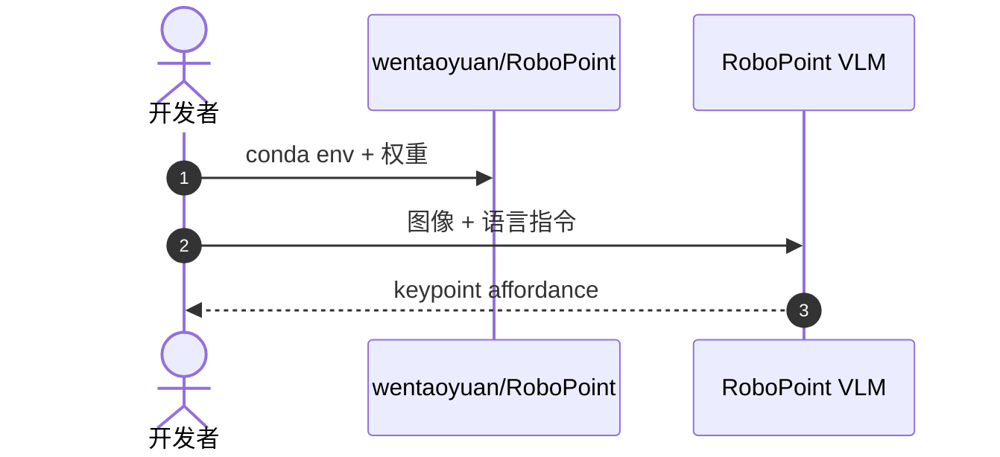

# RoboPoint：空间 affordance 的 keypoint VLM

**RoboPoint**（*A Vision-Language Model for Spatial Affordance Prediction for Robotics*，[arXiv:2406.10721](https://arxiv.org/abs/2406.10721)，[项目页](https://robo-point.github.io/)，[代码](https://github.com/wentaoyuan/RoboPoint)）预测 **语言指令条件下的图像 keypoint affordance**，用 **全自动合成数据 pipeline** instruction-tune VLM，无需真机示范采集。

## 一句话定义

**RoboPoint 输出「该点哪里」的像素 keypoint——把语言变成可对接导航/操作/AR 的通用动作空间。**

## 英文缩写速查

| 缩写 | 英文全称 | 简要说明 |
|------|----------|----------|
| VLM | Vision-Language Model | 视觉-语言模型 |
| AR | Augmented Reality | 增强现实；论文下游之一 |
| VLA | Vision-Language-Action | 可与此 keypoint 接口衔接 |

## 为什么重要

- **Affordance 先于轨迹：** 许多任务只需先知道「可操作点」，再由低层控制器完成运动。
- **零真机数据：** 合成 pipeline 降低数据门槛；与 RoboRefer/RoboSpatial 的 3D 标注路线对照。
- **被后续 VLA 预训练引用：** 如 GreenVLA 等将 RoboPoint 数据纳入 L1 预训练 mix。

## 核心信息

| 项 | 内容 |
|----|------|
| **输出** | 图像 keypoint affordance |
| **数据** | 合成 instruction-tuning 数据（仓库发布） |
| **开源** | **已开源** [wentaoyuan/RoboPoint](https://github.com/wentaoyuan/RoboPoint) 含权重与 Gradio demo |

## 实验与评测

- **评测形态：** 输出是 **图像 keypoint**，因此指标是「点对不对」（命中率 / 与真值区域的一致性），不是抓取成功率——这决定了它的分数属 [评测闭环](../queries/embodied-eval-benchmark-selection-loop.md) 的 **① 认知层**。
- **数据侧的关键主张：** 训练用 **全自动合成 instruction-tuning 数据**，无需真机示范采集；因此复现成本主要在数据生成管线而非机器人时间。
- **第三方对照：** [PointArena](./pointarena.md) 以 pointing 精度为轴把本文与其他 VLM 放在同一标尺上；[RoboRefer](./paper-roborefer.md) 的 RefSpatial-Bench 则把题面推到带推理的空间指代。引用分数时须注明来自哪个基准。
- **数值口径：** 本页为 ingest 级摘要，**未复核逐项分数**；各基准数值 **以 [原文](https://arxiv.org/abs/2406.10721) 与 [官方仓库](https://github.com/wentaoyuan/RoboPoint) 为准**。

## 与其他工作对比

| 维度 | RoboPoint（本页） | [RoboRefer](./paper-roborefer.md) | 端到端 VLA |
|------|--------------------|------------------------------------|-------------|
| 输出 | 语言条件 **keypoint affordance** | 带推理的空间指代（含度量/3D） | 直接动作 |
| 训练数据 | **合成** instruction-tuning，无需真机演示 | RefSpatial 训练集 | 机器人演示轨迹 |
| 下游接法 | 点 → 导航/操作/AR，需外部控制器 | 同左 | 无需中间层 |
| 主要风险 | 点对了但不可达/不可抓 | 同左 | 数据成本高、不可检查中间量 |

- **「点」作为动作空间的价值与代价：** 它让一个通用 VLM 不必学动力学就能接进机器人栈，中间量 **人可检查**；代价是 **点正确 ≠ 可执行**——可达性、避障与抓取稳定性都在这层之外，必须由下游控制器兜底。
- **与 VLA 的分工不是替代关系：** 合成数据带来的低成本泛化，换来的是把执行风险推给下游；选型时问的是「你缺的是语义定位还是动作能力」。

## 结论

**RoboPoint 代表「keypoint affordance VLM」支路——轻量、可合成、易接下游控制。**

- keypoint 动作空间比连续轨迹更易跨平台
- 合成数据 scalable；真机 gap 需下游验证
- 与 PointArena pointing 评测、[RoboRefer](./paper-roborefer.md) 3D 指代形成能力梯度
- 开源完整 train/eval 栈，适合作为 spatial VLM 基线

## 源码运行时序图

## 关联页面

- [PointArena](./pointarena.md)
- [RoboRefer](./paper-roborefer.md)
- [VLA](../methods/vla.md)

## 参考来源

- [robopoint_arxiv_2406_10721.md](../../sources/papers/robopoint_arxiv_2406_10721.md)
- [robopoint.md](../../sources/sites/robopoint.md)
- [wentaoyuan-robopoint.md](../../sources/repos/wentaoyuan-robopoint.md)

## 推荐继续阅读

- [RoboPoint 项目页](https://robo-point.github.io/)
- [Gradio Demo](https://4a1d27fb146d7216fa.gradio.live)（README 链接，可用性以项目为准）
