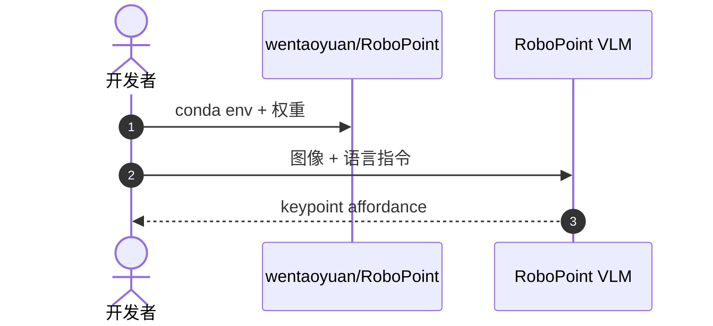

# RoboPoint：空间 affordance 的 keypoint VLM

**RoboPoint**（*A Vision-Language Model for Spatial Affordance Prediction for Robotics*，[arXiv:2406.10721](https://arxiv.org/abs/2406.10721)，[项目页](https://robo-point.github.io/)，[代码](https://github.com/wentaoyuan/RoboPoint)）预测 **语言指令条件下的图像 keypoint affordance**，用 **全自动合成数据 pipeline** instruction-tune VLM，无需真机示范采集。

## 一句话定义

**RoboPoint 输出「该点哪里」的像素 keypoint——把语言变成可对接导航/操作/AR 的通用动作空间。**

## 英文缩写速查

| 缩写 | 英文全称 | 简要说明 |
|------|----------|----------|
| VLM | Vision-Language Model | 视觉-语言模型 |
| AR | Augmented Reality | 增强现实；论文下游之一 |
| VLA | Vision-Language-Action | 可与此 keypoint 接口衔接 |

## 为什么重要

- **Affordance 先于轨迹：** 许多任务只需先知道「可操作点」，再由低层控制器完成运动。
- **零真机数据：** 合成 pipeline 降低数据门槛；与 RoboRefer/RoboSpatial 的 3D 标注路线对照。
- **被后续 VLA 预训练引用：** 如 GreenVLA 等将 RoboPoint 数据纳入 L1 预训练 mix。

## 核心信息

| 项 | 内容 |
|----|------|
| **输出** | 图像 keypoint affordance |
| **数据** | 合成 instruction-tuning 数据（仓库发布） |
| **开源** | **已开源** [wentaoyuan/RoboPoint](https://github.com/wentaoyuan/RoboPoint) 含权重与 Gradio demo |

## 结论

**RoboPoint 代表「keypoint affordance VLM」支路——轻量、可合成、易接下游控制。**

- keypoint 动作空间比连续轨迹更易跨平台
- 合成数据 scalable；真机 gap 需下游验证
- 与 PointArena pointing 评测、[RoboRefer](./paper-roborefer.md) 3D 指代形成能力梯度
- 开源完整 train/eval 栈，适合作为 spatial VLM 基线

## 源码运行时序图

## 关联页面

- [PointArena](./pointarena.md)
- [RoboRefer](./paper-roborefer.md)
- [VLA](../methods/vla.md)

## 参考来源

- [robopoint_arxiv_2406_10721.md](../../sources/papers/robopoint_arxiv_2406_10721.md)
- [robopoint.md](../../sources/sites/robopoint.md)
- [wentaoyuan-robopoint.md](../../sources/repos/wentaoyuan-robopoint.md)

## 推荐继续阅读

- [RoboPoint 项目页](https://robo-point.github.io/)
- [Gradio Demo](https://4a1d27fb146d7216fa.gradio.live)（README 链接，可用性以项目为准）
