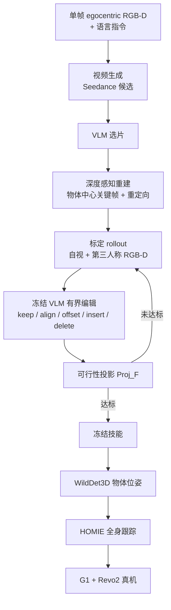

# RoboReact：从生成第一人称视频蒸馏可泛化全身操作技能

**RoboReact**（*Agentic Skill Distillation from Generated Egocentric Videos for Generalizable Whole-Body Manipulation*，[arXiv:2608.03387](https://arxiv.org/abs/2608.03387)，[项目页](https://roboreact.github.io/)）由 **香港中文大学（深圳）/ 京东科技 / 清华大学**（He / Wang / Yue / Teng / Wang / Liu）提出：给定 **一张 egocentric RGB-D** 和语言指令，用视频生成模型想象人类操作，抽出保几何的手–物关键帧并重定向到高 DoF 人形；冻结 VLM 在标定 rollout 上做有界结构化编辑。精炼结束后技能冻结，测试时 **VLM 不进控制环**，只靠物体中心再接地和 [HOMIE](./paper-loco-manip-161-040-homie.md) 全身控制器执行。

## 一句话定义

**别把生成视频当轨迹回放：先编译成物体相对关键帧，用 VLM 在标定里改结构，部署时只估物体位姿再接地。**

## 英文缩写速查

| 缩写 | 英文全称 | 简要说明 |
|------|----------|----------|
| RoboReact | Agentic skill distillation from generated egocentric video | 本文框架：生成视频 → 关键帧技能 → agent 精炼 → 冻结执行 |
| VLM | Vision-Language Model | 冻结的 in-context 技能编辑器，不进测试控制环 |
| EE | End-Effector | 臂末端位姿 \(T_{a,k}\)；与物体相对变换 \(\Delta T_k\) 配对 |
| SR | Success Rate | 全部步骤成功才计终端成功 |
| Avg. Len. | Average completed task length | 平均完成步数；可在前序失败后继续记后续步 |
| HOMIE | Humanoid loco-manipulation WBC | 本文低层跟踪器：跟基座/身高/躯干/臂/手目标 |
| ICL | In-Context Learning | 用 rollout 记忆改关键帧，不做梯度更新 |

## 为什么重要

- **数据采集墙换位置：** 遥操作和人体示教是人形操作的主成本。RoboReact 用生成视频当任务顺序与手–物结构先验，标定只用来把非度量几何校准到真机。
- **编译期推理 vs 运行期几何：** VLM 只在蒸馏阶段看 rollout 并出 keep/align/offset/insert/delete；测试时去掉大模型，避免把 LLM 塞进 50 Hz 环。
- **生成先验几乎够用：** 四任务均值 SR **81.3%**，one-shot 真人视频先验 **80.0%**。瓶颈从「有没有真人视频」转到「怎么编译和再接地」。
- **开源边界：** 截至 **2026-08-14** 项目页无训练仓。今日读表和看视频，不能当可跑通复现栈。

## 核心信息

| 字段 | 内容 |
|------|------|
| 作者 | Shuliang He, Shuai Wang, Bo Yue, Junchi Teng, Changyu Wang, Guiliang Liu（通讯） |
| 机构 | 香港中文大学（深圳）；京东科技；清华大学 |
| 出处 | arXiv:2608.03387（2026-08）；cs.RO |
| 平台 | 29-DoF [Unitree G1](./unitree-g1.md) + BrainCo Revo2 Touch |
| 感知 | 头戴 RealSense D435i；外置 D435 第三人称标定；WildDet3D 物体位姿 |
| 栈 | Seedance 视频生成；GPT-Codex 作 VLM 编辑器；[HOMIE](./paper-loco-manip-161-040-homie.md) 低层；RTX 4080 Super 离板 |
| 开源（截至 2026-08-14） | **确认未开源**：落地页仓不是实现；论文未承诺放代码 |

## 方法与核心结构

技能是有序关键帧，不是连续轨迹：

\[
\Pi=\{(\rho_k,o_k,T^{l}_{a,k},T^{r}_{a,k},h^{l}_{k},h^{r}_{k},m_k)\}_{k=1}^{K}
\]

\(\rho_k\in\{\mathrm{approach},\mathrm{align},\mathrm{fixed}\}\) 标接触前 / 接触中 / 相对几何锁死。\(m_k\) 是手有效掩码：检测失败时向前或向后填最近有效观测。

蒸馏写成约束优化，但不做一阶更新：

\[
\Pi^\star=\arg\min_{\Pi\in\mathcal{F}}\lambda_s\mathcal{L}_{\mathrm{sem}}+\lambda_g\mathcal{L}_{\mathrm{geo}}+\lambda_m\mathcal{L}_{\mathrm{mot}}
\]

| 项 | 作用 |
|----|------|
| \(\mathcal{L}_{\mathrm{sem}}\) | VLM 比较生成视频与真机 rollout 的结构化语义描述 |
| \(\mathcal{L}_{\mathrm{geo}}\) | 物体相对 \(\Delta T\) 对齐；执行时 \(\hat{T}_{a,k}=\hat{T}_{o_k}\Delta T_k^{\star}\) |
| \(\mathcal{L}_{\mathrm{mot}}\) | 从生成视频恢复的腕姿与手指命令作软先验 |
| \(\mathcal{F}\) | 任务结构、新鲜物体位姿、支持的编辑、关节限位 IK |
| \(\mathrm{Proj}_{\mathcal{F}}\) | 再接地、approach 净空、腕目标→关节；失败则回滚 |

VLM 不能发明连续动作。视频按 10 Hz 采样，VLM 选出有序关键帧子集。编辑前给关键帧打 success / alignment / grasp / contact / infeasible，输出只允许五种结构化操作；校验失败或投影失败则撤销。

可选稀疏人类提示 \(u^n\)：**只描述可观察失败，不许给策略编辑**；每条技能最多 5 条。测试评估禁止人类输入。

### 流程总览

## 源码运行时序图

**不适用**（截至 2026-08-14）：项目页与论文未提供训练 / 推理 / 部署仓；GitHub 用户 `RoboReact` 仅有落地页。放出后应补：Generate → Compile → Rollout → \(\mathcal{A}_{\mathrm{ICL}}\) → \(\mathrm{Proj}_{\mathcal{F}}\) → 冻结再接地 → HOMIE。

## 工程实践

| 项 | 建议 / 论文设定 |
|----|----------------|
| **何时用** | 新长程双臂桌面技能，遥操作贵，但能采一张 RGB-D 并接受十几轮标定 |
| **何时不用** | 需要 50 Hz 在线 VLM 恢复；或接触模式必须从零 RL 发现 |
| **先验** | 优先更强视频生成器（Seedance 2.0 > 1.5 Pro）；铰接开抽屉对先验更敏感 |
| **精炼预算** | 主表约 **20** round；15 round 已能把失败前沿推到任务末步 |
| **编辑器** | 更强 VLM 把同样 rollout 编成有效编辑；弱编辑器 10 round 仍明显落后 |
| **第三人称** | 总量可砍，倾倒/遮挡对齐几乎砍不动 |
| **测试环** | 技能冻结后只再估物体位姿；VLM 留在离线 |
| **低层** | 复用 HOMIE 当平衡 API，本文只改高层交互结构 |
| **标定人工** | 最多 5 条现象描述；不要把它写成零人工 |

## 实验与评测

硬件与协议：G1 29 DoF；物体位姿/背景随机，相邻构型平移 ≥5 cm、单轴旋转 ≥10°；Open Box / Open Drawer 各 5 个未见物体实例；每任务一条冻结技能，20 trial。

| 设定 | 结果读法 |
|------|----------|
| Table 1 四任务 | RoboReact 终端 SR **85 / 70 / 85 / 85**（均值 **81.3%**）；真人先验均值 **80.0%**；YOTO 与 ReKep 全面落后 |
| 精炼预算 | 0 round 几乎失败；15 round 两任务各 11/13 完成 |
| 编辑器 | 5.6-ultra 在 10 round 把 Pour Water / Open Box SR 相对 5.1-mini 拉高 23.1 / 30.8 点 |
| 消融 | 去关键帧选择或记忆伤害最大；去第三人称主要打倾倒步 |
| 视频生成器 | Seedance 2.0：Pour Water 92.3%、Open Drawer 84.6%；1.5 Pro 在抽屉上掉到 69.2% |
| 冻结栈扰动 | 保留名义 Avg. Len. 的 **80–94%**；蹲姿扰动最伤（误差向后续接触传播），操作位基座扰动最轻 |

## 结论

**真正拉开差距的是「物体中心编译 + 标定期有界编辑 + 测试期再接地」，不是生成视频是否来自真人。**

1. **真影响：不要回放生成轨迹** — 非度量视频只提供任务顺序和手–物结构；可执行的是物体相对 \(\Delta T\)。
2. **真影响：VLM 放编译期** — 结构化编辑 + 可行性投影，比把大模型塞进控制环更适合真机。
3. **真影响：精炼预算与编辑器能力** — 0 round 不可用；更强 VLM 同样 rollout 换更高 SR。
4. **真影响：语义关键帧和记忆** — 比第三人称相机更决定长程是否走完。
5. **次要代价：铰接接触仍吃先验** — Open Drawer 对视频生成器版本更敏感。
6. **部署读法：** 蹲姿偏差会污染后续全部接触；进操作区后再接地，对局部物体扰动更稳。
7. **工程读法：无代码** — 今日只能读表和看项目页视频。

## 与其他工作对比

| 对照 | 差异读法 |
|------|----------|
| [ExoActor](../methods/exoactor.md) | 第三人称生成视频 + SONIC 跟踪全身运动；RoboReact 走 **egocentric 生成 + 物体中心关键帧 + 标定 VLM**，低层是 HOMIE 而非通用 GMT |
| [合成视频人形任务](./paper-synthetic-video-humanoid-tasks.md) | Veo→GMR→仿真 PPO 跟踪，**无真机**；本文编译后上 G1，不做 DeepMimic 式 RL |
| [OKAMI](./paper-notebook-okami-teaching-humanoid-robots-manipulation-skil.md) | 单段 **真实** RGB-D 视频 + 物体感知重定向；本文先验是 **生成** 视频，并加 agent 精炼 |
| YOTO | 单次双目真人视频学双臂关键帧，固定基座低 DoF；本文 RGB-D、移动高 DoF、测试时再接地 |
| ReKep | 无示教的关系关键点规划；在 G1 全身长程上明显弱于关键帧蒸馏 |
| [HOMIE](./paper-loco-manip-161-040-homie.md) | 本文低层；贡献在高层技能从哪来，不在再训 WBC |

## 局限与风险

- 标定仍可能用到最多 5 条人类现象描述；「无示教」≠「蒸馏零人工」。
- 生成视频几何是近似；没有再接地和精炼，直接执行会因构型不匹配失败。
- 开抽屉等接触丰富铰接仍依赖上游视频质量，精炼消不掉先验差距。
- 冻结栈对蹲姿高度误差更脆弱：上游姿态偏差会传到后续每一步接触。
- **无官方实现**，不能把项目页视频当可部署包。

## 关联页面

- [Loco-Manipulation](../tasks/loco-manipulation.md) — 视频生成驱动路线的真机关键帧蒸馏实例
- [ExoActor](../methods/exoactor.md) — 第三人称视频生成 → 运动跟踪的对照
- [Video-as-Simulation](../concepts/video-as-simulation.md) — 生成视频当交互先验，而不是像素物理引擎
- [Unitree G1](./unitree-g1.md) — 29-DoF 真机
- [HOMIE](./paper-loco-manip-161-040-homie.md) — 低层全身跟踪
- [合成视频人形任务](./paper-synthetic-video-humanoid-tasks.md) — 生成视频 → 仿真 RL 跟踪
- [OKAMI](./paper-notebook-okami-teaching-humanoid-robots-manipulation-skil.md) — 真实单视频物体感知重定向
- [Motion Retargeting](../concepts/motion-retargeting.md) — 关键帧人手到人形的上游映射

## 参考来源

- [roboreact_arxiv_2608_03387.md](../../sources/papers/roboreact_arxiv_2608_03387.md)
- [项目页归档](../../sources/sites/roboreact-github-io.md)
- He et al. — <https://arxiv.org/abs/2608.03387>
- 项目页 — <https://roboreact.github.io/>

## 推荐继续阅读

- 项目页方法与真机视频 — <https://roboreact.github.io/>
- HOMIE 低层座舱与 WBC — <https://homietele.github.io/>
- YOTO（RSS 2025，单次视频双臂）— Zhou et al., *You Only Teach Once*
- ReKep（CoRL 2024，关系关键点约束）— <https://arxiv.org/abs/2409.05865>
