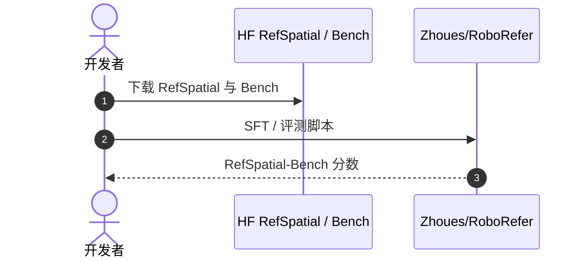

# RoboRefer：机器人空间指代与推理

**RoboRefer**（*Towards Spatial Referring with Reasoning in Vision-Language Models for Robotics*，[arXiv:2506.04308](https://arxiv.org/abs/2506.04308)，[项目页](https://zhoues.github.io/RoboRefer/)，[代码](https://github.com/Zhoues/RoboRefer)）提出 **带推理的空间指代 VLM**，并发布 **RefSpatial** 训练数据与 **RefSpatial-Bench** 评测；后续扩展 **RefSpatial-Expand-Bench**（含室外场景）。

## 一句话定义

**RoboRefer 把「你指的是哪里」从 2D 点定位推进到带推理的 3D/度量空间指代——并给出可开源复现的 RefSpatial 栈。**

## 英文缩写速查

| 缩写 | 英文全称 | 简要说明 |
|------|----------|----------|
| VLM | Vision-Language Model | 视觉-语言模型 |
| REF | Referring Expression | 指代表达 |
| HF | Hugging Face | 数据集与权重托管 |
| ER | Embodied Reasoning | 具身推理；与 LightNav-ER 套件交叉引用 |

## 为什么重要

- **产业评测采用：** Qwen3-VL、Gemini Robotics 1.5 技术报告引用 **RefSpatial-Bench** 评复杂具身空间推理。
- **与 LightNav-ER 对齐：** 站内 [RefSpatial](./refspatial.md) 实体来自 LightNav 脚注；本 ingest 补齐 **官方论文/数据/权重** 溯源。
- **后续 RoboTracer：** 作者发布多步 metric-grounded **TraceSpatial**（arXiv:2512.13660），本页以 RoboRefer 1.0 为 canonical。

## 核心信息

| 项 | 内容 |
|----|------|
| **会议** | NeurIPS 2025 |
| **数据** | HF `JingkunAn/RefSpatial` |
| **基准** | HF `BAAI/RefSpatial-Bench`；Expand-Bench 含室外 |
| **开源** | **已开源** 代码 + SFT 8B 权重 |

## 实验与评测

- **自带训练集与标尺：** 发布 **RefSpatial** 训练数据与 **RefSpatial-Bench** 评测，并扩展 **RefSpatial-Expand-Bench**（含室外场景），使「训练配方」与「评测口径」在同一工作内闭合。
- **被第三方采用是最强的外部验证：** Qwen3-VL、Gemini Robotics 1.5 等在评测中采用 RefSpatial-Bench，说明该标尺已具备跨团队可比性——这比单篇论文自报的领先幅度更有参考价值。
- **能力边界：** 评的是「你指的是哪里」，属 [评测闭环](../queries/embodied-eval-benchmark-selection-loop.md) 的 **① 认知层**；指代正确 **不蕴含** 末端可达或抓取成功。
- **数值口径：** 本页为 ingest 级摘要，**未复核逐项分数**；SFT 8B 权重与逐项成绩 **以 [原文](https://arxiv.org/abs/2506.04308)（NeurIPS 2025）与 [官方仓库](https://github.com/Zhoues/RoboRefer) 为准**。

## 与其他工作对比

| 维度 | RoboRefer（本页） | [RoboPoint](./paper-robopoint.md) | [RoboSpatial](./robospatial.md) / [EmbSpatial](./embspatial.md) |
|------|--------------------|------------------------------------|------------------------------------------------------------------|
| 题面 | 带 **推理** 的空间指代（含度量 / 3D） | 语言条件 keypoint affordance | 空间关系 QA |
| 产出 | 模型 + 训练集 + 基准 | 模型 + 合成数据 + 权重 | 基准为主 |
| 难度来源 | 指代表达的歧义与多步推理 | 点定位精度 | 关系判别 |
| 被复用方式 | 基准被外部模型采用 | 权重被直接调用 | 基准被引用 |

- **同属「空间理解」但不是同一个量：** keypoint 命中率、指代准确率、关系 QA 正确率三者的失败模式各不相同，**跨基准比分数没有意义**；[空间推理 benchmark 地图](../overview/spatial-reasoning-benchmarks-technology-map.md) 给出站内统一索引。
- **RefSpatial 的真正门槛在数据：** 带推理的指代需要标注多步空间关系，本文把这部分一并开源，是它比同类工作更易被复用的原因。

## 结论

**RefSpatial-Bench 已成为 2025–2026 具身 VLM 空间能力的「公共标尺」之一。**

- 空间指代需显式推理链，不仅是单次 pointing
- RefSpatial 训练集 + Bench 分离，便于 mid-training 与 zero-shot 横评
- 被 Qwen3-VL / Gemini Robotics 1.5 引用——选型时可作对照轴
- Expand-Bench 补全室外与更大室内场景覆盖
- 与 [RoboSpatial](./robospatial.md) POI/VQA、[PointArena](./pointarena.md) pointing 互补而非替代

## 源码运行时序图

## 关联页面

- [RefSpatial（LightNav-ER 套件）](./refspatial.md)
- [RoboSpatial](./robospatial.md)
- [PointArena](./pointarena.md)
- [Gemini Robotics](./gemini-robotics.md)
- [具身大模型评测基准选型闭环](../queries/embodied-eval-benchmark-selection-loop.md) — 本页归其 ① 认知评测层：空间指代推理评测，指代准 ≠ 末端执行成功

## 参考来源

- [roborefer_arxiv_2506_04308.md](../../sources/papers/roborefer_arxiv_2506_04308.md)
- [roborefer.md](../../sources/sites/roborefer.md)
- [zhoues-roborefer.md](../../sources/repos/zhoues-roborefer.md)

## 推荐继续阅读

- [RoboRefer 项目页](https://zhoues.github.io/RoboRefer/)
- [RefSpatial-Bench on HF](https://huggingface.co/datasets/BAAI/RefSpatial-Bench)
