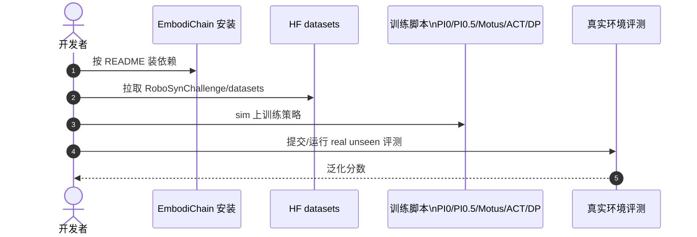

# RoboSynChallenge：合成数据能不能算数，真机说了算

**RoboSynChallenge**（*Mastering Real-World Dexterity via Generalizing Synthesized Manipulation Skills*；[arXiv:2608.12416](https://arxiv.org/abs/2608.12416)，[项目页](https://robosyn-bench.net/)，[代码](https://github.com/EDEM-AI/RoboSynChallenge)，[HF](https://huggingface.co/RoboSynChallenge)）鼓励用 **大规模合成 state-action trials** 学通用策略，但 **最终评测只在未见过的真实操作环境**。

## 一句话定义

**合成数据的价值不由 sim 分数决定，而由跨任务、跨难度、跨环境的真实泛化裁决。**

## 英文缩写速查

| 缩写 | 英文全称 | 简要说明 |
|------|----------|----------|
| WAM | World Action Model | 挑战赛基线类型之一 |
| VLA | Vision-Language-Action | 视觉–语言–动作策略 |
| ACT | Action Chunking Transformer | 模仿学习基线 |
| DP | Diffusion Policy | 扩散策略基线 |
| HF | Hugging Face | 官方数据集与 checkpoint 托管 |

## 为什么重要

- **真实数据稀缺：** 灵巧操作多样性不足是通用策略瓶颈。
- **统一可比：** Transformer / Diffusion / VLA / WAM 同台，避免各报各的 sim 指标。
- **开源闭环：** 框架 + 21 套 sim/real 数据 + 权重，可复现而不仅是 leaderboard。

## 核心信息

| 项 | 内容 |
|----|------|
| **出处** | arXiv:2608.12416（2026-08） |
| **训练** | 合成 state-action（EmbodiChain 栈） |
| **评测** | **仅真实世界**未见环境 |
| **开源（截至 2026-08-19）** | **已开源**：GitHub 框架 + HF 数据/权重 |

## 核心原理

## 源码运行时序图

官方仓 [EDEM-AI/RoboSynChallenge](https://github.com/EDEM-AI/RoboSynChallenge)（归档见 [sources/repos/robosynchallenge.md](../../sources/repos/robosynchallenge.md)）：

- **最短复现：** 装 EmbodiChain → 下 HF 数据 → 跑官方训练入口 → 对照 `evaluation_results/`。

## 工程实践

| 项 | 建议 |
|----|------|
| 读榜 | 必须看 **real** 列，sim 仅作训练手段 |
| 基线 | 同一任务对比 ACT/DP/VLA/WAM，勿只挑最强类 |
| 数据 | HF 21 套命名含 sim/real，下载前核对 split |

## 结论

**RoboSynChallenge 把「合成数据工程」和「真实泛化验收」绑在同一协议里。**

1. **Real-only 终评** — 这是挑战赛的核心立场。
2. **多策略基线** — 避免单一架构叙事。
3. **HF + GitHub 闭环** — 截至入库日可跑通框架与部分权重。
4. **与 LIBERO 互补** — LIBERO 偏 sim benchmark；本文强调 **real generalization**。

## 局限与风险

- 真实评测环境访问/硬件门槛可能高于 sim。
- 合成分布与 real gap 仍依赖 EmbodiChain 质量。
- 并非所有任务权重都已发布，需查 HF org 页面。

## 实验与评测

挑战赛 **只在未见真实环境** 终评；基线含 Transformer、Diffusion、VLA、WAM。具体 leaderboard 见项目页与 `evaluation_results/`。

## 与其他工作对比

相对 [LIBERO](./libero-benchmark.md) 等 sim benchmark：本文 **real generalization** 是硬约束。相对纯 sim2real 论文：本文提供 **统一挑战赛协议 + HF 数据**。

## 关联页面

- [世界模型与真实执行 10 篇技术地图](../overview/world-model-exec-10-papers-technology-map.md)
- [Manipulation](../tasks/manipulation.md)
- [VLA](../methods/vla.md)
- [World Action Models](../concepts/world-action-models.md)
- [灵巧操作数据管线](../queries/dexterous-manipulation-data-pipeline.md)
- [具身大模型评测基准选型闭环](../queries/embodied-eval-benchmark-selection-loop.md) — ③ 策略成功率 + ④ sim↔real 校准：本页把两层压进同一挑战赛协议
- [LIBERO](./libero-benchmark.md)

## 参考来源

- [RoboSynChallenge 论文摘录](../../sources/papers/robosynchallenge_arxiv_2608_12416.md)
- [项目页归档](../../sources/sites/robosynchallenge.md)
- [仓库归档](../../sources/repos/robosynchallenge.md)
- [具身智能小站 10 篇盘点（2026-08-19）](../../sources/blogs/wechat_embodied_station_world_model_exec_10_papers_2026-08-19.md)

## 推荐继续阅读

- [RoboSynChallenge GitHub](https://github.com/EDEM-AI/RoboSynChallenge)
- [HuggingFace RoboSynChallenge](https://huggingface.co/RoboSynChallenge)
- [arXiv:2608.12416](https://arxiv.org/abs/2608.12416)
