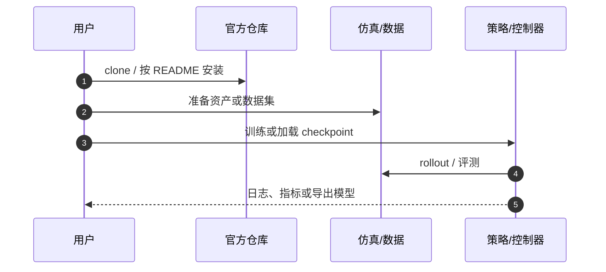

# Robot Parkour Learning（HMI P130）

**Robot Parkour Learning**（*Robot Parkour Learning*，2023，[arXiv:2309.05665](https://arxiv.org/abs/2309.05665)）收录于具身智能研究室 [论文与项目总索引](https://github.com/RealXiaoze/humanoid-motion-intelligence/blob/main/%E8%AE%BA%E6%96%87%E4%B8%8E%E9%A1%B9%E7%9B%AE/README.md) **P130**，主分类为 **Locomotion与运动先验**。本页为本库独立详情节点（编译自策展解读与公开元数据，非原文镜像）。

## 一句话定义

用直接配点启发的软→硬动力学约束课程先让策略发现可行动作，再蒸馏成接收深度的单一视觉四足跑酷策略。

## 英文缩写速查

| 缩写 | 英文全称 | 简要说明 |
|------|----------|----------|
| DAgger | Dataset Aggregation | 多技能专家蒸馏到视觉学生 |
| PPO | Proximal Policy Optimization | 专家训练 |
| Sim2Real | Simulation to Real | 视觉跑酷迁移 |
| DR | Domain Randomization | 感知与动力学鲁棒化 |

## 为什么重要

- 系统分别训练攀爬、跨沟、低姿穿越、侧身挤过和奔跑专家。第一阶段障碍允许穿透，碰撞点进入障碍的深度形成连续惩罚，策略即使还不会完整越障，也能从向前运动与较小穿透中获得梯度。课程逐渐提高障碍和穿透约束难度。第二阶段再换成不可穿透的硬碰撞环境细调，让动作满足真实接触动力学。整个过程只使用简单的前进、能耗和存活类奖励，没有动物参考动作，也没有AMP判别器。
- 在 HMI 六条技术路线中属于 **Locomotion与运动先验**，补齐「总索引有条目、本库无下钻页」的缺口。
- 与相邻方法对照时，优先看问题设定与接口，而不是只记算法名。

## 核心信息

| 字段 | 内容 |
|------|------|
| HMI ID | P130 |
| 年份 | 2023 |
| 分组 | Locomotion与运动先验 |
| 开源状态 | 已开源（与 Extreme Parkour 同仓生态，但论文问题设定不同） |
| 原文 | https://arxiv.org/abs/2309.05665 |

## 核心原理

Robot Parkour解决的是一个探索难题：攀高台、跨大沟、钻低洞和侧身穿缝都需要短时间内做出极端动作，但如果障碍从训练开始就是不可穿透的，随机策略几乎拿不到前进奖励；为每项技能手写一套动作模板又很难扩展。作者用“先让障碍可穿透，再恢复真实碰撞”的课程替代参考动作。

### 流程直觉

模块边界与符号定义以原文为准；上图只固定阅读骨架。

## 工程实践

专家训练时可以看到特权地形和物理状态，最后通过DAgger蒸馏成一个循环视觉策略。部署策略输入机载深度与本体历史，自动判断应当爬、跳、钻还是侧身，不需要外部技能切换器。作者还专门模拟深度缺失、噪声和延迟，并让视觉预处理尽量匹配真机相机。

| 检查项 | 建议 |
|--------|------|
| 一手来源 | 回 arXiv / DOI / 项目页核对数值与声明 |
| 开源边界 | 已开源（与 Extreme Parkour 同仓生态，但论文问题设定不同） |
| 本库定位 | 详情编译页；深入公式与实验表读原文 |

## 源码运行时序图

关键复现路径以官方 README 为准；上图仅标出通用入口顺序。

## 实验与评测读法

- 把「仿真指标 / 真机证据 / 仅项目演示」分开记账。
- 对照同组相邻工作（见关联页面）时，对齐任务定义与观测接口，再比成功率。
- 综述类条目关注分类框架与缺口，不把引用列表当作选型排名。

## 结论

**Robot Parkour Learning 应作为 HMI「Locomotion与运动先验」线上的独立知识节点阅读：先抓住其真正改变的问题接口，再决定是否进入复现或对比实验。**

- 核心贡献是问题表达或管线接口，而不只是单一网络结构名。
- 开源状态：已开源（与 Extreme Parkour 同仓生态，但论文问题设定不同）。
- 与本库已有相邻页交叉阅读，避免重复造页。
- 数值、消融与许可以一手来源为准；本页是编译索引。
- 若官方后续补齐代码/数据，应回写 `sources/` 与本节开源字段。

## 局限与风险

- 论文在A1和Go1两种低成本四足平台上验证，报告了0.4米攀高、0.6米跨沟、0.2米低障和0.28米窄缝等实机任务。它是后续Humanoid Parkour与Project Instinct感知跑酷路线的重要前序：先证明“技能生成加多专家蒸馏”可以在真实机器人上形成单一视觉策略。
- 勿把 HMI 解读中的工程判断直接写成论文作者承诺。
- 经典控制论文与现代 RL/VLA 论文的「可复现」标准不同，选型时分开评估。

## 与其他工作对比

| 维度 | 本工作（Robot Parkour） | [Extreme Parkour](./extreme-parkour.md) | [Humanoid Parkour](./paper-notebook-humanoid-parkour-learning.md) | [AMP Locomotion](./paper-amp-locomotion-quadruped-rewards.md) |
|------|-------------------------|-----------------------------------------|-------------------------------------------------------------------|---------------------------------------------------------------|
| 技能获取方式 | 软→硬动力学约束课程分别训练多专家 | 单一策略 + 视觉，端到端极限越障 | 把跑酷范式迁移到人形 | 短段犬类动作 + AMP 判别器 |
| 参考动作依赖 | 无参考动作，仅前进/能耗/存活奖励 | 无参考动作 | 无参考动作 | 依赖犬类示范提供风格 |
| 感知与部署 | DAgger 蒸馏为单一循环视觉（深度）策略 | 机载深度 + 本体，端到端 | 深度/本体，人形形态 | 本体 + 速度命令，无外感知 |
| 载体 | A1 / Go1 四足 | 四足 | 人形 | Unitree A1 四足 |
| 关系/取舍 | 用「可穿透课程」解探索难题，是感知跑酷路线前序 | 同为四足视觉跑酷，问题设定更聚焦极限动作 | 本工作的人形后继工作 | 同属「替代手工步态奖励」，但走示范而非课程 |

## 关联页面

- [HMI 论文覆盖导读](../queries/hmi-papers-coverage.md)
- [Humanoid Motion Intelligence](./humanoid-motion-intelligence.md)
- [extreme-parkour](./extreme-parkour.md)
- [paper-notebook-humanoid-parkour-learning](./paper-notebook-humanoid-parkour-learning.md)
- [privileged-training](../concepts/privileged-training.md)
- [locomotion](../tasks/locomotion.md)

## 参考来源

- [sources/papers/hmi_p130_robot-parkour-learning.md](../../sources/papers/hmi_p130_robot-parkour-learning.md)
- [sources/repos/humanoid-motion-intelligence.md](../../sources/repos/humanoid-motion-intelligence.md)
- [HMI 论文总索引](https://github.com/RealXiaoze/humanoid-motion-intelligence/blob/main/%E8%AE%BA%E6%96%87%E4%B8%8E%E9%A1%B9%E7%9B%AE/README.md)

## 推荐继续阅读

- [arXiv:2309.05665](https://arxiv.org/abs/2309.05665)
- [项目/官方解读](https://robot-parkour.github.io/)
- [代码](https://github.com/ZiwenZhuang/parkour)
- [HMI 逐篇解读 P130](https://github.com/RealXiaoze/humanoid-motion-intelligence/blob/main/%E8%AE%BA%E6%96%87%E4%B8%8E%E9%A1%B9%E7%9B%AE/%E8%AE%BA%E6%96%87%E9%80%90%E7%AF%87%E8%A7%A3%E8%AF%BB/P130.md)
