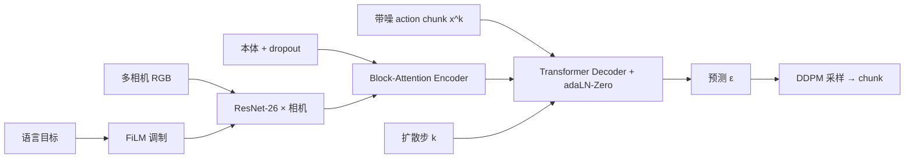
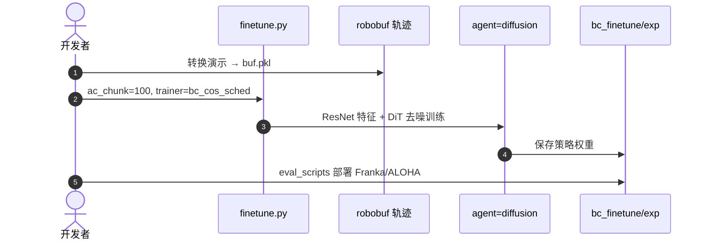

# DiT-Block Policy：机器人扩散 Transformer 的「配方」

**The Ingredients for Robotic Diffusion Transformers**（[arXiv:2410.10088](https://arxiv.org/abs/2410.10088)，[项目页](https://dit-policy.github.io/)，[代码](https://github.com/SudeepDasari/dit-policy)）由 **Sudeep Dasari、Oier Mees、Sebastian Zhao、Mohan Kumar Srirama、Sergey Levine** 等提出（CMU / UC Berkeley 等）。论文回答：**Diffusion Policy 的 U-Net 能否换成 Transformer、应怎么换**——给出 **DiT-Block Policy**：encoder–decoder Transformer 噪声网络 \(\epsilon_\theta\)，解码块用 **adaLN-Zero**（受 [图像 DiT](./paper-dit-scalable-diffusion-transformers.md) 启发）替代难训的 cross-attention 方案。

## 一句话定义

**在 action chunk 上做 DDPM 去噪，但把「怎么把观测与扩散步注入 Transformer」拆成可复现配方：分相机 CNN tokenizer、FiLM 语言、adaLN-Zero 解码。**

## 英文缩写速查

| 缩写 | 英文全称 | 简要说明 |
|------|----------|----------|
| DP | Diffusion Policy | 动作 chunk 扩散模仿学习框架 |
| DiT | Diffusion Transformer | Transformer 骨干 + 扩散目标（本文非 ImageNet 生成） |
| adaLN | Adaptive Layer Normalization | 由条件向量回归 scale/shift 的 LayerNorm |
| DDPM | Denoising Diffusion Probabilistic Model | 训练预测噪声 \(\epsilon\) |
| FiLM | Feature-wise Linear Modulation | 用语言 embedding 调制视觉特征 |
| BC | Behavior Cloning | 示教 + 扩散生成动作分布 |

## 为什么重要

- **阅读链枢纽：** [扩散 → Robotic DiT 纵深路线](../../roadmap/depth-robotics-diffusion-dit-flow.md) 在 [Diffusion Policy](./paper-diffusion-policy.md) 之后、 [RDT-1B](./paper-rdt-1b.md) / [Dita](./paper-dita-scaling-diffusion-transformer-vla.md) 之前，专门讲 **DP 换 Transformer 的工程要素**（Attention、AdaLN、chunk 深度）。
- **解释社区现象：** 原文引用 DP 论文中 **naive Transformer 极难调**；本工作说明问题在 **块设计** 而非「Transformer 不适合机器人」。
- **与 ScaleDP 分工：** [ScaleDP](./paper-scaledp-scaling-diffusion-transformer-policy.md) 强调 **参数量缩放 law**；本文强调 **稳定训练配方 + 观测 token 化**，并发布 **BiPlay** 多模态双臂数据。

## 核心信息

| 项 | 内容 |
|----|------|
| **机构** | 卡内基梅隆大学（CMU）；加州大学伯克利分校（UC Berkeley）等 |
| **出处** | arXiv:2410.10088（2024） |
| **任务** | 语言条件 visuomotor IL；ALOHA 双臂长时域 + DROID Franka 单臂 |
| **Action chunk** | 训练 **H=100**；推理 DDPM **10 步** deterministic + temporal ensembling |
| **开源** | **已开源** — `SudeepDasari/dit-policy`（MIT）+ HF **BiPlay** |

## 核心原理

1. **目标：** 学习 \(\epsilon_\theta(a_t+\epsilon^k, k, o_t, g)\)，与 [Diffusion Policy](../methods/diffusion-policy.md) 相同 **chunk 级 DDPM**，非 flow matching。
2. **观测：** 每路相机 **ResNet-26** 独立编码；**DistilBERT** 文本经 **FiLM** 进入视觉层；本体 **observation dropout** 防模态捷径；encoder 输出多层 embedding \(e^{(i)}\)。
3. **adaLN-Zero 解码：** 第 \(i\) 解码块用 \(a(e^{(i)}, k), b(e^{(i)}, k)\) 调制 LayerNorm，替代标准 cross-attention；输出 projection **零初始化**，训练初期近似恒等 skip。
4. **Receding horizon：** 每次去噪得到 chunk，执行首步或 ensemble 后滑动窗口——与 DP 的 **action horizon / execution horizon** 同一范式（见 [receding horizon](../concepts/receding-horizon-policy-execution.md)）。

### 流程总览

## 源码运行时序图

## 实验与评测

- **长时域双臂：** 1500+ 决策步任务（如寿司切割）；adaLN 相对 cross-attn Transformer **+30%** 量级（论文）。
- **观测设计：** ResNet 分相机 + dropout 相对其它 token 方案 **+40%** 量级。
- **数据 scaling：** **BiPlay**（7023 clips，326 场景，200+ 语言任务）上随数据多样性 improved scaling。
- **Baselines：** 同仓可训 **U-Net Diffusion Policy**（`agent=diffusion_unet`）对照。

## 与其他工作对比

| 对照 | DiT-Block Policy（本文） | [Diffusion Policy](./paper-diffusion-policy.md) | [RDT-1B](./paper-rdt-1b.md) |
|------|--------------------------|-----------------------------------------------|-----------------------------|
| 骨干 | adaLN encoder–decoder Transformer | CNN **或** 难训 cross-attn Transformer / **U-Net** | 大型 **RDT** 扩散基础模型 |
| 规模 | 配方论文 + 强 baselines | 范式奠基 | **1.2B** + 1M episode |
| 语言 VLA | 任务文本条件 IL | 通常无语言 | 语言 + 多相机 **foundation** |

## 结论

**机器人扩散 Transformer 训不动，多半不是 Transformer 的锅，而是缺 adaLN-Zero 式条件注入与分相机 CNN 先验。**

- 读 DP 后应立刻理解：**noise action → denoise → chunk**，再读本文看 **U-Net 之外怎么换 Transformer**。
- **AdaLN + FiLM + chunk=100** 是后续 RDT / VLA 扩散头的共同词汇。
- 复现优先 **`dit-policy` + robobuf**；数据可叠加 **BiPlay**。
- 与 [ScaleDP](./paper-scaledp-scaling-diffusion-transformer-policy.md) 互补：一个讲 **配方**，一个讲 **十亿参数缩放**（但 ScaleDP 无官方仓）。
- 通才 VLA 侧继续读 [Dita](./paper-dita-scaling-diffusion-transformer-vla.md)（大 DiT 直接 denoise 全 chunk + OXE）。

## 局限与风险

- 仍为 **DDPM 多步采样**，推理延迟高于 flow matching（[π₀](./paper-pi0.md) / GR00T）。
- 强依赖 **ResNet 预训练特征路径**（README 指向 data4robotics release）。
- 名称 **DiT-Block Policy** 与 **图像 DiT**、**Dita VLA** 不同物，写文档时需带任务前缀。

## 关联页面

- [Diffusion Policy 方法页](../methods/diffusion-policy.md)
- [depth-robotics-diffusion-dit-flow](../../roadmap/depth-robotics-diffusion-dit-flow.md)
- [paper-diffusion-policy](./paper-diffusion-policy.md)
- [paper-dit-scalable-diffusion-transformers](./paper-dit-scalable-diffusion-transformers.md)

## 参考来源

- [robotic_dit_ingredients_arxiv_2410_10088.md](../../sources/papers/robotic_dit_ingredients_arxiv_2410_10088.md)
- [dit-policy-github-io.md](../../sources/sites/dit-policy-github-io.md)
- [sudeepdasari_dit_policy.md](../../sources/repos/sudeepdasari_dit_policy.md)

## 推荐继续阅读

- [arXiv:2410.10088](https://arxiv.org/abs/2410.10088)
- [BiPlay 数据集](https://huggingface.co/datasets/oier-mees/BiPlay)
