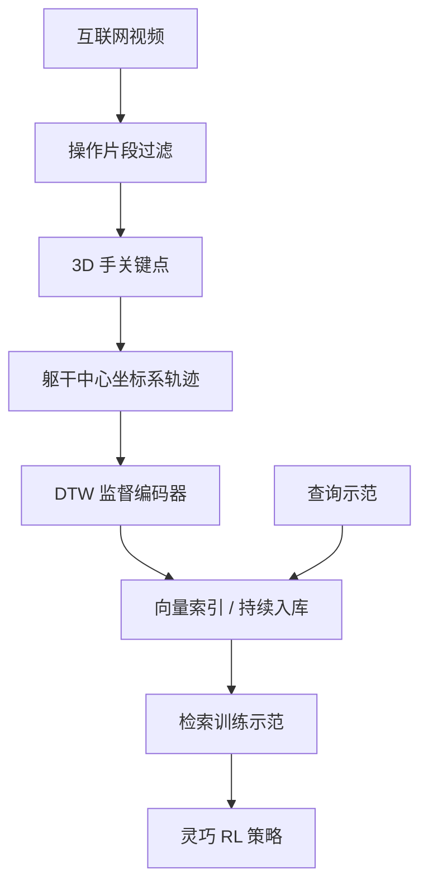

# RoboTok：互联网规模人类示范检索引擎

**RoboTok**（*An Internet-Scale Data Engine for Human Demonstration Retrieval and Dexterous Manipulation Learning*，[arXiv:2609.03199](https://arxiv.org/abs/2609.03199)，[项目页](https://rice-robotpi-lab.github.io/RoboTok/)，[代码](https://github.com/Rice-RobotPI-Lab/RoboTok-Code)）把 **互联网人类操作视频** 组织成 **躯干相对 3D 手部轨迹** 嵌入空间：给定查询示范，检索行为相似片段用于灵巧操作策略训练，而非依赖固定离线数据集。

## 一句话定义

**网络视频的价值不仅在语义规模，更在可对齐的 3D 手部运动几何——用轨迹检索代替外观相似。**

## 英文缩写速查

| 缩写 | 英文全称 | 简要说明 |
|------|----------|----------|
| RoboTok | Robot Token / Trajectory Tok | 本文数据引擎（项目命名） |
| DTW | Dynamic Time Warping | 轨迹对齐监督与检索 ground truth |
| VTDexManip | Visual-Tactile Dexterous Manipulation | 下游仿真灵巧操作基准 |
| RL | Reinforcement Learning | 用检索示范训练策略 |
| mAP | mean Average Precision | 检索评测指标 |

## 为什么重要

- 纳入 [九篇资源汇总](../../sources/blogs/wechat_embodied_station_9_papers_resources_2026-09-06.md) 的「数据扩展」支线。
- **持续索引** 新过滤片段，而非一次性数据集。
- In-domain mAP@20 **0.353** vs STRAP **0.007**；下游 easy 任务多项 **90%+** SR。

## 核心信息

| 项 | 内容 |
|----|------|
| **机构** | Rice University；NVIDIA（Bowen Wen）等 |
| **数据** | 10 万互联网 clip 评测库；90k 训练 / 10k 查询 |
| **下游** | VTDexManip 仿真；仅本体 + 指尖力输入 |
| **开源** | **已开源** [Rice-RobotPI-Lab/RoboTok-Code](https://github.com/Rice-RobotPI-Lab/RoboTok-Code) |
| **真机** | 项目页标注 **coming soon** |

### 流程总览

## 实验与评测

| 轴 | RoboTok 要点 |
|----|-------------|
| In-domain 检索 | mAP@20 **0.353**；MRR@20 **0.858** |
| OOD AssemblyHands | mAP@5 **0.261** vs STRAP **0.133** |
| VTDexManip easy | BottleCap seen **90.2%** vs STRAP **68.2%** |
| VTDexManip hard | Lever Sliding seen **79.3%** vs STRAP **8.4%** |

## 结论

**手部轨迹感知检索能把互联网视频变成可扩展、持续增长的灵巧操作监督源。**

1. **几何 > 外观** — 跨视角/遮挡下轨迹嵌入远强于 Flow/STRAP 类基线。
2. **下游增益大** — 检索质量直接转化为 VTDexManip 成功率。
3. **代码已开源** — RoboTok-Code 为官方入口。
4. **真机待发布** — 截至入库日仅仿真结果。

## 源码运行时序图

官方 [RoboTok-Code](https://github.com/Rice-RobotPI-Lab/RoboTok-Code) 提供检索与训练入口（归档见 [sources/repos/robotok.md](../../sources/repos/robotok.md)）；具体模块名以仓库 README 为准，入库日未审计逐文件调用链。

**最短复现路径：** clone 官方仓 → 按 README 配置环境与数据 → 训练轨迹编码器 → 检索示范 → 接入 VTDexManip 策略训练。

## 局限与风险

- **真机未公开** — 外推需谨慎。
- **手轨迹估计误差** — 依赖 3D 手重建与躯干帧估计质量。
- **与 DemoMimic 分工** — RoboTok 扩数据；[DemoMimic](./paper-demomimic.md) 做单示范接触几何泛化。

## 与其他工作对比

| 对照 | 差异读法 |
|------|----------|
| STRAP / Flow / HAND | 外观或子轨迹检索；RoboTok 用 3D 手部轨迹几何 |
| MimicGen / GRAIL | 生成式扩数据；RoboTok 从互联网持续检索 |
| [DemoMimic](./paper-demomimic.md) | 单示范接触几何泛化；RoboTok 解决示范来源规模 |

## 关联页面

- [Manipulation](../tasks/manipulation.md)
- [Motion Retargeting Pipeline](../concepts/motion-retargeting-pipeline.md)
- [DemoMimic](./paper-demomimic.md)
- [具身资源与可靠性 9 篇地图](../overview/embodied-resources-reliability-9-papers-technology-map.md)

## 参考来源

- [robotok_arxiv_2609_03199.md](../../sources/papers/robotok_arxiv_2609_03199.md)
- [robotok 项目页](../../sources/sites/robotok.md)
- [robotok 仓库](../../sources/repos/robotok.md)
- [具身智能小站 2026-09-06 九篇盘点](../../sources/blogs/wechat_embodied_station_9_papers_resources_2026-09-06.md)

## 推荐继续阅读

- [RoboTok 项目页](https://rice-robotpi-lab.github.io/RoboTok/)
- [RoboTok-Code](https://github.com/Rice-RobotPI-Lab/RoboTok-Code)
