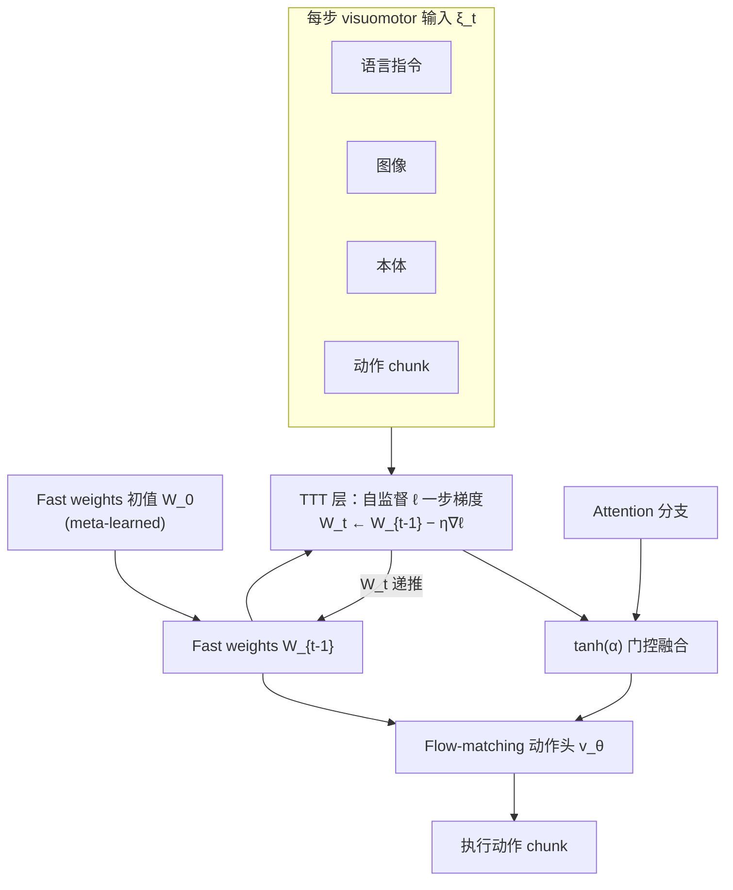

# RoboTTT（Test-Time-Training Robot Policies）

**RoboTTT**（*Context Scaling for Robot Policies*，[NVIDIA GEAR 项目页](https://research.nvidia.com/labs/gear/robottt/)）把 **Test-Time Training（TTT）** 写进机器人 **Vision-Language-Action（VLA）** foundation 模型的时间维：层内携带一个 **微小神经网络**，其 **fast weights** 即递推隐藏状态；**每一次**传入的图像、本体与动作 chunk 都会在 fast weights 上触发 **一步自监督梯度更新**，把任意长的交互历史 **压缩进固定大小参数**，而非堆叠 KV cache 或变长 RNN 状态。

> **工程底座：** 论文实例化为 **GR00T N1.7** VLA（见 [GR00T N1](./paper-hrl-stack-34-gr00t_n1.md) 与 [Isaac GR00T](./isaac-gr00t.md)）。入库时 **尚无独立 arXiv 编号**，以官方项目页为准。

## 一句话定义

**在 VLA 里用「每步更新的小型 fast-weight 核心」代替短历史窗口，使机器人以恒定算力记住约 8K 步 visuomotor 上下文，并在部署后继续从传感器流中学习。**

## 英文缩写速查

| 缩写 | 英文全称 | 简要说明 |
|------|----------|----------|
| TTT | Test-Time Training | 测试/部署时对模型部分参数做在线梯度更新的机制 |
| VLA | Vision-Language-Action | 视觉-语言-动作统一的多模态机器人策略 |
| TBPTT | Truncated Backpropagation Through Time | 分段反传以训练长序列、控制显存的 RNN 技巧 |
| GDN | Gated DeltaNet | 固定大小循环记忆基线（Yang et al., 2024） |
| DAgger | Dataset Aggregation | 用策略诱导状态上的专家纠正迭代纠偏的模仿学习 |
| FM | Flow Matching | RoboTTT 动作头使用的连续动作生成训练目标 |

## 为什么重要

- **新 scaling 轴：** 项目页首次在 **闭环机器人操作** 上展示：预训练 **visuomotor 上下文长度** 从 128 扩到 **8K**（约 5 分钟 @30Hz，较 SOTA 策略 **三个数量级**）时，任务完成分 **持续上升且未见饱和**——类似语言模型 context scaling，但对象是 **物理闭环**。
- **部署后学习：** fast weights 在 **推理时仍每步更新**；失败、纠正与扰动后的 rollout 会进入历史并被 **写入权重**，支撑 **在线自改进** 与 **扰动恢复**，而不必每次重新 fine-tune 全模型。
- **与「另一种 TTT」区分：** [TTT-Parkour](./paper-notebook-ttt-parkour.md) 是对 **已训练跑酷策略** 在 **仿真里做 ≤10 分钟 TTT 微调** 再部署；RoboTTT 把 TTT 做成 **模型内部层**，**训练与测试都在线更新 fast weights**。[WAM-TTT](./paper-wam-ttt-human-video-test-time-steering.md) 则在 **冻结 WAM** 上用 **人视频批次 TTT** 写 fast-weight 记忆，依赖 **meta-training 人–机对齐** 而非机器人 visuomotor 递推。

## 核心结构

| 模块 | 作用 |
|------|------|
| **TTT 层** | 隐藏状态 = fast weights \(W_t\)；每 token：自监督 **Update** + **Apply** 产生输出；**\(O(1)\)** 每步成本相对上下文长度 |
| **门控残差** | \(o=\tanh(\alpha)\odot o_{\mathrm{TTT}}+o_{\mathrm{attn}}\)，\(\alpha\) 初值 \(\approx 0\) 保护 GR00T 预训练 |
| **Flow-matching 动作头** | 序列目标 \(\mathcal{L}_{\mathrm{fm}}=\frac1T\sum_t \ell_t(\xi_t; W_{t-1})\)；\(\xi_t\) 含语言、图像、本体与 action chunk |
| **Sequence action forcing** | 每 chunk **独立** flow 噪声 \(\tau_t\)，避免整段同难度 destabilize 训练 |
| **TBPTT** | 段内反传；**fast weights 跨段传递**、梯度在边界 detach；\(W_0\) **meta-learned** |
| **Context masking** | 部分 timestep **只更新 fast weights、不监督动作** → 人视频前缀 / 失败 rollout 作 **纯上下文** |

### 流程总览

### 两种上下文用法（同一 masking 配方）

| 模式 | Context（mask 动作损失） | 监督（有动作损失） | 测试时能力 |
|------|--------------------------|-------------------|------------|
| **人视频模仿** | 单段 **人演示视频** \(\xi^{\mathrm{video}}\) | 机器人轨迹 \(\xi^{\mathrm{robot}}\) | 未见配置 **one-shot** 装配 |
| **DAgger Distillation** | 机器人 **失败 rollout** | **人工纠正** | **无人工** 在线自纠偏（algorithm distillation 机器人实例） |

## 实验与评测（项目页摘要）

| 任务 | 设定 | RoboTTT 要点 |
|------|------|----------------|
| **Pup Go Car** | ~5 min 车辆模型装配 | 完成分 **~89** vs 单步 GR00T N1.7 **~42** |
| **Gear Bot** | ~5 min 遥控机器人装配 | **~78** vs **~35** |
| **Circuit** | 未见配置 1–2 min | **~71** vs **~23**；四配置 **单次人视频** 条件 |
| **上下文 scaling** | 预训练 128→8K steps | 平均完成分 **单调上升**；GDN / 短历史基线 **无此趋势** |
| **十阶段装配** | ~5 min | **仅 RoboTTT** 完整跑通 |

平台：**YAM 双臂** dexterous setup；基线含 **GR00T N1.7**（单步）、**+1 历史帧**、**GDN** 固定状态记忆。

## 常见误区或局限

- **误区：** 把 RoboTTT 等同于 **测试时全模型 fine-tune** 或 [TTT-Parkour](./paper-notebook-ttt-parkour.md) 式 **离线仿真微调**——RoboTTT 更新的是 **层内 fast weights**，主慢权重与预训练 VLA 骨干通过门控保留。
- **误区：** 认为 **8K 上下文 = 存 8K 帧图像**——实际是 **压缩进固定大小权重**；能记什么取决于 **自监督目标与 meta-learned 更新动力学**。
- **局限：** 入库时 **无公开代码/arXiv**；真机仅项目页列出的装配域；**TBPTT 段长、门控与 masking 配方** 对稳定性敏感；与 **KV/关键帧记忆类 VLA**（如 KEMO）路线尚未在同一 benchmark 系统对比。

## 关联页面

- [VLA（Vision-Language-Action）](../methods/vla.md) — RoboTTT 所扩展的 foundation policy 抽象与长程部署语境
- [GR00T N1](./paper-hrl-stack-34-gr00t_n1.md) — 论文实例化的 VLA 底座与双系统 flow-matching 动作头
- [TTT-Parkour](./paper-notebook-ttt-parkour.md) — 同名缩写、不同问题：感知跑酷 + 仿真短时 TTT
- [Action Chunking](../methods/action-chunking.md) — flow-matching chunk 与序列训练噪声设计背景
- [DAgger](../methods/dagger.md) — DAgger Distillation 所借鉴的纠偏数据形态
- [Manipulation（任务）](../tasks/manipulation.md) — 长程双臂装配与部署后学习选型
- [Bimanual Manipulation](../tasks/bimanual-manipulation.md) — YAM 双臂 dexterous 任务语境

## 参考来源

- [RoboTTT 论文摘录（NVIDIA GEAR）](../../sources/papers/robottt_nvidia_gear.md)
- [NVIDIA Research RoboTTT 项目页归档](../../sources/sites/nvidia-research-robottt.md)

## 推荐继续阅读

- 官方项目页与演示视频：<https://research.nvidia.com/labs/gear/robottt/>
- GR00T N1 原文：<https://arxiv.org/abs/2503.14734>
- 长上下文 TTT（NLP，机制相近）：<https://arxiv.org/abs/2512.23675>（TTT-E2E）
- Algorithm Distillation 原文：<https://arxiv.org/abs/2210.14215>
- Gated DeltaNet 基线：<https://arxiv.org/abs/2412.06464>
