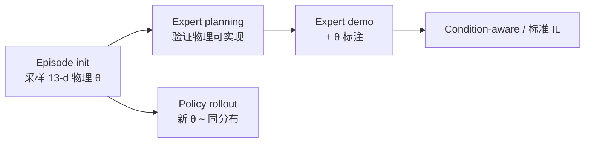

# RoboTwin-Phys（arXiv:2609.26292）

**RoboTwin-Phys**（*Do WAMs and VLAs Understand the Physical World?*，[arXiv:2609.26292](https://arxiv.org/abs/2609.26292)，北大 / Memo 等）在 [RoboTwin 2.0](./robotwin.md) **50 任务** 上新增 **物理条件多样性** 维度：每 episode **连续采样 13 个物理属性**（质量、摩擦、CoM、关节阻尼等），并发布 **5000+** 带 **13-d ground-truth 物理参数** 的专家示范。

## 一句话定义

把「物理 operating condition」当作与视觉/布局 DR 正交的 benchmark 轴，系统测量 WAM/VLA 在质量–摩擦–动力学联合变化下的 manipulation robustness。

## 英文缩写速查

| 缩写 | 英文全称 | 简要说明 |
|------|----------|----------|
| VLA | Vision-Language-Action | 视觉-语言-动作策略 |
| WAM | World Action Model | 世界–动作联合模型 |
| CoM | Center of Mass | 质心，物理属性之一 |
| DR | Domain Randomization | 域随机化；本文强调 **物理** DR |
| SR | Success Rate | 任务成功率 |

## 为什么重要

- **盲区：** 大规模 sim benchmark 多 randomize **外观/布局/相机**，**固定 nominal 物理** — 真机 mass/friction/wear 变化未测。
- **独立 failure 维：** 视觉 DR 下有效的模型可在 **物理变化** 上 **断崖式退化**（π₀.₅ avg **31.60%** vs Fast-WAM **44.24%**）。
- **训练资源：** 物理标注 demo 支持 **condition-aware modeling** 与 **physics-conditioned policy** — 不只评测。

## 核心信息

| 字段 | 内容 |
|------|------|
| 机构 | 北京大学（PKU）、北大先进信息技术研究院、妙记智能（Memo AI）等 |
| 底座 | RoboTwin 2.0（50 bimanual tasks） |
| 物理轴 | **13** attributes，episode-level 连续采样 + task-specific 范围 |
| 数据 | **5000+** expert demos + 13-d GT；兼容官方 RoboTwin 格式 |
| 开源 | **部分 / 待发布** — 论文承诺 benchmark+数据；官方下载链待跟进（2026-09-24） |

## 流程总览

## 核心原理

- **Episode-level physics：** 非 step-wise 噪声 — 一次 episode 固定一组物理 operating condition。
- **Feasibility gate：** expert planning 预先验证 sampled 条件可完成 — 避免 arbitrary 不可解扰动。
- **Annotation：** 每样本附 **ground-truth θ** — 支持 physical-attribute estimation 与 audit。

## 源码运行时序图

**不适用（待发布）** — 官方 benchmark 包未链出；可先沿用 [RoboTwin 2.0](https://github.com/msc-robotwin/robotwin) 熟悉任务格式，待 Phys 扩展发布。

## 工程实践

| 项 | 读法 |
|----|------|
| 与 RoboTwin 2.0 关系 | **不新增任务** — 加 **物理 variation 维** |
| 对比 Ego2Robot | Ego2Robot 解耦 visual/layout/embodiment/semantic；Phys 专测 **动力学参数** |
| 模型选型 | 勿用 Clean/Random **视觉** SR 推断 **物理** robustness |
| 数据用途 | 13-d GT 可训 **condition encoder** 或 physics-conditioned head |

## 实验与评测（Randomized avg SR %，文内 Table 摘录）

| 模型 | Avg SR |
|------|--------|
| Fast-WAM | 44.24 |
| Motus | 39.60 |
| FACT | 39.14 |
| Galaxea-VLA | 37.82 |
| π₀.₅ | 31.60 |

**读法：** 同一 RoboTwin 任务壳下，**物理 DR** 拉开 WAM/VLA 差距 — π₀.₅ 并非最强。

## 与其他工作对比

> 下表只做**定位对照**，不做跨设定横比：各行与本页不共享同一评测协议，数字不可直接相减。

| 对照 | 差异读法 |
|------|----------|
| [RoboTwin 2.0](./robotwin.md) | 底座：同 50 个双臂任务壳，2.0 的 DR 主要随机化**外观/布局/相机**；Phys **不新增任务**，只加 13 维物理 operating condition 轴 |
| [Ego2Robot](./paper-ego2robot.md) | 同样在 RoboTwin 上做解耦 OOD，但轴不同：Ego2Robot 拆 visual / layout / embodiment / semantic；Phys 专测**质量–摩擦–动力学** |
| [Domain Randomization](../concepts/domain-randomization.md) | 物理 DR 常用作 sim2real **训练**手段；Phys 把它变成**评测**轴，并以 expert planning 可行性门控 + GT θ 标注保证每组条件可解、可审计 |
| [具身评测基准选型闭环](../queries/embodied-eval-benchmark-selection-loop.md) | 选型读法：视觉/布局 SR 高不代表物理鲁棒；本页 π₀.₅ 31.60% vs Fast-WAM 44.24% 就是该闭环里「换轴后排名重排」的例子 |

## 结论

**RoboTwin-Phys 把「懂物理世界吗」变成可复现 benchmark：视觉/布局泛化 ≠ 物理 operating condition 鲁棒。**

1. **第三轴 diversity** — 与 appearance/layout/camera 并列，不可省略。
2. **5000+ 标注 demo** — 评测 + 条件建模训练两用。
3. **WAM 未必 > VLA** — 文内 Fast-WAM 领先 π₀.₅，需按任务读。
4. **官方包待跟进** — 入库日仅技术报告与 arXiv。
5. 评测选型见 [embodied-eval 闭环](../queries/embodied-eval-benchmark-selection-loop.md)。

## 关联页面

- [RoboTwin 2.0](./robotwin.md)
- [VLA](../methods/vla.md)
- [World Action Models](../concepts/world-action-models.md)
- [Ego2Robot](./paper-ego2robot.md)

## 推荐继续阅读

- [arXiv:2609.26292](https://arxiv.org/abs/2609.26292)
- [RoboTwin 2.0 论文](https://arxiv.org/abs/2506.18088)

## 参考来源

- [RoboTwin-Phys 论文归档](../../sources/papers/robotwin_phys_arxiv_2609_26292.md)
