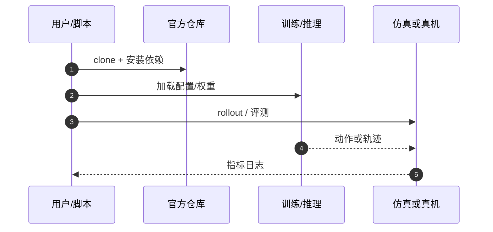

# RobResilience（arXiv:2609.17349）

**RobResilience**（*RobResilience: Implementing and Evaluating a Resilience Framework for Cyber-Physical Embodied Systems*，[arXiv:2609.17349](https://arxiv.org/abs/2609.17349)，[代码](https://github.com/mahyamkashani/RobResilience)）来自 [具身智能小站 12 篇盘点](../../sources/blogs/wechat_embodied_station_12_papers_vla_deploy_2026-09-16.md)。

## 一句话定义

**Webots PR2/ROS2 上运行时检查可容忍扰动、可容忍退化与缓解可行性，支撑具身系统安全状态机。**

## 英文缩写速查

| 缩写 | 英文全称 | 简要说明 |
|------|----------|----------|
| CPS | Cyber-Physical System | 信息物理系统 |
| ROS2 | Robot Operating System 2 | 机器人中间件 |
| PR2 | Personal Robot 2 | Willow Garage 研究平台 |
| HIL | Hardware-in-the-Loop | 半实物仿真 |

## 为什么重要

- 检测到攻击不等于知道该降级、缓解还是停机；需要可复现的韧性评估框架。
- 开源结论：**已开源**（步骤 2.5，2026-09-16）。
- 与 [12 篇技术地图](../overview/vla-deploy-12-papers-technology-map.md) 中同类工作可横向对照。

## 核心机制

| 项 | 内容 |
|----|------|
| **arXiv** | [2609.17349](https://arxiv.org/abs/2609.17349) |
| **开源** | **已开源** |
| **要点** | 运行时监测扰动容忍边界与缓解动作可行性；PR2 + ROS2 + Webots 实例。 |
| **文内指标** | 框架级案例研究；以论文与仓库 README 为准。 |

## 源码运行时序图

## 实验与评测

- 框架级案例研究；以论文与仓库 README 为准。
- **读法：** 清单摘要；逐项对照与 baseline 以原文 PDF 为准。

## 与其他工作对比

- 横向索引见 [12 篇技术地图](../overview/vla-deploy-12-papers-technology-map.md)；与同 arXiv 节点不重复造页。

## 结论

**RobResilience 把「攻击后还能不能安全跑」变成可测状态，而非仅做检测告警。**

1. 开源边界：**已开源** — 以项目页实际链接为准（入库日 2026-09-16）。
2. 核心机制：运行时监测扰动容忍边界与缓解动作可行性；PR2 + ROS2 + Webots 实例。…
3. 部署前核对任务协议与硬件条件，勿直接横比公众号摘录数字。

## 关联页面

- [safety-filter](../concepts/safety-filter.md)
- [safe-rl](../methods/safe-rl.md)
- [ros2-control](../entities/ros2-control.md)
- [paper-ressafe](./paper-ressafe.md)

## 参考来源

- [robresilience_arxiv_2609_17349.md](../../sources/papers/robresilience_arxiv_2609_17349.md)
- [wechat_embodied_station_12_papers_vla_deploy_2026-09-16.md](../../sources/blogs/wechat_embodied_station_12_papers_vla_deploy_2026-09-16.md)
- [arXiv:2609.17349](https://arxiv.org/abs/2609.17349)

## 推荐继续阅读

- [arXiv PDF](https://arxiv.org/pdf/2609.17349)
- [https://github.com/mahyamkashani/RobResilience](https://github.com/mahyamkashani/RobResilience)

