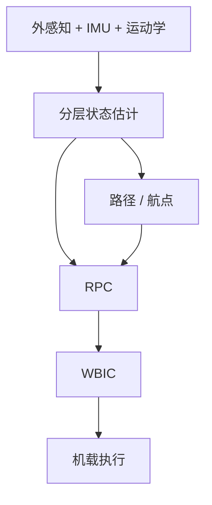

# Robust Autonomous Navigation of Mini-Cheetah Vision

## 一句话定义

**Dudzik et al.（MIT，IROS 2020，[DOI:10.1109/IROS45743.2020.9340701](https://doi.org/10.1109/IROS45743.2020.9340701)）** 完成 **Mini-Cheetah Vision** 系统集成：机载外感知 + **RPC + WBIC** 动态 locomotion + **分层状态估计**，在真实环境以超过 **1 m/s** 做鲁棒自主航点跟踪。

## 英文缩写速查

| 缩写 | 英文全称 | 简要说明 |
|------|----------|----------|
| RPC | Regularized Predictive Control | 正则化预测控制内核 |
| WBIC | Whole-Body Impulse Control | 全身冲量控制下层 |
| IMU | Inertial Measurement Unit | 惯性测量；分层估计输入 |
| SLAM | Simultaneous Localization and Mapping | 定位相关传感融合语境 |
| IROS | International Conference on Intelligent Robots and Systems | 发表会议 |

## 为什么重要

- 论证「盲走控制器不够」：敏捷鲁棒很大程度来自视觉反应。
- 展示小尺度平台上**传感–算力–控制**全机载、无绳系统工程。
- 把 [RPC](./paper-bledt-rpc-thesis.md) 与 [WBIC](./paper-wbic-mpc-mini-cheetah.md) 接到导航闭环。

## 核心信息

| 项 | 内容 |
|----|------|
| **机构** | 麻省理工（MIT） |
| **平台** | Mini-Cheetah Vision |
| **速度** | 自主航点跟踪 **>1 m/s** |
| **开源** | **完整导航栈未单独开源** |

## 核心原理

- 分层估计：规划用定位与 loco 用状态可分离设计。
- RPC 提供鲁棒动态运动；WBIC 落实全身指令。

## 源码运行时序图

**不适用**（无官方完整导航开源仓；loco 内核可参考 Cheetah-Software）。

## 工程实践

| 项 | 建议 |
|----|------|
| 集成 | 先稳 RPC+WBIC 盲走，再接视觉与定位 |
| 估计 | 明确「给规划的状态」vs「给伺服的状态」频率与延迟 |
| 场地 | 动态真实环境测试需安全员与急停 |

## 评测

| 维度 | 要点 |
|------|------|
| 自主 | 无绳、全机载 |
| 速度 | 航点跟踪 >1 m/s |
| 环境 | 动态真实世界场景 |

## 结论

**总判：** 这是 Mini Cheetah **视觉导航系统论文**的代表——价值在集成与分层估计，而非单一新算法。

- 真影响：RPC+WBIC+视觉在小型机上可 >1 m/s 自主。
- 次要代价：开源缺失；系统复杂难复现。
- 部署：作为系统蓝图阅读，组件分别回溯 RPC/WBIC/视觉探索文。

## 与其他工作对比

| 对照对象 | 差异要点 |
|----------|----------|
| [视觉辅助动态探索](./paper-vision-aided-dynamic-exploration-mini-cheetah.md) | 探索文验证外感知 + 动态运动可行；本文进一步集成为无绳全机载自主导航（>1 m/s） |
| [RPC](./paper-bledt-rpc-thesis.md) / [WBIC](./paper-wbic-mpc-mini-cheetah.md) 单点算法 | 本文价值在系统集成与分层状态估计，而非单一新控制算法 |
| 盲走控制器 | 论证盲走不够——敏捷鲁棒很大程度来自视觉反应闭环 |

## 局限与风险

- 小平台传感精度与高速耦合仍难。
- 无代码时只能概念迁移到其他四足。

## 关联页面

- [Vision-aided exploration](./paper-vision-aided-dynamic-exploration-mini-cheetah.md)
- [Bledt RPC](./paper-bledt-rpc-thesis.md)
- [WBIC+MPC](./paper-wbic-mpc-mini-cheetah.md)
- [State estimation](../concepts/state-estimation.md)
- [MIT Mini Cheetah](./mit-mini-cheetah.md)

## 参考来源

- [论文归档](../../sources/papers/robust_autonomous_navigation_mini_cheetah_vision_iros_2020.md)
- [Bledt 论文归档](../../sources/papers/bledt_rpc_thesis_mit_2020.md)

## 推荐继续阅读

- DOI：<https://doi.org/10.1109/IROS45743.2020.9340701>
