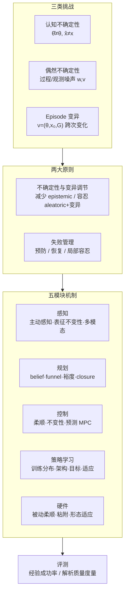

# Robustness of Robotic Manipulation

**Robustness of Robotic Manipulation: Foundations and Frontiers**（Dong et al., arXiv:2606.31494）是面向 **操作鲁棒性** 本身的系统综述，而非把 robustness 当作附带话题。论文给出共享概念语言、统一数学表述，并按 **感知–规划–控制–策略学习–硬件** 五模块归纳已有机制与评测方法，指出向人类级鲁棒性仍缺的 benchmark 与跨范式融合问题。

## 一句话定义

**操作鲁棒性** 指操纵系统在 **认知不确定性、偶然不确定性与 episode 变异** 存在时，仍能借助跨模块机制实现操作目标的程度——需同时明确目标、挑战、机制与评测四元上下文，而非孤立宣称「鲁棒」。

## 英文缩写速查

| 缩写 | 英文全称 | 简要说明 |
|------|----------|----------|
| POMDP | Partially Observable Markov Decision Process | 概率视角下 belief 空间策略与期望回报 |
| MPC | Model Predictive Control | 预测性滚动优化，操作接触模式切换常用 |
| STL | Signal Temporal Logic | 时序任务规范的定量鲁棒性语义 |
| DR | Domain Randomization | 仿真中随机化物理/外观以容忍部署变异 |
| VLA | Vision-Language-Action | 大规模异构数据训练的操作通用策略 |
| CBF | Control Barrier Function | 实时不变性约束，保证状态留在安全集内 |

## 为什么重要

- **填补概念空白：** 既有 manipulation 综述（data-driven grasp、robot learning、foundation models）多 **旁及** robustness；本篇首次以其为 **中心对象**，连接感知、TAMP、接触控制与学习路线。
- **统一三类挑战语言：** 把 epistemic / aleatoric uncertainty 与 episodic variation 并列，避免各子领域用不同词汇描述同一类部署难题。
- **机制–原则双轴组织：** 不确定性与变异 **调节**（减少 vs 容忍）× 失败 **管理**（预防 vs 恢复/局部容忍），便于把 closure 抓取、柔顺控制、域随机化、DAgger 等看似异质方法 **对齐到同一坐标系**。
- **评测分层：** 区分 **经验成功率**（Monte Carlo、阶段式 rubric）与 **解析度量**（抓取质量、裕度、STL、收敛性），指出当前 benchmark 很少显式评 robustness 的缺口。

## 流程总览

## 核心结构（归纳）

### 1）形式化：部分可观测随机控制

- 状态 $x_t$（机器人+物体广义坐标）、控制 $u_t$、观测 $y_t$；动力学 $x_{t+1}=f(x_t,u_t,w_t;\theta)$，观测 $y_t=g(x_t,v_t;\theta)$。
- Episode $\nu=(\theta,x_0,\mathcal{G})$ 编码一次任务实例的物理参数、初态与目标区域。
- **概率视角：** $\Gamma(\pi)=\mathbb{E}_{\nu}[J_\nu(\pi)]$，策略 $\pi(b_t)$ 在 belief 上行动。
- **控制视角：** 对有界扰动集 $\mathcal{W},\mathcal{V},\mathcal{N}$ 做 min-max，追求最坏情况约束满足。

### 2）两大鲁棒性原则

| 原则轴 | 减少路径 | 容忍路径 |
|--------|----------|----------|
| 不确定性与变异调节 | 主动/交互感知、belief 规划、世界模型学习 | 柔顺、表征/控制不变性、closure、funnel、DR/数据扩展 |
| 失败管理 | 预测控制、保守 RL 目标、防 slip 抓取 | 重抓取、形态适应、多模态冗余、DAgger/在线 RL |

两轴 **非互斥**；可靠系统通常 **能减则减、不能减则容**。

### 3）五模块代表机制（节选）

| 模块 | 代表机制 | 主导原则 |
|------|----------|----------|
| 感知 | 主动视点、交互感知、DINO/VLA 不变表征、视触听融合 | 减不确定 / 局部失败容忍 |
| 规划 | belief-space grasp/push、sensorless funnel、chance-constrained、力/形/caging closure | 减不确定 / 容忍变异 |
| 控制 | 阻抗/导纳、CBF/可达集不变性、接触隐式/管式 MPC | 容忍变异 / 防失败 |
| 策略学习 | DR、SE(3) 增广、扩散策略、层次技能、对抗训练、离线保守 RL、DAgger/在线 RL | 容忍变异 / 恢复 |
| 硬件 | 软指/颗粒夹爪、壁虎粘附、可重构软手/模块化形态 | 容忍变异 / 恢复 |

## 评测协议

- **经验：** Eq. (8) 期望目标满足概率 → 多 trial 成功率；阶段式子目标；任务语义 rubric。
- **解析：** 抓取质量（力/形 closure、拓扑 caging）；裕度 $\mathrm{dist}(x,\partial\mathcal{G})$ 与 safety tube；STL 鲁棒性分数；动力学收敛特征值。
- **缺口：** 仿真 benchmark 任务分布窄、sim2real 受限；真机 benchmark 在多样性/规模/一致性间权衡；**显式 robustness 轴** 仍稀缺。

## 常见误区

1. **Robustness = Generalization：** 泛化覆盖广任务/场景，鲁棒性是在 **指定挑战分布** 下的可靠达成；VLA 可能泛化强但对微小接触扰动仍脆弱。
2. **Robustness = Safety：** 安全防伤害；鲁棒性关注 **任务目标** 在不确定下仍达成，二者相交但不等价。
3. **单靠学习或单靠模型：** 论文强调 **know-how（数据经验）与 know-why（模型/先验）融合**——Jenga 式操作同时依赖内部模型与试错。
4. **扰动总有害：** funnel 振动盘、轻微晃动促滑移等说明 **策略性扰动** 有时增强鲁棒。

## 开放问题（论文 §8 浓缩）

- **Benchmark：** 需平衡仿真规模、真机真实性、任务多样性与 **可比的鲁棒性指标**。
- **解析–经验融合：** 闭式裕度/STL 作训练目标 vs 纯 Monte Carlo 成功率，缺乏统一框架。
- **人类级鲁棒：** 终身经验、物理推理世界模型、野外 **硬件–控制共设计**（如乌鸦弯钩）与快速适应的 **系统集成** 仍罕见。

## 与其他页面的关系

- **任务层：** [Manipulation](../tasks/manipulation.md) — 本综述的操作闭环与接触挑战与任务页主线一致；可据此组织鲁棒性阅读路径。
- **概念层：** [Impedance Control](../concepts/impedance-control.md)、[Domain Randomization](../concepts/domain-randomization.md)、[Contact Dynamics](../concepts/contact-dynamics.md) — 分别对应 §5.3.1、§5.4.1、接触不确定性根源。
- **方法层：** [Model Predictive Control](../methods/model-predictive-control.md) — §5.3.3 预测性/contact-implicit MPC 脉络。
- **Query：** [触觉反馈与 RL](../queries/tactile-feedback-in-rl.md)、[接触丰富操作指南](../queries/contact-rich-manipulation-guide.md)、[抓取策略选型](../queries/grasp-policy-selection.md) — 工程向机制落地入口。

## 核心信息

| 字段 | 内容 |
|------|------|
| 机构 | 杜克大学（Duke）；KTH 皇家理工学院；斯坦福大学（Stanford）；麻省理工（MIT）；Organifarms |
| arXiv | <https://arxiv.org/abs/2606.31494> |
| 类型 | Survey / Review |
| 关键词 | Manipulation and Grasping, Robustness, Manipulation under Uncertainty |

## 参考来源

- [robustness_robotic_manipulation_dong_2026.md](../../sources/papers/robustness_robotic_manipulation_dong_2026.md)
- Dong et al., *Robustness of Robotic Manipulation: Foundations and Frontiers*, arXiv:2606.31494, 2026

## 推荐继续阅读

- Mason, *Toward Robotic Manipulation* (Annual Review, 2018) — 操作领域基础综述
- Kroemer et al., *A Review of Robot Learning for Manipulation* (JMLR, 2021) — 学习向操作综述（robustness 非中心）
- [Query：在 RL 中利用触觉反馈提升操作鲁棒性](../queries/tactile-feedback-in-rl.md) — 多模态感知鲁棒机制实践
- Rodriguez, *The unstable queen: uncertainty, mechanics, and tactile feedback* (Science Robotics, 2021) — 接触不确定性与触觉闭环
