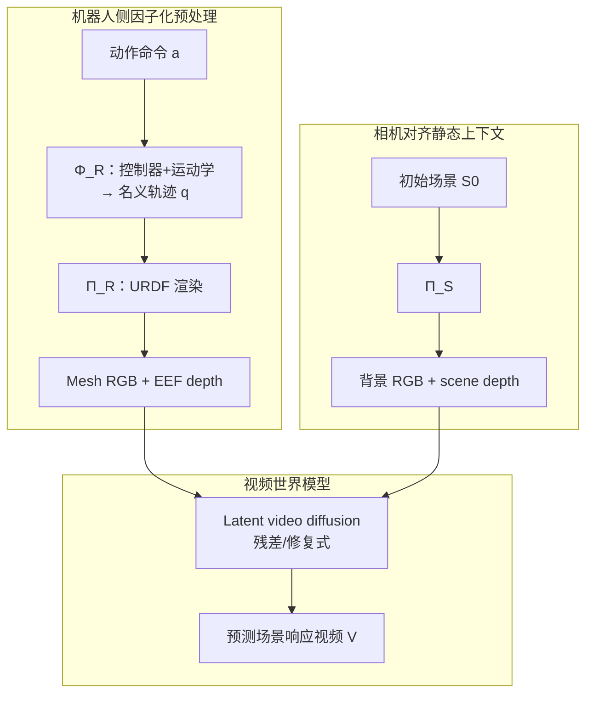

# Rofacto（Robot-Factored World Models · arXiv:2607.22535）

**Rofacto**（*Robot-Factored World Models via Robot Rendering*，[arXiv:2607.22535](https://arxiv.org/abs/2607.22535)，Byungjun Kim / Taeksoo Kim / Hyunsoo Cha / Hanbyul Joo · **首尔大学（SNU）** / **瑞沃世界（RLWRLD）**；[项目页](https://bjkim95.github.io/rofacto/)，[代码宣称](https://github.com/bjkim95/rofacto)）主张：视频世界模型不该同时学「命令如何变成机器人运动」和「场景如何响应」。先把动作经本机控制器/运动学滚成 **名义轨迹**，再用 **URDF** 渲成相机对齐的机器人几何，让模型只学场景响应。

## 一句话定义

**用部署可得的名义轨迹 + URDF 渲染，把机器人动作变成像素域几何条件，从而把动作实现从世界模型里因子化出去。**

## 英文缩写速查

| 缩写 | 英文全称 | 简要说明 |
|------|----------|----------|
| Rofacto | Robot-Factored World Models | 本文：机器人因子化世界模型 |
| URDF | Unified Robot Description Format | 渲染用的机器人几何/运动学描述 |
| EEF | End-Effector | 末端；本文渲染末端深度以消歧接触 |
| WM | World Model | 动作条件未来观测预测器 |
| AdaLN | Adaptive Layer Normalization | 向量状态条件基线的注入方式 |
| DROID | Distributed Robot Interaction Dataset | 固定外视臂–夹爪评测集 |
| SVD | Stable Video Diffusion | 与 Ctrl-World 式 pose 条件对照的骨干 |

## 为什么重要

- **钉死动作接口选型：** raw command 绑 embodiment；logged state 泄漏交互——名义轨迹是中间正解。
- **与同实验室 [DWM](../methods/dwm.md) 对齐又分叉：** 共享「静态上下文 + 可见身体几何 → 残差视频动力学」骨架，但渲染的是 **交互前名义运动**，不是已含接触结果的 logged 轨迹。
- **embodiment 迁移借口更干净：** 新机器人只要能渲 URDF，就走同一视觉条件通路；向量条件则换动作空间与实现映射。
- **对照 [Ctrl-World](./paper-ctrl-world.md)：** 同属操作视频 WM，但 Ctrl-World 用笛卡尔/位姿数值条件，Rofacto 用渲染几何。

## 核心信息

| 项 | 内容 |
|----|------|
| 机构 | 首尔大学（SNU）、瑞沃世界（RLWRLD） |
| 骨干 | Wan 2.1 Fun InP（主）/ SVD（对照）；flow-matching |
| 条件流 | 静态 RGB + 场景深度 + 机器人 mesh RGB + EEF 深度 |
| 数据 | DROID ~41.6k clips；RoboCasa-GR1 ~9.4k（DiT4DiT 执行） |
| 开源（2026-07-27） | **宣称将开源**：项目页 Code → GitHub，仓 **404** |

## 流程总览

## 核心原理（方法）

### 1）三种动作信号

| 信号 | 部署可得？ | 泄漏交互？ | 角色 |
|------|------------|------------|------|
| Raw action | 是 | 否 | 命令，未过控制器 |
| **Nominal trajectory** | **是** | **否** | 本文条件 |
| Realized state | 否（即未来） | 是 | 仅作 oracle 诊断 |

自由空间名义≈实现；接触后分离——**分离本身就是要预测的交互**。

### 2）深度感知渲染接口

仅 mesh RGB 只能表达图像平面重叠；配对 **EEF depth + scene depth** 区分「擦肩而过」与真实接触邻近。

### 3）学习目标

四路条件经预训练视频 VAE 编码后与噪声视频 latent 拼接；文本 prompt 只含场景、不含动作意图；最小化 latent flow-matching 速度误差。

## 源码运行时序图

**不适用**（截至 **2026-07-27**：项目页列出 [`bjkim95/rofacto`](https://github.com/bjkim95/rofacto)，但 GitHub **404**，无可辨识训练/推理入口；见 [`sources/repos/rofacto.md`](../../sources/repos/rofacto.md)）。

## 实验与评测

### 主对比（骨干内比较）

| Backbone | Method | DROID PSNR↑ | RoboCasa PSNR↑ |
|----------|--------|-------------|----------------|
| SVD 1.5B | Ctrl-World pose | 23.15 | — |
| SVD 1.5B | **Rendered mesh** | **25.05** | — |
| Wan 14B | AdaLN state vector | 18.57 | 17.67 |
| Wan 14B | **Rendered + EEF/scene depth** | **21.87** | **24.61** |

### 消融（DROID）

| Variant | PSNR↑ | LPIPS↓ |
|---------|-------|--------|
| Raw action mesh | 21.57 | 0.175 |
| Nominal mesh | 22.44 | 0.164 |
| Nominal + depth | **23.08** | **0.161** |

定性：改渲染名义轨迹可改预测场景响应；HRDexDB 未见 xArm+Inspire、DexMimicGen 双臂、DexYCB 人手重定向均走同一接口。

## 工程实践

| 项 | 实践要点 |
|----|----------|
| 名义化 | DROID：无场景 Isaac Lab 回放遥操作目标；GR1：无碰撞影子 rollout |
| 标定 | **URDF + 相机外参** 是硬前置 |
| 动相机 | 需可用静态场景表示（仿真全量；真机常需重建） |
| 失败数据 | 成功偏置集会弱化抓空/滑脱建模 |
| 开源 | **待公开**；勿按可立即复现排期 |

## 结论

**把「动作实现」和「机器人外观」移出网络、留给控制器与 URDF 渲染后，视频 WM 更擅长学场景响应，也更容易跨 embodiment 复用同一视觉接口。**

1. **优先选名义轨迹，不选 logged state** — 后者对齐视频但泄漏交互。
2. **渲染几何 > 向量 AdaLN** — 同骨干同数据下 PSNR/SSIM/LPIPS 全面更好。
3. **深度不是装饰** — 消融与定性都表明它抑制假接触。
4. **embodiment 泛化靠接口，不靠动作空间对齐** — 新机器人先能渲。
5. **工程税在标定与 URDF** — 换机就要重做渲染栈。
6. **代码未落地** — 入库日仅项目页与论文。

## 局限与风险

- 依赖 URDF 与标定；外观/碰撞模型不准会毒化条件。
- 动相机 + 部分观测场景时静态上下文不完整。
- 成功轨迹偏置；失败接触欠采样。
- **开源未落地**（仓 404）。

## 与其他工作对比

| 路线 | 动作如何进入 WM | 相对 Rofacto |
|------|-----------------|--------------|
| 向量/位姿条件 | AdaLN / cross-attn 数值 | 需学 grounding；embodiment 绑动作空间 |
| [Ctrl-World](./paper-ctrl-world.md) | 笛卡尔位姿帧级条件 | 同属操作 WM；接口哲学不同 |
| [DWM](../methods/dwm.md) | 静景渲染 + **logged** 手网格 | 共享残差视频思路；信号是否泄漏交互是分界 |
| Visual Action Prompts | 图像空间动作提示 | 本文强调「渲什么」：名义而非实现 |

## 关联页面

- [Generative World Models](../methods/generative-world-models.md) — 像素域 WM 谱系
- [DWM](../methods/dwm.md) — 同实验室灵巧视频 WM
- [Ctrl-World](./paper-ctrl-world.md) — 可控操作视频 WM 基线对照
- [Masked Visual Actions](./paper-masked-visual-actions.md) — 掩码轨迹视觉条件
- [Video as Simulation](../concepts/video-as-simulation.md) — 视频当仿真器
- [Manipulation](../tasks/manipulation.md) — 操作任务语境
- [世界模型物理保真输出轴](../overview/world-model-physics-fidelity-outputs.md) — 按输出读物理

## 参考来源

- [Rofacto 论文归档](../../sources/papers/rofacto_arxiv_2607_22535.md)
- [Rofacto 项目页](../../sources/sites/rofacto-github-io.md)
- [bjkim95/rofacto 仓归档](../../sources/repos/rofacto.md)

## 推荐继续阅读

- [项目页](https://bjkim95.github.io/rofacto/) — 对比条与零样本 embodiment 可视化
- [arXiv:2607.22535](https://arxiv.org/abs/2607.22535) — 方法与表格全文
