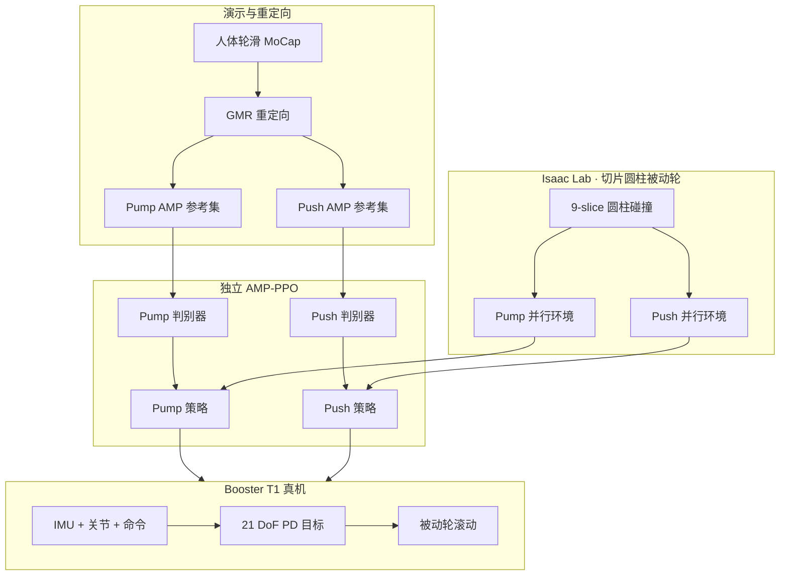

# 被动轮人形轮滑 AMP（Tsinghua）

**Learning Roller-Skating Motions of Humanoid Robots Based on Adversarial Motion Priors**（清华大学，arXiv:[2607.10815](https://arxiv.org/abs/2607.10815)，2026-07-14）在 **Booster T1 + 被动四轮滑** 平台上，提出 **切片圆柱被动轮碰撞模型**，并将人体轮滑 **MoCap 经 GMR 重定向** 为 **Pump Glide / Push Glide** 两套 **独立 AMP-PPO** 管线，在 Isaac Lab 训练、MuJoCo 补充评测，并完成 **双 gait 真机滑行**。

## 一句话定义

**人形穿轮滑不是加几个轮子——被动滚动接触要单独建模，两种推进步态各用一套 AMP 风格先验学。**

## 英文缩写速查

| 缩写 | 英文全称 | 简要说明 |
|------|----------|----------|
| AMP | Adversarial Motion Prior | 从参考动作片段学习对抗风格奖励，无需逐帧相位对齐 |
| PPO | Proximal Policy Optimization | 本文策略优化算法，与 AMP 判别器联合训练 |
| GMR | General Motion Retargeting | 人体轮滑演示重定向到 T1+轮滑构型的标准管线 |
| Pump Glide | — | 周期对称开合推进的轮滑步态 |
| Push Glide | — | 单腿蹬地、另一腿滑行支撑的交替步态 |
| DoF | Degrees of Freedom | T1 23 主动关节 + 每脚 4 被动轮 |
| Sim2Real | Simulation to Real | Isaac Lab 训练后在改装 T1 真机部署 |

## 核心信息

| 字段 | 内容 |
|------|------|
| 机构 | 清华大学（Tsinghua University） |
| 作者 | Yunkang Cheng†、Yutong Wu†、Menghan Li、Shihe Zhou、Mingguo Zhao* |
| 平台 | Booster T1 + 被动轮滑（23+8 DoF） |
| 仿真 | Isaac Lab（训练）；MuJoCo（Push Glide 评测） |
| 控制 | 50 Hz；策略输出 21 非轮关节 PD 目标 |
| 项目页 | <https://cyk579.github.io/Roller-Skating/> |

## 为什么重要

- **被动轮仿真瓶颈：** 窄轮滚动接触若用整球碰撞，约一半体积提供虚假侧向支撑；**9 片圆柱** 是论文给出的可训练折中，直接影响 sim2real 可信度。
- **双推进机制对照：** Pump（对称开合）与 Push（蹬滑交替）**不可共用同一任务奖励**；独立 AMP 数据集/判别器/策略避免手工相位规则。
- **与 SKATER 互补：** [SKATER](./paper-notebook-skater-synthesized-kinematics-for-advanced-trave.md) 侧重回形轮滑效率；本文强调 **AMP 风格约束 + 被动轮动力学建模 + 双 gait 真机**。
- **轮足交叉文献：** 连接 wheeled-legged **被动轮** 综述脉络与 humanoid dynamic skill 的 AMP 族（DeepMimic → AMP → 本文）。

## 方法

| 模块 | 机制 |
|------|------|
| **轮模型** | 视觉 STL + **9 片圆柱** 碰撞；对比 mesh/球体吞吐与支撑误差 |
| **数据** | 两 gait 独立 MoCap → GMR → 平滑/滤穿地 → AMP 状态转移样本 |
| **AMP-PPO** | 5 帧拼接特征；Wasserstein 判别器；Pump/Push 不同 $r_{amp}:r_{task}$ 混合 |
| **任务奖励** | 共享速度/姿态/脚距；Push 额外轮腾空、支撑切换等 **课程化** 项 |
| **部署** | 历史观测编码 + 速度命令；真机 IMU/关节闭环 |

### 流程总览

## 实验要点（归纳）

| 轴 | 报告口径 |
|----|----------|
| **Pump 速度扫** | $0.10$–$0.45$ m/s 完成率 0.77–0.81；$0.50$ m/s 降至 0.53 |
| **Pump 长程** | 100 s 速度剖面总行程 **39.5 m**，躯干倾角 RMS 0.132 rad |
| **Push 速度** | 命令 0.1–0.5 m/s 均可跑满 20 s，但实际速度系统性偏高（增益偏差） |
| **Push 支撑** | 左右轮组短单支撑交替，与支撑腿切换奖励一致 |
| **局限** | 切片轮仍为近似；无标准化轮滑质量基准；Push 跨仿真器速度误差 |

## 与其他工作对比

- **vs SKATER：** [SKATER](./paper-notebook-skater-synthesized-kinematics-for-advanced-trave.md) 侧重合成回形轮滑运动学与效率；本文互补地强调 **AMP 风格约束 + 被动轮动力学建模 + Pump/Push 双 gait 真机部署**。
- **AMP 家族脉络：** 在 DeepMimic → AMP → 本文 的谱系中，将风格模仿从足式扩展到被动轮滑的接触动力学建模。
- **轮碰撞建模对比：** 相较用整球碰撞近似窄轮（会显著夸大侧向支撑、诱导不真实平衡策略），本文的 **9 片圆柱** 碰撞模型降低虚假侧向支撑，提升 sim2real 可信度。

## 常见误区或局限

- **误区：「一个策略学两种滑法」。** 推进与接触时序不同，论文使用 **完全独立** 的参考集、判别器与奖励。
- **误区：「轮用球体碰撞差不多」。** 整球会显著夸大侧向支撑，策略会学到不真实平衡。
- **局限：** 截至入库日 **项目页未列代码**；速度跟踪在 Push 场景仍有 sim/real 与跨物理引擎偏差。

## 工程实践与开源状态

- **开源状态（2026-07-20）：** 项目页 <https://cyk579.github.io/Roller-Skating/> **未列出 GitHub / 权重 / 数据集** → 按 **未开源** 标注；真机视频与方法框图可作为复现需求参考。
- **硬件：** Booster Robotics 提供 T1 平台与实验环境（论文致谢）。

## 关联页面

- [Humanoid Locomotion](../tasks/humanoid-locomotion.md) — 人形移动任务总览
- [Locomotion](../tasks/locomotion.md) — 足式/轮足移动广义任务
- [Reinforcement Learning](../methods/reinforcement-learning.md) — PPO + 对抗先验训练栈
- [Sim2Real](../concepts/sim2real.md) — 被动接触建模与部署偏差
- [SKATER](./paper-notebook-skater-synthesized-kinematics-for-advanced-trave.md) — 人形轮滑另一路线索引

## 参考来源

- [轮滑 AMP 论文摘录（arXiv:2607.10815）](../../sources/papers/roller_skating_amp_arxiv_2607_10815.md)
- [Roller-Skating 项目页](../../sources/sites/cyk579-roller-skating-github-io.md)

## 推荐继续阅读

- 项目页与视频：<https://cyk579.github.io/Roller-Skating/>
- 论文 PDF：<https://arxiv.org/pdf/2607.10815>
- [SKATER 论文](https://arxiv.org/abs/2601.04948) — Pump Glide 任务奖励路线对照
- Peng et al., *AMP: Adversarial Motion Priors* (2021) — 风格先验基础
