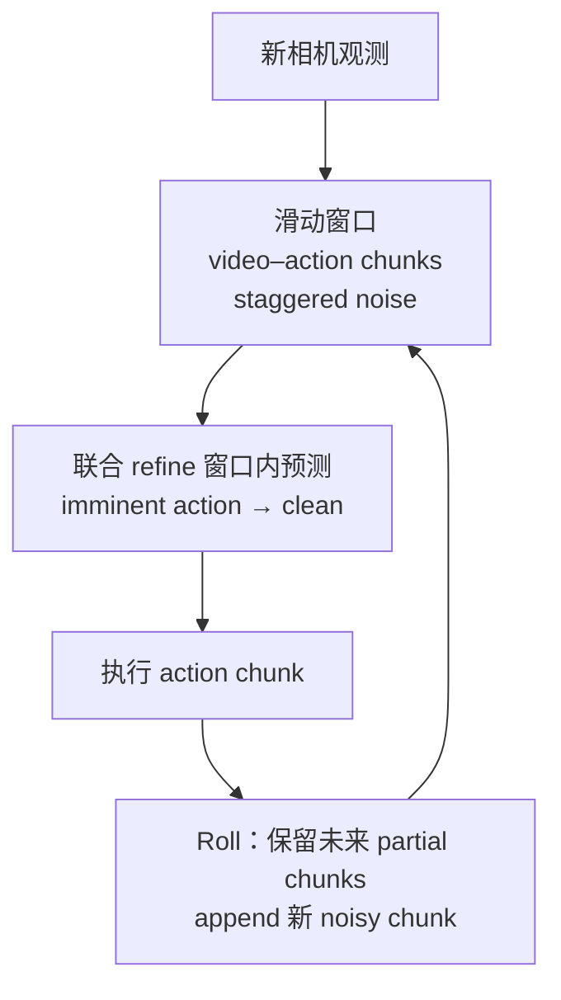

# Rolling-WAM（滚动想象 · World Action Model）

**Rolling-WAM**（*World Action Models with Rolling Imagination*，[arXiv:2609.30247](https://arxiv.org/abs/2609.30247)，[项目页](https://rolling-wam.github.io/)）来自 **USC / Brown / Fudan / TRI** 等：标准 **Joint-WAM** 每个 replan 周期都要 **从头联合去噪整段未来 video–action**，steady-state 延迟高、闭环响应慢。Rolling-WAM 在窗口内维持 **不同噪声等级的 video–action chunks**，每步 **完全去噪即将执行的 action chunk**，远处 chunk **继续 partial denoise**；窗口随新观测 **滚动**，算力分摊到多步并保留跨 chunk 视觉–动作上下文。

## 一句话定义

WAM 的 replan 不再每轮从零联合去噪全 horizon，而在滑动窗口里滚动 partial denoise，使下一 action chunk 更快就绪。

## 英文缩写速查

| 缩写 | 英文全称 | 简要说明 |
|------|----------|----------|
| WAM | World Action Model | 联合预测未来观测与动作 |
| MoT | Mixture-of-Transformers | 视频 DiT expert + 轻量 action Transformer |
| DiT | Diffusion Transformer | 视频与动作去噪骨干 |
| SR | Success Rate | 任务成功率 |
| LIBERO | LIBERO benchmark | 仿真操纵基准 |

## 为什么重要

- **直击 WAM 闭环 latency 瓶颈。** 项目页 RoboTwin 2.0 对照：**Joint-WAM 978 ms** → **Rolling-WAM 215 ms** steady-state replan（**4.5×**），仍报告 **93.3%** 平均 SR。
- **与 [MotionWAM](./paper-motionwam-humanoid-loco-manipulation-wam.md) 互补：** MotionWAM 用 **单次 Video DiT 前向隐状态** 省算；Rolling-WAM 保留 **完整 joint denoising 语义**，但 **摊到多帧 replan**。
- **人形证据：** **Unitree G1 真机平均 SR 85.0%**（项目页 headline），把 rolling 配方从桌面臂推到 **全身平台**。

## 流程总览

## 核心机制（详细）

| 项 | 内容 |
|----|------|
| 架构 | 预训练 **video DiT** + 轻量 **action Transformer**（MoT）；语言 + 机器人状态条件双 expert |
| Attention | 未来 video 可看当前帧与已预测 video chunk、**不可看 action**；action 看全部 visual；action–action **chunk 内** |
| Noise | **Per-chunk noise conditioning**，窗口内各 chunk 处于不同去噪阶段 |
| 训练/推理 | 每 replan：**denoise 到可执行的下一块 action**；远处块 **少步或 partial**；窗口前进时 **延续** 未清完块的 denoise 轨迹 |

## 评测与结果

| 设定 | 报告值（项目页，2026-09-26） |
|------|---------------------------|
| LIBERO 平均 SR | **98.1%** |
| RoboTwin 2.0 平均 SR | **93.3%** |
| 真机 Unitree G1 平均 SR | **85.0%** |
| Steady-state replan latency（A100，RoboTwin 对照） | **215 ms**（Joint 978 / Fast-WAM 548 / π₀.₅ 296 / GR00T N1.7 285 ms） |

> 数值以论文 PDF 与项目页为准；**代码未发布**时社区无法独立复现。

## 源码运行时序图

**不适用**（截至 2026-09-26：[zyinghua/Rolling-WAM](https://github.com/zyinghua/Rolling-WAM) README 声明 **code and checkpoints will be released soon**，无训练/推理入口）。

## 工程实践（含开源状态）

| 项 | 结论 |
|----|------|
| arXiv | <https://arxiv.org/abs/2609.30247> |
| 项目页 | <https://rolling-wam.github.io/> |
| GitHub | [zyinghua/Rolling-WAM](https://github.com/zyinghua/Rolling-WAM) **已开源**（权重 README 仍可能待齐） |
| 复现边界 | 方法图与 latency 表可读；权重与脚本未开放 |

## 结论

**Rolling-WAM 把 Joint-WAM 的「每轮全 horizon 去噪」改成「窗口内滚动 partial denoise」，在保持 competitive SR 的同时把 steady-state replan 压到 ~215 ms 量级。**

1. **4.5× replan 加速** 是 headline；读 latency 表时注意 **warm-up / compile 未计入** 的项目页脚注。
2. **SR 仍 competitive**（LIBERO 98.1%、RoboTwin 93.3%）说明分摊去噪 **不必然牺牲** 操纵质量，但需等代码核对协议。
3. **G1 85%** 表明 rolling 配方可上 **人形真机**；与 loco-manip WAM 栈对照时区分 **任务集**（页内偏 manipulation rollout）。
4. **选型：** 若已有 Fast-WAM / hook-hidden 路线，Rolling-WAM 是 **保留 joint 训练目标** 的第三条 latency 轴。
5. **开源：** 跟进 [Rolling-WAM 仓库](https://github.com/zyinghua/Rolling-WAM) 发布后再补运行时序与复现清单。

## 与其他工作对比

| 对照 | 差异读法 |
|------|----------|
| Joint-WAM | 每 replan **全 horizon 联合去噪** → 高 steady-state latency（对照 **978 ms**） |
| Fast-WAM | 减算/蒸馏路线（对照 **548 ms**）；Rolling-WAM **保留 joint 训练目标**、分摊 denoise |
| [MotionWAM](./paper-motionwam-humanoid-loco-manipulation-wam.md) | **单次 Video DiT hook** 实时人形 loco-manip；Rolling-WAM 面向 **manipulation replan** 与 **G1 85%** headline |
| [DiT4DiT](./paper-dit4dit-video-action-model.md) | 双 DiT **联合训练**基线族；Rolling-WAM 改 **推理调度** 而非换骨干 |
| π₀.₅ / GR00T N1.7 | 项目页 latency 对照中的 **VLA** 基线（**296 / 285 ms**），任务与噪声模型不同，**不可直接比 SR** |

## 关联页面

- [World Action Models](../concepts/world-action-models.md)
- [Generative World Models](../methods/generative-world-models.md)
- [MotionWAM](./paper-motionwam-humanoid-loco-manipulation-wam.md)
- [DiT4DiT](./paper-dit4dit-video-action-model.md)

## 参考来源

- [rolling_wam_arxiv_2609_30247.md](../../sources/papers/rolling_wam_arxiv_2609_30247.md)
- [rolling-wam-github-io.md](../../sources/sites/rolling-wam-github-io.md)
- [rolling-wam.md](../../sources/repos/rolling-wam.md)

## 推荐继续阅读

- [arXiv PDF](https://arxiv.org/pdf/2609.30247)
- [项目页 latency 对照](https://rolling-wam.github.io/)
