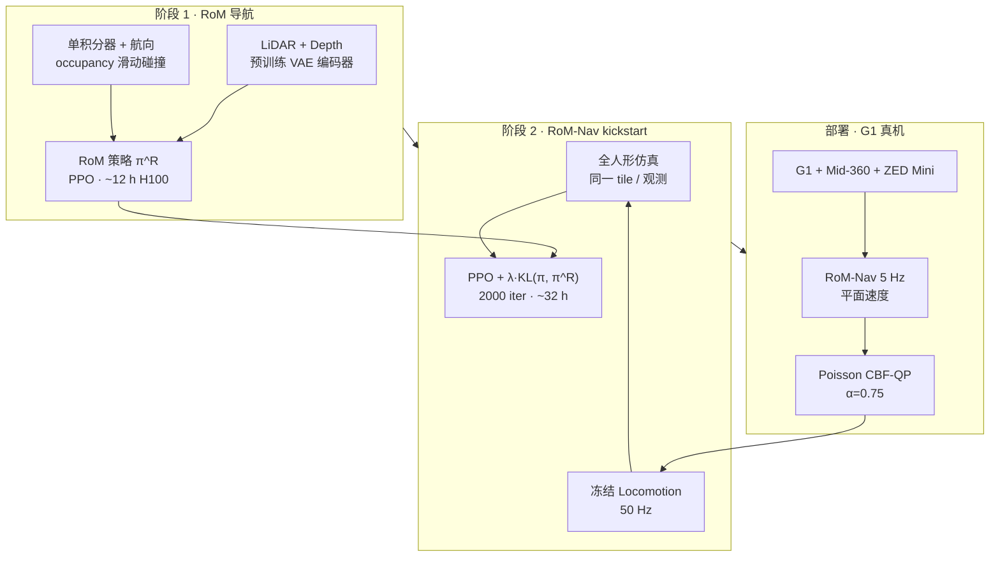

# RoM-Nav：Learning Safe Humanoid Navigation from Reduced Order Models

**Learning Safe Humanoid Navigation from Reduced Order Models**（Compton / Olkin / Bena / Ames；[arXiv:2609.19272](https://arxiv.org/abs/2609.19272)，[项目页](https://wdc3iii.github.io/rom-nav/)，ICRA 2027 under review）提出 **RoM-Nav**：先在 **降阶单积分器 + occupancy 网格** 上、用 **全 3D LiDAR（与深度）** 学会多层地形导航，再以 **KL 散度 + PPO** 把该策略 **kickstart** 到 **全人形 + 冻结 locomotion**；部署时在速度命令上叠 **Poisson 方程导出的 CBF-QP**，在 **分布外几何** 上消除碰撞且 **不牺牲导航成功率**。真机 **Unitree G1** 完成无全局地图的跨楼层任务（**>10 m** 垂直位移、**100 m** 路径）。

## 一句话定义

**先在「会滑墙的 2D RoM」上把 LiDAR 导航训稳，再 KL 蒸馏到「真会爬楼梯的 G1」；最后用 Poisson CBF 给平面速度命令加硬安全壳。**

## 英文缩写速查

| 缩写 | 英文全称 | 简要说明 |
|------|----------|----------|
| RoM | Reduced Order Model | 本文为带航向的单积分器 + 网格碰撞投影 |
| RoM-Nav | RoM kickstarted Navigation | 降阶预训 + 全人形 kickstart 的完整方法名 |
| CBF | Control Barrier Function | 控制屏障函数；本文由 Poisson 场构造 |
| PPO | Proximal Policy Optimization | 人形阶段 RL 主目标 |
| KL | Kullback–Leibler divergence | kickstart 期约束策略贴近 RoM 教师 |
| SPL | Success weighted by Path Length | 相对测地线路径的成功加权指标 |
| SR | Success Rate | 在 45 s / 120 s 预算内到达目标的成功率 |
| LiDAR | Light Detection and Ranging | Mid-360 距离图为主感知 |
| OOD | Out-of-Distribution | 训练未覆盖的障碍几何（含 adversarial 悬挂管） |

## 核心信息

| 项 | 内容 |
|----|------|
| **作者** | William D. Compton、Zachary Olkin、Ryan Bena、Aaron D. Ames |
| **机构** | 加州理工学院（Caltech）计算与数学科学系；亚马逊 Safe Autonomy Frontiers（SAF）实验室 |
| **平台** | Unitree G1；Mid-360 LiDAR + 下视 ZED Mini |
| **控制接口** | 导航 **5 Hz** → 平面 \((v_x, v_y, \omega)\) → **50 Hz 冻结 locomotion** |
| **速度限幅** | 前向 1 m/s、横向 0.25 m/s、角速度 1 rad/s |
| **训练** | RoM **~12 h** / RoM-Nav **~32 h**（单 H100）；合计 **<45 h** |
| **开源** | **待发布** — [项目页核查](../../sources/sites/rom-nav.md)（2026-10-01 无 GitHub） |

## 为什么重要

- **导航瓶颈在楼梯，不在走路：** 单阶段全身 RL 在 cross-level 目标上 fall/timeout 主导失败；RoM kickstart 把 **+34.6 pp**（@45 s vs Single-Stage，cross-level）的增益集中在 **换层几何**，与「locomotion 已会走楼梯、导航不会选路」的诊断一致。
- **降阶不是弃用 LiDAR：** RoM 阶段仍用 **完整 3D LiDAR + 深度** 与同一 tile 分布，只是 **动力学简化** 以加速探索；zero-shot RoM→人形已有 74% SR@45，kickstart 再抬 **~8 pp**。
- **安全与成功率解耦：** 学习策略无碰撞保证；**Poisson CBF** 仅改速度命令，OOD 环境 **10/10 成功且 0 碰撞**（代价是到达时间方差增大）。
- **与 Caltech  locomotion 线互补：** 同组 [GTI](./paper-generate-track-improve.md) 解决 **感知 locomotion 生成+跟踪**；本文假设 **locomotion 已冻结**，专攻 **长程无地图导航 + 安全滤波**。

## 方法

| 模块 | 作用 |
|------|------|
| **RoM 教师** | 单积分器 + 航向；occupancy 0.2 m；撞 occupied 格时 **法向分量投影**（沿边界滑动） |
| **Kickstart** | 人形 PPO + \(\lambda\) 加权 KL 对 RoM 动作分布；\(\lambda: 1 \to 0.05\)（iter 100→1100），总 **2000** iter |
| **感知** | LiDAR/深度 **VAE 预训练 CNN** → self/cross-attention → **GRU** → MLP 动作；编码器 **冻结** |
| **课程** | Multi-story / outdoor tile；目标测地距离 **≤30 m**；**30%** spawn 在楼梯/坡道口（gait 库相位对齐） |
| **安全层** | 点云 → 0.05 m 栅格 → Poisson 得 \(h(p)\) → QP 投影 \(v_{\mathrm{des}}\)（\(\alpha=0.75\)） |

### 流程总览

## 工程实践

| 主题 | 要点 |
|------|------|
| **编码器** | 无预训练 SR 崩溃；Frozen vs Unfrozen@1000 最终相当，解冻 **+15%** 每 iter 算力 |
| **采样** | 去掉 stair 过采样或去掉 30 m 测地 cap 主要伤 **cross-level**（同层 SR 几乎不变） |
| **仿真对比** | Table II：RoM-Nav **82.3 / 92.8%** @45/120 s，SPL **0.769**，逼近 RoM 上界 |
| **硬件对齐** | GLIM 建图 + 重定位 **仅用于对齐 spawn**；策略 **不可见地图** |
| **目标假设** | 机体坐标系下 **准确目标位姿**（强假设）；透明障碍需额外处理 |

## 局限与风险

- **LiDAR 语义盲区：** 玻璃等透明体；论文用挡板人工规避。
- **平面 CBF：** 理论上可能挡掉策略认为可穿越的 route（实验中未观察到）。
- **locomotion 外置：** 楼梯失败模式依赖冻结策略质量；与 GTI 等 locomotion 工作 **版本耦合**。
- **开源：** 待官方仓库发布后再补 `sources/repos/` 与运行时序图。

## 实验与评测

| 设置 | 结果摘要 |
|------|----------|
| **四臂对比** | Single-Stage / RoM(cyl) / RoM(hum) zero-shot / **RoM-Nav**；1024 初值 |
| **Cross-level** | RoM-Nav − RoM(hum) @45s **+15.2 pp**†；− Single-Stage **+34.6 pp**† |
| **CBF 硬件** | OOD：无 CBF **2/10** 碰撞；有 CBF **0/10**；Adversarial：**4/10→0/10** |
| **长程真机** | 实验室内 **36.6 m**；楼梯 **7–10 m** 爬升；户外 **100 m**；**零碰撞** |

## 源码运行时序图

**不适用**（截至 2026-10-01 [项目页](../../sources/sites/rom-nav.md) 未发布可运行官方代码；复现需自建 RoM tile 生成、双阶段 PPO 与 Poisson CBF 部署栈。）

## 与其他工作对比

| 对照 | 差异读法 |
|------|----------|
| [GTI](./paper-generate-track-improve.md) | 同 G1 + Caltech：GTI **训 locomotion**；RoM-Nav **消费冻结 locomotion** 训 **导航 + CBF** |
| [CAP](./paper-cap-perception-blind-humanoid.md) | CAP 减感知探极限；RoM-Nav **满 LiDAR/深度** + 结构先验 |
| [PASSAGE](./paper-passage.md) | 数据驱动人体 motion 对齐 vs **RoM+RL kickstart** |
| Single-Stage 全身导航 RL | 同任务设定下样本效率与 cross-level SR 明显落后（Table II–III） |
| [导航 / SLAM 栈](../overview/navigation-slam-autonomy-stack.md) | 经典栈建图定位规划；本文 **无全局地图**，局部几何进策略 + CBF |
| [CLF vs CBF](../comparisons/clf-vs-cbf.md) | 本文 CBF 来自 **Poisson 占用场**，非 RL 学 barrier |

## 结论

**RoM-Nav 的可复用结论是：人形长程无地图导航应把「几何选路」先在 RoM 上训满，再 KL kickstart 到全身；楼梯类失败用 cross-level 指标单独验收；部署层用解析 CBF 买 OOD 安全，而不是指望策略内隐碰撞约束。**

1. **分两阶段训** — RoM **~12 h** 换 cross-level 可学性；skip kickstart 会丢 **~8 pp** SR@45（相对 RoM zero-shot 到人形）。
2. **冻结 locomotion 边界清晰** — 导航输出 **平面速度**；locomotion 质量上限由外部策略决定（可对齐 GTI / 实验室现有 walker）。
3. **预训练编码器必做** — LiDAR VAE + 分割头；RL 端到端训 CNN 在本设定下不收敛到可用 SR。
4. **采样是 cross-level 的关键** — stair/ramp spawn + 30 m 测地 cap；去掉任一项主要伤 **换层** 而非同层。
5. **安全滤波选型** — Poisson CBF **零学习**、QP 闭式；接受 OOD 上 **时间方差** 增大，成功率保持。
6. **真机规模** — 训练 cap 30 m / 8 m 高差，硬件可到 **100 m / 10 m**；报告时区分 **训练分布 vs 演示外推**。
7. **开源** — 待项目页 Code 链接后再补仓库归档与时序图。

## 关联页面

- [navigation-slam-autonomy-stack](../overview/navigation-slam-autonomy-stack.md)
- [humanoid-locomotion](../tasks/humanoid-locomotion.md)
- [reinforcement-learning](../methods/reinforcement-learning.md)
- [CLF vs CBF](../comparisons/clf-vs-cbf.md)
- [Generate, Track, Improve](./paper-generate-track-improve.md)
- [Unitree G1](./unitree-g1.md)

## 参考来源

- [rom_nav_arxiv_2609_19272.md](../../sources/papers/rom_nav_arxiv_2609_19272.md)
- [rom-nav 项目页核查](../../sources/sites/rom-nav.md)
- [arXiv:2609.19272](https://arxiv.org/abs/2609.19272)

## 推荐继续阅读

- [项目页方法与硬件视频](https://wdc3iii.github.io/rom-nav/)
- [arXiv PDF](https://arxiv.org/pdf/2609.19272)
