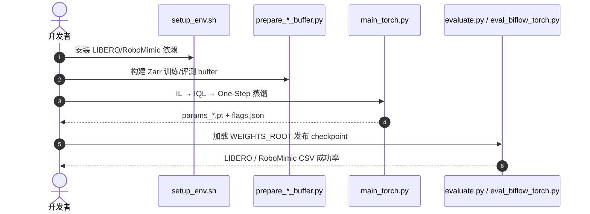

# RoMAN-Flow

**RoMAN-Flow: Taming Autoregressive Normalizing Flows for Offline Reinforcement Learning in Robotic Manipulation**（[arXiv:2608.20208](https://arxiv.org/abs/2608.20208)，[代码](https://github.com/konnyaku28/RoMAN-Flow)）——（见论文作者列表）。

## 一句话定义

**可计算似然让离线 RL 有直接抓手——训练不采样、部署一步生成。**

## 英文缩写速查

| 缩写 | 英文全称 | 简要说明 |
|------|----------|----------|
| AR-NF | Autoregressive Normalizing Flow | 自回归归一化流策略 |
| IQL | Implicit Q-Learning | 离线 RL 后训练阶段 |
| IL | Imitation Learning | 行为克隆预训练阶段 |

## 为什么重要

- 纳入 [具身智能小站 2026-08-22 十篇盘点](../../sources/blogs/wechat_embodied_station_video_contact_control_10_papers_2026-08-22.md) 的「视频→接触→控制→VLA 持续学习」主线。
- 开源状态（入库日）：**已开源**。

## 核心信息

| 项 | 内容 |
|----|------|
| **机构** | （见论文作者列表） |
| **出处** | arXiv:2608.20208（2026-08） |
| **开源** | **已开源** |

### 流程总览

## 结论

**离线操作要同时保住似然可处理性与部署延迟，AR-NF + 蒸馏是可行折中。**

- 优化阶段 sampling-free，避免从自回归策略采样
- 蒸馏后一步动作生成显著降推理延迟
- 官方仓含 LIBERO-10/Long 与 RoboMimic 全流程
- HF 权重与 manifest 外部分发

## 源码运行时序图

## 与其他页面的关系

- [offline-rl](../comparisons/online-vs-offline-rl.md)
- [manipulation](../tasks/manipulation.md)
- [diffusion-policy](../methods/diffusion-policy.md)
- [libero-benchmark](../entities/libero-benchmark.md)
- [视频–接触–控制 10 篇技术地图](../overview/video-contact-control-10-papers-technology-map.md)

## 参考来源

- [roman_flow_arxiv_2608_20208](../../sources/papers/roman_flow_arxiv_2608_20208.md)
- [roman-flow](../../sources/repos/roman-flow.md)
- [wechat_embodied_station_video_contact_control_10_papers_2026-08-22](../../sources/blogs/wechat_embodied_station_video_contact_control_10_papers_2026-08-22.md)

## 推荐继续阅读

- [arXiv:2608.20208](https://arxiv.org/abs/2608.20208)
- [RoMAN-Flow 官方代码](https://github.com/konnyaku28/RoMAN-Flow)
