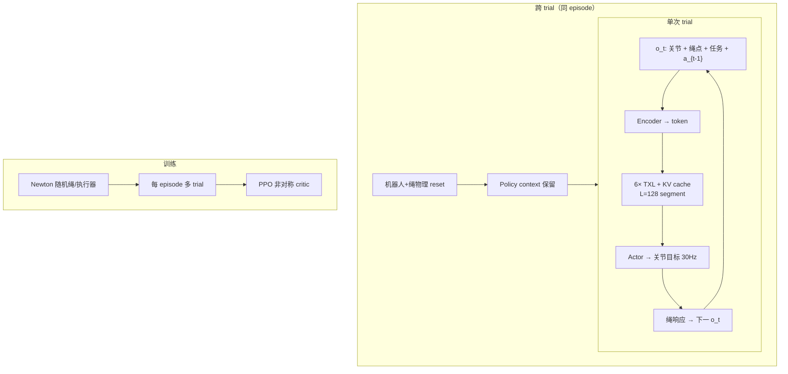

# RopeFormer（arXiv:2609.23432）

**RopeFormer**（*Cross-Trial Adaptation from Interaction History for Dynamic Rope Manipulation*，加州大学伯克利分校 / 西安交大 / 南科大 / 北大，[arXiv:2609.23432](https://arxiv.org/abs/2609.23432)，[项目页](https://ropeformer.github.io/)）把 **动态绳操作** 写成 **跨 trial 的历史条件控制**：不显式估计绳的质量/刚度/阻尼，而在 **物理 reset 后仍保留** Transformer-XL 中的 action–response 上下文，用 **固定权重** 在下一试更好控绳。

## 一句话定义

**每一次甩绳都是一次试验，也是下一次试验的上下文——用 TXL 记住「这截绳怎么回应我」，而不是先标定参数再控。**

## 英文缩写速查

| 缩写 | 英文全称 | 简要说明 |
|------|----------|----------|
| TXL | Transformer-XL | 段级 KV cache，跨 trial 保留 context |
| PPO | Proximal Policy Optimization | 多 trial 段式训练；trial 边界截断 GAE |
| DLO | Deformable Linear Object | 可变形线状物体（绳/缆） |
| TAT | Target Acquisition Time | 真机达到目标角速度的时间 |
| MNE | Median Normalized Error | 真机 sustained 旋转的相对角速度误差 |
| H1-2 | Unitree H1-2 Humanoid | 真机部署平台 |

## 为什么重要

- **未知绳动力学：** 同臂形可产生截然不同的绳响应 — 显式 Real2Sim / 参数辨识难且 sim2real 脆；RopeFormer 用 **交互史** 当隐式上下文。
- **相对 ILC / 残差搜索：** [Flying Knots](./paper-flying-knots.md) 等每 trial **显式改命令**；本文 **不改权重、不改优化器**，仅 **保留/recall 历史 token** — 与 LocoFormer 跨 trial 记忆同族，对象换成 **外部欠驱动绳**。
- **三任务覆盖：** **持续旋转**（Swing/Twirl）与 **瞬态甩击**（Whip）— 验证 history 不只对稳态任务有效。
- **真机 H1-2：** 训练未见物理绳；**T1→T3** 仍系统性改善 — sim2real 叙事不依赖在线微调。

## 核心信息

| 项 | 内容 |
|----|------|
| **作者** | Menglin Wu、Kaixiang Yao（共一）；Shangbo Luan；Masayoshi Tomizuka、Yuxin Chen |
| **机构** | UC Berkeley（MSCL）；西安交通大学；南方科技大学；北京大学 |
| **仿真** | Newton；绳+执行器随机化；**384** 固定评估绳/任务 |
| **真机** | Unitree **H1-2**；双 **ZED 2i** 单 marker 三角化；策略 **30 Hz** |
| **开源** | **待发布** — [项目页](https://ropeformer.github.io/) Code **SOON**（2026-09-30） |

## 流程总览

## 核心原理

1. **Trial / episode：** 同 episode 内绳参数固定；trial 间 **清物理、留 context**；新 episode **清 context**。
2. **TXL 流式推理：** 每步 1 token；128 帧 segment 结束后 **KV cache 滚动**；attention mask 排除其他 episode。
3. **Actor 仅见：** 归一化关节、**1 或 6 个绳点**、任务命令、上一步动作 — **不见** 绳物理参数。
4. **Critic 特权：** 仿真绳/执行器参数仅给 value；GAE **在 trial 边界停止**，避免用未来 trial 奖励反传，但 **context 仍流入下一 trial**。
5. **对照 MLP：** 8 帧观测栈、**每 trial reset** — 无 cross-trial 状态。

## 源码运行时序图

**不适用** — 截至 **2026-09-30** 项目页 Code 为 **SOON**，无官方仓库。

## 工程实践

| 检查项 | 建议 |
|--------|------|
| 观测点数 | TXL-1 vs TXL-6：Twirl 上 **低/中刚度** 更受益 1 点；**高刚度** 6 点更好 |
| Context ablation | 对比须 **同 checkpoint** retain vs reset — 隔离 cross-trial 效应 |
| 真机暂停 | trial 间 **停策略更新** 并等绳静止 — 与训练 reset 协议对齐 |
| Whip 指标 | 仿真 \(d_{\max}\)；真机 **三球命中数** — 勿混读 |
| 代码跟进 | 摘要称 data available — 发布时核对 Newton 场景与 H1-2 接口 |

## 实验与评测读法

- **Swing（TXL-1，T2–T5）：** retain context → acquisition **7.39→4.89 s**，success **48.2→79.8%**。
- **Twirl：** 全库 retain **5.79→4.95 s**（TXL-1）；按刚度分层增益不同。
- **Whip：** 多数角度 **trial 2** 法向偏差低于 trial 1；retain vs reset 在 T2–T5 降 **0.07–0.53 cm** mean \(d_{\max}\)。
- **真机旋转：** Swing TAT **8.57→5.92 s**（−30.9%）；Twirl **3.23→2.13 s**（−33.9%），MNE −55.6%。
- **真机 Whip：** 十组 rope–height，mean hits **0.2→2.3 / 3**（T1→T3）。

## 与其他工作对比

| 维度 | RopeFormer | Flying Knots | GenORM / Wiggle&Go | Iterative Residual |
|------|------------|--------------|--------------------|--------------------|
| 适应机制 | **TXL context** | Task-level ILC QP | 估计绳参再控 | 搜索动作扰动 |
| 权重更新 | **固定** | N/A（非 NN 主路径） | 训练+可选在线 | 通常固定策略 |
| 任务 | Swing/Twirl/Whip | Flying knot | 多种 DLO | 形变体 |
| 真机 | **H1-2** | xArm7 | 文献各异 | 仿真/真机 |

## 结论

**RopeFormer 表明：动态绳操作可以把「上一试的响应」当作控制上下文，在固定策略下实现跨 trial 改善。**

1. **Cross-trial TXL** 在 Swing 上把 success 从 **~48% 拉到 ~80%**（仿真 TXL-1）— 相对 reset context 的对照设计干净。
2. **观测–动力学耦合：** 1 点 vs 6 点 + 刚度分层决定谁受益 — 无 universal「多点总是更好」。
3. **真机 T1→T3** 三任务一致改善 — 支持 **history-as-context** sim2real，而非仅 sim 技巧。
4. **与显式建模正交：** 可与 Newton 标定、ILC 等组合；本文刻意 **不做在线参估计**。
5. **代码 SOON** — 复现需等官方 Newton 任务包与 H1-2 部署脚本。

## 局限与风险

- **非保证单调改进：** 个别 trial 可能变差；aggregate 统计才显示增益。
- **Whip 真机：** 命中数仍随高度/绳变化；T1 常失败。
- **单 marker 观测：** 仅 1 个绳点真机 — 与 TXL-6 仿真能力不对齐。
- **算力：** TXL KV 随 segment 滚动仍有 attention 成本 — 长 episode 多 trial 需 profile。

## 关联页面

- [Manipulation](../tasks/manipulation.md)
- [Flying Knots](./paper-flying-knots.md)
- [PointCast（绳/布点集 WM）](./paper-pointcast-point-set-world-model.md)
- [PPO](../methods/ppo.md)

## 参考来源

- [ropeformer_arxiv_2609_23432.md](../../sources/papers/ropeformer_arxiv_2609_23432.md)
- [ropeformer-github-io.md](../../sources/sites/ropeformer-github-io.md)
- [arXiv:2609.23432](https://arxiv.org/abs/2609.23432)

## 推荐继续阅读

- [项目页](https://ropeformer.github.io/)
- [Flying Knots 项目页](https://flying-knots.github.io/)
