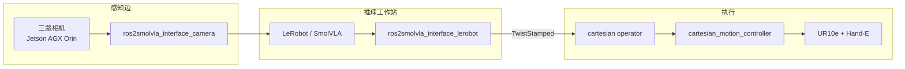
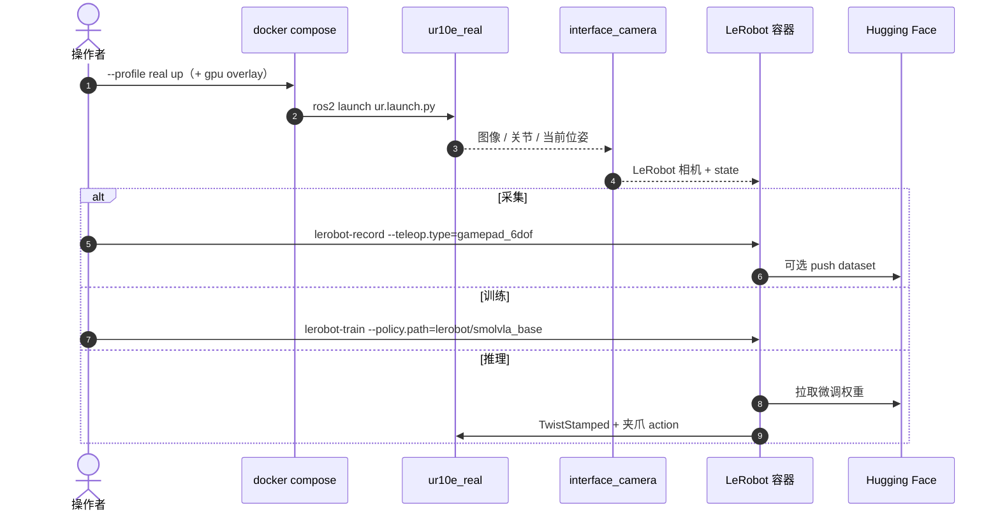

# ROS2SmolVLA：工业轻量臂上的本地小型 VLA

**ROS2SmolVLA**（*Enabling Small Vision-Language-Action Models for Integration into Industrial-Grade Lightweight Robots*，[arXiv:2608.23320](https://arxiv.org/abs/2608.23320)，[项目页](https://una-auxme.github.io/en/projects/ros2smolvla/)，[Docker 入口](https://github.com/una-auxme/ros2smolvla_docker)）由 **奥格斯堡大学机电一体化教席（University of Augsburg, Chair of Mechatronics）** 提出：把 Hugging Face **SmolVLA（450M）** 接到 **ROS 2 + Universal Robots UR10e**，在消费级工作站上做 **本地推理**，用工业轻量臂而不是 SO-101 桌面臂验证拾放。

## 一句话定义

**用 ROS 2 把小型 VLA 的视觉–语言–笛卡尔速度接口焊到工业协作臂上，让合规敏感的现场可以离线跑小任务，而不是把整厂语义交给云端大模型。**

## 英文缩写速查

| 缩写 | 英文全称 | 简要说明 |
|------|----------|----------|
| VLA | Vision-Language-Action | 视觉–语言–动作策略 |
| SmolVLA | Small Vision-Language-Action | Hugging Face 450M 轻量 VLA，本页微调底座 |
| ROS 2 | Robot Operating System 2 | 节点图 + DDS 中间件；本页部署胶水 |
| UR | Universal Robots | 工业协作臂家族；验证硬件为 UR10e |
| ID / OOD | In- / Out-of-Distribution | 训练网格内外的物块/盒位与外观 |

## 为什么重要

- **补上「小 VLA × 工业臂」缺口：** 通才 VLA 难上边缘；实验室小臂评测掩盖了更大工作空间、安全与总线约束。本页给出 **可复现的 ROS 2 接口**，不是又一篇 LIBERO 刷分。
- **本地合规是一等约束：** 推理在 RTX 4080 工作站，相机汇聚在 Jetson AGX Orin；适合不能出厂的产线。
- **数字诚实：** 作者自己写 **成功率不够产线**；价值在 lessons learned（裁剪、失败恢复、颜色偏置），不在宣称通才。
- **与仿真 SmolVLA 对照：** [LW BENCHHUB TOUR](./lw-benchhub-tour.md) 是 Isaac Lab 双臂厨房闭环；这里是 **UR10e 真机 + Gazebo 孪生未用于正式训练**。

## 核心信息

| 项 | 内容 |
|----|------|
| **机构** | 奥格斯堡大学机电一体化教席（University of Augsburg, Chair of Mechatronics） |
| **基座** | Hugging Face **SmolVLA** / `lerobot/smolvla_base`（SmolVLM-2 + Flow Matching Action Expert） |
| **硬件** | UR10e + Robotiq Hand-E；2× Azure Kinect + 腕部 webcam；10 Gbit 交换机 |
| **动作** | 笛卡尔 delta / `TwistStamped`；夹爪过中点才发 goal |
| **数据** | **349** 手柄遥操作 episode（含多色、恢复轨迹）；HF 同名 dataset |
| **开源** | **已开源** — Docker + 四姊妹仓 Apache-2.0；HF 权重与数据 |

## 流程总览

## 源码运行时序图

关键复现路径：以 [`ros2smolvla_docker`](https://github.com/una-auxme/ros2smolvla_docker) 为入口，`docker compose` 拉起真机或仿真 profile，再用 `lerobot-record` / `lerobot-train`；权重默认 [`una-auxme/ROS2SmolVLA_ur10e_no_joints_crop_pick_place`](https://huggingface.co/una-auxme/ROS2SmolVLA_ur10e_no_joints_crop_pick_place)。

## 核心原理

- **小 VLA 的边界：** SmolVLA 每帧最多 **64** visual tokens、交错 self/cross-attention、Action Expert 可 layer-skip。上下文撑不起整厂语义，只适合 **有界工位**。
- **笛卡尔而不是关节：** 观测可含末端位姿；动作为六维速度 + gripper。论文认为这比关节空间更容易换臂。HF 权重卡明确写 **不含关节观测**、顶视裁 **720×720**。
- **采集配方：** 5×5 物块网格 × 5 次 × 变化盒位；穿插多色与失败恢复。起始构型每次手动回位，带来轻微 RC 变化。
- **训练开关：** `train_expert_only=False`、`compile_model=True`；2e5 step 显著好于 5e4（L40S 约 25 h）。

## 实验与评测

提示统一为 “Pick up the [CC] cube and put it in the [BC] box.”。place 从全集计，抓失败则放置失败；自动恢复算成功。

| 划分 | Pick | Place | Place \| 成功抓 |
|------|------|-------|-----------------|
| ID（T1/T3/T4） | 78.33% | 72.50% | **92.47%** |
| OOD（T2/T5/T8/T9） | 76.56% | 46.88% | 61.22% |
| 全部九场景 | **77.72%** | 63.59% | 81.69% |

读法：

- **空间：** ID 盒位 1/7 高，盒位 6 的 place 掉到 40%——覆盖不足，不是「完全不会空间推理」。
- **起始构型：** RC5 因腕相机一开始看不到物块而掉到 50%。
- **颜色指令：** 无颜色提示时 75% 选绿；提示 gray 时正确色仅 20–30%。蓝纹理被当成 drop 触发（作者用蓝物挡腕相机复核）。
- **OOD 盒：** 黑盒 Found 17%；圆形蓝盒 place 100%；纸箱 17%。

## 结论

**ROS2SmolVLA 证明 450M SmolVLA 能在 UR10e 上本地闭环，但当前数字只支持「有界工位可行性」，不支持产线替换传统示教。**

1. **真影响指标：** 成功抓取后的 ID place **92.47%** 说明笛卡尔接口 + 裁剪顶视能把小 VLA 接到大工作空间；OOD place **46.88%** 才是部署上限。
2. **视觉 token 预算：** 必须把任务相关像素塞进 64 token——顶视裁剪是比再堆 episode 更便宜的杠杆。
3. **偏置可被设计：** 蓝 drop / 绿优先既是缺陷，也可作「禁止交互的颜色编码」；负例提示要单独做。
4. **失败恢复：** 恢复 episode 提高鲁棒，但在稀疏数据里会教模型先松爪；应后置微调，不要一上来混进小集。
5. **开源可读：** Docker 五件套 + HF 权重让「工业臂 + LeRobot」可复现；仿真孪生已发布但 **未用仿真数据训正式模型**。
6. **选型：** 要本地小任务、已有 UR + ROS 2 时优先评估；要通才或强指令遵循，看 [Evo-1](./paper-evo1-lightweight-vla.md) / 更大 VLA，而不是本栈。

## 与其他工作对比

| 对比轴 | ROS2SmolVLA | LW BENCHHUB TOUR | Evo-1 | 云端大 VLA |
|--------|-------------|------------------|-------|------------|
| 硬件 | UR10e 真机 | 仿真 DoublePiper | SO100/xArm 等 | 实验室/云 |
| 模型 | SmolVLA 450M 微调 | SmolVLA 评测 | 0.77B 自研 | 3B+ |
| 中间件 | ROS 2 Jazzy + Docker | Isaac Lab EnvHub | LeRobot 官方 | 专有 |
| 开源 | 代码+数据+权重 | 仿真仓 | LeRobot 集成 | 通常权重封闭 |
| 主张 | 本地工业接口 | 仿真飞轮 | 轻量刷分 | 开放词汇 |

## 工程实践

| 项 | 说明 |
|----|------|
| 入口 | `una-auxme/ros2smolvla_docker`；`docker compose --profile real` + GPU overlay |
| OS | Ubuntu 24.04、ROS 2 Jazzy、建议低延迟内核；CUDA 12.6.3 |
| 真机网段 | 机器人 `192.168.56.102`，主机 `192.168.56.101`；须跑 pendant `external_control` |
| 训练 | `lerobot-train --policy.path=lerobot/smolvla_base`；论文 2e5 step；README 示例 2e4 / batch 64 |
| 权重 | HF `una-auxme/ROS2SmolVLA_ur10e_no_joints_crop_pick_place` |
| 源码运行时序图 | 见上文；对齐 Docker README 的 record / train / 推理三条路径 |

## 局限与风险

- **不是产线 SR：** 作者写明整体成功率过低，主因数据覆盖与视觉偏置。
- **仿真未闭环验证：** Gazebo 孪生可换权重，但正式模型只用真机 349 条。
- **深度未用：** 设计阶段考虑过深度，LeRobot 当时格式不支持。
- **指令遵循弱：** 颜色条件常被外观先验压过。

## 关联页面

- [VLA](../methods/vla.md) — 轻量本地部署相对通才云端的方法族
- [LeRobot](./lerobot.md) — 采集 / 训练 / Hub 后端
- [ROS 2 基础](../concepts/ros2-basics.md) — 本页把 VLA 接到 ros2_control / 笛卡尔控制器
- [Manipulation](../tasks/manipulation.md) — 工业拾放任务面
- [LW BENCHHUB TOUR](./lw-benchhub-tour.md) — 同底座 SmolVLA，仿真双臂对照
- [Evo-1](./paper-evo1-lightweight-vla.md) — 另一条亚十亿轻量 VLA（刷分 vs 工业接口）
- [VLA 开源复现景观](../overview/vla-open-source-repro-landscape-2025.md) — 2026 补充入口

## 参考来源

- [ROS2SmolVLA 论文摘录](../../sources/papers/ros2smolvla_arxiv_2608_23320.md)
- [项目页归档](../../sources/sites/ros2smolvla-una-auxme.md)
- [ros2smolvla_docker 仓库归档](../../sources/repos/ros2smolvla_docker.md)

## 推荐继续阅读

- [arXiv:2608.23320](https://arxiv.org/abs/2608.23320) — 完整验证表与 lessons learned
- [项目页](https://una-auxme.github.io/en/projects/ros2smolvla/) — 组件清单与视频
- [SmolVLA 论文](https://arxiv.org/abs/2506.01844) — 450M 底座
- [Hugging Face 权重](https://huggingface.co/una-auxme/ROS2SmolVLA_ur10e_no_joints_crop_pick_place)
