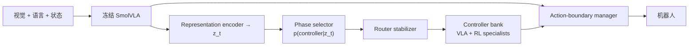

# RouteRLT（arXiv:2609.26467）

**RouteRLT**（*Learning When and Which RL Specialist Should Control a Vision-Language-Action Policy*，[arXiv:2609.26467](https://arxiv.org/abs/2609.26467)，多伦多大学，IROS 2026 IARL）在 **冻结泛化 VLA**（SmolVLA）之上，学习 **何时、哪一枚 phase-specific RL specialist** 接管控制：phase selector 读 VLA 内部 compact latent；stabilizer 抑切换抖动；action-boundary manager 在 chunk 中途换控时 **立即作废未执行后缀**。

## 一句话定义

把「精接触阶段用 RL 专精、其余阶段保留 VLA 泛化」做成 **每步可学习的 controller ownership**，部署时不依赖 privileged phase 边界。

## 英文缩写速查

| 缩写 | 英文全称 | 简要说明 |
|------|----------|----------|
| VLA | Vision-Language-Action | 视觉-语言-动作策略 |
| RL | Reinforcement Learning | 本文 phase-local online 微调专家 |
| LIBERO | Lifelong Benchmark for Robot Manipulation | 仿真多物体 pick-and-place |
| BC | Behavior Cloning | SmolVLA 预训练范式 |
| IARL | Industrial Applications of Robot Learning | IROS 2026 workshop |

## 为什么重要

- **工业痛点：** connector insertion / cable management 等 **少数精度阶段** 决定成败，全轨迹 RL 会覆盖 VLA 泛化。
- **部署 gap：** 既有 RLT 等 work 的 handoff 依赖 **采集期 operator 或 privileged router**；RouteRLT **每 control query** 从 VLA 自身表征预测 ownership。
- **Chunk 语义：** 换控不是等下一 replan — action-boundary manager 保证 **mid-chunk 立即切换**。

## 核心信息

| 字段 | 内容 |
|------|------|
| 机构 | 多伦多大学（University of Toronto） |
| 泛化基座 | **SmolVLA**（compact VLA 族） |
| 专家库 | $\mathcal{C}=\{\pi_{\mathrm{VLA}}\}\cup\Pi_{\mathrm{RL}}$ phase-specific policies |
| 开源 | **未列链接**（2026-09-24） |

## 流程总览

## 核心原理

- **Frozen generalist：** VLA 产出 reference chunk $\tilde{\mathbf{a}}_t$ 与内部特征；**不** end-to-end 微调泛化骨干。
- **Specialist：** 每枚 RL policy 针对 **单一 precision-critical phase** 在线训练（相对 RLT 单阶段扩展 **多阶段多专家**）。
- **Stabilizer：** 避免 posterior 抖动导致频繁换控。
- **Privileged 对照：** 仿真可达与 **oracle phase boundary** 路由同水平，验证 learned router 未丢太多。

## 源码运行时序图

**不适用** — 无公开仓库；复现需 SmolVLA + LIBERO 多物体套件 + Trossen 真机 insertion 协议。

## 工程实践

| 项 | 读法 |
|----|------|
| 基座选择 | 论文固定 SmolVLA — 换大 VLA 需重训 selector/specialists |
| 真机协议 | insertion 在 operator alignment 后开始 — 路由负责 pickup **与** insertion 两阶段 |
| 指标 | 全轨迹 insertion **6.7→35.0%** 是真机主卖点；LIBERO **85→92.22%** 验证路由学习 |
| 与 RLT 关系 | 同属 phase-local RL；RouteRLT 贡献在 **learned multi-specialist routing** |

## 实验与评测

- **LIBERO** 多物体 pick-and-place：全任务 SR **92.22%**（base **85.00%**）。
- **真机** cable pickup + port insertion：全轨迹成功 **35.0%**（base **6.7%**）。
- 视频：Trossen insertion 同步 front/wrist + timeline 显示自动 specialist 序列。

## 与其他工作对比

> 下表只做**定位对照**，不做跨设定横比：各行与本页不共享同一评测协议，数字不可直接相减。

| 对照 | 差异读法 |
|------|----------|
| RLT（phase-local RL） | 同为「VLA 负责泛化、RL 专精精接触阶段」；RLT 的 handoff 依赖采集期 operator 或 privileged router、单阶段；RouteRLT 从 VLA latent **学习每步 ownership**，扩展到**多阶段多专家** |
| [STEAM](./paper-steam-advantage-modeling.md) | STEAM 走 advantage 标注 + CFGRL **改写 VLA 权重**（π₀ 提纯）；RouteRLT **冻结 VLA**，只在执行层切换控制器 |
| [VLA](../methods/vla.md) 中的 RECAP / advantage 微调 | 同上：RECAP 系把部署轨迹变成 advantage-conditioned 微调，改的是泛化骨干；RouteRLT 的专精能力放在外挂 RL specialist 里，骨干泛化不被覆盖 |
| [Action Chunking](../methods/action-chunking.md) | chunk 策略天然要等下一次 replan 才能换控；RouteRLT 的 action-boundary manager 允许 **mid-chunk 立即切换** |

## 结论

**RouteRLT 把 VLA+RL 分工从「人工/ privileged 划 phase」推进到「读 VLA latent 自动路由多枚 RL 专家」，适合 contact-rich 工业长程任务。**

1. **Ownership 每步决策** — 不是固定 critical window。
2. **Mid-chunk 换控** — action-boundary manager 是工程必需，否则 chunk 策略延迟 handoff。
3. **SmolVLA 算力友好** — specialist 训练预算可控。
4. **开源未明** — 选型先当方法论文，勿假设可复现。
5. 与 [VLA](../methods/vla.md) 中 RECAP/advantage 微调对照：RouteRLT **不改 VLA 权重**，只 **换执行控制器**。

## 关联页面

- [VLA](../methods/vla.md)
- [Manipulation](../tasks/manipulation.md)
- [Behavior Cloning](../methods/behavior-cloning.md)
- [STEAM](../entities/paper-steam-advantage-modeling.md) — 另一条 VLA 后训练 advantage 路线

## 推荐继续阅读

- [arXiv:2609.26467](https://arxiv.org/abs/2609.26467)

## 参考来源

- [RouteRLT 论文归档](../../sources/papers/routelt_arxiv_2609_26467.md)
