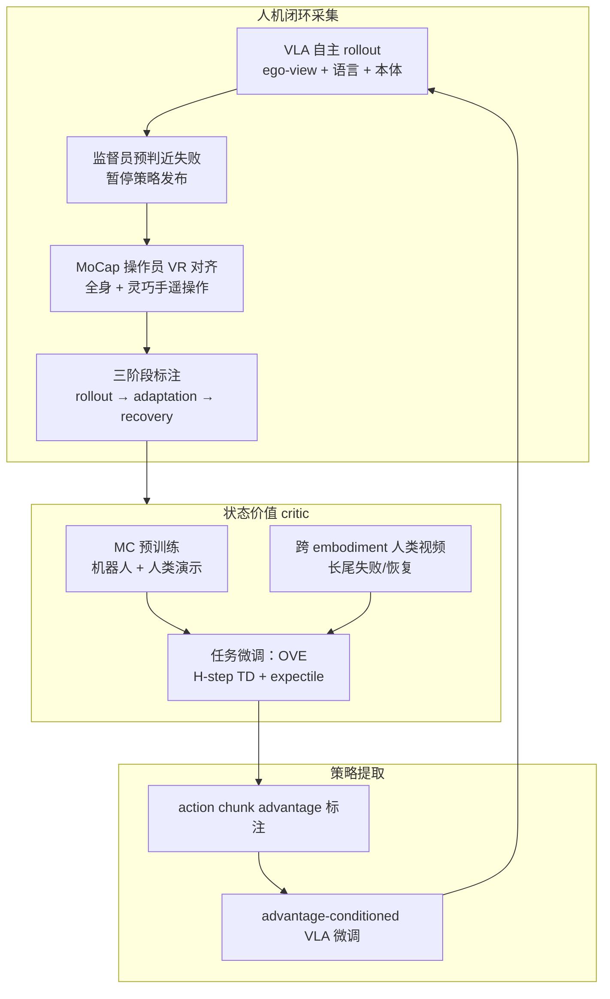

---

type: entity
tags: [paper, humanoid, vla, reinforcement-learning, post-training, human-in-the-loop, teleoperation, dexterous-manipulation, advantage-conditioning, offline-rl, experience-learning, xpeng-robotics, contact-rich-manipulation, xpeng]
status: complete
updated: 2026-06-18
arxiv: "2606.17011"
venue: "arXiv 2026"
related:
  - ../methods/vla.md
  - ../methods/reinforcement-learning.md
  - ../methods/imitation-learning.md
  - ../tasks/teleoperation.md
  - ../tasks/manipulation.md
  - ../comparisons/online-vs-offline-rl.md
  - ../comparisons/rl-vs-il.md
  - ../methods/lwd.md
  - ./paper-bifrost-umi.md
  - ./paper-legs-embodied-gaussian-splatting-vla.md
sources:
  - ../../sources/papers/rove_arxiv_2606_17011.md
  - ../../sources/sites/xpeng-robotics-rove.md
summary: "ROVE（arXiv:2606.17011，XPENG Robotics 等）为人形 VLA 部署后训练提出人机闭环 RL：全身 MoCap 干预采集将轨迹分为 rollout/adaptation/recovery，以 OVE 状态价值 critic 与跨 embodiment 人类视频从混合质量经验中提取 advantage-conditioned 策略，真机接触丰富与精细操作任务上优于 SFT 与 HG-DAgger/Filtered BC/RECAP，并随三轮 rollout–intervention 迭代持续提升。"
---

# ROVE（Unlocking Human Interventions for Humanoid Manipulation via RL）

**ROVE** 是 XPENG Robotics 与复旦、港中文、上交等团队提出的 **人形 VLA 后训练 RL 框架**（arXiv:2606.17011，[项目页](https://xpeng-robotics.github.io/rove/)）：在 **IRON-R01-1.11** 全身灵巧手人形上，让预训练 VLA 自主 rollout，近失败时由 **MoCap 全身遥操作** 接管；针对人形干预轨迹 **非专家、含适应噪声** 的特点，用 **阶段感知价值标注 + Optimistic Value Estimation（OVE）+ advantage conditioning**，从演示、自主 rollout、干预与人类视频中提取更强策略，而非把干预动作一律当专家示范。

## 英文缩写速查

| 缩写 | 英文全称 | 简要说明 |
|------|----------|----------|
| VLA | Vision-Language-Action | 视觉–语言–动作统一的条件策略模型 |
| RL | Reinforcement Learning | 从交互经验优化长期回报的策略学习范式 |
| OVE | Optimistic Value Estimation | 本文：H 步 TD + expectile 回归估计 in-distribution 乐观状态价值 |
| BC | Behavior Cloning | 均匀模仿采集动作；ROVE 对比的 SFT / Filtered BC 基线 |
| HITL | Human-in-the-Loop | 部署中人类在失败倾向处介入纠正或接管的闭环学习 |
| MoCap | Motion Capture | 本文操作员全身与手部动作捕捉驱动的 VR 遥操作 |
| MDP | Markov Decision Process | 状态–动作–奖励–转移的标准序贯决策建模框架 |
| IL | Imitation Learning | 从演示学习策略；与 value-guided 提取形成对照 |

## 为什么重要

- **把「人形干预 ≠ 专家示范」说清楚：** 机械臂 + 夹爪上顺滑的 3D 鼠标/主从臂纠正，在人形 **全身 + 灵巧手** 上常变成 **犹豫、回撤、重定向误差**；直接 HG-DAgger / 干预 BC 会把 **adaptation 噪声** 学进策略（论文报告 HG-DAgger 甚至低于演示策略）。
- **系统 + 算法一体：** 不仅提出 OVE，还给出可运行的 **VLA 暂停 → VR 对齐 → 全身遥操作接管 → 后处理去暂停** 管线，是人形 **部署经验飞轮** 的可复用样板。
- **状态价值而非 Q：** 数据含机器人轨迹、人类干预与 **动作空间不可比** 的 egocentric 人类视频；学 $V(s)$ 吸收跨 embodiment **进度/恢复** 监督，避免 Q 在 OOD 动作上过估计。
- **真机闭环迭代证据：** 擦白板、面包入吐司机两轮主任务上 **三轮 rollout–intervention** 持续提升（45%→80%、56.7%→86.7%），部署可见 **重试插入、补擦遗漏** 等演示策略少见的恢复行为。

## 流程总览

## 核心机制（归纳）

### 1. 干预三阶段与保守失败边界

| 阶段 | 内容 | 价值标注要点 |
|------|------|----------------|
| **Rollout** | VLA 自主执行至近失败 | 失败终态 $C_{\mathrm{fail}}$ |
| **Adaptation** | 操作员对齐构型、犹豫、试探 | **阶段结束** $t_r$ 赋 $C_{\mathrm{fail}}$（不把对齐当 recovery） |
| **Recovery** | 显著推进任务直至完成 | 成功终态奖励 0；步惩罚 $-1$ 编码时间成本 |

与机械臂 HIL 假设「接管即纠正」不同，ROVE 显式建模 **teleoperation gap**，把 **adaptation 与 recovery 分开标注**。

### 2. Optimistic Value Estimation（OVE）

- **预训练：** 异构任务/embodiment 上用 **Monte-Carlo return 回归** 学通用进度概念。
- **微调数据：** 自主 rollout、干预轨迹、**人类经验视频**（仅监督 value，不要求动作对齐）。
- **OVE 目标：** $\hat{V}_t = \sum_{i=t}^{t+H-1}\gamma^{i-t} r_i + \gamma^H V_{\bar\phi}(s_{t+H})$，用 **expectile loss**（$\tau$ 控制乐观度）回归，偏向数据中观察到的 **更好恢复** 而非平均回报。
- **为何 $V$ 而非 $Q$：** 人类视频与机器人动作空间不可直接比较；对比 IQL 式 $Q$ 估计，状态价值更适合 **跨 embodiment 异构经验**。

### 3. Advantage-conditioned VLA 提取

- Critic 为每个 **action chunk** 计算 advantage；按阈值二值化为高/低价值条件。
- Actor 在 **advantage conditioning** 下微调，强调 **高价值 chunk**，避免 Filtered BC 式「只丢坏样本」仍均匀模仿剩余动作。
- **实现细节：** 50-D 本体状态/动作；训练时对高维本体做 **dropout/扰动**，减轻对脆弱关节级线索过拟合，更依赖视觉任务进度。

## 实验与基线（摘要）

- **硬件：** IRON-R01-1.11 人形 + 灵巧手。
- **主任务：** 擦白板（接触丰富）、面包入吐司机（精细对齐）。
- **附加：** 螺丝安装（毫米级装配，项目页 One More Thing）。
- **基线：** 演示 SFT、HG-DAgger、Filtered BC、RECAP（VLA 经验学习代表）。
- **主要结论：**
  - 仅演示数据上 ROVE 已优于 SFT——说明 **人形遥操作示范本身次优**，value-guided 提取优于均匀模仿。
  - 经验学习平均成功率 **ROVE 最佳**；HG-DAgger 策略犹豫、一任务低于演示策略。
  - 相对 RECAP 的差距体现 **阶段感知 advantage 标注 + critic 质量**；相对 Filtered BC 体现 **RL 式负样本利用**。
  - **三轮迭代** 形成闭环：更好策略 → 更丰富经验 → 更清晰 advantage。

## 常见误区或局限

- **「干预数据越多越好」：** 若不做阶段分解与价值筛选，更多干预反而教会 **犹豫与错误纠正**（HG-DAgger 反例）。
- **人类视频直接训 policy：** 论文明确当前人类经验 **仅训 critic**；representation 级蒸馏留作未来工作。
- **感知栈：** 缺腕部相机与触觉，精细操作上限仍受传感约束。
- **范围：** 尚未覆盖 **loco-manipulation**；框架偏 **离线/迭代离线 RL**，非部署时在线探索。
- **平台绑定：** 实验集中在 XPENG IRON-R01；换机体需重估 teleoperation gap 与价值标注边界。

## 与其他工作对比

| 路线 | 干预假设 | 价值学习 | 人形全身 + 灵巧手 |
|------|----------|----------|-------------------|
| **HG-DAgger / 干预 BC** | 干预 ≈ 专家 | 无 / 隐式 | 易吸收 adaptation 噪声 |
| **RECAP / π\*0.6 类** | 部署经验 + advantage | 多为 robot-only | 臂部为主文献多 |
| **LWD 车队 RL** | 成功/失败/干预统一 replay | 分布加权 offline-to-online | 通用人形策略车队场景 |
| **ROVE** | **混合质量 + 三阶段** | **OVE + 人类视频 $V(s)$** | **真机双任务 + 三轮迭代** |

与 [BifrostUMI](./paper-bifrost-umi.md) / [LEGS](./paper-legs-embodied-gaussian-splatting-vla.md) 的对照：后两者聚焦 **如何采高质量示范或合成数据**；ROVE 聚焦 **已有 VLA 部署后，如何从必然次优的干预经验中 RL 式提纯**，与 [Teleoperation](../tasks/teleoperation.md) 数据飞轮的 **后段** 衔接。

## 关联页面

- [VLA（Vision-Language-Action）](../methods/vla.md)
- [Teleoperation](../tasks/teleoperation.md)
- [Manipulation](../tasks/manipulation.md)
- [Online vs Offline RL](../comparisons/online-vs-offline-rl.md)
- [RL vs IL](../comparisons/rl-vs-il.md)
- [LWD](../methods/lwd.md) — 车队级部署经验 RL 的另一代表
- [BifrostUMI](./paper-bifrost-umi.md) — 人形操作数据采集对照

## 推荐继续阅读

- 项目页：<https://xpeng-robotics.github.io/rove/>
- arXiv：<https://arxiv.org/abs/2606.17011>
- Kelly et al., *HG-DAgger: Interactive Imitation Learning with Human Experts* (ICRA 2019) — ROVE 对比的干预模仿基线
- Physical Intelligence, *π\*0.6: a VLA that learns from experience* (2025) — VLA 部署经验学习谱系

## 参考来源

- [ROVE 论文摘录](../../sources/papers/rove_arxiv_2606_17011.md)
- [ROVE 项目页归档](../../sources/sites/xpeng-robotics-rove.md)
- Xiao et al., *ROVE: Unlocking Human Interventions for Humanoid Manipulation via Reinforcement Learning*, arXiv:2606.17011, 2026. <https://arxiv.org/abs/2606.17011>
