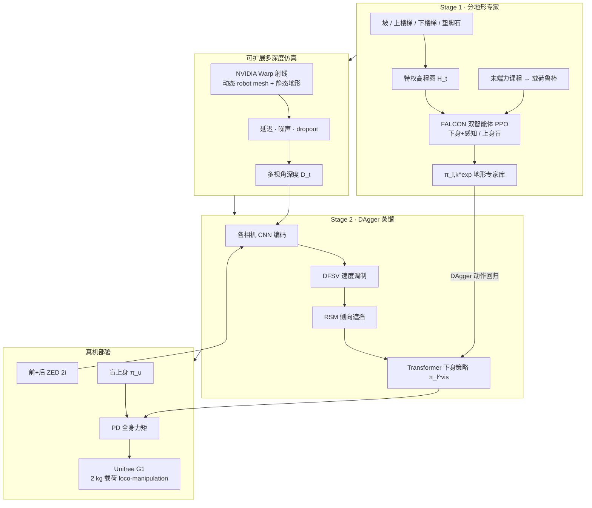

---

type: entity
tags:
  - paper
  - humanoid
  - locomotion
  - perceptive-locomotion
  - depth
  - teacher-student
  - dagger
  - ppo
  - loco-manipulation
  - unitree-g1
  - isaac-gym
  - amazon-far
status: complete
updated: 2026-07-24
arxiv: "2602.03002"
related:
  - ../tasks/stair-obstacle-perceptive-locomotion.md
  - ../tasks/humanoid-locomotion.md
  - ../tasks/loco-manipulation.md
  - ../concepts/terrain-adaptation.md
  - ../concepts/privileged-training.md
  - ../methods/dagger.md
  - ./unitree-g1.md
  - ./isaac-gym-isaac-lab.md
  - ./paper-hrl-stack-22-perceptive_humanoid_parkour.md
  - ./paper-pilot-perceptive-loco-manipulation.md
  - ./paper-faststair-humanoid-stair-ascent.md
  - ./paper-ladderman-humanoid-perceptive-ladder-climbing.md
  - ./extreme-parkour.md
  - ./paper-egohtr.md
sources:
  - ../../sources/papers/rpl_arxiv_2602_03002.md
  - ../../sources/sites/rpl-humanoid-github-io.md
  - ../../sources/papers/egohtr_arxiv_2607_13472.md
summary: "RPL（arXiv:2602.03002，Amazon FAR）两阶段训练：特权高程图分地形专家（FALCON 双智能体 PPO）经 DAgger 蒸馏为多视角深度 Transformer 统一策略；DFSV 与 RSM 鲁棒双向行走与未见窄地形；Warp 多深度渲染约 5× 加速；G1 真机带 2 kg 载荷穿越坡/楼梯/垫脚石。"
---

# RPL：复杂地形上的鲁棒人形多向感知行走

**RPL**（*Learning Robust Humanoid Perceptive Locomotion on Challenging Terrains*，Amazon FAR 等，arXiv:[2602.03002](https://arxiv.org/abs/2602.03002)，[项目页](https://rpl-humanoid.github.io/)）提出 **两阶段学习框架**：先用 **特权高程图** 训练 **分地形专家**（坡、上下楼梯、垫脚石），再以 **DAgger** 蒸馏为仅依赖 **多视角深度** 的 **Transformer 下身策略**；配合 **速度指令深度特征缩放（DFSV）** 与 **随机侧向遮挡（RSM）**，在 **非对称多相机观测** 与 **训练外地形宽度** 下仍保持 **双向/多向** 鲁棒行走，并在 **2 kg 载荷** 的 loco-manipulation 扰动下完成真机长程验证。

## 一句话定义

**先让分地形「神谕」专家在特权地图上学会带载荷的上下身解耦行走，再把它们焊成一台只看前后深度、却能前后倒着走楼梯和踩垫脚石的单策略。**

## 英文缩写速查

| 缩写 | 英文全称 | 简要说明 |
|------|----------|----------|
| RPL | Robust humanoid Perceptive Locomotion | 本文两阶段多向深度感知行走框架 |
| DFSV | Depth Feature Scaling based on Velocity commands | 按速度指令缩放各相机深度 CNN 特征 |
| RSM | Random Side Masking | 随机遮挡深度图两侧以泛化窄地形 |
| DAgger | Dataset Aggregation | 迭代用专家在策略诱导状态下纠偏的蒸馏 |
| PPO | Proximal Policy Optimization | Stage 1 专家策略优化算法 |
| WBC | Whole-Body Control | 上身/下身双智能体解耦的全身控制范式 |
| Sim2Real | Simulation to Real | 深度噪声/延迟/ dropout 随机化支撑迁移 |
| DoF | Degrees of Freedom | 自由度；G1 全身关节维动作 |
| G1 | Unitree G1 Humanoid | 宇树教育科研人形实验平台 |

## 为什么重要

- **填补「单前向深度」空白：** 多数人形感知行走只演示 **前进**；RPL 用 **前+后双深度**（仿真可扩至四向）实现 **双向与全向** 命令跟踪，且处理 **前后相机看到不同地形结构** 的非对称情形。
- **载荷下的感知行走：** 在 **FALCON 式双智能体** 上加入 **末端力课程**（竖直方向为主），使策略在 **蹲下取物、搬运 2 kg** 时仍稳定落脚——比纯 locomotion 论文更贴近 **loco-manipulation** 真机工况。
- **蒸馏技巧可复用：** **DFSV** 用速度方向 **无学习参数** 地选相机；**RSM** 用地形相关 mask 概率模拟 **未见窄道**——二者在 OOD 几何与非对称感知下互补（项目页消融可见）。
- **工程瓶颈：多深度仿真：** 自研 **Warp 射线–动静态 mesh** 管线，在 1024 并行环境、四相机深度下相对 IsaacSim Warp **约 5× 更快**，且支持 **机器人自遮挡**——降低多视角深度 RL 的训练成本。

## 方法

| 模块 | 作用 |
|------|------|
| **Stage 1 专家** | 四类地形各训一套下身专家；输入 **1.6 m×1.0 m 高程图** + 本体历史 + 运动/操作目标；**PPO** + 非对称 critic + 对称增广 |
| **双智能体** | 沿用 **FALCON**：下身条件感知，上身 **盲策略** 跟踪上肢关节目标；动作拼接送 PD |
| **Stage 2 学生** | **DAgger** 回归专家下身动作；**多视角深度 → CNN → DFSV 融合 → Transformer** |
| **DFSV** | 相机朝向与平面速度内积决定特征缩放，强调「朝前走看前相机」 |
| **RSM** | 随机遮挡深度两侧；楼梯/坡面偏大 mask，垫脚石偏小 mask |
| **深度仿真** | Warp 射线查询动态 body mesh + 静态地形；CUDA Graph；建模延迟/噪声/dropout |
| **部署** | G1 **前后 ZED 2i**，48×27 下采样深度；与盲上身策略组合 |

### 流程总览

## 实验要点（归纳）

| 设置 | 要点 |
|------|------|
| 平台 | Unitree G1；IsaacGym 训练 |
| 仿真深度 | 10 Hz，101°×69° FOV，240×135 → 48×27；最多 **4 相机**，真机 **2 相机（前+后）** |
| 地形（训练） | 坡至 37°；楼梯踢面 0.25–0.30 m；垫脚石直径 0.25–0.40 m、缝 0.05–0.70 m |
| 地形（真机） | 20° 坡；台阶 22/25/30 cm；25 cm 垫脚石、60 cm 缝；建筑 **弧形楼梯** |
| 深度渲染 | 1024 env × L40S：RPL **1.3–1.9 s/iter** vs IsaacSim Warp **3.5–9.1 s**（Table I） |
| 多相机 | 垫脚石上 **2 相机** 达专家级双向性能；单下视相机明显掉点（Table II） |
| 消融 | **RSM** 关键于未见窄宽度；**DFSV** 关键于非对称多视角（如前相机楼梯、后相机垫脚石） |
| 代码 | 入库时 **无官方公开仓库** |

## 开源状态（项目页核查，2026-07-20）

| 资源 | 状态 |
|------|------|
| 相关索引仓 | [OpenDriveLab/WholebodyVLA](https://github.com/OpenDriveLab/WholebodyVLA)（资源列表，**非** RPL 可运行训练代码） |
| RPL 官方训练/部署仓 | **未发现**独立可运行发布 |
| 源码运行时序图 | **不适用**（无官方可复现入口） |

## 结论

**多向感知行走的关键不是「再训一个楼梯策略」，而是分地形特权专家 → 多视角深度蒸馏，并用 DFSV/RSM 显式扛非对称观测与未见窄地形。**

1. **两阶段契约** — Stage 1 用 1.6 m×1.0 m 高程图分训坡/上下楼梯/垫脚石专家（FALCON 双智能体 + 末端力课程）；Stage 2 DAgger 焊成只看深度的统一下身策略。
2. **真机相机数 ≠ 仿真最大视野** — 仿真可到 4 相机论证覆盖；G1 躯干仅前后位，部署 **\(N_{\mathrm{cam}}=2\)**（前后 ZED 2i）。
3. **垫脚石上 2 相机可达专家级双向** — 单下视明显掉点；前后深度是双向/非对称地形的最低配置。
4. **RSM / DFSV 看 OOD 而非蒸馏 MSE** — RSM 关键未见窄宽度；DFSV 关键非对称多视角（如前楼梯、后垫脚石）；损失相近不能保证泛化。
5. **载荷是一等公民** — 末端力课程支撑蹲取/搬运 **2 kg** loco-manipulation，而非纯 locomotion 演示。
6. **多深度仿真是成本瓶颈** — Warp 射线管线在 1024 env×L40S 约 **1.3–1.9 s/iter**，相对 IsaacSim Warp **约 5×**；自遮挡与噪声/延迟/dropout 一并建模。

## 常见误区或局限

- **误区：「RPL = 又一个楼梯论文」。** 核心是 **多向深度蒸馏管线 + 仿真加速 + 载荷 loco-manipulation**；楼梯只是四类专家地形之一，与 [FastStair](./paper-faststair-humanoid-stair-ascent.md) 的 **高速上楼 + DCM 监督** 目标不同。
- **误区：「四相机仿真 = 真机四相机」。** 论文因 G1 躯干 **仅前后安装位**，真机部署 **$N_{\text{cam}}=2$**；四向结果主要用于论证 **视野覆盖** 必要性。
- **误区：「蒸馏损失低就等于 OOD 好」。** 项目页强调 **RSM/DFSV 训练损失相近但 OOD 差异大**——多向感知需要 **显式鲁棒化**，不能只看 MSE。
- **局限：** 暂无开源代码；上身 **无感知**，极端上肢遮挡可能仍影响深度；与 [PILOT](./paper-pilot-perceptive-loco-manipulation.md) 的 **LiDAR 全身 LLC** 接口不同，上层需自行对接速度/姿态/上肢命令。

## 与其他工作对比

| 维度 | RPL | PHP | PILOT | FastStair | Extreme Parkour |
|------|-----|-----|-------|-----------|-----------------|
| 机构 | Amazon FAR | Amazon FAR | 上海交大 | LimX / 多机构 | Berkeley 等 |
| 感知 | **多视角深度** | 单深度 | LiDAR 高程 | 机载高程 | 单目前向深度 |
| 多向 | **双向/全向（深度）** | 2D 速度选技能 | 前进为主 | 前进上楼 | 前进跑酷 |
| 训练 | **分地形专家 + DAgger** | MM 长程参考 + DAgger+PPO | 单阶段 MoE PPO | DCM + 分速专家 | scandots + DAgger |
| 载荷 | **2 kg loco-manipulation** | 未强调 | 全身操作跟踪 | — | — |
| 平台 | **G1** | G1 | G1 | LimX Oli | Unitree Go1 |

## 关联页面

- [楼梯与障碍 Locomotion 中心节点](../tasks/stair-obstacle-perceptive-locomotion.md) — 感知楼梯/垫脚石索引
- [Humanoid Locomotion](../tasks/humanoid-locomotion.md) — 人形行走任务总览
- [Loco-Manipulation](../tasks/loco-manipulation.md) — 载荷与上下身解耦上下文
- [Terrain Adaptation](../concepts/terrain-adaptation.md) — 深度/高程感知闭环
- [Privileged Training](../concepts/privileged-training.md) — 高程图专家 → 深度学生
- [DAgger](../methods/dagger.md) — Stage 2 蒸馏算法
- [PHP（Perceptive Humanoid Parkour）](./paper-hrl-stack-22-perceptive_humanoid_parkour.md) — 同系 Amazon FAR 深度跑酷对照
- [LadderMan](./paper-ladderman-humanoid-perceptive-ladder-climbing.md) — 同系 Amazon FAR 稀疏踏棍攀爬与梯上操作
- [EgoHTR](./paper-egohtr.md) — rough-terrain 人演示 → 高度图条件 mimic（数据缺口对照；待开放）
- [Unitree G1](./unitree-g1.md) — 实验平台

## 参考来源

- [RPL 论文摘录（arXiv:2602.03002）](../../sources/papers/rpl_arxiv_2602_03002.md)
- [RPL 项目页归档](../../sources/sites/rpl-humanoid-github-io.md)
- [EgoHTR 论文摘录](../../sources/papers/egohtr_arxiv_2607_13472.md) — 挑战地形人先验数据侧对照

## 推荐继续阅读

- [机器人论文阅读笔记：RPL](https://imchong.github.io/Humanoid_Robot_Learning_Paper_Notebooks/papers/05_Locomotion/RPL__Learning_Robust_Humanoid_Perceptive_Locomotion_on_Challenging_Terrains/RPL__Learning_Robust_Humanoid_Perceptive_Locomotion_on_Challenging_Terrains.html)
- 论文 HTML：<https://arxiv.org/html/2602.03002>
- 论文 PDF：<https://arxiv.org/pdf/2602.03002>
- 项目页（演示视频）：<https://rpl-humanoid.github.io/>
- [OpenDriveLab/WholebodyVLA](https://github.com/OpenDriveLab/WholebodyVLA) — 统一全身 loco-manipulation VLA（README 引用 RPL 为相关工作）
- [PILOT](./paper-pilot-perceptive-loco-manipulation.md) — 单阶段 LiDAR 感知全身 LLC 对照
- [PHP](./paper-hrl-stack-22-perceptive_humanoid_parkour.md) — 同平台深度感知跑酷技能链
