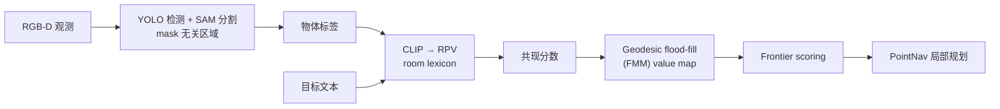
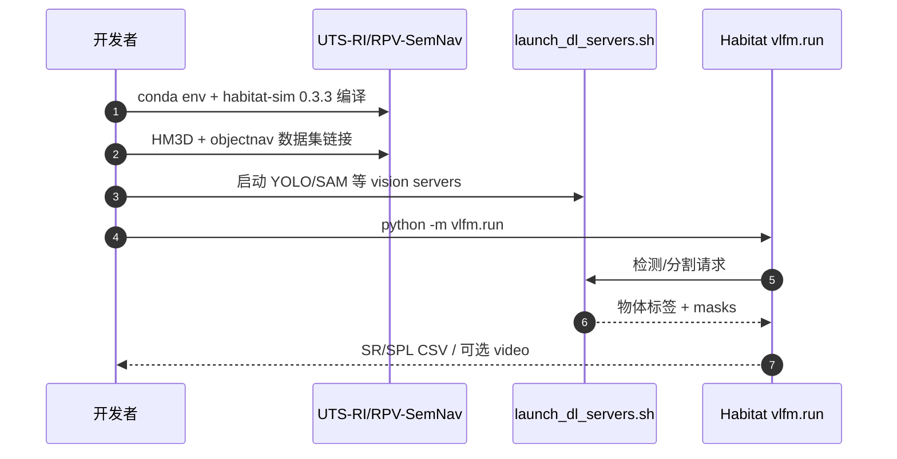

# RPV-SemNav（arXiv:2607.25448）

**RPV-SemNav**（*Room-Mediated Co-occurrence for Zero-Shot Object-Centric Semantic Navigation via Frontier Scoring*，UTS Robotics Institute，[arXiv:2607.25448](https://arxiv.org/abs/2607.25448)，**IROS 2026**）提出 **训练-free、object-centric** 零样本 ObjectNav：**Room Probability Vector（RPV）** 用 CLIP 将物体映射到 **房间类型分布**，以分布重叠估计 **空间共现**；再经 **Fast Marching geodesic flood-fill** 写入 semantic value map 并 **frontier scoring**。

## 一句话定义

不微调导航策略，用「物体更可能出现在哪些房间」的 CLIP 先验 + 测地线传播，给 frontier 打语义分，做开放词汇室内找物。

## 英文缩写速查

| 缩写 | 英文全称 | 简要说明 |
|------|----------|----------|
| RPV | Room Probability Vector | 物体→房间类型概率向量 |
| ObjectNav | Object-Goal Navigation | 找指定物体实例 |
| SR | Success Rate | 任务成功率 |
| SPL | Success weighted by Path Length | 路径效率加权成功 |
| FMM | Fast Marching Method | 测地线 flood-fill 传播 |
| VLM | Vision-Language Model | CLIP 文本嵌入 |

## 为什么重要

- **共现 ≠ 相似度：** microwave 与 bed 在 embedding 可能相近，但 RPV 通过 **room lexicon** 拉开空间先验 — 直击 VLFM 类 **image-holistic** 方法的弱点。
- **Object-centric：** 检测级 anchor（YOLO + SAM）比整帧 cosine 更利于 **FOV 外 frontier** 的延迟更新问题（论文 Related Work）。
- **Engineering：** [GitHub 仓库](https://github.com/UTS-RI/RPV-SemNav) 提供完整 Habitat 0.3.3 安装链 — 可复现 ZSON 管线。

## 核心信息

| 字段 | 内容 |
|------|------|
| 机构 | 悉尼科技大学机器人研究所（UTS-RI） |
| arXiv | [2607.25448](https://arxiv.org/abs/2607.25448) |
| 项目页 | <https://uts-ri.github.io/RPV-SemNav/> |
| 代码 | <https://github.com/UTS-RI/RPV-SemNav> |
| 开源状态 | **已开源**（checkpoint 下载 WIP，README TODO V1 cleanup） |
| 仿真 | Habitat + HM3D ObjectNav val |

## 流程总览

## 工程实践

| 检查项 | 建议 |
|--------|------|
| 安装 | Ubuntu 22.04/24.04；habitat-sim **v0.3.3** 源码编译；注意 `WITH_CUDA` 旧 env 名 |
| 运行 | 终端1 `./scripts/launch_dl_servers.sh`；终端2 `python -m vlfm.run` |
| 数据 | Matterport token + HM3D ObjectNav v1；见 README |
| Checkpoint | SAM3 / YOLOE / Mask2Former — 仓库标注 **WIP** 下载链 |

## 源码运行时序图

节点对齐 [`sources/repos/rpv-semnav.md`](../../sources/repos/rpv-semnav.md) README。

## 实验与评测

- **HM3D validation：** vs image-holistic baselines — SR **+3%**、SPL **+1.3%**（相对提升，论文报告）。
- **设定：** 500 步、成功距离 1m；initialize 12×30° 环视；离散 {forward 0.25m, turn 30°, stop}。
- **读法：** 增益 modest 但 **training-free**；价值在 **可解释 room prior** 与 **object-centric map**。

## 结论

**RPV-SemNav 用 room-mediated co-occurrence 把「语义相似」换成「空间共现」，是 zero-shot ObjectNav 的可解释 engineering baseline。**

1. **RPV overlap** 优于 object–object CLIP 直接相似作导航信号。
2. **Geodesic propagation** 把语义与可达几何绑定 — frontier 分更稳。
3. **已开源** 但环境重（habitat 编译 + 双终端）；checkpoint 链仍 WIP。
4. 与 [zero-shot-object-navigation](../tasks/zero-shot-object-navigation.md) / VLFM 对照读 **holistic vs object-centric**。
5. SPL +1.3% 提醒：训练-free 方法 incremental — 勿夸大 SOTA 幅度。

## 局限与风险

- **Room lexicon 覆盖：** 开放词汇极端物体可能 room 映射模糊。
- **检测链依赖：** YOLO/SAM 失败 → 无 anchor；与 VLM 全帧法不同 failure mode。
- **HM3D only 主结果：** 跨数据集泛化需自行验证。

## 关联页面

- [zero-shot-object-navigation](../tasks/zero-shot-object-navigation.md)
- [embodied-semantic-cognitive-map](../concepts/embodied-semantic-cognitive-map.md)
- [vision-language-feature-fusion](../concepts/vision-language-feature-fusion.md)
- [habitat-sim](./habitat-sim.md)

## 参考来源

- [rpv_semnav_arxiv_2607_25448.md](../../sources/papers/rpv_semnav_arxiv_2607_25448.md)
- [rpv-semnav.md](../../sources/repos/rpv-semnav.md)
- [arXiv:2607.25448](https://arxiv.org/abs/2607.25448)

## 推荐继续阅读

- [RPV-SemNav 项目页](https://uts-ri.github.io/RPV-SemNav/)
- [VLFM（arXiv:2306.14846）](https://arxiv.org/abs/2306.14846)
- [zero-shot-object-navigation 任务页](../tasks/zero-shot-object-navigation.md)
