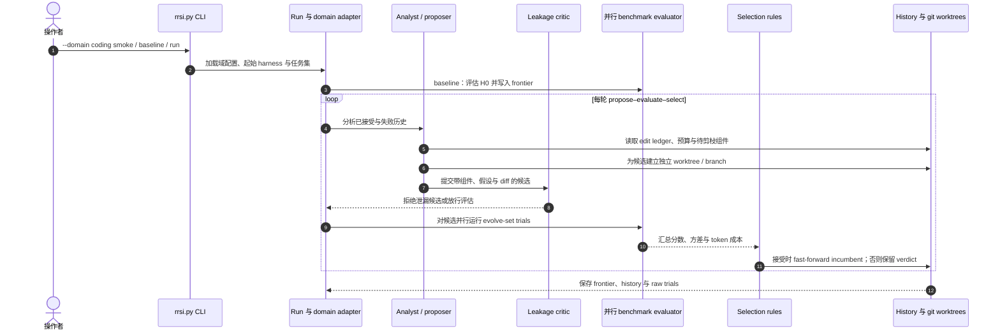

# RRSI：正则化的 Agent Harness 递归自我改进

**RRSI**（[arXiv:2609.24972v2](https://arxiv.org/abs/2609.24972v2)）由 Google Cloud AI Research 等提出，研究如何在**冻结语言模型**周围持续改进 agent harness，同时避免优化过程只记住演化基准。

## 一句话定义

**RRSI 保持 harness 的可编辑空间开放，通过约束每轮提案和接纳规则，寻找能迁移且不无谓增加推理成本的 harness 改动。**

## 英文缩写速查

| 缩写 | 英文全称 | 简要说明 |
|------|----------|----------|
| RSI | Recursive Self-Improvement | 在固定边界内多轮提出、评测并接纳系统改动 |
| RRSI | Regularized Recursive Self-Improvement | 本文对 harness 搜索轨迹施加正则化的方法 |
| LLM | Large Language Model | 本文周围的冻结基础模型 |
| OOD | Out-of-Distribution | 与演化集合分布不同的 held-out 评测 |
| CLI | Command-Line Interface | 官方仓库运行搜索与评估实例的命令入口 |

## 为什么重要

很多 harness 进化方法只看当前 benchmark 的分数，容易得到**对演化集有效、换任务就失效**的补丁。RRSI 把限制放在「怎样搜索」和「什么改动值得保留」上：提示、工具、记忆、工作流等仍可编辑，候选则需要提供更容易归因、通过泄漏审查、跨过测量噪声并证明额外成本合理的证据。

因此它与 [HarnessBank](./paper-harnessbank.md) 的语义基因库与门控选择、[MetaRSI-v1](./paper-metarsi-v1.md) 的 Data/Harness/Model 三算子调度同属 harness RSI 研究线，但机制重心不同：RRSI 系统化限制 edit capacity、benchmark leakage、噪声、token 成本与停滞组件。**该方法改的是 agent 周边脚手架，不是基础模型权重。**

## 核心信息

| 项 | 内容 |
|----|------|
| **机构** | Google Cloud AI Research、北卡罗来纳大学教堂山分校、斯坦福大学、圣路易斯华盛顿大学 |
| **作者** | Peng Xia、Rujun Han、Zifeng Wang、Yanfei Chen、Yufan Zhuang、Yoonho Lee、Chengsong Huang、Han Yu、Zhongying CuiZhu、Yifei Ming、Huaxiu Yao、Burak Gokturk、Tomas Pfister、Chen-Yu Lee |
| **项目页** | <https://regularized-rsi.com/> |
| **代码** | [google-research/rrsi](https://github.com/google-research/rrsi) |
| **任务域** | Coding（Terminal-Bench）、agentic workspace（Harvey LAB）、engineering design（EngDesign） |
| **策略模型** | 项目页示例为 Claude Opus 4.8；支持可配置的兼容模型标识 |
| **开源** | **已开源** — Apache-2.0；含核心搜索实现、域适配器与测试。完整复现需要配置外部模型 API 与独立 benchmark 环境 |

## 核心原理

RRSI 的约束分布在 propose 与 select 两边：

| 阶段 | 约束 | 作用 |
|------|------|------|
| 提案 | 退火 edit budget | 早期允许少量协调改动发现有效机制，后期收敛至单个可归因改动 |
| 提案 | 历史与假设记录 | 已被证伪的想法不重复提；停滞时优先探索从未用过的组件 |
| 筛选 | Leakage critic | 计分前检查候选是否利用任务名、答案或 benchmark 专属逻辑 |
| 筛选 | Noise-adjusted floor | 改进须超过基础 harness 多次测量得到的波动区间 |
| 筛选 | Token cost rule | 增加的推理 token 需要用可测得的任务改进支付 |
| 筛选 | Pruning | 最近不再产出正收益的组件可作为删除候选 |

### 一轮搜索的主流程

H_t 是当前 incumbent harness。每轮分析历史并提出候选，先经泄漏 critic，再在 evolve set 测评；selection 按噪声地板、token 成本与改进幅度选择是否接纳，并把获胜版本保存为可审计 commit。

### 工程实现

- 每个候选在独立的 git worktree 中构建，分支自 evolve/<domain>；接纳候选通过 fast-forward 推进，incumbent 因而对应一个 commit。
- 一轮比较两个候选；记录包括改动组件、假设、diff、分数与成本变化、评审结论。搜索可续跑，并保留 trial 与 history。
- 官方实例覆盖 coding、agentic workspace 与 engineering design；这些是 agent benchmark 工作流，不是机器人控制策略训练代码。
- 核心安装与单测见 [sources/repos/rrsi.md](../../sources/repos/rrsi.md)。端到端运行还需 benchmark 专用依赖、云项目及模型服务凭证。

## 源码运行时序图

官方仓库提供可运行入口。核心搜索时序可概括为：

**复现顺序：** 安装仓库及 [dev] 依赖 → 先跑 pytest / domain 的 smoke → 配置策略与服务模型、benchmark 专属依赖 → 运行 baseline → 启动可续跑的 run；未配置凭证或评测环境时，核心测试通过不代表论文基准已复现。

## 实验与评测

项目页汇总报告：

| 指标 | RRSI 结果 | 读法 |
|------|-----------|------|
| 演化集平均得分 | **+4.0 points** | 相对初始 harness 的项目页汇总 |
| held-out 平均得分 | **+3.4 points** | 未参与优化的基准上仍有提升 |
| policy tokens / trial | **−36%** | 相对无正则化进化的 token 成本 |

论文摘要还报告，在八个基准、三个任务域上最高演化集提升 **+14.1 points**、最高 OOD 提升 **+4.7 points**。这些是作者报告的评测数字，不能外推为任意底座或任务分布上的保证。

## 结论

**RRSI 的核心贡献是把 harness 搜索的可迁移性与推理成本纳入同一套可审计的提案—筛选闭环；证据范围仍限于论文的固定模型和基准环境。**

1. **值得复用：** edit budget 逐步收紧，让晚期改动更容易归因。
2. **值得复用：** 接纳同时检查 benchmark 泄漏、测量噪声与额外 token 成本。
3. **评测时：** 保留未参与演化的任务集，并报告演化分与 held-out 分两条曲线。
4. **运行时：** 将候选、diff、假设、分数、成本和 verdict 一起版本化，便于复盘与回滚。
5. **迁移边界：** 论文结果不代表更换底座、工具生态或机器人任务后仍有同等收益。
6. **复现边界：** 核心代码公开可测；论文级实验仍要配置第三方模型服务和各 benchmark 环境。

## 与其他工作对比

| 工作 | 被改对象 / 主要机制 |
|------|-------------------|
| [HarnessBank](./paper-harnessbank.md) | 语义 Harness Gene Bank 与显著性门控，保留互补机制 |
| [MetaRSI-v1](./paper-metarsi-v1.md) | Data / Harness / Model 三算子在共享闭环中调度 |
| [Dream-RSI](./paper-dream-rsi.md) | 通过历史树回放改进长周期 discovery 的 exploration policy |
| **RRSI** | 开放 harness 编辑空间，正则化 proposal 与 selection 的迭代 |

## 局限与风险

- **评测锚很关键：** noise floor、leakage critic 与成本估算都依赖固定评测器及其统计协议。
- **模型与基准依赖：** 三类 benchmark runner 需要独立环境，默认说明使用 Vertex AI 配置；API 可用性与版本会影响复现。
- **论文结论的外推范围：** 固定模型 / 三类任务域的成功不能直接推成所有 agent、工具栈或开放任务的普遍规律。
- **对机器人研发的映射是类比：** 可借鉴「固定度量 + 改 harness + held-out 验收」，但仓库并未提供机器人环境、控制器或硬件部署闭环。

## 关联页面

- [递归自我改进](../concepts/recursive-self-improvement.md) — RSI 的层级与能力边界
- [AI Auto-Research](../concepts/ai-auto-research.md) — 研究过程中的提案、执行、验证与人类审阅
- [RSI 纵深路线](../../roadmap/depth-rsi.md) — Stage 0–5 学习路径；本页对应 Stage 4
- [MetaRSI-v1](./paper-metarsi-v1.md) — Data / Harness / Model 三算子
- [HarnessBank](./paper-harnessbank.md) — 语义归档与 gated screening 对照
- [Dream-RSI](./paper-dream-rsi.md) — exploration-policy RSI 对照
- [真机策略 autoresearch harness 指南](../queries/real-robot-policy-autoresearch-harness.md) — 将 harness 式闭环应用于机器人研发的工程约束

## 参考来源

- [论文摘录与开源核查](../../sources/papers/rrsi_arxiv_2609_24972.md)
- [RRSI 官方项目页](../../sources/sites/regularized-rsi-com.md)
- [google-research/rrsi 仓库归档](../../sources/repos/rrsi.md)
- [arXiv:2609.24972v2](https://arxiv.org/abs/2609.24972v2)

## 推荐继续阅读

- [项目页：方法图、结果与 evolution explorer](https://regularized-rsi.com/)
- [代码仓库与 Quickstart](https://github.com/google-research/rrsi)
- [RRSI 论文 PDF](https://arxiv.org/pdf/2609.24972v2)
