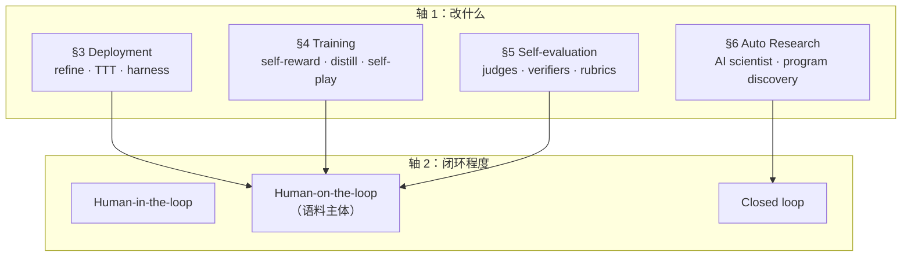
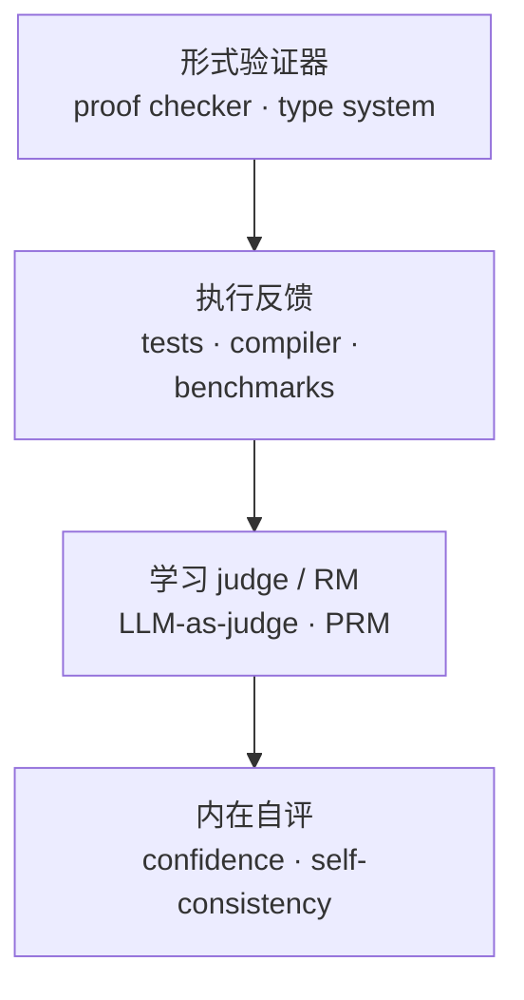
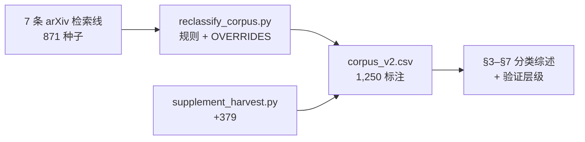
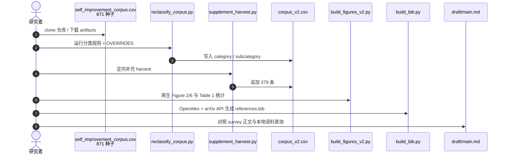

# RSI Survey（2607.07663）：从有界 Self-Refinement 到自主研究闭环

**Recursive Self-Improvement in AI**（Chen, Wang & Qu；[arXiv:2607.07663](https://arxiv.org/abs/2607.07663)，2026）是一份 **44 页、6 图** 的系统综述：从 **1,250 篇** arXiv（2024–2026）出发，用 **改进对象 × 闭环程度** 两轴 taxonomy 把「self-X」词汇下的不同野心分开，并把 **self-evaluation** 提升为与部署/训练/Auto Research **并列的第四技术类** — 因为每条改进环都是「某信号可替代人类判断」的 claim。

## 一句话定义

**用可审计的 1,250 篇语料与验证层级，把工业里已在用的有界 self-refinement 与理论上开放的 RSI 切开，并说明 evaluator 设计空间才是全场的共同天花板。**

## 英文缩写速查

| 缩写 | 英文全称 | 简要说明 |
|------|----------|----------|
| RSI | Recursive Self-Improvement | 系统充分自主设计并训练后继者的极限情形 |
| TTT | Test-Time Training | 部署期按 query/session 更新权重（非纯 inference refine） |
| PRM | Process Reward Model | 对推理步骤打分的过程奖励模型 |
| Auto Research | — | 系统自主做 AI 研究（假设→实验→发现） |
| Human-on-the-loop | — | 自动 improvement signal + 人审计/门控（语料主体） |

## 为什么重要

- **本库 RSI 栈的 peer-review 锚点：** [四层标准 query](../queries/rsi-four-tier-five-pushes.md) 与 [Awesome RSI](./awesome-rsi.md) 分别给 **叙事标尺** 与 **artifact 索引**；本文给 **全谱系 survey + 语料 CSV**，适合查遗漏、对术语、看 2026 爆发集中在哪一类。
- **与 Auto-Research 综述正交：** [AI Auto-Research（2605.18661）](../concepts/ai-auto-research.md) 按 **S1–S8 生命周期**；本文按 **机制与闭环** — §6 Auto Research 与前者 S3/S6 重叠但 **分类轴不同**。
- **机器人读者：** §3.5–3.6 harness/skill 进化与 §4 具身 self-play 直接关联 [真机 autoresearch harness](../queries/real-robot-policy-autoresearch-harness.md)；但 **方向设定** 仍属不可验证任务 — 与 Anthropic [宏观 RSI](../concepts/recursive-self-improvement.md) 人侧瓶颈一致。
- **开源可复现：** [deepgrounding/recursive-self-improvement](https://github.com/deepgrounding/recursive-self-improvement) 释放语料、分类脚本与手稿 — **已开源**（非 Agent 运行时）。

## 核心信息

| 项 | 内容 |
|----|------|
| **作者** | Mingguang Chen*（DeepGrounding）、Licheng Wang（AlphaAvatar）、Bo Qu（Illinois Institute of Technology） |
| **arXiv** | [2607.07663](https://arxiv.org/abs/2607.07663)（v2，2026-09-06） |
| **语料** | 1,250 篇（种子 871 + 补充 379）；74% 发表于 2026 |
| **代码 / 数据** | **已开源** — 语料 `corpus_v2.csv`、reclassify/supplement/build 脚本、`draft/main.md` |
| **旧链说明** | v1 曾引私有 `bamboodrift/...`；canonical 为 deepgrounding 仓 |

## 核心原理

### 两轴 taxonomy

| 类别 | 论文数 | 2026 占比 | 典型代表（survey 锚点） |
|------|--------|-----------|-------------------------|
| Deployment | 393 | 74% | Self-Refine 系；harness/skill 进化 |
| Training | 340 | 69% | STaR；Self-Rewarding；zero-data self-play |
| Self-evaluation | 318 | 82% | LLM-as-judge；PRM；meta-eval |
| Auto Research | 139 | 76% | FunSearch；The AI Scientist 系 |
| Foundations | 60 | 57% | RSI 极限理论；安全与治理 |

**中心切分：** **Bounded self-refinement**（固定外部 evaluator） vs **open-ended RSI**（evaluator 与改进 machinery 一并演化）。

### 验证层级（改进强度的共同解释）

- **定性规律（作者）：** demonstrated self-improvement **跟踪**该层级；失效模式（self-confirming loop、model/diversity collapse）来自 **层级违规**。
- **方向设定 = 验证顶格之上：** 什么值得评估 **不在** 层级内 — 人类仍在 loop 的 **prior** 一步。

### 流程总览（语料 → 分类 → 论述）

## 源码运行时序图

官方配套仓 [deepgrounding/recursive-self-improvement](https://github.com/deepgrounding/recursive-self-improvement) 提供 **语料复现与图表生成** 入口（归档见 [sources/repos/recursive-self-improvement-deepgrounding.md](../../sources/repos/recursive-self-improvement-deepgrounding.md)）— **非** RSI Agent 训练/部署运行时：

- **最短复现路径：** clone → `python draft/scripts/reclassify_corpus.py` → 检查 `artifacts/corpus_v2.csv` → 按需 `build_figures_v2.py` / `build_bib.py`。
- **审计用法：** 对单篇 arXiv ID 查 CSV 中 `category` 与 override 记录，验证 survey 归类是否与读者理解一致。

## 工程实践

| 场景 | 建议 |
|------|------|
| 读 RSI 新闻 | 先问落在 **哪一格 taxonomy** + **哪一层验证** — 勿把 SWE 分数或 harness 自改直接读成 ignition |
| 设计 agent 自进化 | 优先 **human-on-the-loop** + **执行反馈/形式验证** — 与 survey 主体一致 |
| 文献 lint | 用 `corpus_v2.csv` 查遗漏 thread；对照 [Awesome RSI](./awesome-rsi.md) artifact 维度 |
| 对标 Auto-Research | 生命周期问题 → [2605.18661 概念页](../concepts/ai-auto-research.md)；机制/闭环 → 本文 |
| 机器人 harness | §3 harness 进化与 [RSI-Harness](./rsi-harness.md)、[MetaRSI-v1](./paper-metarsi-v1.md) 同轴 — 仍须外部 reset/verify |

## 语料与评测口径

**本文不自带 benchmark**：它是文献综述，「实验」等于 **语料构建与分类**，可核对的量是语料统计而非任何模型分数。读它的数字前先认清这一点。

| 可核对量 | 口径 | 怎么复核 |
|----------|------|----------|
| **1,250 篇** | 种子 871（7 条 arXiv 检索线）+ 定向补充 379 | `reclassify_corpus.py` → `artifacts/corpus_v2.csv` 行数 |
| **四类 + Foundations 的篇数与 2026 占比** | Deployment 393 / Training 340 / Self-evaluation 318 / Auto Research 139 / Foundations 60；2026 占比 57%–82% | 按 `category` 分组统计 CSV；`build_figures_v2.py` 再生 Figure 2/6 与 Table 1 |
| **单篇归类是否合理** | 规则分类 + 显式 `OVERRIDES` | 用 arXiv ID 查 CSV 的 `category` 与 override 记录 |
| **验证层级 ↔ 改进强度** | 作者的**定性规律**，非受控实验 | 不可复核为定量结论；只能当读新闻时的分档提示 |

- **没有测的东西：** 不给方法间的胜负排名，不给成功率/加速比，也不给 impact——语料 74% 出自 2026，引用近零。
- **误读防线：** 某一格篇数多只说明**这一年有人在写**，不等于该路线更有效；`closed loop × self-evaluation` 那格篇数薄，恰恰是**测量缺口**而非风险低。
- **和真正的能力评测分层：** 要判断某条自改进 loop 是否真有效，仍得回到具体任务的成功率协议——分层读法见 [具身评测基准选型闭环](../queries/embodied-eval-benchmark-selection-loop.md)，本文只给「这条 loop 属哪一格、靠哪层验证器兜底」的前置判据。

## 局限与风险

- **非 census：** 检索深度 cap + 2026 偏置；引用近零，impact 不可读。
- **单标注者分类：** 虽 release overrides，边界论文仍存争议。
- **Anthropic essay 作动机框，非证据：** stage 词汇借自 [RSI essay](https://www.anthropic.com/institute/recursive-self-improvement)，survey 证据以语料为准。
- **Closed loop 稀疏：** 最危险 cell（self-eval × closed）在语料中 **薄** — 治理测量仍 underpopulated。
- **机构未全注册：** DeepGrounding / AlphaAvatar 暂不在 `institutions.json` — 正文以全称标注。

## 与其他工作对比

| 维度 | 本文（2607.07663） | AI Auto-Research（2605.18661） | Awesome RSI（Prism-Shadow） |
|------|-------------------|-------------------------------|----------------------------|
| 组织轴 | 改什么 × 闭环程度 | S1–S8 学术生命周期 | RSI artifact × mode |
| 规模 | 1,250 arXiv | 250+ 论文 + 52 基准 | 50 方法 + 29 基准 |
| 核心贡献 | 验证层级 + evaluator 单列 | 人机共治 + 阶段成熟度 | 可筛选方法/基准索引 |
| 开源 | 语料 + 脚本 | Awesome 列表 + 站点 | 静态站 + README |

## 结论

**「Self-improvement」在 2026 文献里主要是可评测、human-on-the-loop 的有界 refinement；开放式 RSI 仍被 grounding、collapse 与算力约束；全场瓶颈在 evaluator 设计，而治理级测量几乎空白。**

1. **先分类再恐慌** — deployment / training / evaluation / research 四类机制与风险画像不同，self-X 词汇会掩盖这一点。
2. **改进强度跟踪验证层级** — 形式验证与执行反馈上的 loop 最可信；纯 LLM judge 与 intrinsic 信号最易 self-confirming。
3. **语料主体是 human-on-the-loop** — closed loop 稀疏，但 §6 与 A-Evolve-Training 等信号值得跟踪 **metric 脱钩** 时的自改策略。
4. **方向设定在验证层级之上** — 与 Anthropic、Auto-Research 综述一致：执行自动化快于 **该研究什么**。
5. **开源语料可用于 lint** — `corpus_v2.csv` + 脚本使分类 disagreements **可审计**，优于纯 narrative survey。
6. **与四层 RSI 标准互补** — [query 页](../queries/rsi-four-tier-five-pushes.md) 给 ignition 标尺；本文给 **机制地图** 与 peer-review 锚点。
7. **机器人侧读法** — harness/skill 进化已进 §3，但真机仍要外部 verify；RSI 叙事不替代 [autoresearch harness](../queries/real-robot-policy-autoresearch-harness.md)。

## 关联页面

- [递归自改进（概念）](../concepts/recursive-self-improvement.md)
- [RSI 四层标准与五次推进](../queries/rsi-four-tier-five-pushes.md)
- [AI Auto-Research](../concepts/ai-auto-research.md)
- [Awesome RSI](./awesome-rsi.md) · [MetaRSI-v1](./paper-metarsi-v1.md) · [Dream-RSI（2609.14858）](./paper-dream-rsi.md) · [karpathy/autoresearch](./karpathy-autoresearch.md)

## 参考来源

- [RSI Survey 论文归档](../../sources/papers/rsi_survey_arxiv_2607_07663.md)
- [deepgrounding/recursive-self-improvement 仓库归档](../../sources/repos/recursive-self-improvement-deepgrounding.md)

## 推荐继续阅读

- 论文 PDF：<https://arxiv.org/pdf/2607.07663>
- 语料仓库：<https://github.com/deepgrounding/recursive-self-improvement>
- Anthropic RSI essay：<https://www.anthropic.com/institute/recursive-self-improvement>
- AI Auto-Research：<https://arxiv.org/abs/2605.18661>
- Awesome RSI Methods：<https://prism-shadow.github.io/awesome-rsi/#methods>
