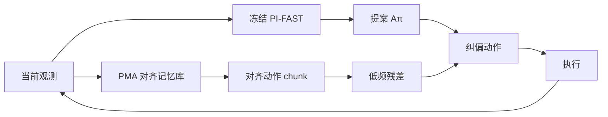

# RTCF（Retrieve in Time, Correct in Frequency · arXiv:2608.04527）

**RTCF**（*Retrieve in Time, Correct in Frequency*，[arXiv:2608.04527](https://arxiv.org/abs/2608.04527)）由 **清华深圳研究院 / 清华 SIGS、同济、复旦、Everwise-Tech** 等提出（范宇泽 / 曹越 / 高鹏杰 / … / 王学谦）：在 **冻结 chunk 式 VLA** 外挂一条 **免训练** 测试时纠偏链路——先用 **Progressive Memory Alignment（PMA）** 把当前执行历史对齐到成功轨迹，再只把检索动作的 **低频运动残差** 叠回策略提案；夹爪与高频细节仍跟冻结策略。

## 一句话定义

**别微调大 VLA：用历史对齐找到「进度一致」的成功记忆，只借它的低频运动趋势改提案——单次前向、CPU 约 11 ms。**

## 英文缩写速查

| 缩写 | 英文全称 | 简要说明 |
|------|----------|----------|
| RTCF | Retrieve in Time, Correct in Frequency | 本文框架：时间维检索 + 频域纠偏 |
| PMA | Progressive Memory Alignment | 因果单调 frontier 的在线子序列对齐 |
| VLA | Vision-Language-Action | 被冻结的 base 策略（文中 PI-FAST） |
| FAST | Efficient action tokenization | π₀ 系动作 tokenization；文中 PI-FAST |
| DCT | Discrete Cosine Transform | 动作 chunk 频域分解载体 |
| LIBERO-Long | — | 十任务多阶段套件；本文主增益来源 |

## 为什么重要

- **补齐「冻结 VLA 纠偏」谱系的免训练格：** [DynaWM](./paper-dynawm-vla-online-correction.md) 要训世界模型；[DreamSteer](./paper-dreamsteer-vla-deployment-steering.md) 要 WM+价值模型；RTCF **零参数更新、不重复 VLA 推理、不加 GPU**。
- **显式拆开两个问题：** (1) 检索哪条、对齐到哪一帧；(2) 转移动作的哪一频段——消融证明时域硬融合会 **伤害** Long（50.0% < baseline 61.6%）。
- **工程画像清晰：** 单次 policy forward；PMA+读出中位 **10.99 ms**；描述子 RAM 32–50 MiB。

## 核心信息

| 项 | 内容 |
|----|------|
| **机构** | 清华大学深圳研究院；清华深圳国际研究生院（SIGS）；同济大学；复旦大学；Everwise-Tech |
| **Base 策略** | 冻结 **PI-FAST**（π₀-FAST 系） |
| **记忆库** | seed=7 成功轨迹预采集后冻结；测试全库搜索、无 oracle |
| **开源** | **确认未开源**（截至 2026-08-07：无项目页 / GitHub / 权重） |

## 核心原理

### Retrieve in Time（PMA）

- 观测经冻结 **SigLIP–PCA** 成描述子；成功记忆同样预编码。
- 对每条记忆维护 **alignment frontier**：新观测到来时按因果转移更新（可停留 / 单位前进 / 有界跳过），保留竞争单调假设。
- 取当前最低平均代价终点 → 同时得到 **哪条记忆** 与 **对齐位置**，无需阶段标签。

### Correct in Frequency

- 读出对齐处未来动作 chunk；对 **运动通道** 做频域分解。
- 转移 **系数裁剪 + 缩放（\(\lambda_0=0.1\)）** 的低频残差到策略提案。
- **高频分量与夹爪** 保留 \(A^\pi_t\)；解码失败则原样执行。

### 流程总览

## 工程实践

| 项 | 内容 |
|----|------|
| **源码运行时序图** | **不适用** — 截至入库日无公开可运行实现 |
| 评测协议 | 四套件 × 10 任务 × 10 初始态 × 5 seed = **2000 episodes/条件** |
| 设备画像 | RTX 4090 跑策略；纠偏在 Xeon CPU |
| 失败回退 | 无可用 future chunk → 保持原提案 |
| 落地前提 | 需要 **同任务成功轨迹记忆库**；库外分布增益未保证 |

## 实验与评测

Matched PI-FAST 对照（Table 1）：

| Method | Long | Spatial | Object | Goal | All |
|--------|------|---------|--------|------|-----|
| PI-FAST | 61.6 | 96.4 | 97.4 | 90.0 | 86.4 |
| Frame-NN（无历史对齐） | 63.6 | 95.8 | 96.8 | 88.6 | 86.2 |
| Time-Domain（无频选） | **50.0** | 96.2 | 97.2 | 87.0 | 82.6 |
| **RTCF** | **68.6** | **97.4** | **97.8** | 89.8 | **88.4** |

部署：PMA p50 **6.28 ms** + FAST future readout **4.71 ms** ≈ **10.99 ms**/chunk。

## 结论

**RTCF 说明：对 chunk VLA，成功经验最有用的部分往往是「进度对齐后的低频运动趋势」——整段时域回放反而会毁掉策略的反应结构。**

1. **主增益在 LIBERO-Long（+7.0 pt）** — 阶段歧义与误差累积越重，历史对齐越值钱；全域 +2.0 pt 不要误读成全面碾压。
2. **两组件都必要** — 去掉历史对齐 Long 只到 63.6%；去掉频选掉到 **50.0%**（有害）。
3. **与可训纠偏模块选型：** 有算力训 WM → [DynaWM](./paper-dynawm-vla-online-correction.md)；要执行前多候选 → [DreamSteer](./paper-dreamsteer-vla-deployment-steering.md)；只要 CPU 侧轻量补丁且有成功记忆 → RTCF。
4. **复现缺口：** 方法清晰但 **无官方代码**；落地需自实现 PMA + 频域残差并备记忆库。

## 局限与风险

- 仅报告冻结 PI-FAST + LIBERO；跨模型 / 真机未给。
- 依赖预采集成功记忆；库覆盖不足时可能误纠偏（虽有回退）。
- Goal 套件 RTCF **89.8 < baseline 90.0**（小幅回退），说明非所有套件单调受益。
- **无开源** 阻碍直接工程复用。

## 与其他工作对比

| 工作 | 训练 | 机制 | 相对 RTCF |
|------|------|------|-----------|
| [DynaWM](./paper-dynawm-vla-online-correction.md) | 要训 | 流匹配重写 chunk | 更强动态目标，成本高 |
| [DreamSteer](./paper-dreamsteer-vla-deployment-steering.md) | 组件预训练 | WM 想象 + 价值筛选 | 多候选，非记忆回放 |
| [BridgeVLA++](./paper-bridgevla-plusplus.md) | 要训 | 模型内时空记忆 | 改策略结构；非测试时补丁 |
| Frame-NN / Time-Domain | 无 | 本文消融 | 证明「乱检索 / 乱融合」不够或有害 |

## 关联页面

- [VLA](../methods/vla.md)
- [Action Chunking](../methods/action-chunking.md)
- [π₀.₇ / FAST 策略](../methods/pi07-policy.md)
- [DynaWM](./paper-dynawm-vla-online-correction.md)
- [DreamSteer](./paper-dreamsteer-vla-deployment-steering.md)
- [BridgeVLA++](./paper-bridgevla-plusplus.md)

## 参考来源

- [RTCF 论文归档](../../sources/papers/rtcf_arxiv_2608_04527.md)

## 推荐继续阅读

- arXiv 全文：<https://arxiv.org/abs/2608.04527>
- 对照：[DynaWM](./paper-dynawm-vla-online-correction.md)（可训在线修正）
