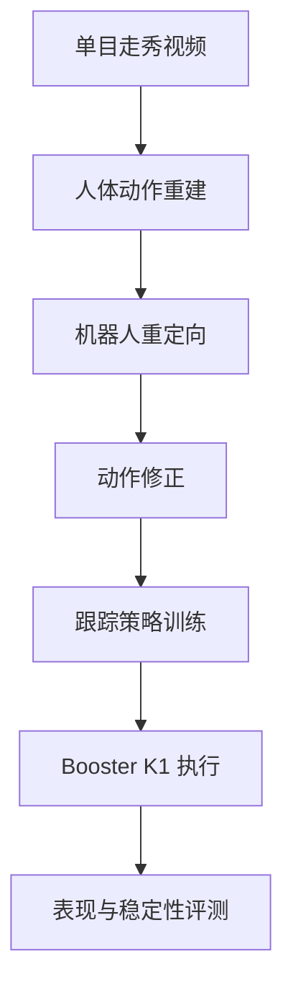

# 走秀表现型行走（arXiv:2609.27003）

**走秀表现型行走**（*Learning Expressive Humanoid Locomotion from Monocular Runway Videos for Robot Fashion Shows*，[arXiv:2609.27003](https://arxiv.org/abs/2609.27003)）来自 [senlanke 具身运控lab 周更盘点](../../sources/blogs/wechat_senlanke_weekly_humanoid_quadruped_2026-09-21_25.md)（2026-09-21–25）。

## 一句话定义

**单目视频→重定向→修正→策略→Booster K1 走秀部署全流程。**

## 英文缩写速查

| 缩写 | 英文全称 | 简要说明 |
|------|----------|----------|
| RL | Reinforcement Learning | 强化学习 |
| WBC | Whole-Body Control | 全身控制 |
| MPC | Model Predictive Control | 模型预测控制 |

## 为什么重要

- 常规定位稳定/速度，难复现窄步宽与姿态风格。

## 流程总览

以下按本页已归纳的机制与资料绘制，表示模块或阅读路径关系。

## 核心机制

| 项 | 内容 |
|----|------|
| **arXiv** | [2609.27003](https://arxiv.org/abs/2609.27003) |
| **开源** | **待发布**（步骤 2.5，2026-09-28） |
| **方法摘要** | Monocular video to expressive gait on Booster K1. |

## 源码运行时序图

**不适用**（截至 2026-09-28 未发布可运行官方代码或待核实）。

## 实验与评测

- 时装秀步态真机（维尔纽斯/肯特州立，以 PDF 为准）。
- 读法：先对齐任务设定、传感器与成功定义，再解读 headline 数字。

## 与其他工作对比

| 维度 | 读法 |
|------|------|
| **同周对照** | 见对应 [周更盘点](../../sources/blogs/wechat_senlanke_weekly_humanoid_quadruped_2026-09-21_25.md) 映射表，勿跨任务直接比 SR |
| **开源状态** | **待发布** — 部署前以项目页/arXiv 为准 |

## 结论

**表现型 locomotion 需要视频到策略的完整风格链。**

1. 开源：**待发布**；勿凭公众号摘要臆断可复现性。
2. 指标须连同实验条件解读（仿真/真机、平台、成功阈值）。
3. 关注 arXiv 版本更新与代码发布。

## 关联页面

- [humanoid-locomotion](../tasks/humanoid-locomotion.md)
- [reinforcement-learning](../methods/reinforcement-learning.md)
- [sim2real](../concepts/sim2real.md)

## 参考来源

- [runway-expressive-locomotion_arxiv_2609_27003.md](../../sources/papers/runway-expressive-locomotion_arxiv_2609_27003.md)
- [wechat_senlanke_weekly_humanoid_quadruped_2026-09-21_25.md](../../sources/blogs/wechat_senlanke_weekly_humanoid_quadruped_2026-09-21_25.md)
- [arXiv:2609.27003](https://arxiv.org/abs/2609.27003)

## 推荐继续阅读

- [arXiv PDF](https://arxiv.org/pdf/2609.27003)
