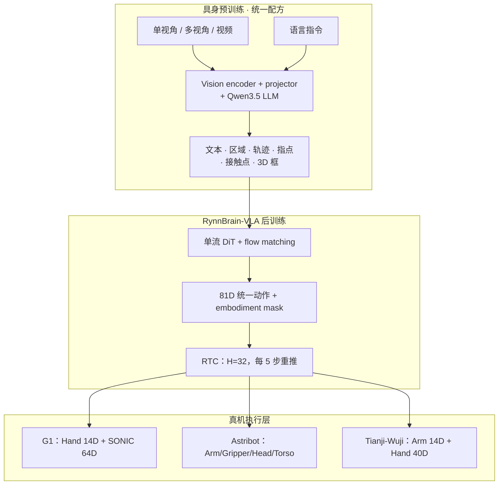
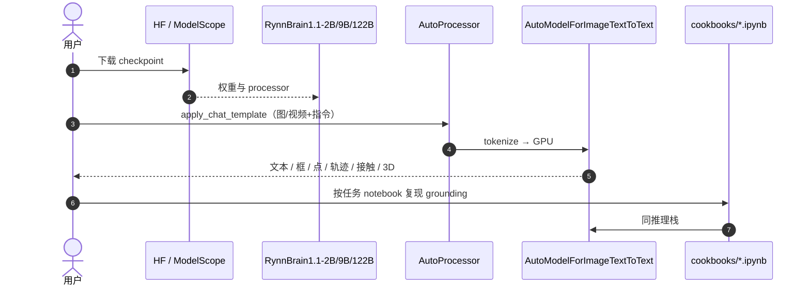

# RynnBrain 1.1：更强、更可泛化的具身基础模型

**RynnBrain 1.1**（*Towards More Capable and Generalizable Embodied Foundation Model*，[arXiv:2607.17977](https://arxiv.org/abs/2607.17977)，[项目页](https://alibaba-damo-academy.github.io/RynnBrain)，阿里巴巴达摩院 + 湖畔实验室）是在 **RynnBrain 1.0** 上的系统升级：在 **统一时空–物理 grounding** 配方下发布 **2B / 9B / 122B-A10B** 三尺度家族；新增面向操作的 **接触点预测** 与（紧凑模型）**原生度量 3D grounding**；并以骨干作单流 DiT 的 **RynnBrain-VLA**（**81 维统一动作空间 + embodiment mask + RTC**）部署到 **Unitree G1、Astribot-S1、Tianji-Wuji**。

## 一句话定义

**在 Qwen3.5 上用同一具身预训练配方缩放 2B→122B，把接触点与 3D 框写进输出空间，再以统一跨本体动作空间把预训练脑接到真机 flow-matching VLA。**

## 英文缩写速查

| 缩写 | 英文全称 | 简要说明 |
|------|----------|----------|
| RynnBrain | RynnBrain embodied foundation model | 达摩院具身基础模型族（1.1 本页） |
| VLA | Vision-Language-Action | 视觉–语言–动作策略；本页为 RynnBrain-VLA |
| MoE | Mixture of Experts | 122B-A10B 稀疏专家骨干 |
| RTC | Real-Time Chunking | 边执行边重推的动作块衔接（β=10） |
| DiT | Diffusion Transformer | VLA 中单流去噪骨干（与 VLM 同流） |
| EEF | End-Effector | 统一动作空间中的末端位姿组（18D） |
| SONIC | SONIC motion tracking controller | G1 全身跟踪低层；64D latent 在 81D 之外 |

## 核心信息

| 字段 | 内容 |
|------|------|
| **机构** | 阿里巴巴达摩院（DAMO Academy, Alibaba Group）；湖畔实验室（Hupan Lab） |
| **arXiv** | [2607.17977](https://arxiv.org/abs/2607.17977) |
| **骨干** | Qwen3.5-2B / 9B / 122B-A10B（DeepStack + Interleaved MRoPE） |
| **VLA 动作空间** | 统一 **81D**（Arm-J 14 / Arm-EEF 18 / Gripper 2 / Hand 40 / Torso 4 / Head 3）+ mask |
| **真机平台** | Unitree G1（+SONIC）、Astribot-S1、Tianji-Wuji |
| **开源（截至 2026-07-21）** | **部分开源**：2B/9B/122B 权重 + 推理/cookbook；**未见** VLA 训练码与 VLA 权重 |

## 为什么重要

- **具身 scaling 的受控证据：** 同一配方三尺度对比 matched **Qwen3.5**，揭示 **推理密集型认知会负缩放**、**定位更吃显式空间监督**——直接补强 [Embodied Scaling Laws](../concepts/embodied-scaling-laws.md) 的「数据轴不可被参数轴替代」叙事。
- **预训练脑 → VLA 的因果对照：** 同演示、同 60k 后训练下，RynnBrain 初始化相对 Qwen 初始化把平均成功率从 **60% → 86.67%**，process **68.33% → 91.28%**——说明具身预训练不是榜单装饰，而是 **真机策略初始化质量**。
- **跨本体联合训练增益：** 统一 81D + mask 下，**Generalist** 再把平均成功率抬到 **91.67%**，支持「异构机器人数据可互补」而非必然灾难遗忘。
- **工程可落地入口：** HF/ModelScope 权重 + transformers/SGLang cookbook 已可跑感知/定位/3D/接触点；与同院系 [RynnWorld-4D](./paper-rynnworld-4d-rgb-depth-flow.md) 形成「脑 / 4D 世界模型」产品线对照。

## 方法栈（核心结构）

| 模块 | 角色 |
|------|------|
| **Qwen3.5 VLM 骨干** | 图/多视角/视频 + 指令；Dense 或 MoE 解码 |
| **物理输出词表** | 框/点/轨迹坐标 \([0,1000]\) 与文本同自回归 |
| **Contact point** | 紧凑 \((x,y,\theta)\)，替代 1.0 抓取矩形四角 |
| **Native 3D（2B/9B）** | 相机系 9D 框（中心/尺寸/姿态），离散化后自回归 |
| **RynnBrain-VLA** | 骨干作单流 DiT；flow matching；chunk **H=32**；RTC 每 5 步重推 |
| **统一动作 + mask** | 81D 体部分组；只在活跃维算损失；G1 另拼 64D SONIC |

### 流程总览

## 源码运行时序图

官方仓 [alibaba-damo-academy/RynnBrain](https://github.com/alibaba-damo-academy/RynnBrain) 当前公开主线是 **基础模型推理**（`transformers` / `sglang` / `demo.py` / `cookbooks/`），**不是** 端到端 VLA 训练。一次典型「权重 → 感知/定位推理」如下：

- **可复现边界：** 感知、定位、接触点、3D grounding cookbook 可跑；**RynnBrain-VLA 训练与真机驱动层未随仓发布**，需自建后训练与 embodiment layer。
- **服务化：** README 亦支持 `sglang.launch_server` + OpenAI-compatible API。

## 工程实践

| 项 | 建议 |
|----|------|
| **选型** | 要 **具身 QA/定位/3D/接触** 开箱能力 → 先跑公开 2B/9B；要 **跨本体 VLA** → 读论文配方，权重需自训或等后续 release |
| **依赖钉** | README 示例 `transformers==5.2.0`；大模型注意显存与 MoE 部署 |
| **G1 栈** | VLA 输出需接 [SONIC](../methods/sonic-motion-tracking.md)；64D SONIC token **不在** 81D 统一空间内 |
| **RTC** | chunk 32、每 5 步重推、\(\beta=10\)；与 [Action Chunking](../methods/action-chunking.md) 异步部署同族 |
| **开源状态** | 详见 [sources/repos/rynnbrain.md](../../sources/repos/rynnbrain.md)：基础模型 **已开源**；VLA **待发布/未公开** |

## 实验要点（摘要级）

> 数字以 [arXiv:2607.17977](https://arxiv.org/abs/2607.17977) 为准。

| 设定 | 结果要点 |
|------|----------|
| **真机平均（单任务 RynnBrain-VLA）** | process **91.28%** / success **86.67%** |
| **vs Qwen-Based-VLA（同配方）** | 68.33 / 60.00 → 差距约 **+23 / +27 pt** |
| **vs GR00T N1.7 / π₀.₅** | 83.31·73.33 / 72.44·65.00 |
| **Generalist** | process **94.14%** / success **91.67%** |
| **G1 Pull the Chair** | **90%** vs GR00T+SONIC **75%** |
| **3D：SUN RGB-D AP@15** | 2B **34.28** → 9B **41.12** |
| **3D：WildDet3D AP3D** | 2B **17.36** → 9B **23.44** |
| **Scaling 叙事** | 推理密集型认知：RynnBrain 升、Qwen3.5 **负缩放**；定位：最大 Qwen 仍低于最小 RynnBrain |

## 常见误区或局限

- **误区：** 以为 GitHub = 可复现全部真机 VLA——**公开资产是基础模型推理与权重**；跨本体 VLA 与遥操作数据 **未随仓给出**。
- **误区：** 把 122B 的榜单领先直接等同于 **可部署 VLA**——大模型主证据在 **认知/定位基准**；真机 VLA 实验未宣称用 122B 作策略骨干。
- **局限：** 接触点缺标准化功能有效性指标，论文以 **定性** 为主；3D grounding 目前主推 **2B/9B**。
- **局限：** G1 依赖 **SONIC** 低层与平台特有 64D 输出，跨人形栈迁移需重做 embodiment layer。

## 与其他工作对比

| 对照对象 | RynnBrain 1.1 的差异 |
|----------|----------------------|
| **RynnBrain 1.0** | 同团队前作；1.1 加 **接触点紧凑表示**、**native 3D**、系统 **VLA 初始化对照** 与 **122B MoE** |
| **Qwen-VLA / Qwen3.5** | 同生态骨干；RynnBrain 强调 **具身预训练 + 显式空间输出**，受控实验显示优于「直接 Qwen 后训练 VLA」 |
| **π₀.₅ / GR00T N1.7** | 真机长程三任务上 RynnBrain-VLA（及 Generalist）更高；G1 上仍叠 SONIC |
| **InternVLA-A1.5** | 同 Qwen3.5 族；A1.5 走 **latent foresight + WAN**；RynnBrain 走 **大规模具身脑 + 统一跨本体动作空间** |
| **RynnWorld-4D** | 同达摩院 Rynn* 线；World-4D 是 **RGB-DF 生成 + Policy**；本页是 **感知–推理–VLA 脑** |

## 关联页面

- [VLA（Vision-Language-Action）](../methods/vla.md) — 统一 VLA 范式与通才实例索引。
- [Embodied Scaling Laws](../concepts/embodied-scaling-laws.md) — 非均匀具身 scaling 对照。
- [Foundation Policy](../concepts/foundation-policy.md) — 基础策略抽象母类。
- [Action Chunking](../methods/action-chunking.md) — H=32 与 RTC 语境。
- [SONIC](../methods/sonic-motion-tracking.md) — G1 全身跟踪低层。
- [Qwen-VLA](./qwen-vla.md) — 同阿里 Qwen 生态通才 VLA。
- [RynnWorld-4D](./paper-rynnworld-4d-rgb-depth-flow.md) — 同院系 4D 世界模型。
- [InternVLA-A1.5](./paper-internvla-a15-unified-vla.md) — Qwen3.5 + flow VLA 对照。
- [Manipulation](../tasks/manipulation.md) / [Bimanual Manipulation](../tasks/bimanual-manipulation.md) — 真机操作任务背景。

## 推荐继续阅读

- 论文 PDF：[arXiv:2607.17977](https://arxiv.org/pdf/2607.17977)
- 项目页：[alibaba-damo-academy.github.io/RynnBrain](https://alibaba-damo-academy.github.io/RynnBrain)
- 代码与 cookbook：[github.com/alibaba-damo-academy/RynnBrain](https://github.com/alibaba-damo-academy/RynnBrain)
- 权重集合：[Hugging Face RynnBrain 1.1](https://huggingface.co/collections/Alibaba-DAMO-Academy/rynnbrain-11)
- 前作 RynnBrain 1.0：[arXiv:2602.14979](https://arxiv.org/abs/2602.14979)

## 参考来源

- [RynnBrain 1.1 论文摘录](../../sources/papers/rynnbrain_1_1_arxiv_2607_17977.md)
- [RynnBrain 项目页归档](../../sources/sites/rynnbrain-alibaba-damo.md)
- [RynnBrain 仓库归档](../../sources/repos/rynnbrain.md)
