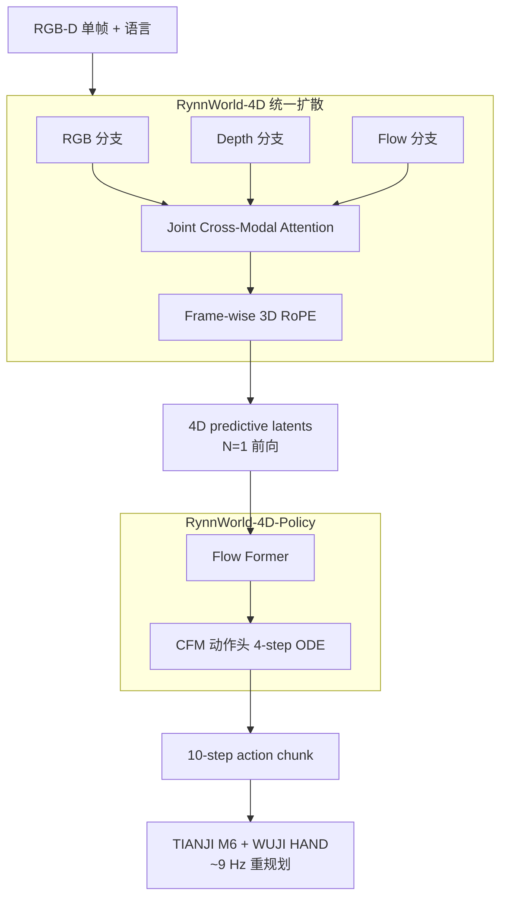

# RynnWorld-4D（4D Embodied World Models · arXiv:2607.06559）

**RynnWorld-4D**（*RynnWorld-4D: 4D Embodied World Models for Robotic Manipulation*，[arXiv:2607.06559](https://arxiv.org/abs/2607.06559)，阿里巴巴 DAMO Academy + 港中大等，[项目页](https://alibaba-damo-academy.github.io/RynnWorld-4D.github.io)）主张 **RGB + Depth + Flow（RGB-DF）** 同步演化才是 **物理 grounded 4D 表征**：在 **单一扩散过程** 中 co-generate 未来 RGB、深度图与光流；**RynnWorld-4D-Policy** 逆动力学头 **单次前向** 读取内部 4D latent 输出动作，绕过多步视频去噪，服务 **~9 Hz 闭环** 双手灵巧操作。

## 一句话定义

**2D 像素不够——用 RGB-DF 三联同步预测把外观、几何与跨帧运动绑在一起，Policy 头一次前向把 4D 想象翻译成控制。**

## 英文缩写速查

| 缩写 | 英文全称 | 简要说明 |
|------|----------|----------|
| RGB-DF | RGB, Depth, Flow | 外观–深度–光流 **投影 4D 表征** |
| DiT | Diffusion Transformer | 三分支 + **Joint Cross-Modal Attention** |
| 3D RoPE | 3D Rotary Position Embedding | **帧级** 几何–运动一致位置编码 |
| IDM | Inverse Dynamics Model | RynnWorld-4D-Policy **流匹配动作头** |
| CFM | Conditional Flow Matching | Policy ODE **4 步** 采样 |
| Rynn4D | — | **2.544 亿帧** 伪标注 depth/flow 混合数据集 |
| FPV | First-Person View | RealSense D435i 真机评测视角 |

## 为什么重要

- **代表策展「几何层」显式 4D 生成：** 深度补 **结构**、光流补 **运动**；可 back-project 为 **3D scene flow**，比纯 RGB 更接近 **6-DoF 末端动作空间**。
- **Policy 部署成本：** 骨干 **$N{=}1$ 前向** 抽 4D latent + 轻量 head **4-step ODE** → 有效 **~9 Hz** chunk 控制（$K{=}10$ actions @ 50 Hz 执行），对比 **逐步视频去噪 IDM** 路线。
- **真机 dexterous bimanual SOTA 级：** Hand-over（动态手间传递）**28.57%** vs $\pi_0$ **2.86%** / $\pi_{0.5}$ **0%**——显式 ** kinetic + geometric cue** 缓解 **高 DoF 自遮挡**。
- **与 [MECo-WAM](./paper-meco-wam-4d-geometry-cotraining.md) 形成光谱：** Rynn **推理期保留 4D 生成**；MECo **训练加 4D、部署轻量**。

## 核心结构与方法

| 模块 | 方法要点 |
|------|----------|
| **输入** | 单帧 **RGB-D** + 语言指令 $l$ |
| **Tri-branch DiT** | RGB / Depth / Flow **独立 transformer** + **共享 cross-attention K/V**；同一 denoising loop **同步去噪** |
| **Joint Cross-Modal Attention** | 强制三分支 **外观–几何–运动一致** |
| **Frame-wise 3D RoPE** | 时空位置编码对齐 **几何与运动演化** |
| **Rynn4DDataset 1.0** | EpicKitchens/EgoVid + RoboMind/RDT/Galaxea 等；**伪 depth + flow** 伪标签 pipeline |
| **RynnWorld-4D-Policy** | 冻结 RynnWorld-4D；**Flow Former** 压缩 spatiotemporal tokens → CFM 动作头；chunk $K{=}10$，54-DoF（WUJI HAND） |

### RGB-DF 统一扩散 + Policy 单次前向

### 六任务真机成功率（%，35 trials，论文 Table 5 摘要）

| Method | Dual Picking | Block Push | Hand-over | Bimanual Lift | Lid Place | Bowl Stack |
|--------|-------------|------------|-----------|---------------|-----------|------------|
| $\pi_0$ | 88.57 | 94.29 | 2.86 | 91.43 | 34.29 | 51.43 |
| $\pi_{0.5}$ | 94.29 | 100.00 | 0.00 | 94.29 | 37.14 | 42.86 |
| **RynnWorld-4D-Policy** | **94.29** | **97.14** | **28.57** | **97.14** | **65.71** | **65.71** |

## 实验要点（索引级）

| 轴 | 报告口径（以论文为准） |
|----|------------------------|
| **Rynn4DDataset 1.0** | **254.4M+** 帧（depth/flow 伪标注） |
| **真机 SR（35 trials / 120s limit）** | 六任务见上表；Lid/Bowl **+8.57pp** vs 次优 DP |
| **w/o RynnWorld-4D latent** | ResNet-18 替代：Dual Picking **94.29→71.43%** |
| **模态消融** | 全 RGB-DF **优于** 任一子集（Depth 利空间精度，Flow 利运动敏感任务） |
| **控制频率** | 推理 ~1.1s / chunk；执行 50 Hz；**~9 Hz** 重查询 |
| **机构** | 阿里 DAMO、港中大、Hupan Lab 等 |

## 与其他工作对比

| 工作 | 关系 |
|------|------|
| **[MECo-WAM](./paper-meco-wam-4d-geometry-cotraining.md)** | **训练期 4D 专家、部署零几何**；Rynn **显式 4D 生成 + Policy 读 latent** |
| **Cosmos / Wan 2D WM** | 缺 **显式 depth/flow**；易 depth ambiguity |
| **NeRF / 3DGS / 4D Gaussians** | 场景特定或需 **多视角**；Rynn 保持 **单帧 RGB-D 条件 + 视频扩散可扩展性** |
| **UniPi / Motus IDM** | **多步 denoise 再 IDM**；Rynn **单次 4D 前向** |
| **[EmbodiedGen V2](./paper-embodiedgen-v2-sim-ready-world-engine.md)** | **环境层 sim-ready**；Rynn 偏 **像素–几何–运动预测层** |

## 常见误区或局限

- **误区：** 认为必须 **在线生成完整 RGB-DF 视频** 才能控制；Policy 路径 **只读一次 latent**，非逐步解码全视频。
- **误区：** pseudo depth/flow **等于真值**；大规模依赖 **伪标注**，sim 指标与真机 gap 仍存。
- **局限：** 单 FPV RGB-D **遮挡敏感**；254M 帧训练 **算力门槛高**；长 horizon **4D 一致性与动作忠实度** 待验证；与 WAM **联合 action 生成** 未在本作统一。

## 与其他页面的关系

- [wm-action-consequence-category-03-geometry-4d](../overview/wm-action-consequence-category-03-geometry-4d.md) — 显式 4D 生成代表
- [动作后果技术地图](../overview/robot-world-models-action-consequence-technology-map.md) — 像素/几何/环境三层索引
- [World Action Models](../concepts/world-action-models.md) — Policy 头与 WAM 交界
- [MECo-WAM](./paper-meco-wam-4d-geometry-cotraining.md) — 推理高效几何 WAM 对照
- [Deform360](./paper-deform360-deformable-visuotactile-dataset.md) — 可变形体 3D 粒子对照数据

## 推荐继续阅读

- [RynnWorld-4D 论文（arXiv:2607.06559）](https://arxiv.org/abs/2607.06559)
- [RynnWorld-4D 项目页](https://alibaba-damo-academy.github.io/RynnWorld-4D.github.io)
- [MECo-WAM 论文实体](./paper-meco-wam-4d-geometry-cotraining.md)
- [Generative World Models](../methods/generative-world-models.md) — Wan 系视频先验

## 参考来源

- [具身智能研究室 · 世界模型动作后果专题导读（2026-07）](../../sources/blogs/wechat_embodied_ai_lab_robot_world_models_action_consequence_2026.md)
- [RynnWorld-4D 论文（arXiv:2607.06559）](https://arxiv.org/abs/2607.06559)
