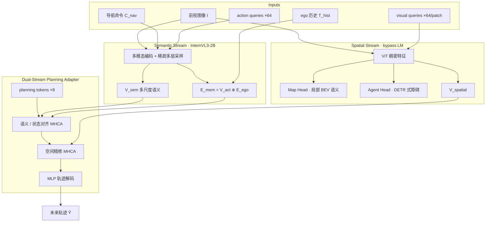

# S²-VLA（Semantic–Spatial Dual-Stream · 驾驶 VLA · arXiv:2607.13926）

**S²-VLA**（*Decoupling Semantic and Spatial Streams in Vision-Language-Action Models for Autonomous Driving*，亦写作 **S-squared-VLA**，[arXiv:2607.13926](https://arxiv.org/abs/2607.13926)）由 **武汉理工大学**（机械与电子工程学院、智能交通系统研究中心、计算机科学与人工智能学院）提出：在端到端自动驾驶 VLA 中 **显式解耦语义推理与空间感知**，用级联 **Dual-Stream Planning Adapter** 融合意图与几何约束，在 **NAVSIM** 闭环基准、**纯 SFT** 对照下报告 **PDMS 87.1** 与最高 **NC 98.4**。

> **命名注意：** 勿与操作域论文 *S2-VLA: State-Space Guided Vision-Language-Action Models for Long-Horizon Manipulation*（arXiv:2606.27872）混淆。

## 一句话定义

**别让驾驶轨迹只从被语言瓶颈压扁的语义向量里「猜」出来——语义流管意图，空间流绕过自回归头保住几何，再由规划适配器按「先意图、后几何」级联对齐。**

## 英文缩写速查

| 缩写 | 英文全称 | 简要说明 |
|------|----------|----------|
| S²-VLA / S-squared-VLA | Semantic–Spatial Dual-Stream Vision-Language-Action | 本文双流驾驶 VLA 框架 |
| VLA | Vision-Language-Action | 统一感知–推理–动作的策略族 |
| VLM | Vision-Language Model | 视觉–语言骨干（本文用 InternVL3-2B） |
| NAVSIM | Non-reactive Autonomous Vehicle Simulation | 闭环驾驶规划评测基准 |
| PDMS | Predictive Driver Model Score | NAVSIM 综合分（NC/DAC/EP/TTC/Comf） |
| NC | No Collision | 无碰撞率；本文报 98.4 |
| SFT | Supervised Fine-Tuning | 监督微调；本文强调与 RL 后训练对照公平 |
| BEV | Bird's-Eye View | 鸟瞰语义图；空间流 Map Head 输出 |
| LoRA | Low-Rank Adaptation | 第二阶段在冻骨干上低秩适配 |

## 核心信息

| 字段 | 内容 |
|------|------|
| **机构** | 武汉理工大学（Wuhan University of Technology） |
| **arXiv** | [2607.13926](https://arxiv.org/abs/2607.13926)（Submitted 2026-07-15） |
| **通讯作者** | Duanfeng Chu |
| **骨干** | InternVL3-2B（InternViT + Qwen2.5） |
| **传感器** | **仅前视相机**（无 LiDAR） |
| **评测** | NAVSIM navtest 闭环；纯 SFT |
| **开源** | **未开源**（截至 2026-07-23 无项目页 / 代码 / 权重） |

## 为什么重要

- **点名驾驶 VLA 的结构性失败模式：** 单流 SFT 把深层语义直接接到控制，会系统性地 **偏语义、丢几何**（spatial representation collapse），解释「会说话 / 粗行为对，但车道与边界不稳」。
- **与「加世界模型 / 加 RL」正交的架构轴：** 相对 [X-Foresight](./paper-x-foresight.md) 的内嵌预测式世界建模，S²-VLA 先在 **表征路由** 上保住未压缩空间特征；作者明确下一步可再接闭环 RL（如 GRPO）。
- **公平对照可读：** Table II 刻意剔除 AutoVLA / ReCogDrive 等的 RL 增强变体，只比 SFT 网络设计；在纯相机设定下逼近甚至超过部分 LiDAR E2E（如 ARTEMIS 87.0）。

## 核心原理

### 三模块分工

| 模块 | 输入 / 机制 | 输出角色 |
|------|-------------|----------|
| **Multi-Scale Semantic Stream** | 导航命令、前视图、\(N_{\mathrm{act}}=64\) action queries；稀疏采样层 \(\{3,8,13,18,23,24\}\)；ego 历史嵌入拼入 action 记忆 | 多尺度 \(V_{\mathrm{sem}}\) + 意图记忆 \(E_{\mathrm{mem}}\) |
| **Task-Driven Spatial Stream** | ViT 上 9-patch 动态分辨率 + 每 patch 64 visual queries；**绕过** 自回归 LM | \(V_{\mathrm{spatial}}\)；Map/Agent 头注入几何先验 |
| **Dual-Stream Planning Adapter** | \(M=8\) planning tokens；块内先语义/状态 MHCA（可学习门控），再对 \(V_{\mathrm{spatial}}\) 空间精修 | MLP → 未来轨迹 \(\hat{Y}\in\mathbb{R}^{8\times 3}\) |

### 流程总览

### 源码运行时序图

**不适用** — 截至 2026-07-23 论文与 arXiv 页 **未发布** 可运行训练 / 推理代码或权重；无官方仓库入口可对齐。

### 三阶段训练（工程配方）

1. **VLM SFT（3 epoch）：** ReCogDrive VQA，增强指令跟随与交通场景空间推理。
2. **意图 + 辅助感知（4 epoch）：** 冻 VLM，LoRA；暂解耦空间特征与 Adapter。
3. **视觉精修对齐（4 epoch）：** 冻感知与意图，专训空间精修侧，使轨迹贴合几何约束。

联合损失：\(\mathcal{L}_{\mathrm{total}}=\lambda_{\mathrm{plan}}\mathcal{L}_{\mathrm{plan}}+\lambda_{\mathrm{agent}}\mathcal{L}_{\mathrm{agent}}+\lambda_{\mathrm{map}}\mathcal{L}_{\mathrm{map}}\)（规划含 \(L_1\) + 加速度/jerk 平滑）。

## 工程实践

| 项 | 内容 |
|----|------|
| **硬件训练** | 4× NVIDIA A100；AdamW；batch 16；lr \(1\times10^{-4}\) |
| **LoRA** | \(r=8\)，\(\alpha=16\) |
| **损失权重** | \(\lambda_{\mathrm{plan}}=1.0\)，\(\lambda_{\mathrm{agent}}=0.1\)，\(\lambda_{\mathrm{map}}=0.5\)，\(\lambda_{\mathrm{smooth}}=0.5\) |
| **Map 范围** | 前向局部 BEV：\(X\in[0,32]\) m，\(Y\in[-32,32]\) m（单目前视） |
| **复现入口** | **无** — 仅能对照论文超参与 NAVSIM 协议；见 [NAVSIM](https://github.com/autonomousvision/navsim) 基准本身 |
| **源码运行时序图** | **不适用**（未开源） |

### NAVSIM 关键数字（论文 Table II / III，SFT-only）

| 方法 | PDMS ↑ | NC ↑ |
|------|--------|------|
| InternVL3-2B 文本头 | 84.1 | 97.6 |
| + 多尺度语义 Adapter | 85.6 | 98.2 |
| + 空间流 | 86.2 | 98.1 |
| + 辅助感知（全文） | **87.1** | **98.4** |
| ReCogDrive\* / ImagiDrive | 86.5 / 86.4 | 98.1 / 97.9 |
| [DiffusionDrive](./paper-diffusiondrive.md)（LiDAR E2E） | 88.1 | 98.2 |

\*RL 增强变体未纳入对照。

## 评测

- **基准：** NAVSIM navtest 闭环；指标为 PDMS 及其子项 NC / DAC / EP / TTC / Comf。
- **对照协议：** 只比 SFT / 行为克隆网络设计，剔除 AutoVLA、ReCogDrive 等的 RL（如 GRPO）后训练变体。
- **主结果：** 纯相机 S²-VLA **PDMS 87.1**、**NC 98.4**；相对同骨干 InternVL3-2B 文本头 **+3.0 PDMS**。

## 结论

**驾驶 VLA 里真正拉开差距的是「语义∥空间双流路由」保住未压缩几何；纯 SFT 下的 PDMS 增益可读，但不要把它读成全方法族（含 RL）的绝对第一。**

1. **空间流必须绕过自回归 LM** — 单流文本头 InternVL3-2B 仅 PDMS **84.1**；加多尺度语义 Adapter→**85.6**，再加空间流→**86.2**，全文（+辅助感知）→**87.1 / NC 98.4**，相对文本头 **+3.0 PDMS**。
2. **对照只比 SFT 网络设计** — Table II 刻意剔除 AutoVLA / ReCogDrive 等 RL（如 GRPO）变体；读榜时勿与带闭环 RL 后训练的方法直接比「绝对 SOTA」。
3. **纯前视相机仍逼近部分 LiDAR E2E** — 相对 ARTEMIS（PDMS 87.0）可读为同量级；相对 [DiffusionDrive](./paper-diffusiondrive.md)（88.1）仍在 DAC 等子项落后，闭环 RL 是作者标明的下一步。
4. **三阶段训练顺序有工程含义** — 先 VLM SFT，再冻骨干 LoRA 训意图+感知，最后专训空间精修；损失以 \(\lambda_{\mathrm{plan}}=1.0\) 为主、map/agent 辅之。
5. **复现边界：未开源** — 无权重与训练脚本，选型只能对照论文超参与 [NAVSIM](https://github.com/autonomousvision/navsim) 协议；勿与操作域 S2-VLA（arXiv:2606.27872）混淆命名。

## 与其他工作对比

| 对照对象 | 差异要点 |
|----------|----------|
| 单流 VLM/VLA（InternVL3 文本头、ReCogDrive 等） | 本文化解 **spatial representation collapse**：空间流绕过自回归量化 |
| [X-Foresight](./paper-x-foresight.md) | 小鹏路线偏 **内嵌预测世界模型**；本文偏 **语义∥空间双流表征路由** |
| [Qwen-RobotNav](./qwen-robot-nav.md) | RobotNav 是多任务导航基座（含 NAVSIM mode）；本文是 **驾驶专用** 端到端轨迹 VLA |
| [DiffusionDrive](./paper-diffusiondrive.md) / ARTEMIS 等 E2E | 常依赖 LiDAR 或重扩散解码；本文纯前视相机仍逼近 ARTEMIS PDMS |

## 局限与风险

- **算力：** 稠密空间特征提取 + 双流级联注意力有非平凡开销；作者拟用更稀疏几何注入降本。
- **开源缺口：** 无权重与训练脚本，工程选型只能读论文与 NAVSIM 公开协议，无法本地复现 PDMS。
- **SFT 天花板：** 相对 DiffusionDrive 等仍在 DAC 等子项落后；文中将闭环 RL 后训练列为自然下一步，勿把「纯 SFT VLA SOTA」误读为「全方法族绝对第一」。
- **单目前视：** Map Head 只重建前方可见局部 BEV，环视 / 远端拓扑仍依赖语义流抽象。

## 关联页面

- [VLA](../methods/vla.md) — 视觉–语言–动作方法纵览（含驾驶 VLA 条目）
- [X-Foresight](./paper-x-foresight.md) — 另一条驾驶 VLA 轴：内嵌 chunk-wise 预测世界模型（小鹏）
- [《自动驾驶核心算法盘点》技术地图](../overview/autonomous-driving-core-algorithms-series.md) — 经典模块化栈 ↔ 端到端 VLA 对照入口
- [Qwen-RobotNav](./qwen-robot-nav.md) — 亦报告 NAVSIM PDMS 的导航基座（任务 mode 含驾驶）
- [视觉–语言导航](../tasks/vision-language-navigation.md) — VLN / 导航与驾驶评测分界
- [五大具身模型分类](../comparisons/vlm-vln-vla-vlx-world-model-taxonomy.md) — VLM→VLA 能力边界

## 参考来源

- [sources/papers/s_squared_vla_arxiv_2607_13926.md](../../sources/papers/s_squared_vla_arxiv_2607_13926.md)
- [arXiv:2607.13926](https://arxiv.org/abs/2607.13926)

## 推荐继续阅读

- 论文 HTML：<https://arxiv.org/html/2607.13926>
- NAVSIM 基准：<https://github.com/autonomousvision/navsim>（Dauner et al., NeurIPS 2024）
- InternVL3：<https://arxiv.org/abs/2504.10479>
- 对照阅读：[X-Foresight 项目页](https://x-foresight-1.github.io/en/)（驾驶 VLA + 世界模型，未开源）
