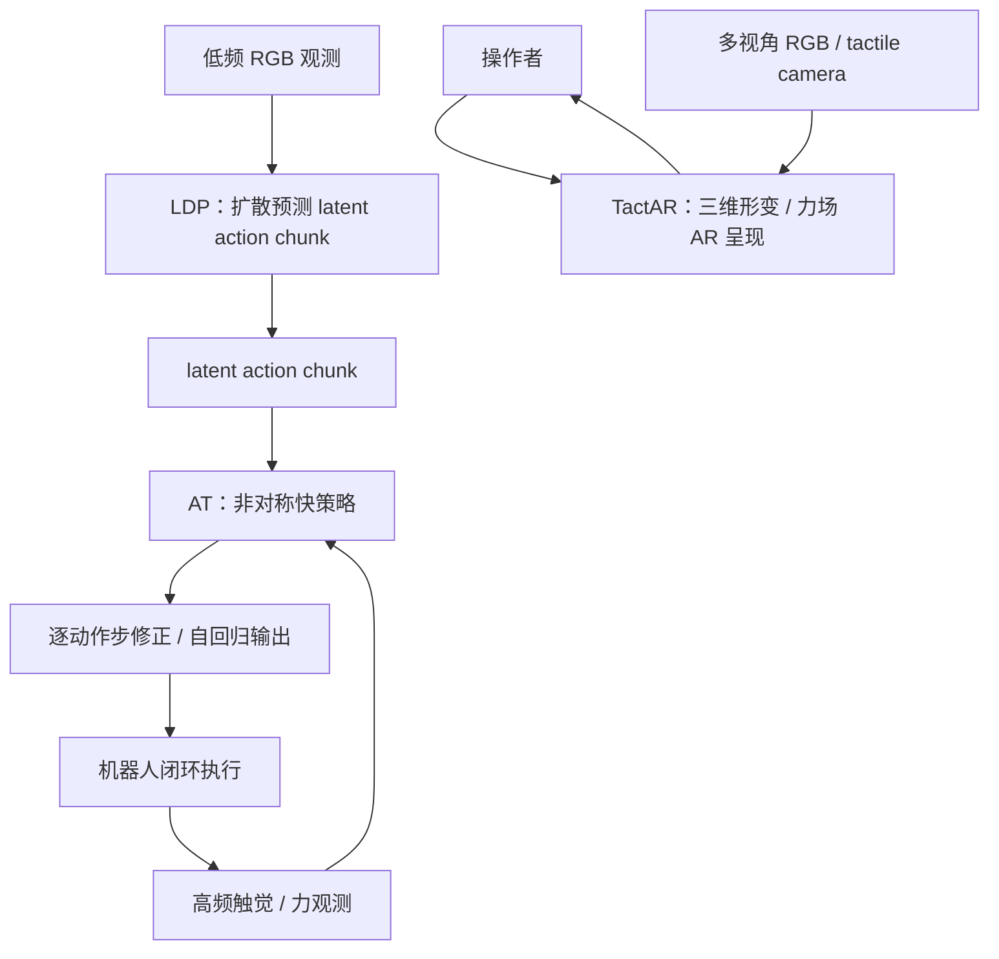

# Reactive Diffusion Policy（RDP）

**Reactive Diffusion Policy: Slow-Fast Visual-Tactile Policy Learning for Contact-Rich Manipulation** 将长时序视觉模仿与快速接触反馈拆成慢规划环和快反应环：慢速 latent diffusion policy 预测动作块，快速 asymmetric tokenizer 用高频触觉/力输入逐步修正该 latent chunk。配套 **TactAR** 将触觉传感器的三维形变/力场叠加到机械臂末端的 AR 坐标中，服务于接触丰富任务的遥操作采数。论文发表于 **RSS 2025**，并入围 **Best Student Paper Finalist**。

## 一句话定义

**扩散策略负责“接下来要做的一段动作”，触觉/力策略在每个动作步看接触并快速纠偏；TactAR 将接触信息空间化呈现给示教者。**

## 英文缩写速查

| 缩写 | 英文全称 | 简要说明 |
|------|----------|----------|
| RDP | Reactive Diffusion Policy | 本文慢–快视觉–触觉模仿策略 |
| TactAR | Tactile Augmented Reality | 将触觉/力场可视化叠加至 AR 的遥操作系统 |
| LDP | Latent Diffusion Policy | 低频预测 latent action chunk 的慢策略 |
| AT | Asymmetric Tokenizer | 快策略的非对称 tokenizer，用触觉/力和 latent 动作条件化逐步修正 |
| DP | Diffusion Policy | 视觉模仿学习扩散策略基线 |
| TCP | Tool Center Point | 机器人末端工具中心点 |

## 为什么重要

- Action chunking 有利于建模长程行为，但在 chunk 执行期间难以及时响应接触变化；RDP 将高频触觉/力反馈放回 chunk 内闭环。
- LDP 建模长时序、多模态动作块；AT 提供低延迟接触响应，不要求单一高频采样器承担完整规划。
- 论文展示 GelSight、MCTac 与力传感器配置，方法不局限于单一触觉相机。
- TactAR 把数据采集系统也纳入设计：空间化 AR 接触反馈帮助操作者理解接触状态。
- 后续端到端工作 [ImplicitRDP](./paper-implicitrdp-visual-force-diffusion-policy.md) 保留慢快时间结构，但不再采用显式独立快策略网络。

## 核心信息

| 项 | 内容 |
|----|------|
| 论文 | [arXiv:2503.02881](https://arxiv.org/abs/2503.02881)（v3，2025-04-23） |
| 会议 | Robotics: Science and Systems (RSS) 2025 |
| 奖项 | Best Student Paper Finalist |
| 作者 | Han Xue、Jieji Ren、Wendi Chen、Gu Zhang、Yuan Fang、Guoying Gu、Huazhe Xu、Cewu Lu |
| 机构 | 上海交通大学；清华大学 IIIS；上海齐智研究院；上海 AI Lab；上海创智学院 |
| 代码 | [RDP](https://github.com/xiaoxiaoxh/reactive_diffusion_policy)；[TactAR APP](https://github.com/xiaoxiaoxh/TactAR_APP) |
| 项目页 | [reactive-diffusion-policy.github.io](https://reactive-diffusion-policy.github.io/) |

## 方法与数据流

训练分两阶段：先训练快策略的 asymmetric tokenizer，再训练慢速 latent diffusion policy；推理时慢策略利用低频视觉生成动作块，快策略在 chunk 执行过程中根据高频触觉/力条件逐步自回归地细化该 chunk。慢层决定行为与时间结构，快层在接触反馈下调节动作。

## TactAR 遥操作系统

- 将光学触觉或力传感器信号表示成三维形变/力场，并以 AR 叠加到机器人末端附近。
- 支持多路 RGB 相机和触觉相机实时流；需标定虚拟坐标系与机器人 TCP / 世界坐标关系。
- 作者部署路径包含 Meta Quest 3、工作站、机器人与 RealSense 相机；TactAR APP 源码为 Unity 项目，可按文档构建 APK，也可下载 release APK。
- TactAR 是遥操作/数据采集界面，不是 RDP 推理策略；完整系统还需配置 ROS 2、机器人、传感器和数据录制服务。

## 评测与指标

论文项目页报告剥皮、擦拭、双臂提杯三项任务。前两项含扰动前、接触前扰动、接触后扰动；双臂提杯强调力控制与协同。下表汇总项目页公开的各自任务分数，不能解释为跨任务通用成功率。

| 任务 | 对照 | DP | RDP |
|------|------|----|-----|
| 剥皮 | Force 总分 | 0.44 | **0.95** |
| 剥皮 | GelSight / MCTac 总分 | — | 0.90 / 0.88 |
| 擦拭 | Force 总分 | 0.57 | **0.87** |
| 擦拭 | GelSight 总分 | — | 0.77 |
| 双臂提杯 | Force 总分 | 0.00 | **0.70** |
| 双臂提杯 | GelSight + MCTac 总分 | — | 0.48 |

- RTX 4090 上模块推理时间：DP 120 ms、RDP 慢策略 LDP 100 ms、快策略 AT <1 ms；并非机器人全链路端到端延迟。
- 10 位参与者的 TactAR 用户研究：规范化剥皮长度 0.72→0.91，稳定接触力比例 0.58→0.87。
- 这些结果依赖论文任务、示教数据、设备和判分口径，不保证直接外推到其他平台。

## 工程实践与开源边界

- RDP 仓库发布策略代码与部署/采数指南，链接数据集与模型入口；参考环境为 Ubuntu 22.04 / ROS 2 Humble、PyTorch 1.13.1 + CUDA 11.7。
- README 配置涵盖 Flexiv 双臂、Franka 单臂支持、RealSense、可选 GelSight Mini 与 Quest 3；这些是作者记录的配置，不是不可替代的最低要求。
- TactAR 仓库提供 Unity 源码、构建及使用指南和预构建 APK release。
- 运行前应核对各仓库当前 README、license 与硬件兼容信息；不推断代码、数据和模型共享同一许可。

## 与 ImplicitRDP 的方法对比

| 维度 | RDP | ImplicitRDP |
|------|-----|-------------|
| 设计 | 显式两级：LDP + AT | 统一端到端模型中的结构化慢快因果注意力 |
| 快速反馈 | AT 用高频 tactile/force 修正 latent chunk | 异步视觉/力 token 在统一模型内处理 |
| 关键取舍 | 模块边界清楚，快环低延迟；依赖慢层 latent | 减少显式交接与瓶颈；训练/因果结构更复杂 |

## 结论

**RDP 把低频视觉扩散动作块与高频接触反馈明确分层，让 chunk 执行期间不再完全开环；TactAR 让示教者也能利用空间化触觉反馈。**理解其结果时应保留各任务的分数口径与传感器配置；复现则需同时考虑策略代码、TactAR 硬件链路和机器人驱动。

## 局限与注意事项

- 显式慢快接口会压缩两层间信息，快层响应受慢层 latent chunk 约束；ImplicitRDP 的动机之一是减轻该瓶颈。
- TactAR 依赖 AR 设备、标定、网络和传感器同步；用户研究规模有限。
- 三项实机任务不能证明跨机器人、跨任务的普适性。
- 归一化分数、离散擦拭评分与双臂提杯分数口径不同，不能相互直接排序。

## 关联页面

- [ImplicitRDP：端到端视觉–力慢快扩散策略](./paper-implicitrdp-visual-force-diffusion-policy.md)
- [Diffusion Policy](../methods/diffusion-policy.md)
- [Imitation Learning](../methods/imitation-learning.md)
- [Contact-Rich Manipulation](../concepts/contact-rich-manipulation.md)
- [Manipulation](../tasks/manipulation.md)
- [Bimanual Manipulation](../tasks/bimanual-manipulation.md)
- [Awesome Touch 技术地图](../overview/sun-awesome-touch-technology-map.md)

## 参考来源

- [论文摘录与评测归档](../../sources/papers/reactive_diffusion_policy_2503_02881.md)
- [项目主页归档](../../sources/sites/reactive-diffusion-policy-github-io.md)
- [RDP 代码仓归档](../../sources/repos/reactive_diffusion_policy.md)
- [TactAR APP 仓归档](../../sources/repos/tactar-app.md)
- [Awesome Touch 清单摘录](../../sources/papers/sun_awesome_touch_2503_02881_reactive-diffusion-policy-slow-fast-visu.md)
