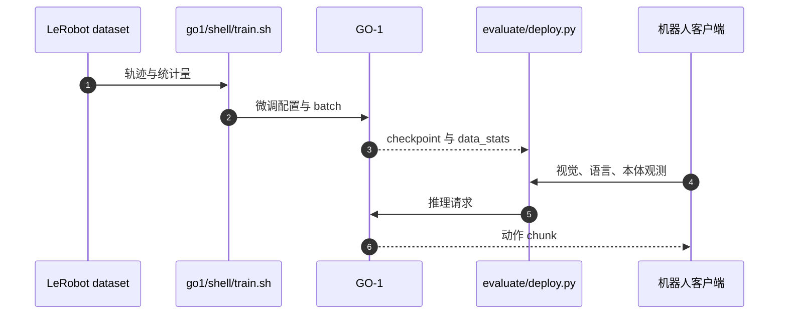

# AgiBot-World Colosseo：数据与通才策略平台

## 一句话定义

Colosseo 将大规模真机操作数据、评测与 GO-1 通才策略连接成可扩展平台；数据集发布与模型开源是不同时间的事件。

## 英文缩写速查

| 缩写 | 英文全称 | 简要说明 |
| --- | --- | --- |
| VLA | Vision-Language-Action | 视觉和语言条件下生成动作 |
| ViLLA | Vision-Language-Latent-Action | 用潜动作规划连接语义与动作 |
| AE | Action Expert | 把条件信息解码为动作块 |

## 为什么重要

- 提供规模化真机数据和可运行基线，适合研究数据混合、跨任务泛化与动作接口。
- 将 2025 数据/论文与后来开放的 GO-1 区分，避免沿用“仅数据开放”的旧结论。

## 核心原理

论文的 GO-1 使用 **ViLLA**：视觉语言骨干提取条件，Latent Planner 提供潜动作计划，Action Expert 生成动作 chunk。官方 **GO-1 Air 不含 Latent Planner**，可用于检查规划模块的成本与收益。

数据覆盖约百万轨迹、100 台机器人、100 多个真实场景；这些是数据集规模说明，不能替代任务覆盖、轨迹质量和训练采样比例检查。

## 源码运行时序图

训练与服务是两个阶段；客户端执行动作后采集新观测形成闭环。

## 数据模态与版本

公开 LeRobot 复现接口包含 RGB、语言、机器人状态与动作轨迹；各 split 是否有深度/触觉，以实际字段为准。平台介绍中的触觉硬件不表示全部轨迹都含触觉监督。

## 工程实践

1. 先用 LeRobot 格式查看观测、动作、语言和统计量；`scripts/visualize_dataset.py` 可检查单任务。
2. 用 `go1/configs/go1_sft_libero.py` 设置数据、动作维度、chunk 和频率；`go1/shell/train.sh` 启动微调。
3. `evaluate/deploy.py` 提供策略服务；实机适配仍须明确机器人观测与动作语义。
4. **2026-10-05 核查**：GO-1 / GO-1 Air 权重、微调/推理代码及数据已有入口；2025-09-19 是 GO-1 开源事件，非论文发表日。仓库声明 **CC BY-NC-SA 4.0**，含非商用限制。

## 评测与指标

复现时分别报告数据版本、任务划分和基座（GO-1 / GO-1 Air）。README 给出的显存参考为推理约 **7 GB**、全参微调约 **70 GB**、仅 Action Expert 微调约 **24 GB**（微调 batch=16）；配置变化会改变需求。

## 结论

**Colosseo 的工程价值是把数据、模型与微调/服务入口同时开放。**

1. 锁定数据版本及训练/测试划分。
2. 以 GO-1 Air 对照潜规划模块收益。
3. 在自有硬件上验证动作接口和许可适用范围。

## 与其他工作对比

GO-1 与 GO-1 Air 的差别是 Latent Planner，可作为潜动作规划的结构对照。[AgiBot World 2026](agibot-world-2026.md) 是后续数据发布，不是原始 Colosseo 的别名；GO-2 也应按独立模型的训练/评测口径阅读。

## 局限与风险

- 公开数据并不意味着所有本体均可直接部署；传感器与动作接口需要适配。
- 不把 2026 新数据集描述回填为原始 Colosseo 的实验证据。

## 关联页面

- [智元数据平台](./agibot-world-2026.md)
- [GO-2](./go-2.md)
- [世界模型](../methods/generative-world-models.md)

## 参考来源

- [官方数据与 GO-1 仓库核查](../../sources/repos/agibot-world.md)
- [AgiBot World 项目页](../../sources/sites/agibot-world.md)

## 推荐继续阅读

- [官方仓库](https://github.com/OpenDriveLab/AgiBot-World)
- [论文](https://arxiv.org/abs/2503.06669)
