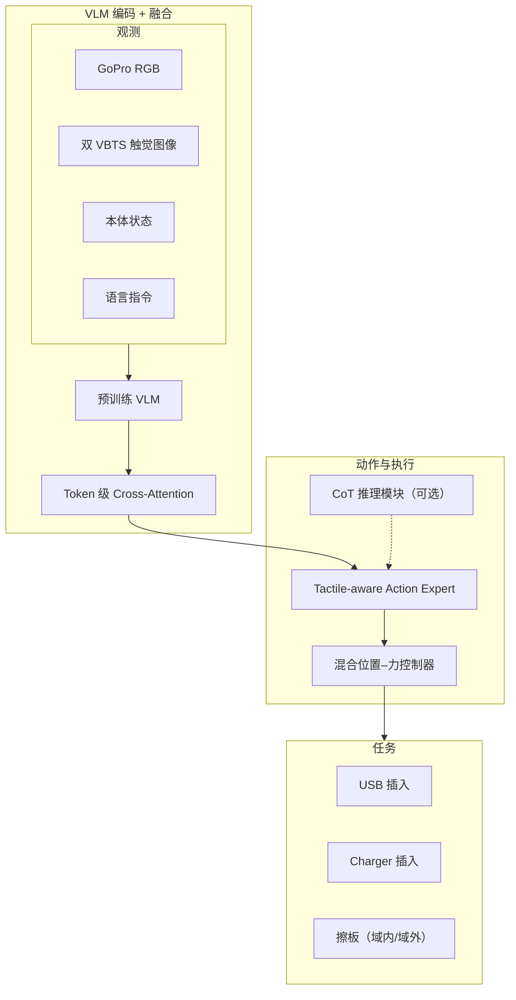

# Tactile-VLA：解锁 VLA 物理知识用于触觉泛化（arXiv:2507.09160）

**Tactile-VLA**（*Unlocking Vision-Language-Action Model's Physical Knowledge for Tactile Generalization*，[arXiv:2507.09160](https://arxiv.org/abs/2507.09160)，Jialei Huang 等 · **清华大学 / UESTC / 上海交大**；[项目页](https://jialeihuang.github.io/tactileVLA.github.io/)）把预训练 VLM 的 **物理交互语义** 用少量触觉 demo **激活**：token 级 cross-attention 融合 RGB+语言+触觉+本体，**tactile-aware action expert** 输出位置与力目标，经 **混合位置–力控制器** 执行。

## 一句话定义

**在 VLA 里把触觉当作「激活 VLM 已有物理常识」的开关——混合位置–力控制 + 可选 CoT，使力相关语言零样本泛化，擦板域外黑板 80% 而基线 0%。**

## 英文缩写速查

| 缩写 | 英文全称 | 简要说明 |
|------|----------|----------|
| Tactile-VLA | — | 本文视–触–语–动融合 VLA |
| VTLA | Vision-Tactile-Language-Action | 视触觉语言动作策略族 |
| VLA | Vision-Language-Action | 视觉–语言–动作多模态策略 |
| CoT | Chain-of-Thought | Tactile-VLA-CoT 自适应推理变体 |
| VBTS | Vision-Based Tactile Sensing | UMI 夹爪双高分辨率 VBTS |
| UMI | Universal Manipulation Interface | 数据采集夹具形态 |

## 核心信息

| 项 | 内容 |
|----|------|
| 机构 | Tsinghua University；UESTC；Shanghai Jiao Tong University |
| 采集 | UMI 夹爪 + **双 VBTS** + GoPro |
| 控制器 | **混合位置–力控制器**（hybrid position–force） |
| 变体 | Tactile-VLA；**Tactile-VLA-CoT**（触觉参与自适应推理） |
| 开源（2026-09-23） | **待发布** — 项目页 GitHub **Coming Soon** |

## 为什么重要

- **VLM 物理知识可被触觉激活：** 证明语义先验已含力相关概念；少量接触觉 demo 即可 **零样本** 分离 softly/hardly 等力词（**4.68 N vs 9.13 N**）。
- **混合位置–力控制是 VTLA 落地关键：** 纯位置 VLA 在 Charger 等接触丰富任务 brittle；本文 **90% vs π₀-base 40%**。
- **CoT 解决域外推理：** 擦板力不足时 CoT 读触觉反馈增力；域外黑板 **80% vs 基线 OOD 0%**。
- **与同批 VTLA 对照轴：** [ForceVLA](./paper-forcevla.md) 走低维 F/T+MoE；[OmniVTLA](./paper-sa-2508-08706-omnivtla-vision-tactile-language-action-model-wi.md) 走 SA-ViT 语义对齐；[TaF-VLA](./paper-sa-2601-20321-taf-vla-tactile-force-alignment-in-vision-langua.md) 走触觉–力 latent 对齐。

## 核心贡献/方法

| 模块 | 要点 |
|------|------|
| **Token 级融合** | 视觉、语言、触觉、本体经 VLM 编码后 **自由 cross-attend** |
| **Action expert** | 同时预测 **目标位置与力**；非仅位置 chunk |
| **混合控制器** | 位置–力混合执行；接触丰富阶段可力主导 |
| **三能力轴** | (1) 触觉感知指令跟随；(2) 触觉常识抓取；(3) CoT 自适应推理 |
| **零样本力语言** | 未见 Charger 上 softly **4.68 N** vs hardly **9.13 N**；基线力–语言无相关 |

## 流程总览

## 评测与指标

| 任务/设置 | Tactile-VLA | π₀-base | 备注 |
|-----------|-------------|---------|------|
| USB 插入 | **35%** | **5%** | 成功率 |
| Charger 插入 | **90%** | **40%** | 成功率 |
| 力词 softly（未见物体） | **4.68 N** | 无相关 | vs hardly **9.13 N** |
| 擦板域内 | **80%** | — | CoT 变体 |
| 擦板域外（黑板） | **80%** | **0%** | CoT vs 基线 OOD |

## 与其他工作对比

| 维度 | Tactile-VLA | ForceVLA | OmniVTLA | TaF-VLA |
|------|-------------|----------|----------|---------|
| 力/触觉模态 | VBTS 图像 + **显式力目标** | 6 轴 F/T + FVLMoE | SA-ViT 语义触觉 | 触觉–力 latent 对齐 |
| 控制 | **混合位置–力** | Flow matching π₀ | 标准 VTLA | VLA + TaF-Adapter |
| 推理 | **CoT** | 无 | 无 | 力感知语言微调 |
| 开源 | Coming soon | 待发布 | 数据已放 | 部分 |

## 结论

**Tactile-VLA 的核心不是「再加触觉 token」，而是用触觉激活 VLM 里已有的物理语义，并用混合位置–力控制把语义落到接触相位——CoT 把这一能力延伸到域外擦板（80% vs 0%）。**

1. **Charger 90%** — 混合力控相对 π₀-base 40% 是最硬的成功信号。
2. **力语言零样本** — softly/hardly 在未见物体上仍分离 ~4.5 N，说明 VLM 物理先验可触达。
3. **CoT 专打 OOD** — 黑板擦板 80% vs 基线 0%；域内也到 80%。
4. **双 VBTS UMI** — 采集栈与 [Sparsh](./paper-sparsh.md) 类 VBTS 表征可后续对接。
5. **代码未发** — 复现需等 GitHub；项目页表格可作指标锚点。
6. **与 ForceVLA 互补** — 本文 VBTS+力目标 vs F/T MoE；见 [九篇地图](../overview/tactile-intelligence-nine-papers-map.md)。

## 源码运行时序图

**不适用**（截至 **2026-09-23**：项目页 **Code & Data → GitHub Coming Soon**，无公开训练/推理仓；见 [`sources/sites/tactile-vla-jialeihuang.md`](../../sources/sites/tactile-vla-jialeihuang.md)）。

## 局限与风险

- 仅 UMI 双 VBTS + 少量 demo 任务；跨传感器/跨本体未充分验证。
- CoT 推理延迟与稳定性未系统报告。
- 混合力控标定与硬件 F/T 传感器关系未在本文完全展开（对照 [ForceVLA](./paper-forcevla.md) 低维 wrench）。
- **开源待发布**，工程复现窗口未定。

## 关联页面

- [VLA](../methods/vla.md) — π₀-base 基线语境
- [视触觉融合](../concepts/visuo-tactile-fusion.md) — 双 VBTS 融合
- [接触丰富操作](../concepts/contact-rich-manipulation.md) — USB/Charger/擦板
- [ForceVLA](./paper-forcevla.md) — 力觉 MoE 对照
- [OmniVTLA](./paper-sa-2508-08706-omnivtla-vision-tactile-language-action-model-wi.md) — 语义对齐 VTLA
- [触觉智能九篇地图](../overview/tactile-intelligence-nine-papers-map.md) — VTLA 层总览

## 参考来源

- [Tactile-VLA 论文归档（arXiv:2507.09160）](../../sources/papers/tactile_vla_arxiv_2507_09160.md)
- [Tactile-VLA 项目页归档](../../sources/sites/tactile-vla-jialeihuang.md)

## 推荐继续阅读

- [项目页](https://jialeihuang.github.io/tactileVLA.github.io/) — 架构图、定量表、CoT 视频
- [arXiv:2507.09160](https://arxiv.org/abs/2507.09160) — 方法与附录
- [Awesome Touch 技术地图](../overview/sun-awesome-touch-technology-map.md) — VTLA 分组坐标
