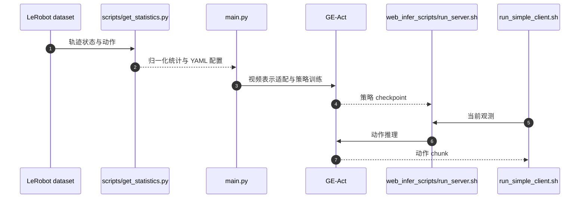

# Genie Envisioner：世界模型、策略与视觉仿真

## 一句话定义

Genie Envisioner 以 GE-Base 视频预训练表示为底座，分别适配 GE-Act 动作生成与 GE-Sim 动作条件视觉仿真，三者有不同运行接口。

## 英文缩写速查

| 缩写 | 英文全称 | 简要说明 |
| --- | --- | --- |
| VLA | Vision-Language-Action | 视觉和语言条件下生成动作 |
| WM | World Model | 预测未来视觉状态的模型 |
| EWMB | Embodied World Model Benchmark | 评估具身世界模型的基准 |

## 为什么重要

- 共享预训练表示，分开验证“能预测未来”与“能控制机器人”。
- GE-Sim 是视觉模拟，不应被当作具有精确接触力学的物理仿真器。

## 核心原理

| 分支 | 条件与目标 | 用途 |
| --- | --- | --- |
| GE-Base | 观测/语言到未来视频 | 世界表示预训练 |
| GE-Act | 在共享表示上接动作学习 | 机器人操作策略 |
| GE-Sim | 加入动作条件预测视频 | 策略视觉 rollout / 测试 |

仓库支持 LTX 与 Cosmos 系视频骨干；当前公开版本与论文初版要按配置区分。GE-Sim 2、GE-Act 2 是后续独立工作，不能把它们的架构和评测归给 V1。

## 源码运行时序图

图对应 GE-Act 路径；GE-Sim 的动作条件视频生成使用另一入口，不能替代策略执行。

## 工程实践

1. 自有 LeRobot 数据先由 `scripts/get_statistics.py` 计算状态/动作统计，配置数据路径、动作维度与归一化。
2. `scripts/train.sh main.py` 分别使用 `video_model_lerobot.yaml` 与 `policy_model_lerobot.yaml` 训练视频/策略；视频推理由 `scripts/infer.sh` 进入。
3. `web_infer_scripts/run_server.sh` 与客户端用于 GE-Act 部署；GE-Sim 另用 `gesim_video_gen_examples/infer_gesim.py`。
4. **2026-10-05 核查**：训练/推理代码、GE-Base、Calvin GE-Act、Cosmos2 GE-Sim 权重有公开入口。部分复用目录 Apache-2.0，其余代码/数据 CC BY-NC-SA 4.0，不能把整仓称为宽松商用许可。

## 评测与指标

GE-Base 读世界预测与 EWMB；GE-Act 读操作成功率（公开 Calvin 权重与评测说明）；GE-Sim 读动作条件预测和策略 rollout。比较必须同时绑定分支、骨干、数据与采样配置。

## 结论

**共享世界表示可以支持三个用途，但各分支的有效性需要分别验证。**

1. 按 GE-Base / GE-Act / GE-Sim 选择入口。
2. 先验证统计量与动作维度，再微调部署。
3. 不以视觉质量推定闭环控制可靠性。

## 与其他工作对比

[GE-Sim 2](ge-sim-2.md) 延续动作条件视觉模拟并扩展闭环评测，[GE-Act 2](paper-ge-act-2.md) 是后续世界–动作策略；[Genie Sim 3](genie-sim-3.md) 是仿真平台。共享 Genie 名称不表示三者同一模型或同一物理接口。

## 局限与风险

- 视频逼真度、动作正确性与物理一致性是不同指标。
- 权重开放不等于全部预训练混合数据开放；各分支资源与许可单独核对。

## 关联页面

- [智元数据平台](./agibot-world-2026.md)
- [GO-2](./go-2.md)
- [世界模型](../methods/generative-world-models.md)
- [GE-Sim 2](./ge-sim-2.md)
- [GE-Act 2](./paper-ge-act-2.md)

## 参考来源

- [Genie Envisioner 官方源码核查](../../sources/repos/genie-envisioner-v1.md)

## 推荐继续阅读

- [项目页](https://genie-envisioner.github.io/)
- [官方源码](https://github.com/AgibotTech/Genie-Envisioner-V1)
