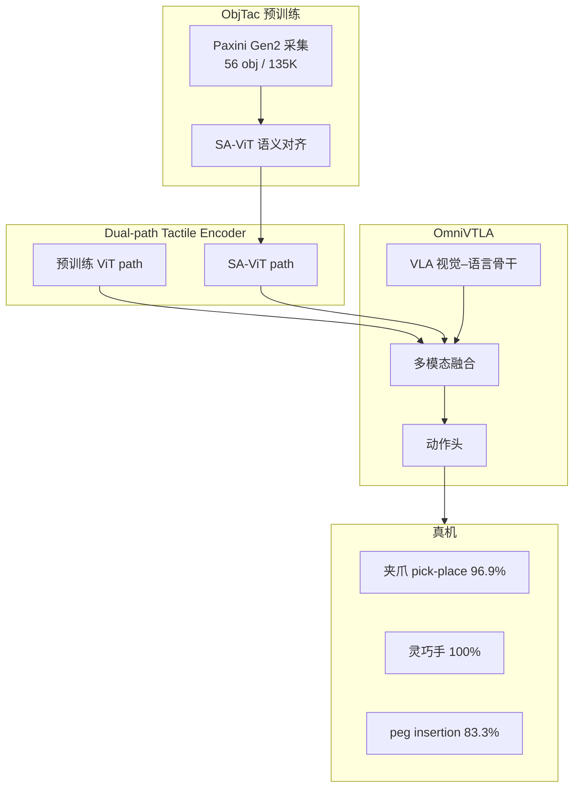
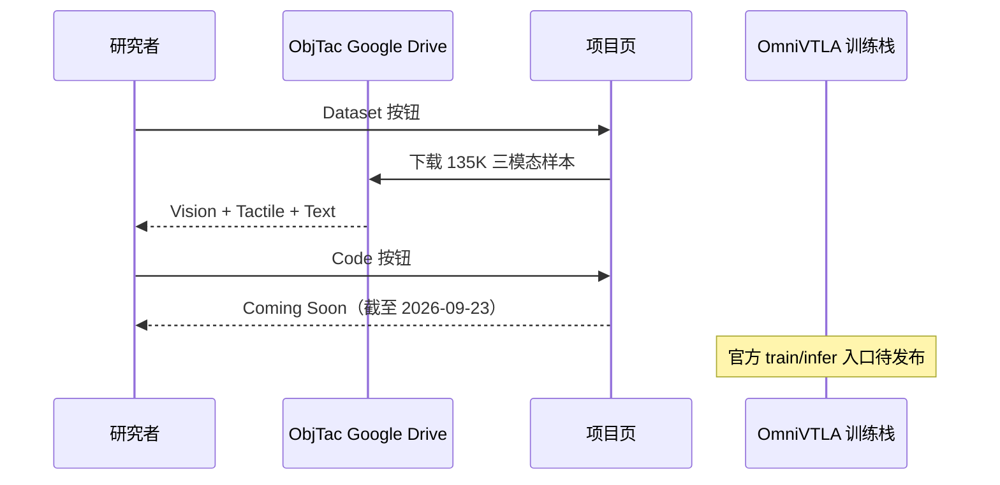

# OmniVTLA：语义对齐触觉的 VTLA（arXiv:2508.08706）

**OmniVTLA**（*Vision-Tactile-Language-Action Model with Semantic-Aligned Tactile Sensing*，[arXiv:2508.08706](https://arxiv.org/abs/2508.08706)，Zhengxue Cheng 等 · **上海交通大学 / Paxini Tech**；[项目页](https://readerek.github.io/Objtac.github.io/)）提出 **语义对齐 VTLA**：双路径触觉编码（预训练 ViT + **SA-ViT**）+ **ObjTac**（56 物体 / 10 类 / **135K** 视–触–文三模态样本），使触觉 latent 与 CLIP/SigLIP 式视觉–语言语义同构。

## 一句话定义

**把触觉从「低维力向量拼接」升级为与视觉/语言语义对齐的 SA-ViT 表征，再用 dual-path encoder 驱动 VTLA——夹爪 pick-place 96.9%、灵巧手 100%、peg insertion 83.3%。**

## 英文缩写速查

| 缩写 | 英文全称 | 简要说明 |
|------|----------|----------|
| OmniVTLA | — | 本文语义对齐 VTLA |
| VTLA | Vision-Tactile-Language-Action | 视–触–语言–动作 |
| SA-ViT | Semantically-Aligned Tactile ViT | ObjTac 上对比学习的语义触觉 ViT |
| ObjTac | — | 56 物体 135K 三模态数据集 |
| VLA | Vision-Language-Action | 视觉–语言–动作策略 |
| ViT | Vision Transformer | dual-path 通用支路与 SA-ViT 支路 |

## 核心信息

| 项 | 内容 |
|----|------|
| 机构 | Shanghai Jiao Tong University；Paxini Tech |
| 通讯作者 | Zhengxue Cheng（zxcheng@sjtu.edu.cn） |
| 传感器 | Paxini Gen2 **力阵列触觉** + 720P 30 FPS 第一视角视频 + 文本 |
| ObjTac | **56** 物体 / **10** 材质类 / **135K** 配对（270k 力记录筛选） |
| 开源（2026-09-23） | **部分开源** — [ObjTac Google Drive](https://drive.google.com/drive/folders/1jamNGWYhCk-uVKtrleF55WUpHctmOQBH)；OmniVTLA 代码 **Coming Soon** |

## 为什么重要

- **触觉需要语义对齐而非仅低维拼接：** 图像编码器继承 CLIP/SigLIP 对齐；触觉侧 SA-ViT 在 ObjTac 上对齐材质/粗糙度/硬度等 **latent 概念**。
- **ObjTac 填补三模态缺口：** 力阵列 + 视频 + 文本；60 Hz 力数据；相对纯 visuo-tactile 轨迹补 **语言描述层**。
- **真机轨迹质量：** 语义触觉 cues 使策略 **「远快近慢」** — 无接触快速接近、接触段平滑减速。
- **与 [Sparsh](./paper-sparsh.md) 分工：** Sparsh 跨 VBTS SSL；OmniVTLA 走 **力阵列 + 语义对齐 VTLA** 端到端。

## 核心贡献/方法

| 模块 | 要点 |
|------|------|
| **ObjTac** | 56 物体 × 10 类；每物体 2–5 次交互；Text + Vision + Tactile |
| **SA-ViT** | ObjTac 对比学习；触觉与视觉/语言概念对齐 |
| **Dual-path encoder** | 通用预训练 ViT path + SA-ViT path；参数匹配 controlled ablation |
| **OmniVTLA** | 端到端接触丰富操作；继承 VLA 视觉–语言语义 |
| **轨迹行为** | 接触前高速接近、接触后平滑减速 |

## 流程总览

## 评测与指标

| 任务 | OmniVTLA | 基线提升 | 备注 |
|------|----------|----------|------|
| Pick-and-place（夹爪） | **96.9%** | **+21.9 pt** | 成功率 |
| Pick-and-place（灵巧手） | **100%** | **+6.2 pt** | 成功率 |
| Peg insertion | **83.3%** | **+33.3 pt** | 成功率 |
| 轨迹 | 更短完成时间 | — | 更平滑减速 |

## 与其他工作对比

| 维度 | OmniVTLA | Tactile-VLA | ForceVLA | Sparsh |
|------|----------|-------------|----------|--------|
| 触觉表征 | **SA-ViT 语义对齐** | VBTS token 融合 | 6 轴 F/T MoE | SSL frozen encoder |
| 数据 | **ObjTac 135K 三模态** | UMI demo | ForceVLA-Data | 661k 无标 SSL |
| 控制 | 标准 VTLA 动作 | **混合位置–力** | π₀ flow | probe/DP |
| 开源 | 数据已放 | Coming soon | 待发布 | ARCHIVED 全栈 |

## 结论

**OmniVTLA 的主张是：VTLA 里触觉必须是语义对齐的 latent（SA-ViT），而不是力向量的 append——ObjTac 135K + dual-path 在 pick-place 与 peg 上分别拉到 96.9%/100% 与 83.3%。**

1. **SA-ViT 是核心** — 相对 vanilla ViT path，语义对齐 path 驱动「远快近慢」轨迹。
2. **ObjTac 可先用** — Drive 已放；135K 三模态适合预训 SA-ViT 或对照实验。
3. **灵巧手 100%** — 相对夹爪 +6.2 pt 较小，但绝对成功率封顶。
4. **Peg +33.3 pt** — 接触丰富插入任务增益最大。
5. **代码待发** — 训练/推理仓 Coming Soon；权重未独立 HF 发布。
6. **与 Sparsh 可组合** — dual-path 的通用 ViT 支路可接 frozen Sparsh（见 [九篇地图](../overview/tactile-intelligence-nine-papers-map.md)）。

## 源码运行时序图

**不适用（训练/推理栈）** — OmniVTLA 代码 **Coming Soon**；**ObjTac 数据集** 可独立下载用于 SA-ViT 预训练或分析：

## 局限与风险

- Paxini Gen2 力阵列；跨 DIGIT/GelSight（[Sparsh](./paper-sparsh.md) 族）泛化未验证。
- SA-ViT 权重未独立发布；复现 VTLA 需等官方代码。
- ObjTac 文本描述质量与 VLA 指令分布耦合；下游任务迁移需验证。
- **部分开源** — 勿误写为全栈已开源。

## 关联页面

- [视触觉融合](../concepts/visuo-tactile-fusion.md) — 三模态对齐
- [触觉传感](../concepts/tactile-sensing.md) — 力阵列数据轴
- [VLA](../methods/vla.md) — VTLA 骨干
- [Sparsh](./paper-sparsh.md) — VBTS SSL 对照
- [Tactile-VLA](./paper-sa-2507-09160-tactile-vla-unlocking-vision-language-action-mod.md) — 混合力控 VTLA
- [触觉智能九篇地图](../overview/tactile-intelligence-nine-papers-map.md) — VTLA 层
- [机器人视觉感知栈选型闭环](../queries/robot-perception-stack-selection-loop.md) — 本页归其 ④ 下游策略消费层：视触觉感知输出如何被 VTLA 策略语义对齐后消费

## 参考来源

- [OmniVTLA 论文归档（arXiv:2508.08706）](../../sources/papers/omnivtla_arxiv_2508_08706.md)
- [ObjTac / OmniVTLA 项目页归档](../../sources/sites/objtac-omnivtla.md)

## 推荐继续阅读

- [项目页](https://readerek.github.io/Objtac.github.io/) — ObjTac 规格、力阵列可视化、真机视频
- [ObjTac Google Drive](https://drive.google.com/drive/folders/1jamNGWYhCk-uVKtrleF55WUpHctmOQBH) — 数据集下载
- [arXiv:2508.08706](https://arxiv.org/abs/2508.08706) — dual-path ablation 全文
