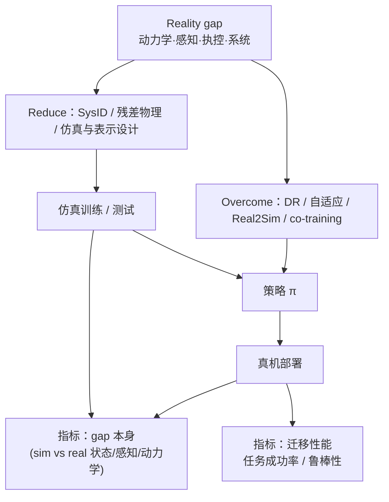

# Reality Gap in Robotics：Sim2Real 综述

**The Reality Gap in Robotics: Challenges, Solutions, and Best Practices**（[arXiv:2510.20808](https://arxiv.org/abs/2510.20808)，[项目页](https://robotics-reality-gap.github.io/)）由 **苏黎世大学 RPG、NVIDIA、悉尼大学、华盛顿大学、犹他大学** 等联合撰写，拟刊于 **Annual Review of Control, Robotics, and Autonomous Systems 2026**。本文是 **Sim2Real 全景综述**：先定义 gap，再按 **动力学 / 感知 / 执控 / 系统设计** 四类来源拆解，将方法分为 **缩小 gap（仿真侧）** 与 **跨越 gap（策略侧）**，并区分 **gap 评测** 与 **迁移评测**。同时收录于 [Awesome-Real2Sim2Real](https://github.com/sun254667/Awesome-Real2Sim2Real) 清单 **063/063**（Surveys & Overviews）。

## 一句话定义

**把「仿真–真机不一致」拆成可定位的四类来源，再用 Reduce / Overcome 两套工具箱与双轨指标，给出可操作的 Sim2Real 工程 recipe。**

## 英文缩写速查

| 缩写 | 英文全称 | 简要说明 |
|------|----------|----------|
| Sim2Real | Simulation to Real | 仿真训练策略部署到真机 |
| Real2Sim | Real to Simulation | 用真机数据校准或重建仿真 |
| DR | Domain Randomization | 训练时随机化仿真参数以提升鲁棒性 |
| SysID | System Identification | 辨识并标定仿真/真机动力学参数 |
| POMDP | Partially Observable Markov Decision Process | 部分可观测 MDP；系统设计与观测 gap 常用形式化 |
| R2S2R | Real2Sim2Real | 真机→仿真→真机闭环数据与训练 |

## 为什么重要

- **Annual Review 级坐标：** 在 navigation / locomotion / manipulation 均已依赖仿真的背景下，给出 **gap 因果链 + 方法 taxonomy**，适合作为站内 Sim2Real 主题的 **2026 总览锚点**（相对单篇 DR / SysID 论文）。
- **Reduce vs Overcome 分工：** 避免「只堆 DR」或「只调 URDF」——先判断 gap 能否在仿真侧消掉，再选策略侧鲁棒/自适应手段；与 [四条路线（可辨识性）](../comparisons/sim2real-four-routes-identifiability.md) 症状查表可并用。
- **双轨评测：** 强调 **gap 本身** 与 **迁移后任务表现** 不是同一指标；只报 sim reward 或 sim success rate 不足以证明可部署。

## 核心信息

| 项 | 内容 |
|----|------|
| **机构** | 苏黎世大学机器人与感知组（University of Zurich, RPG）；英伟达（NVIDIA）；悉尼大学（The University of Sydney）；华盛顿大学（University of Washington）；犹他大学（University of Utah） |
| **类型** | Survey / Annual Review（非单一系统论文） |
| **项目页** | <https://robotics-reality-gap.github.io/> |
| **开源** | **不适用** — 截至 2026-10-01 [项目页核查](../../sources/sites/robotics-reality-gap.md) **未列** GitHub / 数据集；综述无官方可运行代码 |
| **清单坐标** | Awesome-Real2Sim2Real **063/063**，分组 Surveys & Overviews |

## 核心原理

### Reality gap 的四类来源（Section 3）

| 维度 | 典型差异（归纳） |
|------|------------------|
| **Dynamics** | 刚体/接触/摩擦建模、参数、积分器、人机交互、未建模效应、网格与资产保真 |
| **Perception & Sensing** | 传感器模型与噪声、环境表示、本体/碰撞感知 |
| **Actuation & Control** | 执行器模型、底层 PD/力控、电力电子与饱和 |
| **System Design** | 通信延迟、安全机制、POMDP 建模、实现与栈差异 |

工程上应先 **定位主 gap 落在哪一层**，再选 Section 4 的方法；同一策略可能在多层同时失配。

### 流程总览：来源 → 手段 → 评测

### 方法 taxonomy：Reduce vs Overcome（Section 4）

| 族 | 意图 | 代表方向（综述归类） |
|----|------|----------------------|
| **Reducing the gap** | 让仿真更接近真机 | 系统辨识与标定、学习残差动力学、硬件–仿真协同、提高仿真保真、模态/状态–动作抽象与表示选择 |
| **Overcoming the gap** | 让策略对剩余差异不敏感或可适应 | 域随机化、域泛化/自适应、真机数据选择与探索、策略架构与正则、Real2Sim、sim–real 协同训练 |

文中 **Sim-to-Real Recipe**（归纳）：(1) 仿真覆盖任务相关变量；(2) 逐分量尝试 **Reduce**；(3) 对不可建模部分用 **Overcome**；(4) 同时报告 **gap 指标** 与 **迁移指标**。

### 开放问题（Section 6，读法摘要）

- **「错模型 + 强控制器」边界：** 何种任务可容忍简化物理，何时必须 SysID / 可微仿真？
- **可微仿真、视频/世界模型、仿真推断、大模型+仿真：** 与当前 [Sim2Real 概念页](../concepts/sim2real.md) 中的数据飞轮、Real2Sim 管线主题直接衔接。

## 源码运行时序图

**不适用** — 本文为 Annual Review **综述**，[项目页](https://robotics-reality-gap.github.io/) 未提供官方训练/推理仓库（见 [sources/sites/robotics-reality-gap.md](../../sources/sites/robotics-reality-gap.md)）。

## 评测与指标

- **Assessing the reality gap（Section 5.1）：** 度量仿真与真机在状态、感知、动力学等层面的 **差异本身**（与任务无关或弱相关）。
- **Assessing sim-to-real transfer（Section 5.2）：** 度量策略在真机上的 **任务表现、鲁棒性、样本效率** 等。
- **本页不搬运** 原文逐条 metric 公式表；具体定义与引用文献以 [PDF/HTML](https://arxiv.org/abs/2510.20808) 为准。
- **实践建议：** 部署前至少做一次 **sim vs real 对照实验**（同一策略、同一任务协议），再报真机指标——可与 [Sim2Real checklist](../queries/sim2real-checklist.md) 对齐。

## 与其他工作对比

| 对照 | 关系 |
|------|------|
| [Sim2Real 方法横向对比](../comparisons/sim2real-approaches.md) | 本站 DR / DA / 真机微调 **三大范式**；本综述 **更细的分层来源 + Reduce/Overcome** |
| [四条路线（可辨识性）](../comparisons/sim2real-four-routes-identifiability.md) | 偏 **工程症状与路线选择**；本综述偏 **Annual Review 文献全景** |
| [PACE](../entities/paper-pace-sim2real-legged-robots.md) | 足式 **SysID + Reduce** 实例 |
| [Acosta 等：仿真器冲击验证](../entities/paper-acosta-validating-simulators-real-world-impacts.md) | **Dynamics / 接触** gap 与 DR 语境的单篇代表 |

## 结论

**这是 2026 年值得优先 bookmark 的 Sim2Real 综述：价值在 taxonomy 与 recipe，不在某个可一键复现的 repo。**

- **先定位 gap 层：** 动力学 / 感知 / 执控 / 系统栈——四类来源决定该 SysID、改传感器管线还是 DR+自适应。
- **Reduce 与 Overcome 不要混为一谈：** 能在仿真侧消掉的差异（参数、资产、延迟建模）优先 Reduce；不可建模部分再上 DR、Real2Sim、co-training。
- **评测必须双轨：** 单独 sim 曲线无法证明 gap 已关；需要 gap 指标 + 真机任务指标成对报告。
- **与清单条目关系：** Awesome **063/063** 提供策展坐标；**方法细节与 metric 定义以 Annual Review 原文为准**。
- **开源：** 无官方代码；选型与实验设计读本文 + 原文引文链即可，复现请跟具体方法论文（如 PACE、RMA 等）。
- **后续主题：** 可微仿真、世界模型、大模型+仿真——Section 6 与站内 Real2Sim / 数据飞轮条目可交叉跟进。

## 常见误区

1. **把综述 Highlights 当实验结论** — 本页与 Awesome 条目均为 **导读坐标**，量化对比见原文与各方法论文。
2. **只调 DR 不做 gap 归因** — DR 属于 Overcome 族；若主因是 URDF/摩擦/SysID，应优先 Reduce。
3. **假设「Sim 成功 ≈ 可部署」** — 必须看 **迁移指标** 与真机协议；综述 Section 5 专门区分两类 metric。

## 关联页面

- 概念：[Sim2Real](../concepts/sim2real.md)
- 对比：[Sim2Real 方法横向对比](../comparisons/sim2real-approaches.md)、[四条路线](../comparisons/sim2real-four-routes-identifiability.md)
- 清单：[Awesome-Real2Sim2Real](./awesome-real2sim2real.md)、[技术地图](../overview/sun-awesome-r2s2r-technology-map.md)
- 查询：[gap 缩减实战](../queries/sim2real-gap-reduction.md)、[checklist](../queries/sim2real-checklist.md)

## 参考来源

- [深读摘录](../../sources/papers/reality_gap_robotics_arxiv_2510_20808.md) — 本次 ingest 编译源
- [项目页归档](../../sources/sites/robotics-reality-gap.md) — 开源边界核查（2026-10-01）
- [Awesome 策展摘录](../../sources/papers/sun_awesome_r2s2r_2510_20808_the-reality-gap-in-robotics-challenges-s.md)
- [Awesome-Real2Sim2Real 列表总表](../../sources/papers/sun_awesome_r2s2r_catalog.md)
- 论文：<https://arxiv.org/abs/2510.20808> · 项目页：<https://robotics-reality-gap.github.io/>

## 推荐继续阅读

- [Annual Review 原文 PDF](https://arxiv.org/pdf/2510.20808)
- [Awesome-Real2Sim2Real 仓库](https://github.com/sun254667/Awesome-Real2Sim2Real)
- [Sim2Real 闭环工程](../queries/sim2real-closed-loop-engineering.md)
