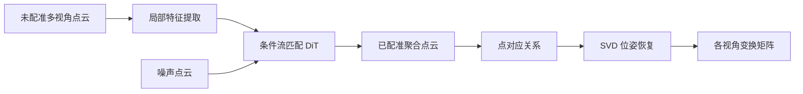
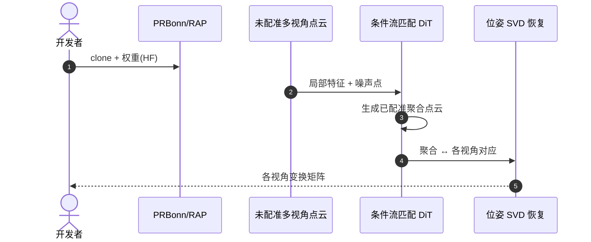

# RAP：Scaling 3D Point Cloud Registration by Flow Matching

**RAP**（*Register Any Point: Scaling 3D Point Cloud Registration by Flow Matching*；[arXiv:2512.01850](https://arxiv.org/abs/2512.01850)，[项目页](https://register-any-point.github.io/)，[代码](https://github.com/PRBonn/RAP)）由 **波恩大学（University of Bonn）；斯坦福大学（Stanford University）** 提出（ECCV 2026）。

## 一句话定义

**把多视角点云配准写成条件流匹配生成，单阶段直接生成已配准点云并恢复各视角位姿。**

## 英文缩写速查

| 缩写 | 英文全称 | 简要说明 |
|------|----------|----------|
| RAP | Register Any Point | 本文方法；条件流匹配生成已配准点云 |
| FM | Flow Matching | 流匹配；连续归一化流训练生成模型 |
| DiT | Diffusion Transformer | 扩散 Transformer；RAP 的去噪/生成骨干 |
| RegX | Registration Benchmark X | 作者跨域配准 benchmark（含 zero-shot 设定） |
| ICP | Iterative Closest Point | 迭代最近点；传统配准基线对照 |

## 为什么重要

- 把多视角点云配准写成条件流匹配生成，单阶段直接生成已配准点云并恢复各视角位姿。
- 为机器人感知、重建或空间推理链路提供可引用的 **深度论文实体**，便于与站内方法页交叉。
- 开源状态已按项目页核查：已开源。

## 核心信息

| 项 | 内容 |
|----|------|
| **机构** | 波恩大学（University of Bonn）；斯坦福大学（Stanford University） |
| **出处** | ECCV 2026 |
| **论文** | <https://arxiv.org/abs/2512.01850> |
| **项目页** | <https://register-any-point.github.io/> |
| **开源** | **已开源** — 官方仓库 [`PRBonn/RAP`](https://github.com/PRBonn/RAP)（2026-09-12 项目页核查）。 |
| **Hugging Face** | <https://huggingface.co/YuePanEdward/RAP> |

## 核心原理

RAP 将多视角点云配准表述为**条件流匹配**生成：以各视角局部特征为条件，从噪声点云流式生成**已配准的聚合点云**，单阶段完成对应关系与几何对齐。生成后通过聚合点与各视角点云的对应关系，用 **SVD** 闭式恢复各视角 **6DoF 位姿**，避免传统 ICP/RANSAC 的多阶段误差累积。

### 流程总览

## 评测与指标

- **RegX benchmark：** 作者在 RegX 上系统评测 indoor/outdoor、LiDAR/RGB-D 等跨模态配准，RAP 在多项指标上优于传统与 learning-based 基线。
- **Zero-shot 跨域：** 训练域与测试域传感器/场景不同时，RAP 仍保持 competitive 配准精度，体现 flow matching 的泛化能力。
- **单阶段效率：** 相对 detect-then-register 流水线，单阶段生成 + SVD 位姿恢复减少超参调优与失败模式。
- **HF 生态：** Hugging Face 提供预训练权重、RegX 相关数据与 **Gradio demo**，便于快速验证跨域点云对。

## 与其他工作对比

> 下表只做**定位对照**，不做跨设定横比：本页数字来自论文与项目页摘录，与下列各页不共享同一评测协议。

| 对照 | 差异读法 |
|------|----------|
| ICP / RANSAC 等传统配准 | 同为「求各视角 6DoF 变换」，差别在**误差从哪来**：ICP 靠迭代最近点，需较好初值且在低 overlap 下易落局部极小；RAP 先生成已配准点云、再用 SVD 闭式求位姿，把对应关系问题交给生成模型。代价是吃权重与显存，不再是纯几何算法 |
| detect-then-register 两阶段学习方法 | 同为学习型配准，但**阶段数不同**：两阶段要先检特征点/描述子再匹配，失败模式分散在两处超参上；RAP 单阶段，调的是流匹配采样步数而非匹配阈值 |
| [LiDAR 里程计与融合](../methods/lidar-odometry-fusion.md) | **问题不同，常被混用**：里程计求的是逐帧连续位姿（时序、增量、实时预算）；RAP 求的是一组**静态多视角**点云的相互对齐，没有时序先验，不能直接顶替 odometry 前端 |
| [Lingbot Map](../methods/lingbot-map.md) / [Paper Lingbot Map](../entities/paper-lingbot-map.md) | 建图侧的下游消费方：RAP 产出的是对齐好的点云与位姿，地图层关心的是长期一致性与回环；二者是**前端 ↔ 后端**关系而非替代关系 |

## 结论

**RAP 用条件流匹配单阶段生成已配准点云并用 SVD 恢复位姿，在 RegX 上展现 strong zero-shot 跨域配准能力，适合 SLAM/重建前端升级。**

- 从 HF [`YuePanEdward/RAP`](https://huggingface.co/YuePanEdward/RAP) 拉权重，先跑官方 demo 熟悉输入点云格式与 overlap 假设。
- 跨域部署时在 RegX 相近模态上 benchmark，勿将在 ObjVerse 训练的权重直接用于稀疏 outdoor LiDAR 而不调采样密度。
- SVD 位姿步骤依赖生成点云质量；若 flow 步数不足，先增采样步数再调 ICP 精修。
- 与 [Lidar Odometry Fusion](../methods/lidar-odometry-fusion.md) 集成时，明确 RAP 处理的是**多视角静态配准**而非逐帧里程计。
- 大规模点云需按 README 做 voxel/downsample；流匹配内存随点数平方增长，边缘设备需裁剪 ROI。
- 关注 HF 数据集版本与 [`PRBonn/RAP`](https://github.com/PRBonn/RAP) commit 对齐，避免权重-代码接口不一致。

## 工程实践

| 项 | 建议 |
|----|------|
| 复现入口 | https://github.com/PRBonn/RAP |
| 权重/数据 | https://huggingface.co/YuePanEdward/RAP |
| 开源状态 | 已开源 |
| 依赖风险 | 按 README 安装；GPU/数据集门槛以仓库说明为准 |

## 源码运行时序图

运行时节点对齐 `PRBonn/RAP` README 中的安装与评测脚本。

## 局限与风险

- 论文设定与真实机器人传感器噪声、标定误差、算力预算可能存在差距。
- 权重与训练数据规模较大，边缘设备需评估推理延迟。

## 关联页面

- [Lidar Odometry Fusion](../methods/lidar-odometry-fusion.md)
- [Lingbot Map](../methods/lingbot-map.md)
- [Paper Lingbot Map](../entities/paper-lingbot-map.md)

## 参考来源

- [`register_any_point_rap_arxiv_2512_01850.md`](../../sources/papers/register_any_point_rap_arxiv_2512_01850.md)
- [`register-any-point.md`](../../sources/sites/register-any-point.md)
- [`prbonn-rap.md`](../../sources/repos/prbonn-rap.md)
- 论文：<https://arxiv.org/abs/2512.01850>

## 推荐继续阅读

- [项目页](https://register-any-point.github.io/)
- [arXiv:2512.01850](https://arxiv.org/abs/2512.01850)
- [Hugging Face](https://huggingface.co/YuePanEdward/RAP)
