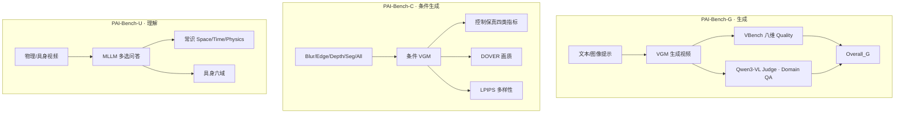
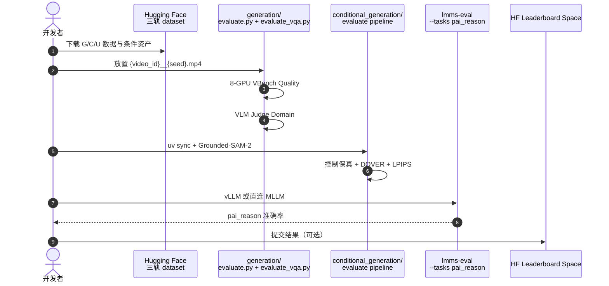

# PAI-Bench: A Comprehensive Benchmark For Physical AI

**PAI-Bench**（*PAI-Bench: A Comprehensive Benchmark For Physical AI*，[arXiv:2512.01989](https://arxiv.org/abs/2512.01989)，**CVPR 2026 Oral**，[GitHub](https://github.com/SHI-Labs/physical-ai-bench)，[Leaderboard](https://huggingface.co/spaces/shi-labs/physical-ai-bench-leaderboard)）由 **佐治亚理工、CMU**（Humphrey Shi 组等）提出：在 **真实世界视频** 上统一评测 Physical AI 的 **预测**（视频生成模型 VGM）与 **感知**（多模态大模型 MLLM），共 **2,808** 案例、三轨任务，揭示当前系统「画质高、物理弱；理解远落后人类」的共性缺口。

## 一句话定义

**PAI-Bench 把 Physical AI 的生成画质、物理域合理性、条件控制保真与视频物理理解收进同一套真实数据基准，是 Cosmos / Wan 等 WFM 论文引用的主榜定义页。**

## 英文缩写速查

| 缩写 | 英文全称 | 简要说明 |
|------|----------|----------|
| PAI-Bench | Physical AI Bench | 本文基准；含 G / C / U 三轨 |
| VGM | Video Generative Model | 文本/图像/视频条件世界生成模型 |
| MLLM | Multimodal Large Language Model | 视频问答与物理推理评测对象 |
| Domain Score | Domain-specific physical plausibility | G 轨：MLLM-as-Judge 物理 QA 准确率 |
| Quality Score | Visual/temporal fidelity | G 轨：改编自 VBench 的八维画质指标 |
| AV | Autonomous Vehicle | 驾驶 dashcam 等子域 |
| DOVER | Deep Open VQA Evaluator for Video | C 轨画质指标 |

## 为什么重要

- **统一缺口诊断：** 以往 VBench / VideoMME / Physics-IQ 等各自只测生成或理解；PAI-Bench 首次 **同数据哲学** 覆盖生成、条件生成、理解三能力。
- **WFM 选型锚点：** [Cosmos-Predict2.5](./paper-sa-2511-00062-world-simulation-with-video-foundation-models-fo.md)、[Kairos](./paper-kairos-native-world-model-stack.md)、[PhysisForcing](./paper-physisforcing.md) 等站内论文的 PAI-Bench 分数均指 **本榜 G/C 轨**——读分必须先对齐口径。
- **工程可复现：** MIT 仓 + 三份 HF 数据集 + Leaderboard Space；G/C 本地 `evaluate.py`，U 轨可走 `lmms-eval` `pai_reason`。
- **社区结论硬：** 15 个 VGM、4 组条件 VGM、16+ MLLM 大规模评测；人类偏好与自动指标 **r=0.918**。

## 核心信息

| 项 | 内容 |
|----|------|
| 机构 | 佐治亚理工学院（Georgia Tech）、卡内基梅隆大学（CMU） |
| 会议 | CVPR 2026 **Oral**（2026-04-09 公布） |
| 规模 | **2,808** 案例（G 1,044 视频 + C 600 + U 1,027 视频级） |
| 子域 | AV、机器人、工业/smart space、人体、自我中心、物理常识 |
| 代码 | [SHI-Labs/physical-ai-bench](https://github.com/SHI-Labs/physical-ai-bench)（MIT） |
| 数据 | [generation](https://huggingface.co/datasets/shi-labs/physical-ai-bench-generation) / [conditional](https://huggingface.co/datasets/shi-labs/physical-ai-bench-conditional-generation) / [understanding](https://huggingface.co/datasets/shi-labs/physical-ai-bench-understanding) |
| 开源核查 | **已开源**（2026-09-06）：仓 + 数据 + 榜单；致谢 NVIDIA Cosmos team 协作 |

## 核心原理

### 三轨任务

| 轨道 | 对象 | 核心问题 | 关键指标 |
|------|------|----------|----------|
| **PAI-Bench-G** | VGM（T2V/I2V 等） | 未来帧是否 **既好看又物理合理** | Quality（VBench 八维）+ Domain（Qwen3-VL-235B 答 5,636 QA） |
| **PAI-Bench-C** | 条件 VGM | 模糊/边缘/深度/分割控制是否 **忠实且多样** | Blur SSIM、Edge F1、Depth si-RMSE、Mask mIoU、DOVER、LPIPS |
| **PAI-Bench-U** | MLLM | 物理常识 + 具身推理是否 **接地视频** | Space / Time / Physics + 六数据集具身 QA（多选） |

- **G 轨 Overall** = (Domain 六项均值 + Quality 八项均值) / 2（百分制；站内 Cosmos 论文有时报 **0–1 小数**，需 ×100 或查原表）。
- **G 轨数据：** 开放数据 + 网络源；Qwen2.5-VL-72B 字幕 + 人工校正；Domain QA 来自 Cosmos-Reason 本体 + 人工 refine。
- **C 轨数据：** AgiBot、OpenDV、Ego-Exo-4D 各 200 clip；每视频 1 原 caption + 5 变体 caption（多样性）。
- **U 轨数据：** 物理常识 604 QA / 426 视频；具身 610 QA / 601 视频（BridgeData、RoboVQA、RoboFail、AgiBot、HoloAssist、专有 AV）。

### 流程总览

## 源码运行时序图

节点对齐 [`sources/repos/physical_ai_bench.md`](../../sources/repos/physical_ai_bench.md) 与官方 README。

## 工程实践

| 项 | 要点 |
|----|------|
| 环境 | Python **3.10**；各轨 `uv sync` 独立环境 |
| G 轨 | `generation/evaluate.py --mode custom_input` + `evaluate_vqa.py`；视频命名 `{video_id}__{seed}.mp4` |
| C 轨 | `get_checkpoint.sh`；Wan-Fun 在 blur/seg 上可能无连贯输出（论文省略） |
| U 轨 | 推荐 `lmms-eval` `pai-bench` 分支；16 帧默认（InternVL3.5 仅 8 帧） |
| 分数换算 | 论文 Table 3 为 **0–100**；Cosmos Predict2.5 论文部分表为 **0–1**——横比前读列标题 |
| 榜单 | [physical-ai-bench-leaderboard](https://huggingface.co/spaces/shi-labs/physical-ai-bench-leaderboard) |

## 评测与指标

### PAI-Bench-G（节选，Overall）

| 模型 | Overall | Domain Avg. | Quality Avg. |
|------|--------:|------------:|-------------:|
| Source Videos | 83.9 | 89.8 | 78.0 |
| Veo3（闭源） | 82.2 | 86.8 | 77.6 |
| Wan2.2-I2V-A14B | **82.3** | 87.1 | 77.5 |
| Cosmos-Predict2.5-2B | 81.4 | 84.9 | 78.0 |
| DynamicCrafter | 68.3 | 63.0 | 73.7 |

**读榜：** Quality 接近真源，Domain 全面低于真源——**高画质 ≠ 物理合理**。

### PAI-Bench-C（Quality Score 节选）

| 模型 | 最佳单控制 | All 多控制 |
|------|-----------|-----------|
| Cosmos-Transfer1-7B | 6.89（Depth） | **9.24** |
| Cosmos-Transfer2.5-2B | 8.77（Blur） | **9.24** |

多信号联合优于单控制；Seg 控制 mIoU 常最低（掩码时序噪声）。

### PAI-Bench-U（Overall 节选）

| 模型 | Overall | 人类 |
|------|--------:|-----:|
| Human | — | **93.2** |
| Qwen3-VL-235B | **64.7** | — |
| GPT-5 | 61.8 | — |
| Random | 37.0 | — |

零帧 ≈ 随机；**开源 Qwen3-VL-235B 可超 GPT-5**，但整体仍距人类 ~30 pt。

## 与其他工作对比

| 对照 | PAI-Bench（本页） | VBench / VBench++ | VideoMME / EgoSchema | WorldArena / WorldBench |
|------|-------------------|-------------------|----------------------|-------------------------|
| 生成画质 | ✓ Quality 八维 | ✓ 主焦点 | ✗ | 部分 WAM 榜 |
| 物理域 | ✓ Domain QA | △ 弱 | △ 非 Physical AI 专用 | ✓ 物理/功能 |
| 条件生成 | ✓ **PAI-Bench-C 首创系统评测** | ✗ | ✗ | △ |
| 视频理解 | ✓ 物理+具身 | ✗ | ✓ 通用理解 | ✓ 具身效用 |
| 真实数据 | ✓ 全轨 | 混合 | ✓ | 视子榜 |

站内 [Cosmos Predict2.5](./paper-sa-2511-00062-world-simulation-with-video-foundation-models-fo.md) 的 **I2W Overall 0.810** 是 **G 轨 post-train 子集**；本页是榜的完整定义与三轨入口。

## 结论

**PAI-Bench 是 Physical AI 生成与理解的对照实验场：它证明 SOTA VGM 在 Domain 上系统性低于真源，而 MLLM 在物理视频推理上仍远未接近人类。**

1. **报分先问轨道** — G（开放生成）/ C（控制翻译）/ U（MLLM 问答）不可混读；Cosmos 论文小数分多指 G 轨 Overall。
2. **Domain 比 Quality 更 discriminating** — 选型 WFM 时优先看 Domain 与 QA 失败样例，而非 VBench 美学单项。
3. **条件生成用多信号** — C 轨 All 条件 Quality 显著高于单模态；工程上应提取互补控制而非只喂模糊视频。
4. **理解榜防捷径** — U 轨零帧≈随机、需多帧；thinking 对 Qwen3 未必增益，GPT-5 需视觉+文本联合推理才涨分。
5. **复现走官方仓** — 三轨环境分离；U 轨优先 `lmms-eval` 集成，避免自写 prompt 口径漂移。
6. **与 NVIDIA 生态** — 榜由 SHI-Labs 维护，但与 Cosmos team 协作密切；Transfer/Predict 分数是 **第三方基准** 而非 NVIDIA 自研榜。

## 局限与风险

- **Judge 依赖：** G 轨 Domain 用 Qwen3-VL-235B 作 judge，换 judge 模型可能改相对排序。
- **规模：** 2,808 例相对 MVP Bench 等仍中小；子域覆盖虽广但每域样本有限。
- **闭源模型：** Veo3 等仅每 prompt 一条样本，随机性未完全对齐开源五 seed 平均。
- **分数体系：** G 轨百分制 vs 部分论文 0–1 表；横比前必须统一量纲。
- **U 轨集成演进：** 官方推荐 `lmms-eval` 上游集成，fork 分支可能随版本变化。

## 关联页面

- [Generative World Models](../methods/generative-world-models.md)
- [Cosmos Predict2.5 / Transfer2.5](./paper-sa-2511-00062-world-simulation-with-video-foundation-models-fo.md)
- [Cosmos Transfer](./cosmos-transfer.md)
- [NVIDIA Cosmos](./nvidia-cosmos.md)
- [Kairos](./paper-kairos-native-world-model-stack.md)
- [PhysisForcing](./paper-physisforcing.md)
- [WorldArena](./paper-sa-2602-08971-worldarena-a-unified-benchmark-for-evaluating-pe.md)
- [WorldBench](./paper-sa-2601-21282-worldbench-disambiguating-physics-for-diagnostic.md)
- [具身评测枢纽](../overview/hub-embodied-eval-benchmark.md)
- [Sim2Real](../concepts/sim2real.md)

## 参考来源

- [PAI-Bench 一手摘录](../../sources/papers/physical_ai_bench_arxiv_2512_01989.md)
- [physical-ai-bench 仓库](../../sources/repos/physical_ai_bench.md)
- [Hugging Face 入口](../../sources/sites/hf-physical-ai-bench.md)

## 推荐继续阅读

- [arXiv:2512.01989](https://arxiv.org/abs/2512.01989)
- [GitHub: SHI-Labs/physical-ai-bench](https://github.com/SHI-Labs/physical-ai-bench)
- [Leaderboard Space](https://huggingface.co/spaces/shi-labs/physical-ai-bench-leaderboard)
- [Cosmos Predict2.5 论文](https://arxiv.org/abs/2511.00062) — 常见 PAI-Bench 受测模型
