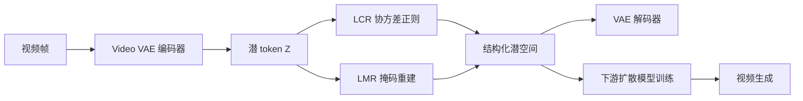
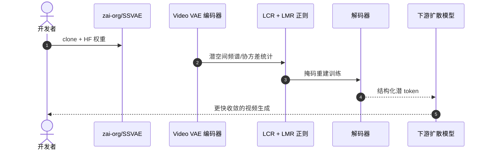

# SSVAE：Delving into Latent Spectral Biasing of Video VAEs for Superior Diffusability

**SSVAE**（*Delving into Latent Spectral Biasing of Video VAEs for Superior Diffusability*；[arXiv:2512.05394](https://arxiv.org/abs/2512.05394)，[项目页](https://zhazhan.github.io/ssvae.github.io/)，[代码](https://github.com/zai-org/SSVAE)）由 **智谱 AI（Zhipu AI）** 提出（arXiv 2025）。

## 一句话定义

**通过 LCR 与 LMR 正则塑造视频 VAE 潜空间频谱偏置，使下游扩散训练约 3× 更快收敛且生成质量更高。**

## 英文缩写速查

| 缩写 | 英文全称 | 简要说明 |
|------|----------|----------|
| SSVAE | Spectral-Structured Video VAE | 本文方法；带潜空间频谱偏置的视频 VAE |
| LCR | Latent Covariance Regularization | 潜协方差正则；约束 token 间统计结构 |
| LMR | Latent Masked Reconstruction | 潜掩码重建；塑造 few-mode 频谱偏置 |
| VAE | Variational Autoencoder | 变分自编码器；视频压缩到潜 token |
| DM | Diffusion Model | 扩散模型；下游视频生成训练对象 |

## 为什么重要

- 通过 LCR 与 LMR 正则塑造视频 VAE 潜空间频谱偏置，使下游扩散训练约 3× 更快收敛且生成质量更高。
- 为机器人感知、重建或空间推理链路提供可引用的 **深度论文实体**，便于与站内方法页交叉。
- 开源状态已按项目页核查：已开源。

## 核心信息

| 项 | 内容 |
|----|------|
| **机构** | 智谱 AI（Zhipu AI） |
| **出处** | arXiv 2025 |
| **论文** | <https://arxiv.org/abs/2512.05394> |
| **项目页** | <https://zhazhan.github.io/ssvae.github.io/> |
| **开源** | **已开源** — 官方仓库 [`zai-org/SSVAE`](https://github.com/zai-org/SSVAE)（2026-09-12 项目页核查）。 |
| **Hugging Face** | <https://huggingface.co/zai-org/SSVAE> |

## 核心原理

SSVAE 针对视频 VAE 潜空间**频谱偏置**（spectral biasing）：标准 VAE 潜 token 分布不利于下游扩散训练。通过 **LCR**（潜协方差正则）与 **LMR**（潜掩码重建）联合塑造 **few-mode** 结构——少数主导模态承载主要信息，使扩散模型更易学习。编码-解码仍为标准 VAE 架构，改动集中在训练目标与潜空间统计。

### 流程总览

## 评测与指标

- **收敛加速：** 相同扩散训练预算下，SSVAE 潜空间使下游扩散约 **3× 更快收敛**（相对标准 Video VAE 与 Wan 2.2 等对照）。
- **生成质量：** 视频 reward / 质量指标提升约 **10%**，在相同步数下优于未正则化的 VAE 潜空间。
- **Few-mode 偏置：** 潜谱分析显示能量集中于少数模态，与 LCR+LMR 设计一致，解释 diffusability 提升机制。
- **Wan 2.2 对照：** 论文与 Wan 2.2 Video VAE 对比，SSVAE 在扩散友好性与重建质量间取得更优折中。

## 与其他工作对比

> 下表只做**定位对照**，不做跨设定横比：本页数字来自论文与项目页摘录，与下列各页不共享同一评测协议。

| 对照 | 差异读法 |
|------|----------|
| 标准 Video VAE / Wan 2.2 VAE | 同为「把视频压成潜 token」，架构也几乎一致，差别全在**训练目标**：标准 VAE 只优化重建，潜谱分布对下游扩散不友好；SSVAE 加 LCR + LMR 把能量逼到少数主导模态。读法是「同一套 encoder/decoder，换了损失」，不是换骨干 |
| [扩散模型](../concepts/diffusion-model.md) | **优化的是不同环节**：扩散侧的提速工作（少步采样、蒸馏）压的是**推理步数**；SSVAE 压的是**训练收敛步数**，单次 forward 成本不变。两者正交，可叠加 |
| [生成式世界模型](../methods/generative-world-models.md) | 世界模型页关心「预测未来观测能否支撑决策」；SSVAE 只负责其中的**表示层**，不改动力学建模，也不保证 reward 相关的语义被保留——机器人侧迁移前需在目标域短视频上单独验证 |
| [EmbodiedVAE](../entities/paper-embodiedvae.md) | 同为「改 Video VAE 让下游生成更好学」，但**先验来源相反**：EmbodiedVAE 用具身结构先验（双编码器拆臂/背景、非对称时空压缩保臂的时序）；SSVAE 的正则是纯统计的（协方差 + 掩码重建），与任务无关——因此更通用，也读不出「哪部分像素是机械臂」 |

## 结论

**SSVAE 用 LCR+LMR 塑造 few-mode 潜空间频谱偏置，使下游视频扩散约 3× 更快收敛并带来 ~10% 质量增益，适合 world-model / 视频生成栈的 VAE 替换。**

- 从 HF [`zai-org/SSVAE`](https://huggingface.co/zai-org/SSVAE) 加载权重，按 README 替换现有 Video VAE 后再训扩散，勿只换 encoder 不换 decoder 统计。
- 监控潜空间协方差谱：若 few-mode 偏置不足，检查 LCR/LMR 损失权重是否被重建项淹没。
- 与 [Generative World Models](../methods/generative-world-models.md) 集成时，对比 Wan 2.2 baseline 的相同训练步数曲线，而非仅看最终 FVD。
- 机器人 sim-to-real 若依赖视频 world model，优先在目标域短视频上验证 **10% reward 增益**是否可迁移。
- 训练算力仍 dominated by 扩散阶段；SSVAE 节省的是收敛步数，不是单次 forward 成本。
- 保持 [`zai-org/SSVAE`](https://github.com/zai-org/SSVAE) 与 HF 权重版本一致，LCR 统计依赖 checkpoint 内 batch norm 状态。

## 工程实践

| 项 | 建议 |
|----|------|
| 复现入口 | https://github.com/zai-org/SSVAE |
| 权重/数据 | https://huggingface.co/zai-org/SSVAE |
| 开源状态 | 已开源 |
| 依赖风险 | 按 README 安装；GPU/数据集门槛以仓库说明为准 |

## 源码运行时序图

运行时节点对齐 `zai-org/SSVAE` README 中的安装与评测脚本。

## 局限与风险

- 论文设定与真实机器人传感器噪声、标定误差、算力预算可能存在差距。
- 权重与训练数据规模较大，边缘设备需评估推理延迟。

## 关联页面

- [Generative World Models](../methods/generative-world-models.md)
- [Diffusion Model](../concepts/diffusion-model.md)
- [Paper Embodiedvae](../entities/paper-embodiedvae.md)

## 参考来源

- [`ssvae_video_vae_diffusability_arxiv_2512_05394.md`](../../sources/papers/ssvae_video_vae_diffusability_arxiv_2512_05394.md)
- [`ssvae-project.md`](../../sources/sites/ssvae-project.md)
- [`zai-org-ssvae.md`](../../sources/repos/zai-org-ssvae.md)
- 论文：<https://arxiv.org/abs/2512.05394>

## 推荐继续阅读

- [项目页](https://zhazhan.github.io/ssvae.github.io/)
- [arXiv:2512.05394](https://arxiv.org/abs/2512.05394)
- [Hugging Face](https://huggingface.co/zai-org/SSVAE)
