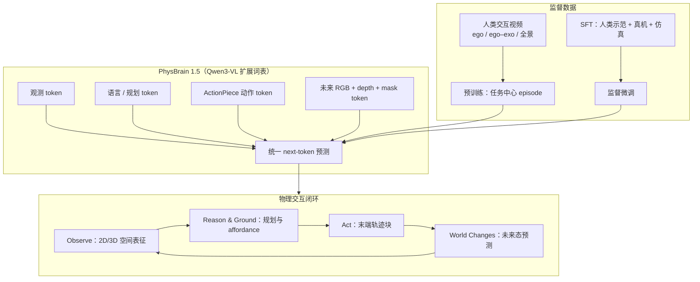
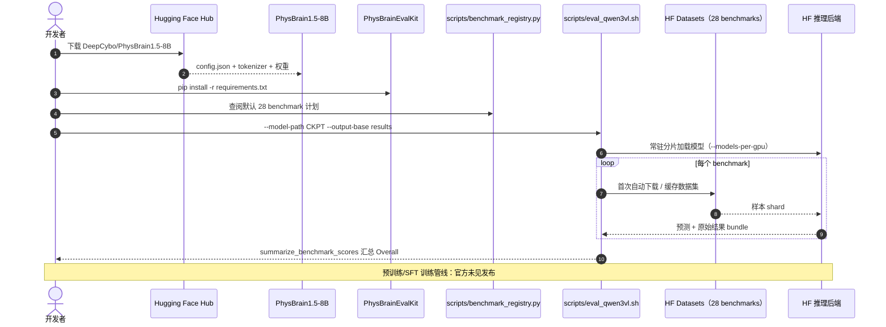

# PhysBrain 1.5：从通用 VLM 到物理基础模型

**PhysBrain 1.5**（*From General VLMs to Physical Foundation Model*，[技术报告](https://github.com/DeepCybo-PhysAI/PhysBrain-1.5/blob/main/tech_report.pdf)，[项目页](https://deepcybo-physai.github.io/PhysBrain-1.5/)，**机智赛博（DeepCybo） / 北京中关村学院 / 中关村人工智能研究院（ZGCI）**）在前作 [PhysBrain（arXiv:2512.16793）](https://arxiv.org/abs/2512.16793) 的「人类 ego 视频 → 具身监督」脉络上，把 **具身理解、动作生成与未来状态预测** 收进 **单一 Qwen3-VL 自回归骨干**：语言、空间输出、末端轨迹与未来视觉状态均为离散 token，共享 next-token 目标、**无任务专用 head**。发布 **2B / 8B** 权重与 **PhysBrainEvalKit** 28 项 benchmark 复现工具。

## 一句话定义

**用人类交互视频预训练 + 人类/真机/仿真 SFT，在 Qwen3-VL 上同时学「看懂物理世界、生成 ActionPiece 动作块、预测下一步 RGB+depth+mask」的统一具身基础模型。**

## 英文缩写速查

| 缩写 | 英文全称 | 简要说明 |
|------|----------|----------|
| PhysBrain | Physical Brain / PhysBrain model family | DeepCybo 具身基础模型族；本页为 1.5 代发布 |
| VLM | Vision-Language Model | 视觉–语言模型；骨干为 Qwen3-VL |
| VLA | Vision-Language-Action | 视觉–语言–动作；本页以统一 token 空间承载动作与未来态 |
| Ego | Egocentric Vision | 第一人称可穿戴视角；预训练主监督来源之一 |
| HOI | Hand–Object Interaction | 手–物交互；人类视频监督的核心场景 |
| FA | FlashAttention | 评测时注意 FA4 与训练对齐；FA2 可能有轻微波动 |

## 核心信息

| 字段 | 内容 |
|------|------|
| **机构** | 机智赛博（DeepCybo）；北京中关村学院（Zhongguancun Academy）；中关村人工智能研究院（ZGCI / ZGCA） |
| **学术脉络** | 前作 [arXiv:2512.16793](https://arxiv.org/abs/2512.16793)（Awesome Egocentric Vision #192）；1.5 以技术报告 + 权重发布 |
| **骨干** | 预训练 **Qwen3-VL**；扩展 action token 与 visual-state token |
| **规模** | **2B**（Overall 66.6，参考档）/ **8B**（Overall **72.5**，开源榜主档） |
| **开源（截至 2026-09-13）** | **部分开源**：HF 权重 + Demo + **PhysBrainEvalKit** 评测；**未见** 预训练/SFT 训练代码与数据 |

## 为什么重要

- **统一物理闭环可读：** 观测 → 推理与动作 → 环境变化 → 新观测，与 [Foundation Policy](../concepts/foundation-policy.md)「单骨干多能力」叙事同族，但把 **未来态预测** 写进同一词表而非外挂世界模型。
- **人类视频作为主监督轴：** 预训练监督全部来自人类交互视频（ego、同步 ego–exo、全景 episode），直接延续前作「ego 数据桥接 VLM 与物理智能」主张；与 [Human-as-Humanoid](./paper-human-as-humanoid.md) 的「人类视频 → 机器人标签」管线形成 **数据入口对照**。
- **开源榜可核对：** 28 benchmark 独立重评、每榜单一指标；8B **72.5** overall，开源 **14 项第一 / 10 项第二**，并有公开 EvalKit 可复现（相对仅 README 的具身脑发布）。
- **工程入口清晰：** Transformers / vLLM / SGLang 等标准 VLM 栈 + HF 权重即可试跑；动作侧用 **ActionPiece** 统一 codebook 跨本体。

## 方法栈（核心结构）

| 模块 | 角色 |
|------|------|
| **Qwen3-VL 骨干** | 共享自回归 Transformer；语义、运动与未来态监督更新同一参数 |
| **Embodied understanding** | 视觉–空间感知、3D/多视角、规划、指向/affordance、视觉轨迹推理 |
| **Action generation** | **ActionPiece** token 编码末端轨迹块；跨控制配置与机械臂 setup 共享 action codebook |
| **Future-state prediction** | 预测空间对齐的 **RGB + depth + robot mask** 作为下一步世界态 |
| **数据** | 预训练：人类交互视频；SFT：人类示范 + 真机轨迹 + 仿真经验 |

### 流程总览

## 源码运行时序图

官方 **训练栈未发布**；可复现路径为 **Hugging Face 推理** 与 **PhysBrainEvalKit 评测**（归档见 [sources/repos/physbrain-eval-kit.md](../../sources/repos/physbrain-eval-kit.md)）：

- **最短评测路径：** 配置 `HF_HOME` → `eval_qwen3vl.sh --dry-run` 验计划 → 去 `--dry-run` 并加 `--resume` 断点续跑。
- **注意力实现：** 模型训练用 **FA4**；EvalKit 支持 FA2/FA4，FA2 分数可能有轻微波动。
- **Demo 试玩：** [HF Space physbrain1-5-8b-demo](https://huggingface.co/spaces/hugging-apps/physbrain1-5-8b-demo)。

## 工程实践

| 项 | 建议 |
|----|------|
| **选型** | 要 **开源具身空间榜可核对** → 8B + EvalKit；要 **轻量试跑** → 2B；要 **训练复现** → 目前需等官方或自研 |
| **权重** | `DeepCybo/PhysBrain1.5-8B` / `PhysBrain1.5-2B`（[HF 集合](https://huggingface.co/collections/DeepCybo/physbrain-15)） |
| **评测** | [PhysBrainEvalKit](https://github.com/DeepCybo-PhysAI/PhysBrainEvalKit)；单 benchmark 亦可 `python eval_<name>.py --model_path ...` |
| **部署栈** | 项目页列出 Transformers / vLLM / SGLang / LLaMA-Factory / ms-swift / veRL |
| **开源状态** | **部分开源**：权重 + 评测 + Demo **已发布**；训练代码与数据 **未见** |

## 评测与指标（摘要）

> 分数以 [项目页](https://deepcybo-physai.github.io/PhysBrain-1.5/#results) / 技术报告为准；0–100 分，越高越好；Overall 为 28 benchmark **未加权均值**。

| 模型 | Overall | 开源排名 |
|------|---------|----------|
| **PhysBrain 1.5-8B** | **72.5** | 开源 evaluated 模型 **#1**（14×第一，10×第二） |
| PhysBrain 1.5-2B | 66.6 | 参考档，不参与开源排名 |
| Gemini 3.6 Flash（闭源参照） | 73.0 | — |
| GPT-6-Astra（闭源参照） | 73.3 | — |

**五类 benchmark 覆盖：** 基础视觉–空间感知；空间与多视角理解；具身认知/推理/规划；空间指向与 affordance；视觉轨迹与轨迹推理。亮点项包括 VLABench **76.4**、Part-Affordance **84.0**、RoboRefit **89.6**、VABench-V.-Trace **89.8** 等（8B）。

## 结论

**PhysBrain 1.5 的核心主张是「物理交互闭环不必拆成三个模型」：理解、ActionPiece 动作与未来 RGB+depth+mask 预测共享一个词表与一个 next-token 目标，再用人类视频主监督把 VLM 拉进物理世界。**

- 最硬的可核对证据是 **28 benchmark 开源 Overall 72.5** 与公开 **PhysBrainEvalKit**，而不是单点 demo；闭源前沿（GPT-6-Astra 73.3）差距已在同一重评协议下量化。
- **ActionPiece + 统一 codebook** 是跨本体部署的关键工程接口：一个 generalist checkpoint 可服务多样机械臂与控制配置，但真机闭环仍依赖各平台驱动层（本发布以理解与轨迹预测为主证据）。
- **数据轴决定上限：** 预训练全来自人类交互视频，与 [RynnBrain 1.1](./paper-rynnbrain-1-1.md)「具身预训练决定 VLA 起点」、[ACE-Brain-0.5](./paper-ace-brain-0-5.md)「统一具身脑五功能」形成同代对照——PhysBrain 1.5 更强调 **未来态 token 与世界模型一体化**。
- 适用边界：**训练栈与数据未开源**，复现止于 HF 推理 + EvalKit 榜单；动作真机成功率需读者自建后训练与 embodiment 层。
- 与前作关系：arXiv:2512.16793 提出 ego 视频桥接叙事；1.5 是 **可下载权重 + 可跑评测** 的产品化发布，而非另一篇独立 arXiv 编号。

## 常见误区或局限

- **误区：** 把技术报告里的闭源参照分数当成「已超越所有前沿」——榜单同时列出 Gemini / GPT 参照，8B 与闭源最强档仍接近但未全面超越。
- **误区：** 以为 GitHub `PhysBrain-1.5` 仓含训练代码——该仓为 **技术报告 + 文档**；可运行评测在 **PhysBrainEvalKit**。
- **局限：** 28 项主要为 **空间智能与规划类 VLM benchmark**，不等同于长程真机操作成功率全集。
- **局限：** 人类交互视频与真机/SFT 数据 **未公开**，二次训练需自建数据管线。

## 与其他工作对比

| 对照对象 | PhysBrain 1.5 的差异 |
|----------|----------------------|
| **PhysBrain（2512.16793）** | 前作强调 ego 视频作 VLM→物理智能桥梁；1.5 落地为统一 token 基础模型 + 权重 |
| **ACE-Brain-0.5** | 同 Qwen3-VL 族统一具身脑；ACE 强调 SSR+ 与进度自监控；PhysBrain 强调 **未来态预测进同一词表** |
| **RynnBrain 1.1** | 同「具身预训练脑」线；RynnBrain 用 81D 统一动作空间接 VLA；PhysBrain 用 **ActionPiece** + 28 空间榜 |
| **Human-as-Humanoid** | 同 DeepCybo 生态；后者把 ego–exo 人类视频转成机器人标签；PhysBrain 1.5 是 **通用具身基础模型发布** |

## 关联页面

- [VLA](../methods/vla.md) — 统一 VLA / 具身基础模型范式索引
- [Foundation Policy](../concepts/foundation-policy.md) — 基础策略与多能力单骨干抽象
- [Manipulation](../tasks/manipulation.md) / [Teleoperation](../tasks/teleoperation.md) — 动作与示范数据语境
- [ACE-Brain-0.5](./paper-ace-brain-0-5.md) — 同 Qwen3-VL 族统一具身脑对照
- [RynnBrain 1.1](./paper-rynnbrain-1-1.md) — 具身预训练脑 + 跨本体 VLA 对照
- [Human-as-Humanoid](./paper-human-as-humanoid.md) — 同机构人类视频→机器人监督管线
- [Awesome Egocentric Vision](./awesome-egocentric-vision.md) — 前作策展列表入口

## 推荐继续阅读

- 项目页：[deepcybo-physai.github.io/PhysBrain-1.5](https://deepcybo-physai.github.io/PhysBrain-1.5/)
- 技术报告 PDF：[github.com/DeepCybo-PhysAI/PhysBrain-1.5](https://github.com/DeepCybo-PhysAI/PhysBrain-1.5/blob/main/tech_report.pdf)
- 前作论文：[arXiv:2512.16793](https://arxiv.org/abs/2512.16793)
- 权重：[Hugging Face PhysBrain 1.5 集合](https://huggingface.co/collections/DeepCybo/physbrain-15)
- 评测工具：[PhysBrainEvalKit](https://github.com/DeepCybo-PhysAI/PhysBrainEvalKit)
- 在线 Demo：[physbrain1-5-8b-demo](https://huggingface.co/spaces/hugging-apps/physbrain1-5-8b-demo)

## 参考来源

- [PhysBrain 1.5 技术报告摘录](../../sources/papers/physbrain_1_5_technical_report_2026.md)
- [PhysBrain 1.5 项目页归档](../../sources/sites/physbrain-1-5-github-io.md)
- [PhysBrain-1.5 文档仓归档](../../sources/repos/physbrain-1-5.md)
- [PhysBrainEvalKit 仓库归档](../../sources/repos/physbrain-eval-kit.md)
- [Awesome 策展摘录（arXiv:2512.16793）](../../sources/papers/sun_awesome_ego_2512_16793_physbrain-human-egocentric-data-as-a-bri.md)
