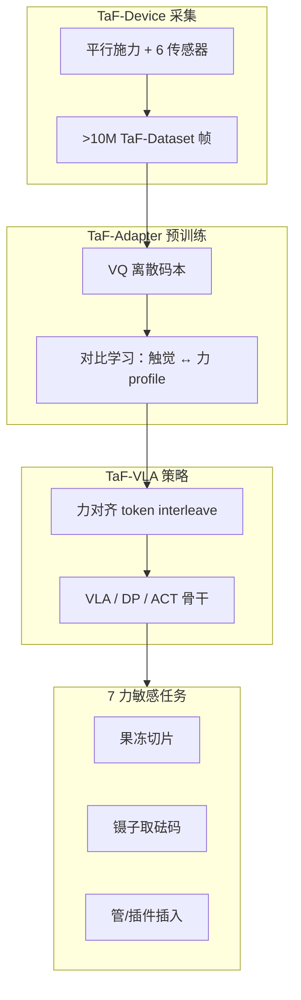
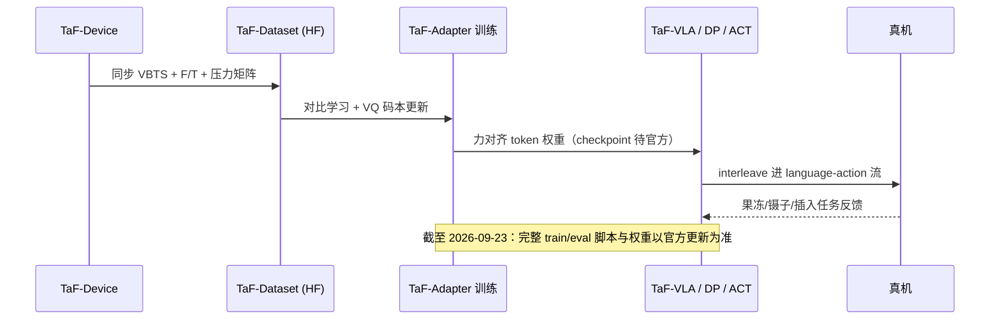

# TaF-VLA：VLA 中的触觉–力对齐（arXiv:2601.20321）

**TaF-VLA**（*Tactile-Force Alignment in Vision-Language-Action Models for Force-aware Manipulation*，[arXiv:2601.20321](https://arxiv.org/abs/2601.20321)，Yuzhe Huang 等 · **北航 / 上海科技大学 / BIGAI / 香港大学**；[项目页](https://peilin-666.github.io/projects/TaF_VLA/)）提出 **Tactile-Force Alignment** 范式：高维 VBTS 观测在 **共享 latent** 与 6 轴 F/T + 压力矩阵对齐（**非** 触觉–视觉对齐，**非** 显式力回归）。

## 一句话定义

**用 TaF-Adapter 把时序触觉 VQ 码本与力 profile 做对比对齐，再 interleave 进 VLA——7 项力敏感日常任务平均较此前 SOTA 视触觉 VLA +22%，果冻切/镊子取砝码等 fragile 场景可插拔 Diffusion Policy/ACT。**

## 英文缩写速查

| 缩写 | 英文全称 | 简要说明 |
|------|----------|----------|
| TaF-VLA | Tactile-Force Alignment VLA | 本文框架 |
| TaF | Tactile-Force | 触觉–力对齐范式 |
| VQ | Vector Quantization | TaF-Adapter 离散共享码本 |
| VBTS | Vision-Based Tactile Sensing | GelSight / DIGIT 等 |
| VLA | Vision-Language-Action | 下游策略骨干 |
| F/T | Force/Torque | 6 轴力/力矩 + 压力矩阵 |

## 核心信息

| 项 | 内容 |
|----|------|
| 机构 | Beihang University；ShanghaiTech University；BIGAI；The University of Hong Kong |
| 通讯作者 | Chenxi Xiao、Ziyuan Jiao（†） |
| TaF-Device | 平行施力结构；**6** 种传感器；**~10 万帧/小时** |
| TaF-Dataset | **>10M** 同步视触觉 / F/T / 压力矩阵帧（HF [`jiamig/taf-dataset`](https://huggingface.co/datasets/jiamig/taf-dataset)） |
| 开源（2026-09-23） | **部分开源** — [`mrHuangyz/TaF-VLA`](https://github.com/mrHuangyz/TaF-VLA) 存在；项目页仍标 Code Coming soon；Adapter 权重未列 |

## 为什么重要

- **VTLA 的力盲根因：** 现有 VTLA 常把触觉当「更多视觉纹理」，未 grounding 到 **物理力动态**。
- **对齐 vs 预测：** TaF-Adapter 用对比学习 + VQ 共享空间 **隐式对齐**，优于 explicit force regression 与 naive tactile–vision concat（抗噪、跨传感器）。
- **规模化数据工厂：** TaF-Device **10M+** 帧使对齐预训练可扩展；相对 [ForceVLA](./paper-forcevla.md) 244 轨迹是 **数据轴** 对照。
- **可插拔：** TaF-Adapter 可接 Diffusion Policy / ACT，不必绑死单一 VLA 架构。

## 核心贡献/方法

| 阶段 | 要点 |
|------|------|
| **TaF-Device** | 平行 actuator 同步 VBTS + 6 轴 F/T + 压力矩阵；可换 indenter |
| **TaF-Dataset** | >10M 帧；6 传感器覆盖 GelSight / DIGIT 等族 |
| **TaF-Adapter** | 时序触觉 → VQ 码本；对比学习对齐力 profile；历史聚合捕获 stick-slip |
| **TaF-VLA** | 力对齐 token **interleave** language-action 流；力感知语言指令微调 |
| **Benchmark** | 7 力临界任务（果冻切片、镊子取砝码、插件等）；**+22%** 平均 vs 此前 SOTA 视触觉 VLA |

## 流程总览

## 评测与指标

| 设置 | 结果 | 备注 |
|------|------|------|
| 7 任务平均 SR | **+22%** | vs 此前 SOTA 视触觉对齐 VLA |
| vs vision-only | 显著优势 | fragile / precision 场景 |
| Plug-and-play | DP / ACT 可插 | 无需架构特定调参 |
| 对齐 vs 预测 | 隐式 latent **优于** 显式力回归 | 跨传感器泛化 |
| 消融 | VQ / 历史聚合 / 对比项均关键 | 见项目页 |

## 与其他工作对比

| 维度 | TaF-VLA | ForceVLA | Tactile-VLA | Sparsh |
|------|---------|----------|-------------|--------|
| 对齐目标 | **触觉 ↔ 力** | F/T post-VLM MoE | VBTS 激活 VLM 物理语义 | 触觉 ↔ 视觉 SSL |
| 触觉形态 | 高维 VBTS | 低维 6 轴 F/T | VBTS 图像 | SSL encoder |
| 数据 | **10M+ TaF** | 140k step | UMI demo | 462k SSL |
| 力建模 | **隐式 latent** | 显式 wrench token | 混合位置–力控制 | 力场 DPT 解码 |

## 结论

**TaF-VLA 把 VTLA 里缺失的一环补成「触觉–力对齐」而非「触觉–视觉对齐」——10M 帧 TaF-Dataset + VQ 对比学习，7 任务 +22%，且 Adapter 可插 DP/ACT。**

1. **范式切换** — 读论文先分清 tactile–force vs tactile–vision alignment。
2. **+22% 七任务平均** — 相对此前 SOTA 视触觉 VLA 的主线证据。
3. **TaF-Dataset 先用** — HF `jiamig/taf-dataset` 10M+ 帧；文件区以实际上传为准。
4. **隐式 > 显式** — 对齐 latent 比 force regression 更抗噪、跨传感器。
5. **部分开源** — GitHub README 完整但项目页 Coming soon；权重未官方发布。
6. **与 ForceVLA 并列选型** — 低维 F/T MoE vs 高维 VBTS–力对齐；见 [九篇地图](../overview/tactile-intelligence-nine-papers-map.md)。

## 源码运行时序图

[`mrHuangyz/TaF-VLA`](https://github.com/mrHuangyz/TaF-VLA) 存在但 **训练/推理入口与权重发布不完整**（项目页 Code Coming soon）。预期三阶段管线：

## 局限与风险

- TaF-Device 实验室内采集；真机遥操 10K+ episodes 与 TaF 自动采集分布可能不同。
- HF 数据集 **文件区可能未完全上传**；复现前核对实际上传状态。
- TaF-Adapter 权重未官方 checkpoint；GitHub 与项目页开源状态不一致。
- 7 任务仍属 representative set；跨 embodiment 需小量适应。

## 关联页面

- [视触觉融合](../concepts/visuo-tactile-fusion.md) — VBTS 与力信号融合
- [触觉传感](../concepts/tactile-sensing.md) — TaF-Device 六传感器轴
- [VLA](../methods/vla.md) — 可插 Adapter 的 VLA 骨干
- [ForceVLA](./paper-forcevla.md) — 低维 F/T MoE 对照
- [Sparsh](./paper-sparsh.md) — VBTS SSL 上游 encoder
- [触觉智能九篇地图](../overview/tactile-intelligence-nine-papers-map.md) — VTLA 层

## 参考来源

- [TaF-VLA 论文归档（arXiv:2601.20321）](../../sources/papers/taf_vla_arxiv_2601_20321.md)
- [TaF-VLA 项目页归档](../../sources/sites/taf-vla-peilin.md)

## 推荐继续阅读

- [项目页](https://peilin-666.github.io/projects/TaF_VLA/) — TaF-Device 实物、demo 视频
- [GitHub: mrHuangyz/TaF-VLA](https://github.com/mrHuangyz/TaF-VLA) — README 与硬件图
- [HF: jiamig/taf-dataset](https://huggingface.co/datasets/jiamig/taf-dataset) — 10M+ 帧元数据
- [arXiv:2601.20321](https://arxiv.org/abs/2601.20321) — TaF-Adapter 公式与消融
