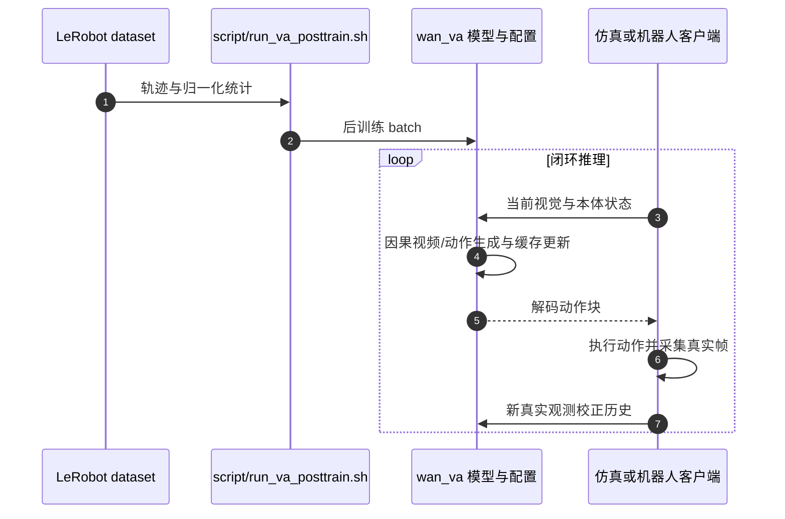

# LingBot-VA：因果视频–动作世界模型

## 一句话定义

LingBot-VA 在因果交错序列中建模视觉动态与动作，以真实观测更新缓存，并通过异步执行减少视频–动作联合推理的控制停顿。

## 英文缩写速查

| 缩写 | 英文全称 | 简要说明 |
| --- | --- | --- |
| VLA | Vision-Language-Action | 视觉和语言条件下生成动作 |
| MoT | Mixture of Transformers | 视频/动作双流建模 |
| KV | Key-Value | 注意力历史缓存 |
| IDM | Inverse Dynamics Model | 把动作潜表示解码为执行动作 |

## 为什么重要

- 把世界预测与动作学习放入同一时间结构，便于研究视觉动态先验如何影响控制。
- 强调执行后真实观测回写，避免长程预测把错误持续带入闭环。

## 核心原理

**因果交错建模 → 动作解码 → 执行 → 真实观测替换视频缓存 → 下一轮推理**。视频流与动作流保持概念区分，MoT、KV cache 和异步执行共同降低重复计算。

公开仓目前提供 **shared backbone** 的基座与 RoboTwin / LIBERO-Long 后训练权重；分离双流版本不能仅凭论文描述认定已经发布。VA 2.0 的 semantic visual-action tokenizer、因果 DiT 与 MoE 另见[公司家族页](./robbyant.md)。

## 源码运行时序图

模型进程与客户端是分离运行环境；部署细节以 README 对应 benchmark 的服务脚本为准。

## 工程实践

1. 先锁定 `wan_va/configs/va_libero_cfg.py` 中 `action_snr_shift`、动作 channel 和 `norm_stat`，它们必须与 checkpoint 对齐。
2. 自有数据按 LeRobot 处理；`script/run_va_posttrain.sh` 选择 `robotwin_train` 或 `libero_train`。
3. 仿真与策略环境分离，通过 server-client 通信，避免依赖冲突。
4. **2026-10-05 核查**：Apache-2.0 代码、shared-backbone 权重、RoboTwin 与 LIBERO 后训练数据公开；不代表完整预训练池与所有论文结构开放。

## 评测与指标

公开提供 RoboTwin-2.0、LIBERO-Long 的评测与后训练路径。对比时明确 shared backbone、任务划分与数据增广，分别测长程成功率、数据效率和异步闭环时延；本页不混用 VA 2.0 数字。

## 结论

**LingBot-VA 的核心是因果视频–动作建模与真实观测校正构成闭环。**

1. 配置必须与发布权重的动作归一化一致。
2. 分别记录预测误差、控制成功率与时延。
3. 按已发布 shared-backbone 范围复现，不推定全部结构已开放。

## 与其他工作对比

与 [LingBot-VLA](lingbot-vla.md) 的直接动作生成相比，本作强调因果视觉动态与动作的联合时间结构。与 [FastWAM](paper-fast-wam.md) 的测试时跳过未来视频不同，本作需要分析视频–动作交错推理、异步执行和真实观测校正各自的代价。

## 局限与风险

- 预测视频存在累积误差，真实观测回写是闭环的一部分。
- 视频去噪、通信和动作执行的吞吐须一起测；不能以单模型帧率代替端到端时延。

## 关联页面

- [Robbyant 家族与 VA 2.0](./robbyant.md)
- [LingBot-VLA](./lingbot-vla.md)
- [世界模型](../methods/generative-world-models.md)

## 参考来源

- [官方项目与运行入口](../../sources/repos/lingbot-va.md)

## 推荐继续阅读

- [官方项目](https://technology.robbyant.com/lingbot-va/)
- [官方源码](https://github.com/robbyant/lingbot-va)
