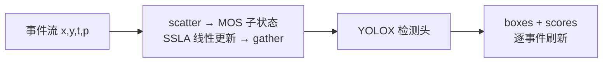
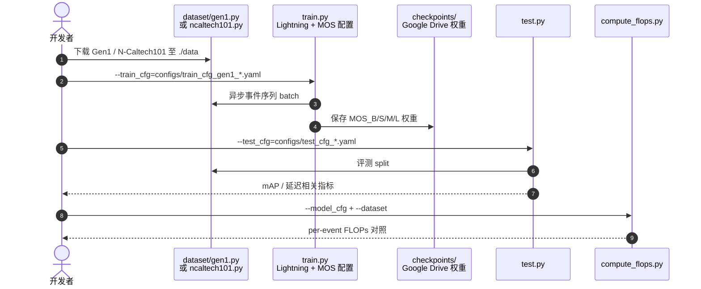

# SSLA-Det：空间稀疏线性注意力事件检测

**Low-Latency Event-Based Object Detection with Spatially-Sparse Linear Attention**（[arXiv:2603.06228](https://arxiv.org/abs/2603.06228)，[代码](https://github.com/haohq19/ssla)，ECCV 2026）由 **Haiqing Hao、Zhipeng Sui、Rong Zou、Zijia Dai、Nikola Zubić、Davide Scaramuzza、Wenhui Wang**（**清华大学**、**苏黎世大学 Robotics and Perception Group**、**上海科技大学**）提出：**SSLA**（Spatially-Sparse Linear Attention）在 **mixture-of-spaces（MOS）** 状态分解与 **scatter–compute–gather** 训练下，让线性注意力检测器只对事件触达的空间子状态做更新，从而在 **Gen1** 与 **N-Caltech101** 上保持异步方法竞争力精度，并把 **per-event 计算降到最强异步基线的 1/20 以下**。

## 一句话定义

**检测需要细粒度空间状态，但事件是空间稀疏的——SSLA 让线性注意力只激活被事件命中的 MOS 子空间，并行训练、循环推理、逐事件低延迟。**

## 英文缩写速查

| 缩写 | 英文全称 | 简要说明 |
|------|----------|----------|
| SSLA | Spatially-Sparse Linear Attention | 本文核心：空间稀疏的线性注意力状态更新 |
| SSLA-Det | SSLA Detection model | 基于 MOS 骨干的端到端异步检测器 |
| MOS | Mixture-of-Spaces | 状态分解为多空间子状态（`model_mos.py`） |
| A2S | Asynchronous-to-Synchronous | 逐事件编码再接入 ML 管线的范式；前置 [EVA](../../sources/repos/eva.md) |
| mAP | mean Average Precision | COCO 风格检测均值精度 |
| Gen1 | Prophesee Gen1 Automotive Detection | 车载事件检测基准数据集 |

## 为什么重要

- **事件相机卖点是低延迟**，但异步 RNN 难并行训练；提精度又常拉高 **per-event FLOPs**。
- **线性注意力**可「训练并行 + 推理循环」，却默认 **稠密全局状态**——与检测所需的 **细粒度空间表征** 冲突。
- SSLA-Det 给出 **状态级空间稀疏** 的可训练实现，并把官方代码、Gen1/N-Caltech101 配置与 checkpoint 一并放出，适合作为 **车载 / 边缘事件检测** 的 latency–accuracy 对照点。

## 核心信息

| 项 | 内容 |
|----|------|
| **机构** | 清华大学精密仪器系；苏黎世大学 Robotics and Perception Group；上海科技大学 |
| **会议** | ECCV 2026 |
| **数据集** | [Gen1 Automotive](https://www.prophesee.ai/2020/01/24/prophesee-gen1-automotive-detection-dataset/) · N-Caltech101（[DAGR](https://github.com/uzh-rpg/dagr) 生态预处理） |
| **精度（论文）** | Gen1 **0.375 mAP** · N-Caltech101 **0.515 mAP**（异步方法 SOTA 表述） |
| **效率（论文）** | vs 最强异步基线 **>20× ↓ per-event 计算** |
| **前置** | [EVA](https://arxiv.org/abs/2505.11165) A2S 特征学习（Gen1 检测 **0.477 mAP**）— [`sources/repos/eva.md`](../../sources/repos/eva.md) |
| **开源** | **已开源**：[haohq19/ssla](https://github.com/haohq19/ssla)（train / test / compute_flops + Drive 权重） |

## 核心原理

### 瓶颈与 SSLA 回应

| 瓶颈 | 标准线性注意力 | SSLA |
|------|----------------|------|
| 空间细粒度 | 全局状态维数高 | **MOS 分解**为多子空间状态 |
| 事件稀疏性 | 每事件更新全状态 | **仅激活事件坐标对应子状态**（状态级稀疏） |
| 训练并行 | 循环难 batch | **scatter–compute–gather** 保持并行训练 |

### 检测栈（仓库对齐）

- **骨干：** `model_mos.py` + `layers/mos_attention.py` / `linear_attention.py` / `async_sparse_module.py`
- **头：** `layers/yolox_head.py`（YOLOX 风格）
- **规模：** `configs/model/MOS_{B,S,M,L}.yaml`

### 流程总览

## 源码运行时序图

官方实现 [haohq19/ssla](https://github.com/haohq19/ssla)（归档 [`sources/repos/ssla.md`](../../sources/repos/ssla.md)）：

- **最短复现：** 按 README 装 PyTorch 2.6 + torch-scatter → 放置 Gen1 目录结构 → 下载 Drive checkpoint → `python test.py --test_cfg=configs/test_cfg_gen1_b.yaml`。
- **训练：** `python train.py --train_cfg=configs/train_cfg_gen1_b.yaml`（或 N-Caltech101 对应 yaml）。
- **与 EVA 对照：** 特征级 A2S 基线见 [`sources/repos/eva.md`](../../sources/repos/eva.md)（`run_training.py` + `hidden.py`）。

## 实验与评测读法

| 数据集 | SSLA-Det mAP（论文） | 选型备注 |
|--------|----------------------|----------|
| Gen1 Automotive | **0.375** | 车载异步检测主基准；数据来自 Prophesee 官方 |
| N-Caltech101 | **0.515** | 与 UZH-RPG **DAGR** 预处理链路一致 |
| Per-event 计算 | **>20× ↓** vs 最强异步基线 | 与 [EVA](https://arxiv.org/abs/2505.11165)（Gen1 **0.477 mAP**）比：SSLA 以 **效率** 为主卖点，勿只看单点 mAP |

## 与其他工作对比

> 下表只做**定位对照**：Gen1 mAP 之外的延迟/FLOPs 口径各家不一，跨页比数字前先对齐「per-event 还是 per-window」。

| 对照 | 差异读法 |
|------|----------|
| [EVA](https://arxiv.org/abs/2505.11165)（A2S 特征学习） | 同为异步事件检测，**帕累托点不同**：EVA 表征更重、Gen1 **0.477 mAP** 高于 SSLA-Det 的 **0.375**，但 SSLA 主张 per-event 计算 **>20× ↓**。这是一条「按延迟预算选点」的取舍线，不是谁全面更优 |
| 稠密线性注意力 | 同样能「训练并行 + 推理循环」，但状态是**全局稠密**的：每个事件都要更新整块状态，与事件流的空间稀疏性对不上。SSLA 的增量就是把稀疏性下推到**状态级**（MOS 子空间 + scatter/gather） |
| 异步 RNN / SNN 路线 | 同为逐事件更新、延迟低，但**训练难并行**，规模化受限；SSLA 用线性注意力换回并行训练，代价是要额外设计子空间划分 |
| [AMI-EV](./paper-microsaccade-inspired-event-camera.md) | **改的是传感器侧**：用微扫视让静止纹理也产生事件，解决「没运动就没数据」；SSLA-Det 改的是下游网络。两者互补，前者决定输入里有没有信号，后者决定信号多快变成框 |
| [simple-evrgb-cal](./paper-simple-evrgb-cal.md) | 事件—RGB 标定，是把事件检测结果接回现有 RGB 感知栈的**前置条件**；与本页不是替代关系，同一条栈上的不同环节 |
| [Query：机器人视觉感知栈选型闭环](../queries/robot-perception-stack-selection-loop.md) | SSLA-Det 落在该闭环的「低延迟检测」一格；先在那里定「要不要上事件相机」，再回本页按延迟预算挑 MOS 规模 |

## 结论

**低延迟事件检测的下一跳不是更重的循环网络，而是让线性注意力状态也学会「跟事件一样稀疏」。**

1. **真影响指标：** per-event FLOPs / 端到端延迟与 mAP 的 **联合 Pareto**；论文主张 SSLA 在异步族内把效率推 front。
2. **次要代价：** Gen1 绝对 mAP 可能低于 EVA 等更重表征（0.375 vs 0.477）——部署时需按 **延迟预算** 选点。
3. **工程入口：** 官方仓已给 Gen1 + N-Caltech101 全套 yaml 与权重；N-Caltech101 请跟 DAGR 目录说明预处理。
4. **硬件上下文：** 事件相机感知栈还可对照 [AMI-EV](./paper-microsaccade-inspired-event-camera.md)（静止纹理）与 [simple-evrgb-cal](./paper-simple-evrgb-cal.md)（事件—RGB 标定）。
5. **复现顺序：** 先 `test.py` + 官方 checkpoint 验证 mAP，再 `compute_flops.py` 对齐效率声明。

## 工程实践

| 项 | 说明 |
|----|------|
| GPU | README 测于 Ampere（A800 / 3090），CUDA 12.4 |
| 依赖 | PyTorch 2.6、Lightning、torch-scatter、pycocotools、h5py |
| Gen1 布局 | `./data/Gen1/data/{train,val,test}` + `./data/Gen1/bbox/...` |
| 模型档 | MOS_B（小）→ MOS_L（大）；`configs/test_cfg_*` 与 scale 一一对应 |
| Checkpoint | [Google Drive](https://drive.google.com/drive/folders/1sCcDlYpDL_SXwxHUmaxwfj_vh_16wna9?usp=sharing) |

## 局限与风险

- **精度–效率权衡：** 相对 EVA，Gen1 mAP 数字更低但计算更省——论文结论绑定 **异步 + 线性注意力** 设定，换同步帧基线不可直接比。
- **数据准备：** Gen1 体积大；N-Caltech101 依赖 DAGR 预处理，路径错配会导致 silent 失败。
- **机构覆盖：** UZH-RPG 尚未入 `institutions.json` 注册表；引用请以论文 affiliation 为准。
- **许可：** 仓库未在 ingest 日显式标注 SPDX；商用前请读 GitHub 默认许可与数据集协议。

## 关联页面

- [AMI-EV 微扫视事件相机](./paper-microsaccade-inspired-event-camera.md) — 事件硬件与静态场景
- [simple-evrgb-cal](./paper-simple-evrgb-cal.md) — 事件—RGB 跨模态标定
- [感知栈选型闭环](../queries/robot-perception-stack-selection-loop.md)
- [Awesome Egocentric 技术地图](../overview/sun-awesome-ego-technology-map.md) — Event Camera 分组上下文

## 参考来源

- [论文摘录](../../sources/papers/ssla_arxiv_2603_06228.md)
- [SSLA 代码归档](../../sources/repos/ssla.md)
- [EVA 前置代码归档](../../sources/repos/eva.md)

## 推荐继续阅读

- [arXiv:2603.06228](https://arxiv.org/abs/2603.06228)
- [GitHub haohq19/ssla](https://github.com/haohq19/ssla)
- [演示视频](https://youtu.be/qaVeSqEt8IM)
- [Gen1 数据集](https://www.prophesee.ai/2020/01/24/prophesee-gen1-automotive-detection-dataset/)
- [DAGR / N-Caltech101](https://github.com/uzh-rpg/dagr)
- [EVA 论文 arXiv:2505.11165](https://arxiv.org/abs/2505.11165)
